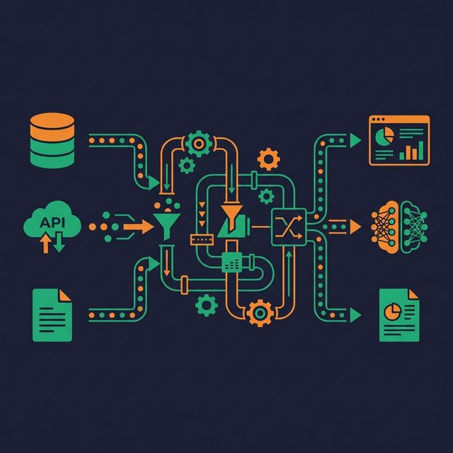
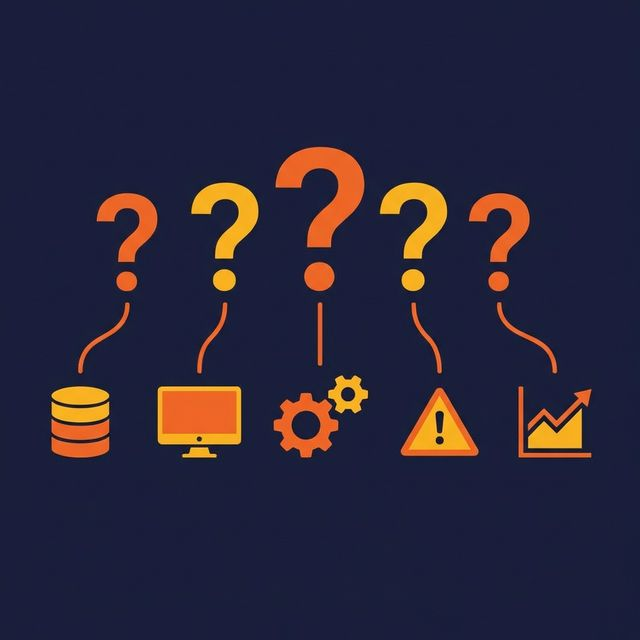

The median lifespan of a popular data tool is about three years. The tool you master today may be deprecated or replaced by the time your next project ships. What doesn't change are the principles underneath: how data flows, how systems fail, how contracts between producers and consumers work, and how to decompose messy requirements into clean, maintainable pipelines.

Thinking like a data engineer means solving problems at the systems level, not the tool level. It means asking "what could go wrong?" before asking "what framework should I use?"

## Tools Change — Principles Don't

Every year brings a new orchestrator, a new streaming framework, a new columnar format. Teams that build their expertise around a specific tool struggle when the landscape shifts. Teams that build expertise around principles — idempotency, schema contracts, data quality at the source, composable stages — adopt new tools without starting over.

The question is never "How do I do this in Tool X?" The question is "What problem am I solving, and what properties does the solution need to have?" Once you answer that, the tool choice becomes a constraint-matching exercise.

## The Five Questions Framework

Before designing any pipeline, answer five questions:

**1. What data exists?** Identify every source: databases, APIs, event streams, files. Note the format (JSON, CSV, Parquet, Avro), volume (rows per day), freshness (real-time, hourly, daily), and reliability (does this source go down?).

**2. Where does it need to go?** Identify every consumer: dashboards, ML models, downstream systems, analysts. Note what format they need, how fresh the data must be, and what SLAs they expect.

**3. What transformations are needed?** Map the gap between source shape and consumer shape. This includes cleaning (nulls, duplicates, encoding), enriching (joining lookup data), and aggregating (daily summaries, running totals).

**4. What can go wrong?** List failure modes: late data, schema changes in the source, duplicate events, null values in required fields, API rate limits, network partitions, out-of-order events. For each failure mode, define the expected behavior — skip, retry, alert, or quarantine.

**5. How will you know if it's working?** Define observability: row counts in vs. row counts out, freshness checks, schema validation, anomaly detection. If you can't answer this question before building the pipeline, you'll be debugging in production.

## Think in Systems, Not Scripts

A script processes data from A to B. A system handles what happens when A is late, B is down, the data shape changes, the volume doubles, and the on-call engineer needs to understand what happened at 3 AM.

Thinking in systems means:

**Composability.** Break pipelines into discrete stages that can be developed, tested, and monitored independently. An ingestion stage should not also handle transformation and loading. When a stage fails, you restart that stage, not the entire pipeline.

**Contracts.** Define what each stage produces: column names, data types, value ranges, freshness guarantees. When a producer changes its output, the contract violation is caught immediately — not three stages downstream when a dashboard shows wrong numbers.

**State management.** Track what has been processed. Know where to resume after a failure. Avoid reprocessing data unnecessarily by maintaining checkpoints, watermarks, or change data capture (CDC) positions.

**Isolation.** One failing pipeline should not take down others. Shared resources (connection pools, compute clusters, storage) need limits per-pipeline to prevent noisy-neighbor problems.

## Design for Failure First

The default assumption should be: every component will fail. Networks drop. APIs return errors. Source schemas change without warning. Storage fills up. The pipeline that handles none of these cases works in development and breaks in production.

Practical failure-first design:

- **Retry with backoff.** Transient errors (network timeouts, API rate limits) often resolve themselves. Retry with exponential backoff before alerting.
- **Dead-letter queues.** Records that can't be processed (malformed, unexpected schema) go to a separate queue for inspection — not dropped silently.
- **Idempotent writes.** Running a pipeline job twice should produce the same end-state. Use upserts, deduplication, or transaction-based writes instead of blind appends.
- **Circuit breakers.** If a downstream system is unresponsive, stop sending data after N failures instead of filling up buffers and crashing.

## Anti-Patterns That Signal Inexperience

**Choosing the tool before understanding the problem.** "We should use Kafka" is not a good starting point. "We need sub-second event delivery with at-least-once guarantees" is. The tool choice follows from the requirements, not the other way around.

**Monolithic pipelines.** One script that reads from a database, cleans data, joins three tables, aggregates, and writes to a warehouse. When any step fails, the entire pipeline fails. When any step needs a change, the entire pipeline needs retesting.

**No error handling.** `try: process() except: pass` is not error handling. Every expected failure mode should have an explicit response: retry, skip and log, alert, or halt.

**No monitoring.** If the only way you learn about a pipeline failure is when an analyst asks "why is the dashboard empty?", your observability is broken.

## What to Do Next

Pick your most critical pipeline. Walk through the Five Questions Framework. Can you answer all five clearly and completely? If not, the gaps are your immediate priorities. Write down the answers, share them with your team, and use them as the specification for your next refactor.

[Try Dremio Cloud free for 30 days](https://www.dremio.com/get-started?utm_source=ev_buffer&utm_medium=influencer&utm_campaign=next-gen-dremio&utm_term=blog-021826-02-18-2026&utm_content=alexmerced)
