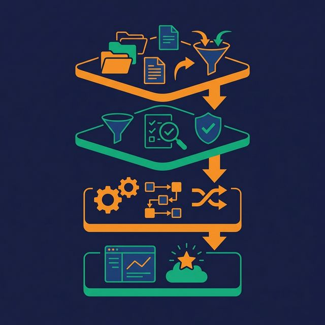
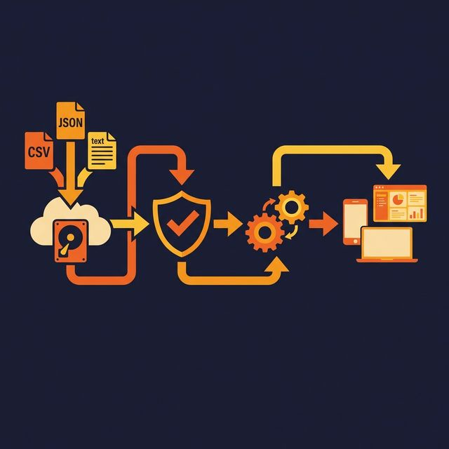

Most pipeline failures aren't caused by bad code. They're caused by no architecture. A script that reads from an API, transforms JSON, and writes to a database works fine on day one. On day ninety it fails at 3 AM because the API changed its response format, and the only way to recover is to rerun the entire pipeline from scratch — hoping that reprocessing three months of data doesn't create duplicates.

Reliable pipelines are designed, not debugged into existence.

## Reliability Is a Design Property, Not a Bug-Fix

You don't make a pipeline reliable by adding try-catch blocks after it breaks. You make it reliable by building reliability into the architecture from the start. That means:

- **Resumability.** After a failure, you restart from where it stopped, not from the beginning.
- **Idempotency.** Running the same job twice produces the same result.
- **Observability.** You know what the pipeline processed, how long it took, and where it is right now.
- **Isolation.** One failing stage doesn't cascade into unrelated stages.

These properties don't come from choosing the right framework. They come from how you structure the pipeline.

## The Four Architecture Layers

Every well-designed pipeline has four distinct layers, even if they run in the same job:

**Ingestion.** Pull raw data from sources and land it unchanged. Don't transform here. Don't filter. Don't join. Store the raw data exactly as it arrived, with metadata (timestamp, source, batch ID). This gives you a replayable audit trail.

**Staging.** Validate the raw data. Check for schema compliance, null values in required fields, duplicate records, and data type mismatches. Records that fail validation go to a quarantine table or dead-letter queue — they don't silently disappear.

**Transformation.** Apply business logic: joins, aggregations, calculations, enrichments. This is where raw events become metrics, where customer records merge across sources, where timestamps convert to business periods. Keep business logic in one layer, not spread across ingestion and loading scripts.

**Serving.** Organize the transformed data for consumers. Analysts need star schemas. ML models need feature tables. APIs need denormalized lookups. The serving layer shapes data for its audience without changing the underlying transformation logic.

## Build a DAG, Not a Script

A script runs steps in order: step 1, step 2, step 3. If step 2 fails, you rerun from step 1. If step 3 needs a new input, you rewrite the script.

A directed acyclic graph (DAG) models dependencies explicitly. Step 3 depends on step 2 and step 4. Step 2 and step 4 can run in parallel. If step 2 fails, you rerun step 2 — not steps 1, 4, or 3.

DAG-based thinking gives you:

- **Parallelism.** Independent stages run concurrently, cutting wall-clock time.
- **Targeted retries.** Failed stages retry alone, not the entire workflow.
- **Clear dependencies.** You can see exactly what feeds into a given output.
- **Incremental development.** Add new stages without touching existing ones.

Even if your orchestrator doesn't enforce DAGs, design your pipeline as one. Document which stages depend on which outputs. Make each stage read from a defined input location and write to a defined output location.

## Dependency Management

Implicit dependencies are the most common source of pipeline fragility. "This pipeline assumes table X exists because another pipeline created it" is an implicit dependency. When the other pipeline is delayed, skipped, or renamed, your pipeline breaks.

Make dependencies explicit:

- **Declare data dependencies.** If stage B reads the output of stage A, model that relationship in your orchestration. Don't rely on timing ("A usually finishes by 6 AM").
- **Use sensors or triggers.** Wait for data to arrive before starting a stage. Check for a file, a partition, or a row count — don't check the clock.
- **Version your interfaces.** When a producer changes its output schema, consumers should detect the change before they process stale or malformed data.
- **Document ownership.** Every dataset should have an owner. When you depend on someone else's table, you should know who to contact when it changes.

## Failure Handling Patterns

**Retry with backoff.** Most transient failures (network timeouts, API throttling, lock contention) resolve themselves. Retry 3-5 times with exponential backoff (e.g., 1s, 5s, 25s) before marking a stage as failed.

**Dead-letter queues.** Records that cannot be processed (corrupt payloads, unexpected schemas, values out of range) go to a quarantine area. Log why they failed. Review them periodically. Don't drop them silently.

**Circuit breakers.** If a downstream system returns errors consistently, stop sending requests after N failures. Resume with a health check. This prevents cascading failures and buffer exhaustion.

**Checkpointing.** After processing each batch or partition, record what was completed. On failure, resume from the last checkpoint. This is the difference between a 5-minute recovery and a 5-hour reprocessing job.

## What to Do Next

Map your current pipelines against the four architecture layers. Identify which layers are missing or mixed together. The most common gap: ingestion and transformation are in the same script, making it impossible to replay raw data or isolate failures. Separate them, and reliability follows.

[Try Dremio Cloud free for 30 days](https://www.dremio.com/get-started?utm_source=ev_buffer&utm_medium=influencer&utm_campaign=next-gen-dremio&utm_term=blog-021826-02-18-2026&utm_content=alexmerced)
