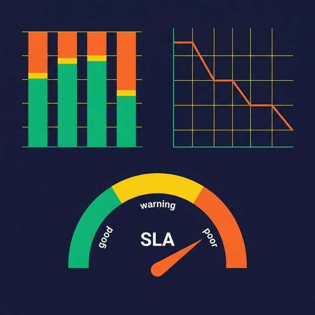

When an analyst finds null values in a revenue column, the typical response is to add a calculated field in the BI tool: `IF revenue IS NULL THEN 0`. That "fix" doesn't fix anything. It masks a problem at the source — and every downstream consumer has to independently discover and patch the same issue.

Data quality is a pipeline problem. It should be enforced where data enters your system, not where it exits as a chart.

## The Dashboard Isn't Where Quality Gets Fixed

Quality problems that surface in dashboards have already propagated through every layer of your stack: raw tables, transformed models, aggregations, caches, and API endpoints. By the time an analyst spots a zero-revenue row, the bad record has been used to train ML models, trigger automated alerts, and populate executive reports.

Fixing quality at the point of consumption is reactive, fragmented, and unrepeatable. Every team applies different patches. Every new consumer rediscovers the same problems.

Fixing quality at the point of ingestion is proactive, centralized, and consistent. Every downstream consumer benefits from the same validated data.

## Six Dimensions of Data Quality

Not all quality problems are the same. Categorizing them helps you build targeted checks:

**Completeness.** Are required fields populated? A customer record missing an email address might be acceptable. A transaction record missing an amount is not.

**Accuracy.** Do values reflect reality? An age of 250 is syntactically valid but factually wrong. Accuracy checks require domain knowledge and range validation.

**Consistency.** Do the same facts agree across sources? If your CRM says a customer is in Texas and your billing system says California, you have a consistency problem.

**Timeliness.** Did the data arrive when expected? A daily feed that arrives 6 hours late might still be correct — but any dashboards refreshed before it arrived showed stale numbers.

**Uniqueness.** Are there duplicate records? Double-counted revenue is worse than no revenue. Deduplication on business keys (order ID, event ID) is essential.

**Validity.** Do values conform to expected formats and ranges? Dates in the future, negative quantities, email addresses without @ signs — structural validation catches these before they corrupt downstream logic.

## Enforce Quality Inside the Pipeline

Add a validation stage between ingestion and transformation. This stage checks every record against defined quality rules and routes failures to a quarantine table.

**Schema validation.** Check column names, data types, and required vs. optional fields. If the source adds or removes a column, catch it here — not when a transformation SQL query fails.

**Range and format checks.** Ensure numeric values fall within expected ranges (0 ≤ price ≤ 1,000,000). Validate date formats, email patterns, and enum values against allowed lists.

**Referential checks.** Verify that foreign key values exist in their reference tables. An order referencing a non-existent customer ID means either the order is invalid or the customer pipeline is behind.

**Volume checks.** Compare the row count of the incoming batch against historical baselines. A daily feed that usually delivers 50,000 rows but arrives with 500 rows should trigger an alert, not proceed silently.

**Freshness checks.** Validate that event timestamps fall within the expected window. A batch of events all timestamped from three days ago may indicate a delayed replay, not current data.

## Quarantine, Don't Drop

When a record fails validation, don't drop it. Route it to a quarantine table with metadata: which check failed, when, and the original record content.

Dropping bad records silently creates invisible data loss. Your row counts won't match, your aggregations will undercount, and no one will know why.

Quarantined records give you:

- **Visibility.** You know how many records failed and why.
- **Recovery.** When the quality rule was too strict (false positive), you can reprocess quarantined records.
- **Root cause analysis.** Patterns in quarantine (e.g., all failures from one source) help you fix the actual problem upstream.
- **Accountability.** You can report quality rates per source, per pipeline, per day.

## Track Quality Like You Track Uptime

Pipeline monitoring typically covers: did the job run? Did it succeed? How long did it take? Quality monitoring adds: how many records passed validation? What percentage failed? Which checks triggered the most failures?

Build quality metrics into your monitoring dashboards:

- **Pass/fail ratio** per pipeline, per day
- **Failure breakdown** by quality dimension (completeness, accuracy, etc.)
- **Trend lines** to catch gradual degradation before it becomes critical
- **SLA tracking** for freshness and completeness targets

Alert on quality regressions the same way you alert on pipeline failures. A pipeline that runs successfully but produces 30% invalid records is worse than one that fails outright — because it's silently wrong.

## What to Do Next

Audit your most important pipeline. Add a validation stage with checks for completeness, uniqueness, and volume. Route failures to a quarantine table. Within a week, you'll know more about your data quality than any dashboard could tell you.

[Try Dremio Cloud free for 30 days](https://www.dremio.com/get-started?utm_source=ev_buffer&utm_medium=influencer&utm_campaign=next-gen-dremio&utm_term=blog-021826-02-18-2026&utm_content=alexmerced)
