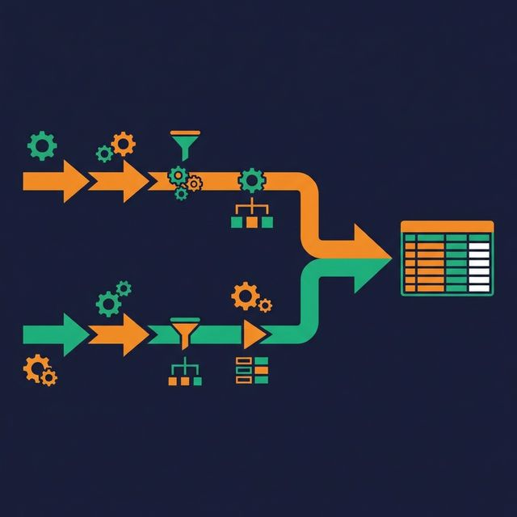
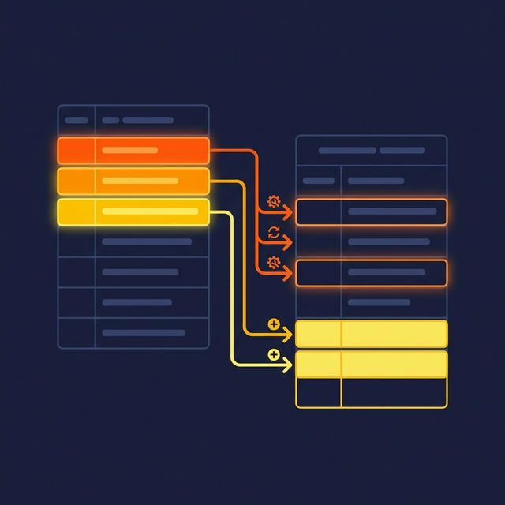

A pipeline runs, processes 100,000 records, and loads them into the target table. Then it fails on a downstream step. The orchestrator retries the entire job. Now the table has 200,000 records — 100,000 of them duplicates. Revenue reports double. Dashboards misfire. Someone spends the next four hours manually deduplicating records and explaining to stakeholders why the numbers were wrong.

This is the cost of not building idempotent pipelines.

## What Idempotency Means for Pipelines

An idempotent operation produces the same result no matter how many times you execute it. For data pipelines, that means: running the same job twice — or ten times — leaves the target data in the exact same state as running it once.

This property matters because retries are inevitable. Orchestrators retry failed tasks. Backfill jobs reprocess historical data. Network glitches cause at-least-once delivery. Engineers manually rerun jobs during debugging. Without idempotency, every one of these events risks data corruption.

Idempotency is not about preventing retries. It's about making retries safe.

## The Partition Overwrite Pattern

The simplest and most reliable idempotency pattern for batch pipelines: overwrite the entire partition.

Instead of appending rows, your pipeline replaces the complete partition for the time period being processed. For a daily pipeline processing January 15th:

```sql
-- Delete existing data for this partition
DELETE FROM target_table WHERE event_date = '2024-01-15';

-- Insert fresh data for this partition
INSERT INTO target_table
SELECT * FROM staging_table WHERE event_date = '2024-01-15';
```

If the job reruns, it deletes and recreates the same partition — resulting in the same data. Many table formats support INSERT OVERWRITE or REPLACE PARTITION as an atomic operation, which is even safer because it avoids a window where the partition is empty.

**When to use it:** Daily, hourly, or other time-partitioned batch pipelines. This covers the majority of data warehouse loading patterns.

**Limitation:** You need a clear partitioning key. For non-time-series data, partition overwrite may not apply.

## The Upsert/MERGE Pattern

For data that doesn't partition cleanly — or for change data capture (CDC) workloads — use MERGE (also called upsert):

```sql
MERGE INTO target_table t
USING staging_table s
ON t.order_id = s.order_id
WHEN MATCHED THEN UPDATE SET
  t.status = s.status,
  t.updated_at = s.updated_at
WHEN NOT MATCHED THEN INSERT (order_id, status, updated_at)
VALUES (s.order_id, s.status, s.updated_at);
```



If the merge runs twice with the same staging data, the result is identical. Existing records update to the same values. New records insert once because they already exist on the second run.

**When to use it:** CDC pipelines, entity-centric data (customers, products, accounts), and slowly changing dimensions.

**Requirement:** A reliable business key that uniquely identifies each record. Without one, merges produce inconsistent results.

## Event Deduplication for Streaming

Streaming systems typically guarantee at-least-once delivery, which means the same event can be delivered and processed multiple times. Your pipeline needs to handle this.

**Process-level deduplication.** Maintain a set (in-memory, in a key-value store, or in the target database) of recently processed event IDs. Before processing each event, check if its ID has been seen. Skip duplicates.

**Write-level deduplication.** Use MERGE or conditional INSERT:

```sql
INSERT INTO events (event_id, payload, processed_at)
SELECT event_id, payload, NOW()
FROM incoming_events
WHERE event_id NOT IN (SELECT event_id FROM events);
```

**Windowed deduplication.** For high-volume streams, maintain dedup state only for a window (e.g., last 24 hours). Events outside the window are assumed to be unique — a practical tradeoff between memory usage and dedup completeness.

## Anti-Patterns That Break Idempotency

**Blind INSERT/APPEND.** Every retry adds duplicate rows. This is the default behavior in most systems and the most common cause of data inflation.

**Auto-incrementing surrogate keys.** If your pipeline generates IDs at processing time (not from the source data), duplicates get different IDs and look like distinct records.

**Timestamps as dedup keys.** Using `processed_at` as part of the primary key means the same source record processed at different times produces different target records.

**"We'll dedup later."** Deferring deduplication to a cleanup job means every consumer between the load and the cleanup sees dirty data.


## What to Do Next

Identify your five most frequently retried or backfilled pipelines. Check whether they use INSERT or MERGE. If they use INSERT, switch to partition overwrite or MERGE. Run the pipeline twice intentionally and verify the target table has the same row count both times. That's your idempotency test.

[Try Dremio Cloud free for 30 days](https://www.dremio.com/get-started?utm_source=ev_buffer&utm_medium=influencer&utm_campaign=next-gen-dremio&utm_term=blog-021826-02-18-2026&utm_content=alexmerced)
