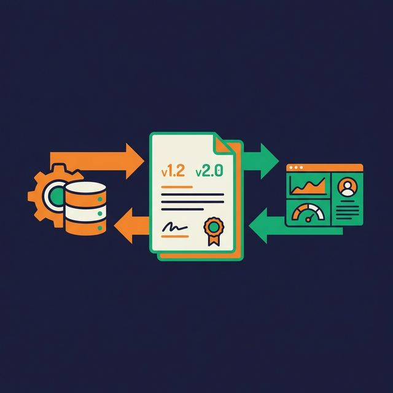
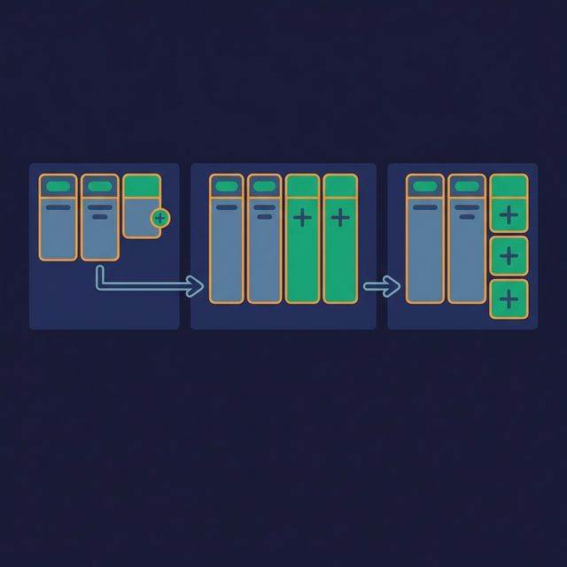
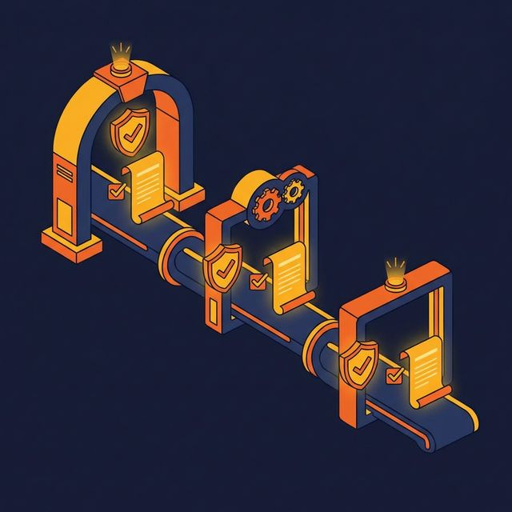

A source team renames a column from `user_id` to `customer_id`. Twelve hours later, five dashboards show blank values, two ML pipelines fail, and the data engineering team spends the morning tracing a problem that could have been prevented with one rule: treat your schema like an API.

Schema evolution is the practice of changing data structures without breaking the systems that depend on them. Get it right, and your data platform stays flexible. Get it wrong, and every schema change becomes an emergency.

## Your Schema Is an API

When an application team changes a REST API endpoint, they version it. They deprecate the old version. They give consumers time to migrate. They don't silently rename fields and hope nobody notices.

Data schemas deserve the same discipline. Your columns are fields. Your tables are endpoints. Your downstream consumers — dashboards, ML pipelines, reports, other pipelines — are API clients. When you change the schema, you change the contract.

The difference: API changes are usually intentional and reviewed. Schema changes often happen accidentally — a source system updates its export format, an engineer renames a column for readability, a new data type is introduced. Without guardrails, these changes propagate downstream silently.

## Safe vs. Breaking Changes

Not all schema changes carry the same risk:

**Backward-compatible (safe) changes:**
- Adding a new optional column with a default value
- Widening a data type (INT to BIGINT, FLOAT to DOUBLE)
- Adding documentation or metadata to columns
- Reordering columns (if consumers reference by name, not position)

**Breaking changes:**
- Removing a column that consumers reference
- Renaming a column without maintaining the old name
- Narrowing a data type (BIGINT to INT — values may overflow)
- Changing the semantic meaning of a column (e.g., `revenue` from gross to net)
- Changing nullability (nullable to non-nullable breaks inserts with nulls)

The rule: backward-compatible changes can be deployed without coordination. Breaking changes require a migration plan.

## The Additive-Only Pattern

The simplest schema evolution strategy: never remove or rename columns. Only add new ones.

When a column needs to be replaced:
1. Add the new column alongside the old one
2. Update producers to populate both columns
3. Migrate consumers to the new column one at a time
4. Once all consumers have migrated, mark the old column as deprecated
5. Remove the old column only after a deprecation period (e.g., 90 days)

This pattern is boring — and that's the point. Boring is reliable. Adding a column never breaks existing queries. Consumers that don't need the new column ignore it. Consumers that do need it can adopt it on their own schedule.

**Tradeoff:** Table width grows over time. Schemas accumulate deprecated columns. This is an acceptable cost compared to production outages.

## Schema Versioning and Migration

For changes that can't be additive (fundamental restructuring, data model migrations), use explicit versioning:

**Version in the table name.** `customers_v1`, `customers_v2` coexist. Consumers migrate from v1 to v2 at their own pace. A view named `customers` points to the current version.

**Version in metadata.** Store a schema version field in each record or partition. Consumers check the version and apply the appropriate parsing logic.

**Schema registries.** Centralized systems that store and validate schemas. Producers register their schema. Consumers declare their expected schema. The registry checks compatibility and rejects breaking changes.

Schema registries enforce rules automatically:
- BACKWARD compatible: new schema can read data written by old schema
- FORWARD compatible: old schema can read data written by new schema
- FULL compatible: both backward and forward compatible

## Contract Enforcement at Pipeline Boundaries

Don't rely on conventions ("we don't rename columns"). Enforce contracts programmatically at pipeline boundaries:

**At ingestion.** Compare the incoming data schema against the expected schema. If columns are missing, added, or retyped, log the difference and alert. For safe changes, proceed and notify. For breaking changes, halt and quarantine.

**At transformation.** Validate that every column referenced in SQL or transformation logic exists in the input schema. Catch missing-column errors at validation time, not at runtime.

**At serving.** Validate that output schemas match the contracts expected by consumers. If a downstream dashboard expects column `revenue`, verify it exists and has the correct type before the pipeline marks the job as successful.

## What to Do Next

Document the schema of your five most critical tables: column names, types, nullability, and a one-line description. That's your version 1 contract. Set up an automated check that compares incoming data against this contract and alerts on any deviation. You'll catch the next breaking change before it breaks anything.

[Try Dremio Cloud free for 30 days](https://www.dremio.com/get-started?utm_source=ev_buffer&utm_medium=influencer&utm_campaign=next-gen-dremio&utm_term=blog-021826-02-18-2026&utm_content=alexmerced)
