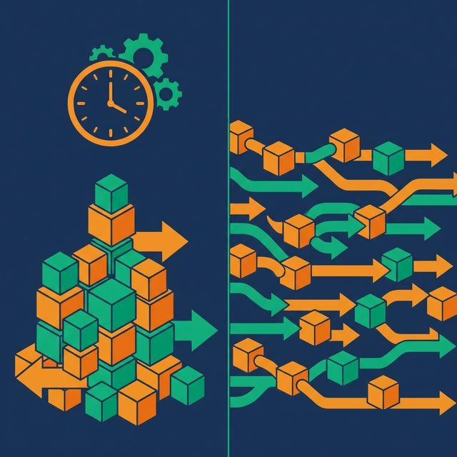
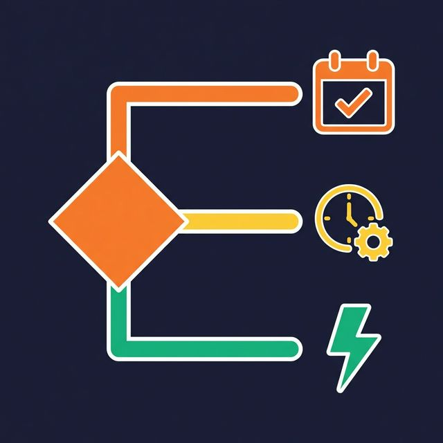

"We need real-time data." This is one of the most expensive sentences in data engineering — because it's rarely true, and implementing it when it's not needed multiplies complexity, cost, and operational burden.

The question isn't "should we use streaming?" The question is "how fresh does the data actually need to be, and what are we willing to pay for that freshness?"

## The Question Isn't "Real-Time or Not" — It's "How Fresh?"

Freshness requirements exist on a spectrum:

- **Daily** (24-hour latency): Fine for financial reporting, historical trend analysis, ML training datasets
- **Hourly** (1-hour latency): Adequate for operational dashboards, inventory tracking, marketing attribution
- **Near-real-time** (1-15 minutes): Sufficient for user activity feeds, recommendation updates, alerting
- **Real-time** (sub-second): Required for fraud detection, stock trading, IoT safety systems

Most "we need real-time" requests are actually "we need hourly" or "we need 5-minute" requests. Clarifying the actual latency requirement before choosing an architecture prevents overengineering.

## When Batch Wins

Batch processing is the default choice. Choose it unless you have a specific, justified reason to stream.

**Simpler failure recovery.** A batch job fails at 3 AM. You fix the bug, rerun the job, and it reprocesses the same bounded dataset. Recovery is predictable and testable.

**Easier testing.** Given input dataset X, the output should be Y. You can version test datasets, run them locally, and assert exact outputs. Streaming test scenarios require simulating time, ordering, and late-arriving events — dramatically harder.

**Lower operational cost.** Batch jobs run on schedule, consume resources during execution, and release them when done. Streaming jobs run continuously, consuming resources 24/7 even during low-volume periods.

**Better tooling maturity.** SQL-based transformations, orchestrators with DAG visualization, version-controlled dbt models — the batch ecosystem is deeper and more mature for most data warehouse workloads.

**When to use:** Daily/hourly analytics, data warehouse loading, ML training data, compliance reporting, historical backfills.

## When Streaming Wins

Streaming processing is the right choice when latency is measured in seconds and the cost of stale data is high.

**Fraud detection.** You can't batch-process credit card transactions once an hour. By the time you detect a fraudulent pattern, thousands of dollars are already gone. Fraud detection needs event-by-event evaluation in real time.

**IoT and safety systems.** A temperature sensor in a chemical plant detecting an abnormal reading can't wait for the next hourly batch. Alerting must happen in seconds.

**Real-time personalization.** Showing a user recommendations based on what they did 30 seconds ago requires streaming user events through a recommendation engine.

**Operational systems.** Inventory management, ride-sharing pricing, and live logistics tracking all need sub-minute data freshness to function correctly.

**When to use:** Event-driven business logic, sub-second alerting, real-time user-facing features.

## The Micro-Batch Middle Ground

Micro-batch processing runs batch jobs at very short intervals — every 1, 5, or 15 minutes. It captures most of the value of streaming with the simplicity of batch.

**Same tools, shorter intervals.** Your existing batch infrastructure (SQL transformations, orchestrators, testing frameworks) works unchanged. You just schedule runs more frequently.

**Most use cases are satisfied.** An operational dashboard refreshing every 5 minutes feels "real-time" to most business users. Marketing attribution updating every 15 minutes is fresh enough for campaign optimization.

**Significantly lower complexity.** No stream processing framework to learn. No state management. No watermark configuration. No event ordering challenges.

**The tradeoff:** Micro-batch cannot achieve sub-second latency. If you genuinely need event-by-event processing under one second, you need a streaming framework.

## A Decision Framework

Before choosing between batch, micro-batch, and streaming, answer these questions:

| Question | Batch | Micro-batch | Streaming |
|---|---|---|---|
| Required latency | Hours | Minutes | Seconds |
| Cost of stale data | Low | Medium | High |
| Team streaming expertise | Not needed | Not needed | Required |
| Operational budget | Lowest | Low | Highest |
| Recovery complexity | Simple rerun | Simple rerun | Complex |

**Start with batch.** If stakeholders say "we need real-time," ask "what's the cost of a 15-minute delay?" If the answer is "that's fine," micro-batch gives you near-real-time at batch-level complexity.

**Upgrade to streaming only when justified.** Sub-second latency requirements, event-driven business logic, and high-volume event processing are legitimate streaming use cases. "I want the dashboard to update faster" is usually not.

## What to Do Next

List every pipeline in your platform and categorize it by actual (not requested) latency requirement. You'll likely find that 80% or more of your workloads are well-served by batch or micro-batch. Focus streaming investment on the 20% that genuinely needs it.

[Try Dremio Cloud free for 30 days](https://www.dremio.com/get-started?utm_source=ev_buffer&utm_medium=influencer&utm_campaign=next-gen-dremio&utm_term=blog-021826-02-18-2026&utm_content=alexmerced)
