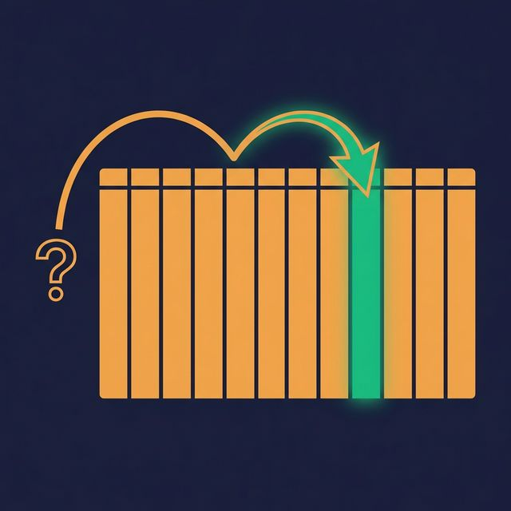
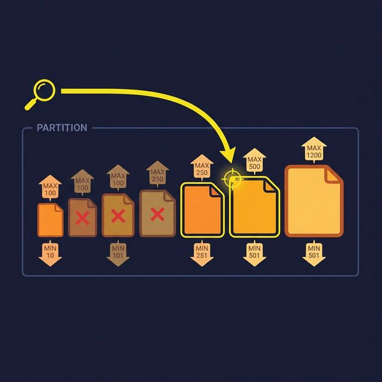
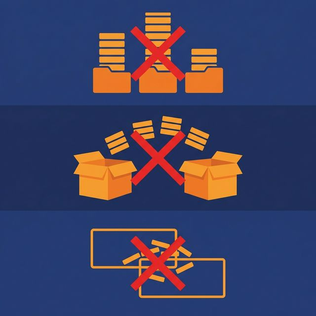

A table with 500 million rows takes 45 seconds to query. After partitioning it by date, the same query — filtering on a single day — returns in 2 seconds. The SQL didn't change. The data didn't change. The only thing that changed was how the data was organized on disk.

Performance in analytical workloads is almost never about faster hardware. It's about reading less data.

## Read Less Data, Run Faster Queries

Analytical query engines scan data to answer queries. A full table scan reads every row, every column. But most queries only need a fraction of the data: this week's transactions, this region's customers, this product category's sales.

Partitioning and data organization let the engine skip irrelevant data entirely:

- **Partition pruning.** The engine reads only the partitions that match the query's WHERE clause.
- **Column pruning.** Columnar formats (Parquet, ORC) read only the requested columns.
- **Predicate pushdown.** Min/max statistics in file metadata let the engine skip files whose value ranges don't match the filter.

Combined, these techniques can reduce the data scanned from terabytes to megabytes. The fastest query is the one that reads the least data.

## Partitioning Strategies

**Time-based partitioning.** Partition by date, hour, or month. This is the most common strategy because most analytical queries filter by time. A daily partition structure means a query for "last week" reads 7 partitions instead of scanning the entire table.

**Value-based partitioning.** Partition by a categorical column: region, source system, customer tier. This works when queries consistently filter on that column. A multi-tenant application might partition by tenant ID so each tenant's queries touch only their data.

**Hash-based partitioning.** Distribute data evenly across N buckets using a hash function on a key column. This is useful for join-heavy workloads: two tables hashed on the same join key can be joined partition-to-partition without shuffling data.

**Composite partitioning.** Combine strategies: partition by date, then bucket by customer ID within each date. This handles queries that filter on date and join on customer ID.

**Choosing the right strategy:** Look at your most frequent queries. What columns appear in WHERE clauses and JOIN conditions? Those are your partition candidates. If 90% of queries filter by date, partition by date.

## File-Level Organization

Partitioning controls which directory the query engine reads. File-level organization controls how efficiently it reads within that directory.

**Sorting.** Sort rows within each file by a frequently filtered column. If queries often filter `WHERE status = 'active'`, sorting by status clusters active rows together. The engine reads min/max metadata, sees that a file's status range is only 'active', and skips files that don't match.

**Z-ordering.** When queries filter on multiple columns, linear sorting optimizes for only one. Z-ordering interleaves the sort order across multiple columns, enabling predicate pushdown on any combination of the Z-ordered columns. It's especially effective for 2-3 column filter combinations.

**File sizing.** Target file sizes between 128 MB and 1 GB. Files too small (< 10 MB) create metadata overhead and excessive file-open operations. Files too large (> 2 GB) reduce parallelism and waste I/O when only a fraction of the file is needed.

## Compaction: The Maintenance Task You Can't Skip

Streaming writes and frequent small batch appends create many small files. A partition with 10,000 files of 1 MB each is dramatically slower to query than the same data in 10 files of 1 GB each.

Compaction merges small files into optimally-sized files. It's the data equivalent of defragmenting a disk.

Run compaction:
- After streaming writes accumulate small files
- After many small batch appends
- On a regular schedule (daily or weekly) for active partitions
- Targeted at partitions where file counts exceed a threshold

Compaction also provides an opportunity to re-sort data within files, clean up deleted records (in formats that use soft deletes like Iceberg and Delta), and update file-level statistics.

## Common Partitioning Mistakes

**Over-partitioning.** Partitioning by a high-cardinality column (user ID, transaction ID) creates millions of partitions, each with a few rows. The engine spends more time listing and opening files than reading data. Rule of thumb: keep individual partition sizes above 100 MB.

**Under-partitioning.** A single partition for the entire table means every query scans everything. If your table has billions of rows and no partitions, even simple queries are slow.

**Misaligned partitions.** Partitioning by month when every query filters by day means the engine reads an entire month's data for a single-day query. Align partition granularity with query granularity.

**Ignoring compaction.** Streaming into a table without compacting creates the small-file problem. Query performance degrades gradually until someone notices. Schedule compaction as part of pipeline maintenance.

## What to Do Next

Identify your slowest analytical query. Check the table's partitioning strategy. If the table has no partitions, add one aligned with the query's most common WHERE clause. If it's already partitioned, check file sizes — if the average file is under 10 MB, run compaction. Measure before and after.

[Try Dremio Cloud free for 30 days](https://www.dremio.com/get-started?utm_source=ev_buffer&utm_medium=influencer&utm_campaign=next-gen-dremio&utm_term=blog-021826-02-18-2026&utm_content=alexmerced)
