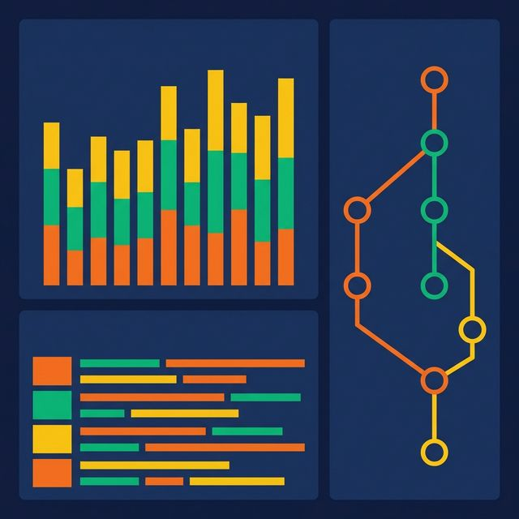
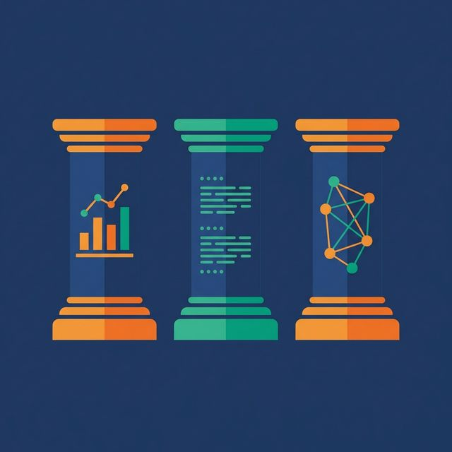
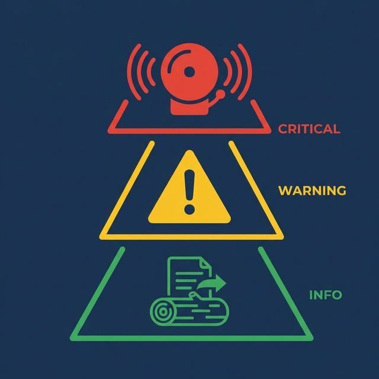

An analyst messages you on Slack: "The revenue numbers look wrong. Is the pipeline broken?" You check the orchestrator — all green. You check the target table — data loaded this morning. You check the row count — looks normal. Forty-five minutes later, you discover that a source API returned empty responses for one region, and the pipeline happily loaded zero rows for that region without alerting anyone.

The pipeline succeeded. The data was wrong. No one knew until a human noticed.

This is the cost of monitoring pipeline execution without monitoring pipeline output.

## You Can't Fix What You Can't See

Traditional monitoring answers: did the job run? Did it succeed? How long did it take? These questions cover infrastructure health, not data health. A pipeline can execute perfectly — no errors, no retries, no timeouts — and still produce incorrect or incomplete data.

Observability goes further. It answers: what did the pipeline process? How much? Was the data complete and correct? Is the output fresh? And when something is wrong, it provides enough context to diagnose the root cause without hunting through logs manually.

The distinction matters. Monitoring tells you the pipeline ran. Observability tells you the pipeline worked.

## The Three Pillars of Pipeline Observability

**Metrics.** Quantitative measurements collected at every pipeline stage: row counts, processing time, error rates, data freshness, resource utilization. Metrics are cheap to collect, easy to aggregate, and essential for dashboards and alerting.

**Logs.** Structured, timestamped records of what happened during execution. A useful log entry includes: pipeline name, stage name, batch ID, timestamp, action (started/completed/failed), row count, and any error message. Structured logs (JSON format) are searchable and parseable. Unstructured logs ("Processing data...") are noise.

**Lineage.** The path data takes from source to destination, at the table or column level. Lineage answers: where did this number come from? If the source changes, what downstream tables and dashboards are affected? Lineage turns debugging from archaeology into graph traversal.

## What to Measure

Not everything needs a metric. Measure what helps you answer these questions:

**Is the data fresh?** Track the timestamp of the most recent row in each target table. Compare it to the expected freshness (e.g., less than 2 hours old). A freshness metric that exceeds its SLA triggers an alert before anyone opens a dashboard.

**Is the data complete?** Track row counts in vs. row counts out at each stage. A significant drop (e.g., input: 100,000 rows, output: 90,000 rows) means records were filtered, rejected, or lost.

**Is the data correct?** Track quality metrics: null rates, duplicate rates, range violation counts. Trend these over time. A gradual increase in null rates indicates a deteriorating source.

**Is the pipeline healthy?** Track execution time per stage. A stage that normally takes 5 minutes but now takes 50 minutes may indicate data volume growth, resource contention, or a bad query plan.

**Is the pipeline meeting SLAs?** Define when data must be available (e.g., daily tables loaded by 6 AM). Track SLA compliance as a percentage. A pipeline with 95% SLA compliance has failed its consumers once every 20 days.

## Alerting Without Alert Fatigue

Alert fatigue is the most common reason observability fails. Too many alerts and the on-call engineer starts ignoring them. Too few and real problems go unnoticed.

**Alert on business impact, not on every error.** A transient retry is not an alert. A pipeline that misses its SLA by an hour is. A single null row is not an alert. A null rate jumping from 0.1% to 15% is.

**Use severity levels.** Critical: data consumers are affected now (missed SLA, empty output). Warning: something is degrading but not yet impacting consumers (execution time increasing, row count declining). Info: notable but non-actionable (successful backfill, schema migration completed).

**Set thresholds dynamically.** Static thresholds ("alert if row count < 10,000") break when data naturally grows or shrinks. Use rolling baselines: alert if today's row count deviates by more than 20% from the 7-day average.

**Route alerts effectively.** Critical alerts go to PagerDuty or on-call channels. Warnings go to team Slack channels. Info goes to logs-only. Don't send everything to the same channel.

## Data Lineage for Impact Analysis

When a problem occurs, the first question is: what's affected? Lineage answers this.

**Upstream analysis.** A dashboard shows wrong numbers. Lineage traces the dashboard back through the serving table, the transformation, the staging table, and the raw source. The break is visible in the graph.

**Downstream impact analysis.** A source system announces a schema change. Lineage shows every table, model, and dashboard that depends on that source. You know the blast radius before making any changes.

**Column-level lineage.** Table-level lineage shows connections between tables. Column-level lineage shows which source column feeds which target column. This level of detail turns a "the revenue is wrong" investigation from hours to minutes.

## What to Do Next

Add freshness tracking to your three most critical tables: record the max event timestamp after each load and alert when it exceeds the SLA. This single metric — data freshness — catches more problems than any other observability signal.

[Try Dremio Cloud free for 30 days](https://www.dremio.com/get-started?utm_source=ev_buffer&utm_medium=influencer&utm_campaign=next-gen-dremio&utm_term=blog-021826-02-18-2026&utm_content=alexmerced)
