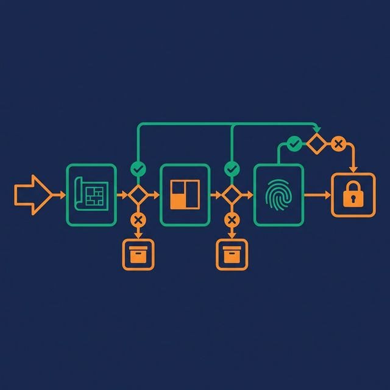

Best practices documents are easy to write and hard to use. They list principles without context, advice without prioritization, and rules without explaining when to break them. This one is different. It's a practical, tool-agnostic checklist organized by the categories that matter most — with each item tied to a specific outcome.

Use this as a recurring audit. Run through it quarterly. Any unchecked item is either a technical debt item or a conscious tradeoff. Know which is which.

## Pipeline Design

- [ ] **Separate ingestion from transformation.** Raw data lands unchanged. Business logic runs separately. This lets you replay raw data and isolate failures.
- [ ] **Model pipelines as DAGs.** Each stage has explicit inputs and outputs. Independent stages run in parallel. Failed stages retry alone.
- [ ] **Make dependencies explicit.** If pipeline B needs the output of pipeline A, declare that dependency in your orchestrator. Don't rely on timing assumptions.
- [ ] **Use sensors or triggers for scheduling.** Wait for data to arrive, not for the clock to hit a certain time. Data-driven triggers are more reliable than cron jobs.
- [ ] **Keep stages single-purpose.** An ingestion stage should not also validate, transform, and load. Each stage does one thing and does it well.

## Data Quality

- [ ] **Validate schema at ingestion.** Compare incoming data against expected column names, types, and nullability. Catch schema drift before it propagates.
- [ ] **Check completeness.** Required fields have no nulls. If `customer_id` is nullable in your orders table, downstream joins will silently lose rows.
- [ ] **Enforce uniqueness.** Primary keys have no duplicates. Run dedup checks after every load. Double-counted records are worse than missing records.
- [ ] **Quarantine bad records.** Route validation failures to a quarantine table with metadata (which check failed, when, the original record). Never drop records silently.
- [ ] **Track quality metrics.** Null rates, duplicate rates, and range violations tracked per pipeline, per day. Trend these metrics to catch gradual degradation.

## Reliability and Idempotency

- [ ] **Make every pipeline idempotent.** Running the same job twice produces the same result. Use partition overwrite or MERGE — never blind INSERT.
- [ ] **Implement retry with backoff.** Transient failures (network, API limits) resolve themselves. Retry 3-5 times with exponential backoff before alerting.
- [ ] **Use dead-letter queues.** Records that can't be processed go to a queue for inspection, not to /dev/null.
- [ ] **Checkpoint progress.** After processing each batch or partition, record what's done. On failure, resume from the last checkpoint.
- [ ] **Design for failure.** Every component will fail. Define the expected behavior for each failure mode: retry, skip and log, alert, or halt.

## Schema Management

- [ ] **Treat your schema as an API.** Column names are fields. Tables are endpoints. Consumers are clients. Changing the schema without coordination is as bad as changing an API without versioning.
- [ ] **Use additive-only changes.** Add new columns. Never remove or rename columns without a deprecation period.
- [ ] **Enforce contracts at boundaries.** Validate that incoming schema matches expectations at ingestion. Validate that outgoing schema matches consumer contracts at serving.
- [ ] **Version breaking changes.** When a schema must change incompatibly, version it (v1, v2). Let consumers migrate on their own schedule.
- [ ] **Document every column.** Column name, type, description, source, owner. If an engineer can't find this information in under 30 seconds, it's not documented.

## Testing and Validation

- [ ] **Run schema tests on every pipeline execution.** Column existence, data types, not-null constraints. These are fast, cheap, and catch the most common problems.
- [ ] **Run uniqueness and null checks on primary keys.** The two most impactful data quality tests. Add them today.
- [ ] **Compare row counts against baselines.** Alert when today's count deviates by more than 20% from the trailing average. Catches missing data and unexpected volume spikes.
- [ ] **Test transformation logic with fixtures.** Small, known-good input datasets with expected outputs. Run these in CI before deploying pipeline changes.
- [ ] **Add regression tests for key business metrics.** Total revenue, distinct customer count, and other critical aggregations compared against previous runs.

## Observability and Monitoring

- [ ] **Track data freshness per table.** The timestamp of the most recent row. Alert when it exceeds the SLA. This single metric catches more problems than any other.
- [ ] **Alert on business impact, not every error.** SLA violations, quality regressions, and anomalous volume changes are alerts. Transient retries and expected maintenance are not.
- [ ] **Use structured logging.** JSON-formatted log entries with pipeline name, stage, batch ID, timestamp, row count, and status. Searchable, parseable, filterable.
- [ ] **Build data lineage.** Know where each table's data comes from and where it goes. Column-level lineage turns "the numbers are wrong" from a half-day investigation into a 10-minute graph traversal.
- [ ] **Review observability quarterly.** Are alerts still relevant? Are thresholds still accurate? Are dashboards still used? Trim unactionable alerts and update stale baselines.

## What to Do Next

Print this checklist. Walk through it with your team in a 30-minute meeting. Check what's already in place, identify the three highest-impact unchecked items, and schedule them as engineering work — not aspirational goals on a wiki page. Best practices only matter when they're implemented.

[Try Dremio Cloud free for 30 days](https://www.dremio.com/get-started?utm_source=ev_buffer&utm_medium=influencer&utm_campaign=next-gen-dremio&utm_term=blog-021826-02-18-2026&utm_content=alexmerced)
