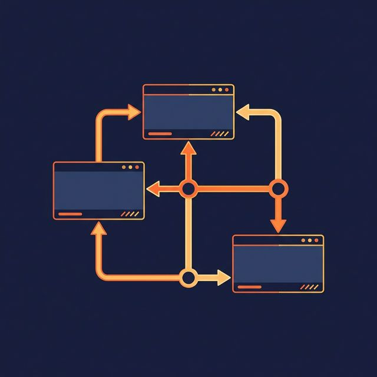
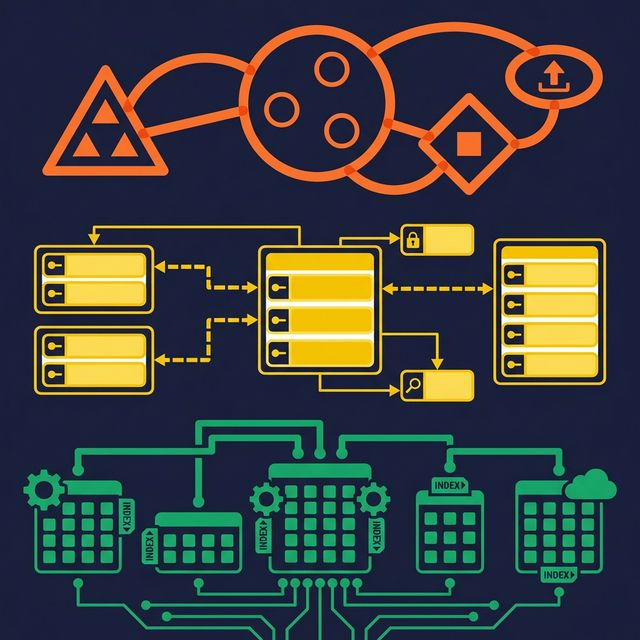
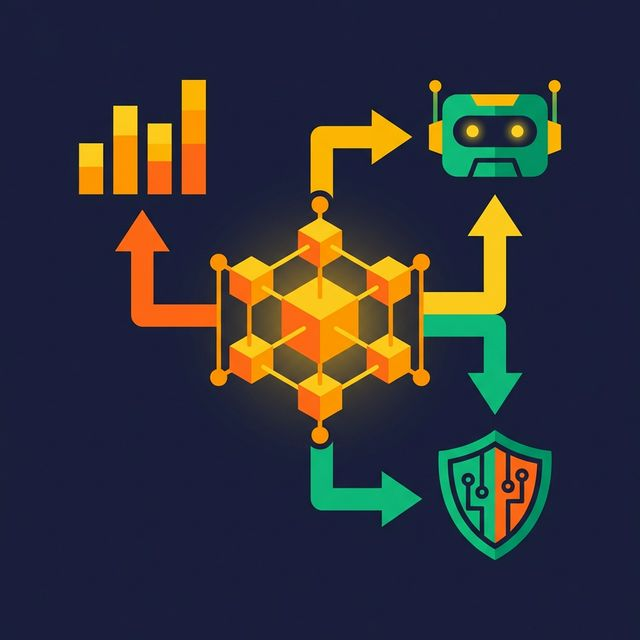

Every database, data warehouse, and data lakehouse starts with the same question: how should this data be organized? Data modeling answers that question by creating a structured blueprint of your data — what it contains, how it relates, and what it means.

A data model is not a diagram you draw once and forget. It's a living definition of your business logic, encoded in the structure of your tables, columns, and relationships. Get it right, and every downstream consumer — dashboards, reports, AI agents, applications — works from the same shared understanding. Get it wrong, and you spend months untangling conflicting definitions of "customer," "revenue," and "active user."

## What Data Modeling Actually Means

Data modeling is the process of defining entities, attributes, and relationships for a dataset. Entities represent real-world objects or concepts (Customers, Orders, Products). Attributes describe those entities (customer name, order date, product price). Relationships define how entities connect (a customer *places* an order, an order *contains* products).

The goal is to create a representation precise enough that a database can store the data reliably, and clear enough that a human — or an AI agent — can understand what the data means.

Think of it as an architectural blueprint. You wouldn't build a house without one, and you shouldn't build a data platform without a data model.

## The Three Levels of Data Modeling

Data models operate at three levels of abstraction, each serving a different audience:

| Level | Audience | Purpose | Contains |
|---|---|---|---|
| **Conceptual** | Business stakeholders | Define *what* data is needed | Entities, relationships, business rules |
| **Logical** | Data architects | Define *how* data is structured | Attributes, data types, normalization rules, keys |
| **Physical** | Database engineers | Define *where and how* data is stored | Tables, columns, indexes, partitions, constraints |

**Conceptual models** capture business requirements without technical details. A conceptual model might say "Customers place Orders, and Orders contain Products." It doesn't specify column types or index strategies. Its job is to align business stakeholders and technical teams on what data the system needs.

**Logical models** add precision. They define attributes (customer_id, customer_name, email), assign data types (INTEGER, VARCHAR, TIMESTAMP), and specify normalization rules. A logical model is independent of any specific database engine — it works whether you implement it in PostgreSQL, Snowflake, or Apache Iceberg.

**Physical models** are implementation-specific. They define table names, column types for a specific DBMS, primary and foreign keys, indexes for query performance, and partitioning strategies. This is where theoretical design meets operational reality — storage formats, compression codecs, and file organization all matter here.

## Common Data Modeling Techniques

Several techniques exist for organizing data. Each fits different use cases:

**Entity-Relationship (ER) Modeling** is the most widely used technique for transactional systems. It maps entities, attributes, and their relationships using formal diagrams. Most OLTP databases — the systems that power applications — start with an ER model.

**Dimensional Modeling** organizes data into facts (measurable events like sales transactions) and dimensions (context like date, product, and customer). Star schemas and snowflake schemas are the two primary patterns. This technique dominates data warehousing and analytics.

**Data Vault Modeling** separates data into Hubs (business keys), Links (relationships), and Satellites (descriptive attributes with history). It's designed for environments where sources change frequently and full audit history matters.

**Graph Modeling** represents data as nodes (entities) and edges (relationships). It's useful when the relationships between data points are as important as the data itself — social networks, recommendation engines, fraud detection.

## Why Data Modeling Matters More Than Ever

Three trends have made data modeling more critical, not less:

**AI needs structure to be accurate.** When an AI agent generates SQL, it relies on well-defined tables, clear column names, and documented relationships. A poorly modeled dataset forces the agent to guess which table contains "revenue" and which join path connects "customers" to "orders." Those guesses create hallucinated queries that return wrong numbers.

**Self-service analytics depends on understandable data.** Business users exploring data in a BI tool can only self-serve if the data model is intuitive. When tables are named `stg_src_cust_v2_final` with columns like `c1`, `c2`, `c3`, even experienced analysts give up and file a ticket instead.

**Compliance requires traceable definitions.** Regulations like GDPR and CCPA demand that organizations know what personal data they store, where it flows, and who can access it. A well-documented data model provides that traceability. Without one, compliance audits turn into archaeology projects.

Platforms like [Dremio](https://www.dremio.com/blog/agentic-analytics-semantic-layer/?utm_source=ev_buffer&utm_medium=influencer&utm_campaign=next-gen-dremio&utm_term=blog-021826-02-18-2026&utm_content=alexmerced) address this by letting you implement data models as virtual datasets (SQL views) organized in a Medallion Architecture — Bronze for raw data preparation, Silver for business logic and joins, Gold for application-specific outputs. The model exists as a logical layer without requiring physical data copies, and Wikis, Labels, and Fine-Grained Access Control add documentation and governance directly to the model.

## What to Do Next

Pick your five most-queried tables. For each one, answer three questions: What does each column mean? How does this table connect to other tables? Who is allowed to see which rows? If you can't answer all three confidently, your data model has gaps.

Filling those gaps means defining clear entities, documenting attributes, and specifying relationships — the core of data modeling.

[Try Dremio Cloud free for 30 days](https://www.dremio.com/get-started?utm_source=ev_buffer&utm_medium=influencer&utm_campaign=next-gen-dremio&utm_term=blog-021826-02-18-2026&utm_content=alexmerced)
