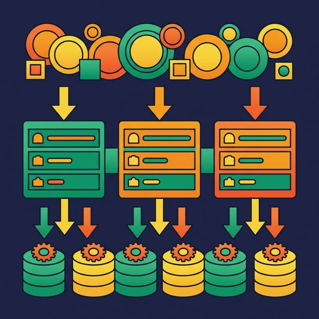
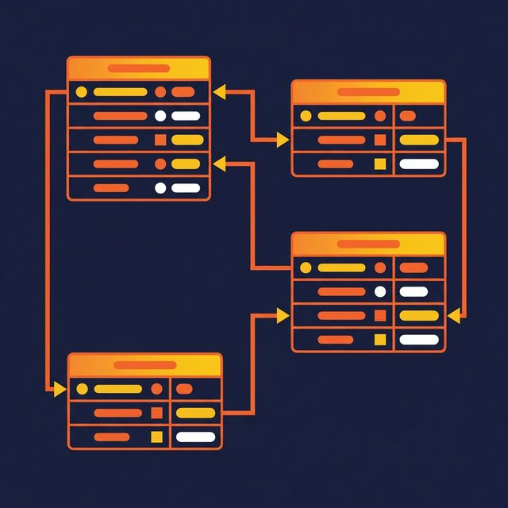

Most data teams jump straight from a stakeholder request to creating database tables. They skip the planning steps that prevent misalignment, redundancy, and rework. The result: tables that make sense to the engineer who built them but confuse everyone else.

Data modeling addresses this by working at three levels of abstraction. Each level answers a different question, for a different audience, at a different stage of the design process.

## Why Three Levels Exist

A single data model can't serve every purpose. Business stakeholders need to see what data the system captures and how concepts relate. Data architects need to define precise structures, data types, and rules. Database engineers need to optimize storage and performance for a specific platform.

Trying to capture all of this in one diagram creates a document that's too abstract for engineers and too technical for the business. Three levels solve this by separating concerns.

## The Conceptual Data Model

A conceptual data model defines the big picture. It identifies the major entities your system needs to track and the relationships between them.

For an e-commerce platform, a conceptual model might look like this:

- **Customer** places **Order**
- **Order** contains **Line Item**
- **Line Item** references **Product**
- **Product** belongs to **Category**

There are no column names, no data types, no keys. The conceptual model exists to answer one question: "Do we agree on what data the system needs?"

This model is created collaboratively with business stakeholders. Its value is alignment. When the finance team says "customer" and the marketing team says "customer," the conceptual model ensures they mean the same thing.

**Skip this level**, and you build a database that captures the wrong entities or misses key relationships. Fixing structural errors after the database is in production costs 10x more than catching them at conception.

## The Logical Data Model

The logical model adds precision to the conceptual model. It defines:

- **Attributes** for each entity (customer_id, customer_name, email, signup_date)
- **Data types** (INTEGER, VARCHAR(255), DATE)
- **Primary keys** (customer_id uniquely identifies each customer)
- **Foreign keys** (order.customer_id references customer.customer_id)
- **Normalization rules** (eliminate redundancy up to Third Normal Form)

The logical model is intentionally DBMS-independent. It works whether you implement it in PostgreSQL, MySQL, Snowflake, or Apache Iceberg tables. This separation matters because it lets you evaluate the design on its own merits before committing to a specific technology.

Normalization is the primary discipline at this level. The logical model eliminates data redundancy by splitting entities into their most atomic forms. A customer's address doesn't live in the orders table — it lives in its own table, referenced by a foreign key.

## The Physical Data Model

The physical model translates the logical model into the exact implementation for a specific database engine. This is where theoretical design meets operational reality.

A physical model specifies:
- Table names and column definitions (`customers`, `orders`, `line_items`)
- Data types specific to the DBMS (`BIGINT` vs. `INTEGER`, `TIMESTAMP_TZ` vs. `TIMESTAMP`)
- Indexes for query performance (B-tree on `customer_id`, hash on `email`)
- Partitioning strategies (partition `orders` by `order_date` using monthly ranges)
- Compression and file format choices (Parquet with Snappy compression for Iceberg)

The physical model is where performance tuning happens. You might denormalize at this level — joining the customer name into the orders table to avoid an expensive join at query time — even though the logical model keeps them separate.

In a lakehouse architecture, the physical model also includes Iceberg table properties: partition specs (time-based or value-based), sort orders for query optimization, and file format settings.

## How the Three Levels Connect

Each level feeds the next:

| Aspect | Conceptual | Logical | Physical |
|---|---|---|---|
| **Abstraction** | High | Medium | Low |
| **Audience** | Business stakeholders | Data architects | Database engineers |
| **Entities** | Named | Defined with attributes | Tables with typed columns |
| **Relationships** | Named | With cardinality and keys | Foreign key constraints |
| **Data types** | None | Generic (INTEGER, VARCHAR) | DBMS-specific (BIGINT, TEXT) |
| **Normalization** | Not applicable | Applied (3NF) | May denormalize for performance |
| **Performance** | Not considered | Not considered | Indexes, partitions, caching |

In platforms like [Dremio](https://www.dremio.com/blog/agentic-analytics-semantic-layer/?utm_source=ev_buffer&utm_medium=influencer&utm_campaign=next-gen-dremio&utm_term=blog-021826-02-18-2026&utm_content=alexmerced), you can implement all three levels using virtual datasets organized in a Medallion Architecture. Bronze views represent the physical layer (raw data mapped to typed columns). Silver views represent the logical layer (joins, business keys, normalized relationships). Gold views represent the conceptual layer (business entities ready for consumption, documented with Wikis and tagged with Labels).

## Common Mistakes

**Skipping the conceptual model.** Engineers jump to table creation and miss requirement gaps that surface months later when a stakeholder asks "Why don't we track X?"

**Building logical models tied to a DBMS.** If your logical model includes PostgreSQL-specific syntax, it's a physical model disguised as a logical one. This makes migration and evaluation harder.

**Over-normalizing for analytics.** Third Normal Form is correct for transactional systems. But analytics workloads benefit from wider, flatter tables that reduce join counts. Know when to denormalize.

**Under-documenting all levels.** A model without documentation is a puzzle. Column names like `c_id`, `dt`, and `amt` save keystrokes and cost hours of confusion.

## What to Do Next

Audit your current data platform against all three levels. Can you show a business stakeholder what entities your system tracks (conceptual)? Can you show an architect the precise attributes and relationships (logical)? Can you explain why the tables are partitioned and indexed the way they are (physical)?

If any of those questions draws a blank, you have a gap worth filling.

[Try Dremio Cloud free for 30 days](https://www.dremio.com/get-started?utm_source=ev_buffer&utm_medium=influencer&utm_campaign=next-gen-dremio&utm_term=blog-021826-02-18-2026&utm_content=alexmerced)
