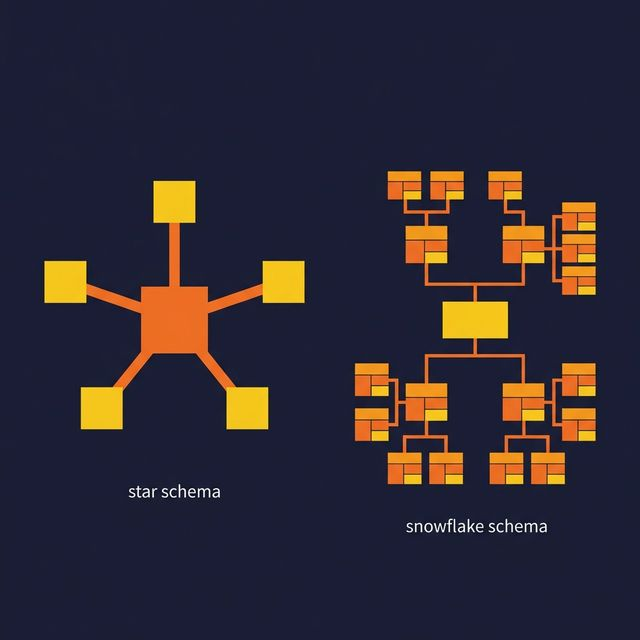
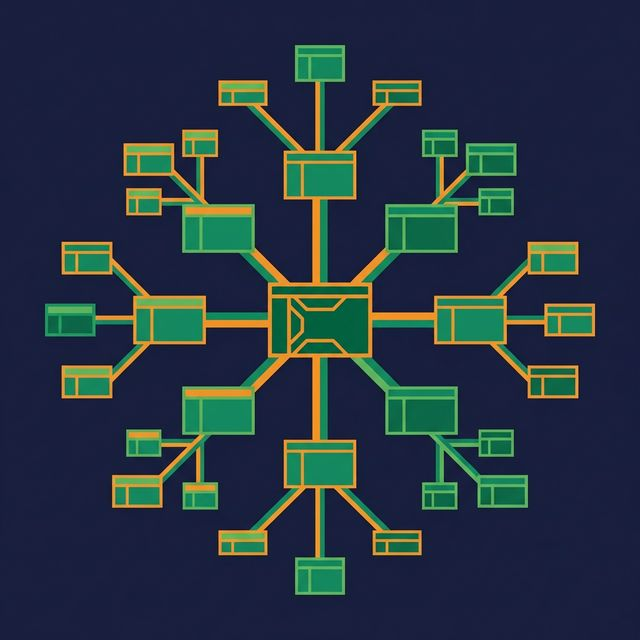

Both star schemas and snowflake schemas are dimensional models. They both organize data into fact tables (measurable events) and dimension tables (context about those events). The difference is how they structure the dimensions.

That structural difference affects query performance, storage efficiency, SQL complexity, and how easily BI tools and AI agents can interpret your data. Here's how to choose.

## The Two Patterns of Dimensional Modeling

Dimensional modeling separates data into two types:

**Fact tables** store measurable events — a sale, a page view, a shipment, a login. Each row represents one event. Columns include numeric measures (revenue, quantity, duration) and foreign keys pointing to dimension tables.

**Dimension tables** provide context for facts — who (customer), what (product), when (date), where (location), how (channel). Dimensions describe the "business words" people use to filter, group, and label their analysis.

Star and snowflake schemas differ in how they organize those dimension tables.

## Star Schema: Denormalized Dimensions

In a star schema, each dimension is a single, denormalized table. All attributes for a dimension live in one place.

A product dimension contains the product name, category, subcategory, department, and brand — all in one table. This means some values repeat. Every product in the "Electronics" category stores the string "Electronics" in its row.

**Advantages:**
- Fewer joins per query. A typical star schema query joins the fact table to 3-5 dimension tables. That's it.
- Simpler SQL. Analysts write shorter, more readable queries.
- Faster query performance. Fewer joins means less work for the query engine.
- Better BI tool compatibility. Most BI tools expect star schemas and generate optimal SQL against them.

**Tradeoff:** Data redundancy in dimensions. If the "Electronics" department changes its name, you update it in every row that references it.

## Snowflake Schema: Normalized Dimensions

In a snowflake schema, dimensions are normalized into sub-tables. Instead of one product dimension, you have separate tables for Product, Category, Subcategory, and Department, linked by foreign keys.

**Advantages:**
- Less storage redundancy. Each value stored once. "Electronics" appears in one row of the Department table.
- Single source of truth per attribute. Rename a department in one row instead of thousands.
- Aligns with OLTP normalization practices. Familiar to engineers coming from transactional database backgrounds.

**Tradeoff:** More joins per query. A query that would join 4 tables in a star schema might join 8-12 tables in a snowflake schema. SQL gets longer, more complex, and harder for analysts to write without help.

## Side-by-Side Comparison

| Aspect | Star Schema | Snowflake Schema |
|---|---|---|
| Dimension structure | Denormalized (flat) | Normalized (branching) |
| Tables per query | Fewer (4-6 typical) | More (8-12 typical) |
| Query performance | Faster | Slower (more joins) |
| SQL complexity | Simpler | More complex |
| Storage efficiency | Lower (some redundancy) | Higher |
| BI tool compatibility | Better | Harder |
| ETL/pipeline complexity | Simpler loads | More complex loads |
| Self-service friendliness | High | Low |
| Update granularity | Update many rows | Update one row |

## When to Choose Which

**Choose a star schema when:**
- Your primary workload is analytics and reporting
- Business users run ad-hoc queries or use BI tools
- Query performance matters more than storage costs
- You want AI agents to generate accurate SQL (fewer joins = fewer mistakes)
- Your dimensions are small enough that redundancy is negligible

**Choose a snowflake schema when:**
- Dimensions are very large and redundancy has real storage costs
- Regulatory requirements demand a single canonical source per attribute
- Only ETL engineers (not analysts) write queries against the model
- You need strict referential integrity across dimension hierarchies

## Why Star Schema Usually Wins

Three changes in modern data platforms have tilted the balance toward star schemas:

**Storage is cheap.** Object storage costs a fraction of a cent per gigabyte per month. The storage savings from normalizing dimensions rarely justify the query complexity cost.

**Columnar formats compress redundancy well.** Parquet and ORC store data in columns. Repeated values like "Electronics" compress to nearly nothing. The physical storage overhead of a denormalized dimension is much smaller than it appears in row-oriented thinking.

**AI and self-service need simplicity.** When an AI agent generates SQL against your data model, fewer tables and fewer joins reduce the chance of hallucinated join paths. When a business analyst builds a report, fewer joins reduce the chance of wrong results.

Platforms like [Dremio](https://www.dremio.com/blog/agentic-analytics-semantic-layer/?utm_source=ev_buffer&utm_medium=influencer&utm_campaign=next-gen-dremio&utm_term=blog-021826-02-18-2026&utm_content=alexmerced) make this choice even easier. Virtual datasets let you model star schemas as SQL views without physically copying or denormalizing data. Reflections automatically optimize query performance in the background. You get the simplicity of a star schema with optimized physical performance, regardless of how the underlying data is stored.

## What to Do Next

Take your most-used fact table. Count the joins required to build a complete report. If you're joining more than five dimension tables, or if dimension tables themselves require sub-joins, consider flattening your dimensions into a star schema. Measure the query performance difference. In most cases, the improvement is significant and the storage increase is negligible.

[Try Dremio Cloud free for 30 days](https://www.dremio.com/get-started?utm_source=ev_buffer&utm_medium=influencer&utm_campaign=next-gen-dremio&utm_term=blog-021826-02-18-2026&utm_content=alexmerced)
