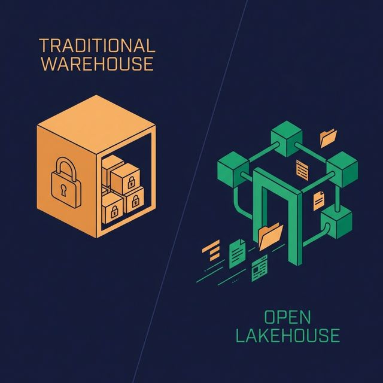
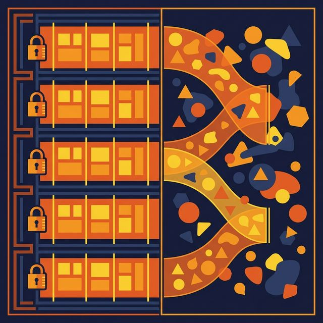
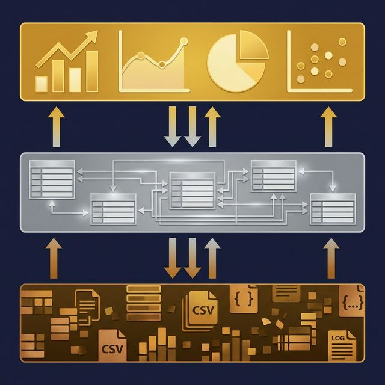

Traditional data modeling assumed you controlled the database. You defined schemas up front, enforced foreign keys at write time, and optimized with indexes. The lakehouse changes every one of those assumptions.

Data lives in open file formats on object storage. Schemas evolve without rewriting data. Queries run through engines that may not enforce relational constraints. The modeling discipline is the same, but the mechanics are different.

## What's Different About a Lakehouse

A lakehouse stores data as files — typically Parquet — on object storage like S3 or Azure Blob. An open table format like Apache Iceberg adds structure: schema definitions, partition metadata, snapshot history, and transactional guarantees.

This architecture gives you more flexibility than a traditional RDBMS, but also more responsibility. There are no foreign key constraints enforced at write time. No triggers. No stored procedures. Referential integrity is your problem to solve in pipelines and views, not something the storage engine handles for you.

The tradeoff is worth it: open formats, engine portability, cheap storage, and the ability to run multiple compute engines (Spark, Dremio, Flink, Trino) against the same data.

## Schema-on-Read Changes the Rules

In a traditional warehouse, you define the schema before writing data (schema-on-write). Every row must conform to the schema or the insert fails. This guarantees consistency but makes changes expensive. Adding a column means an ALTER TABLE. Changing a data type might require rewriting the entire table.

In a lakehouse, you can also store data first and apply structure at query time (schema-on-read). Iceberg supports schema evolution natively — add columns, rename columns, widen data types, and reorder fields without rewriting underlying files.

This flexibility changes how you model:
- **Bronze layer**: Accept data as-is from sources. Apply minimal typing. Don't reject records that don't match a rigid schema.
- **Silver layer**: Apply business logic, joins, and type enforcement through SQL views.
- **Gold layer**: Serve consumption-ready datasets with stable, documented schemas.

The model evolves at the view layer, not the storage layer. This makes iteration faster and migration cheaper.

## The Medallion Architecture as a Modeling Pattern

The Medallion Architecture (Bronze → Silver → Gold) is the most common data modeling pattern in lakehouse environments. Each layer is a set of SQL views or managed tables:

**Bronze (Preparation):**
- Maps raw source data to typed columns
- Renames ambiguous column names
- Applies basic data type casting
- One view per source table

**Silver (Business Logic):**
- Joins related entities (orders + customers + products)
- Applies business rules (revenue = quantity × price WHERE status = 'completed')
- Filters invalid or duplicate records
- Implements the logical data model

**Gold (Application):**
- Tailored views for specific use cases
- Executive dashboards, Sales reports, AI agent context
- Minimal transformation — mostly selecting from Silver views
- Documented with business-friendly names and descriptions

In [Dremio](https://www.dremio.com/blog/agentic-analytics-semantic-layer/?utm_source=ev_buffer&utm_medium=influencer&utm_campaign=next-gen-dremio&utm_term=blog-021826-02-18-2026&utm_content=alexmerced), these layers are implemented as virtual datasets (SQL views) organized in Spaces. Each view is documented with Wikis, tagged with Labels, and governed with Fine-Grained Access Control. The logical model lives in the platform, not in scattered dbt files or tribal knowledge.

## Physical Modeling for Iceberg Tables

When you do create physical Iceberg tables (as opposed to views), the modeling considerations differ from traditional RDBMS:

**Partitioning matters more than indexing.** Iceberg uses partition pruning instead of traditional B-tree indexes. Choose partition columns based on your most common query filters — typically date columns. Iceberg's hidden partitioning means users don't need to know the partition scheme to write efficient queries.

**Sort order affects scan performance.** Within each partition, Iceberg can sort data by specified columns. Sorting by a frequently filtered column (like `customer_id` or `region`) enables min/max pruning that skips irrelevant files.

**Compaction replaces vacuum.** Small files accumulate from streaming inserts. Regular compaction rewrites many small files into fewer large files, improving scan performance.

**Schema evolution is non-destructive.** Adding a column to an Iceberg table doesn't rewrite existing files. Old files return `null` for the new column. This makes the physical model more adaptable than traditional databases.

## Challenges to Watch For

**No referential integrity enforcement.** The lakehouse won't stop you from inserting an order with a `customer_id` that doesn't exist in the customers table. Build data quality checks in your pipelines.

**Schema drift across sources.** When sources change their schemas unexpectedly, your Bronze layer must handle it. Design Bronze views to be tolerant of new or missing columns.

**Over-reliance on views.** Views are powerful, but deeply nested views (View D reads from View C reads from View B reads from View A) create performance and debugging challenges. Keep the chain to three levels when possible.

## What to Do Next

If you're moving from a traditional warehouse to a lakehouse, start by recreating your most-used tables as Iceberg tables and your most-used transformations as SQL views. Organize those views into Bronze, Silver, and Gold layers. Measure whether query performance meets your SLAs — and if it doesn't, add Reflections to optimize the heavy queries without changing the logical model.

[Try Dremio Cloud free for 30 days](https://www.dremio.com/get-started?utm_source=ev_buffer&utm_medium=influencer&utm_campaign=next-gen-dremio&utm_term=blog-021826-02-18-2026&utm_content=alexmerced)
