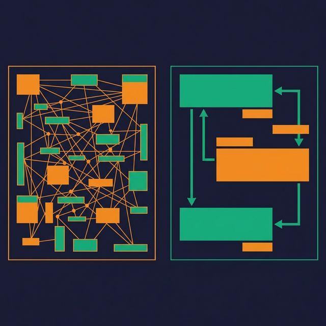
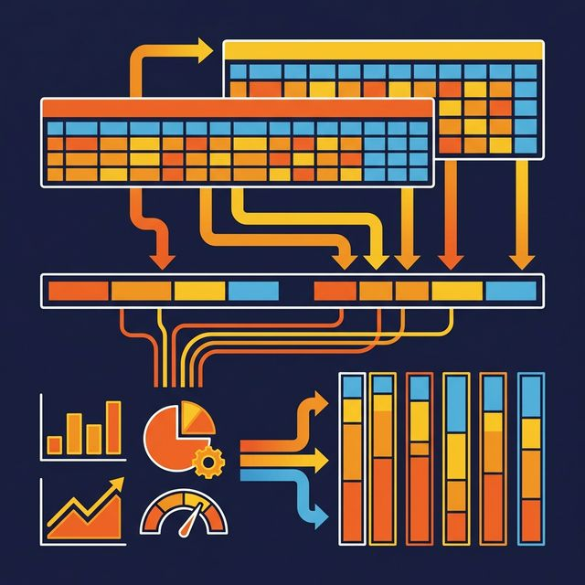

The data model that runs your production application is almost never the right model for analytics. Transactional systems are designed for fast writes — inserting orders, updating inventory, processing payments. Analytics systems are designed for fast reads — scanning millions of rows, aggregating across dimensions, filtering by date ranges.

Using a transactional model for analytics is like using a filing cabinet when you need a search engine. The data is there, but finding answers takes too long.

## Transactions vs. Analytics: Two Different Problems

Transactional (OLTP) workloads process many small operations: insert one order, update one account balance, delete one expired session. These models are normalized to Third Normal Form (3NF) or beyond —  every piece of data stored once, redundancy eliminated, consistency enforced through constraints.

Analytical (OLAP) workloads process few large operations: scan all orders for the last year, aggregate revenue by region and product category, calculate year-over-year growth. These models are denormalized — data is pre-joined, attributes are flattened, and the structure is optimized for scans rather than updates.

| Aspect | OLTP Model | OLAP Model |
|---|---|---|
| Optimization target | Write speed | Read speed |
| Normalization | 3NF or higher | Denormalized |
| Table structure | Narrow and many | Wide and few |
| Joins per query | Many (10-20) | Few (3-5) |
| Storage format | Row-oriented | Columnar |
| Typical query | UPDATE one row | SUM across millions |

## Why Normalized Models Slow Down Analytics

A normalized 3NF model might have 15 tables involved in answering "What was revenue by product category by month?" The query engine must join orders to order_items to products to categories to dates, applying filters and aggregations across each join.

Each join adds latency. Each join also adds a point of failure — wrong join condition, missing foreign key, ambiguous column name. An AI agent generating SQL against a 15-table normalized model has far more opportunities to make a mistake than against a 4-table star schema.

The fix is not to abandon normalization. Keep your OLTP model normalized for your application. But create a separate analytical model — denormalized, structured for queries, with pre-built joins and business-friendly column names — for reporting and analytics.

## Designing for Read Performance

Analytical data models follow several patterns that optimize for read performance:

**Wide tables reduce joins.** Instead of `orders → customers → addresses → cities → states`, create a single `fact_orders` view with `customer_name`, `customer_city`, `customer_state` included. Every join you eliminate saves query time and reduces complexity.

**Pre-computed columns reduce repeated calculations.** If every report calculates `quantity * unit_price * (1 - discount)` as "net revenue," compute it once in the model and expose it as a column. This eliminates repeated formula definitions and ensures consistency.

**Consistent naming improves discoverability.** Use `order_date` instead of `dt`. Use `customer_email` instead of `email`. When column names are self-explanatory, analysts find the right data faster, and AI agents generate more accurate SQL.

**Date dimensions enable time-based analysis.** A date dimension with `fiscal_quarter`, `is_weekend`, `is_holiday`, and `week_of_year` makes time-based filtering trivial. Without it, every analyst writes a different `CASE WHEN MONTH(date) IN (1,2,3) THEN 'Q1'` expression.

## Pre-Aggregation and Summary Tables

Not every query needs to scan raw data. For frequently run aggregations, pre-aggregated summary tables reduce query time from minutes to milliseconds.

Common patterns:
- **Daily summary**: Total revenue, order count, average order value per day per product category
- **Monthly snapshot**: Active customers, churned customers, MRR per segment
- **Rolling window**: 7-day and 30-day moving averages for key metrics

The tradeoff is maintenance. Every summary table needs a refresh pipeline, and stale summaries produce outdated numbers.

Platforms like [Dremio](https://www.dremio.com/blog/5-ways-dremio-reflections-outsmart-traditional-materialized-views/?utm_source=ev_buffer&utm_medium=influencer&utm_campaign=next-gen-dremio&utm_term=blog-021826-02-18-2026&utm_content=alexmerced) handle this automatically with Reflections — pre-computed aggregations and materializations that the query optimizer uses transparently. Users query the logical views; Dremio substitutes the fastest Reflection without the user knowing. No manual summary table management required.

## Columnar Storage and Physical Layout

Analytics models benefit from columnar storage formats like Parquet:

- **Column pruning**: Queries that touch 5 of 50 columns only read those 5 columns from disk
- **Compression**: Repeated values in a column (category names, status codes) compress efficiently
- **Vectorized processing**: Engines like Dremio (built on Apache Arrow) process columnar data in CPU-cache-friendly batches

Physical layout decisions that matter:
- **Partition by time**: Most analytics queries filter by date range. Partitioning by month or day lets the engine skip irrelevant data files entirely.
- **Sort by high-cardinality filters**: If queries frequently filter by `customer_id` or `region`, sorting data within partitions enables min/max pruning.
- **Compact regularly**: Small files from streaming inserts slow down scan performance. Compaction rewrites small files into larger, optimized ones.

## What to Do Next

Find your slowest dashboard. Look at the queries behind it. Count the joins, measure the scan size, and check whether the model is normalized 3NF or denormalized for analytics. If it's still using the transactional model, create an analytical view layer on top — a denormalized star schema with pre-computed columns, clear naming, and a date dimension. The dashboard performance improvement is usually immediate and significant.

[Try Dremio Cloud free for 30 days](https://www.dremio.com/get-started?utm_source=ev_buffer&utm_medium=influencer&utm_campaign=next-gen-dremio&utm_term=blog-021826-02-18-2026&utm_content=alexmerced)
