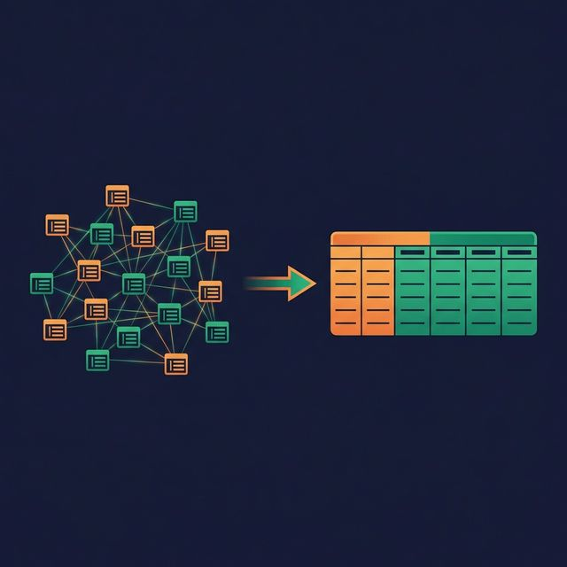
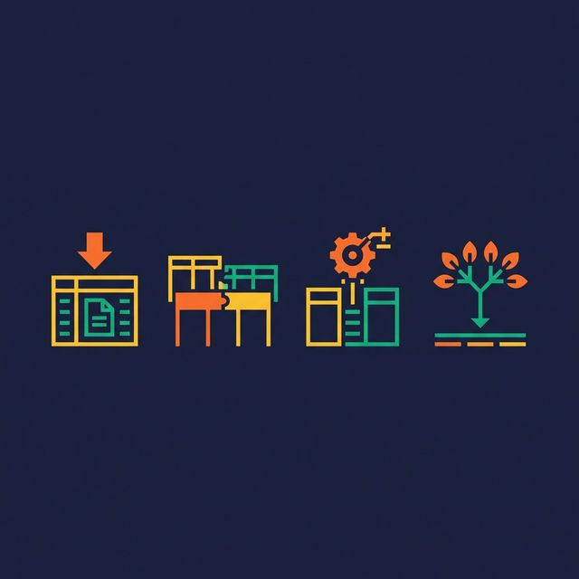
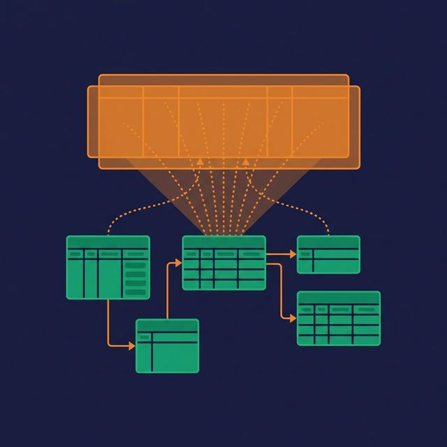

Normalization is the first rule taught in database design. Eliminate redundancy. Store each fact once. Use foreign keys. It's the right rule for transactional systems. And it's the wrong rule for most analytics workloads.

Denormalization is the deliberate introduction of redundancy into your data model to reduce joins and speed up queries. Done poorly, it creates a maintenance nightmare. Done well, it turns slow dashboards into fast ones and makes your data accessible to analysts and AI agents who can't write 12-table joins.

## What Normalization Gives You (and What It Costs)

Normalization (Third Normal Form and beyond) organizes data so that each piece of information exists in exactly one place. A customer's city lives in the customers table. An order's product lives in the order_items table joined to the products table.

**What normalization gives you:**
- No update anomalies (change a city in one row, not thousands)
- Smaller storage footprint (no duplicated data)
- Strong data integrity (constraints enforced at the schema level)

**What normalization costs you:**
- More joins per query (a report might join 10-15 tables)
- Slower read performance (each join adds latency)
- More complex SQL (longer queries, more error-prone)
- Harder self-service (analysts struggle with multi-join queries)

For an OLTP system processing 10,000 inserts per second, normalization is correct. For an OLAP system answering "revenue by region by quarter," it's a performance bottleneck.

## What Denormalization Actually Means

Denormalization takes several forms:

**Embedding dimension attributes in fact tables.** Instead of joining `orders → customers` to get the customer name, include `customer_name` directly in the orders table.

**Pre-joining lookup tables.** Instead of maintaining separate `cities`, `states`, and `countries` tables, flatten them into a single column: `customer_city_state_country`.

**Adding calculated columns.** Instead of computing `quantity × price × (1 - discount)` in every query, store `net_revenue` as a pre-computed column.

**Creating wide summary tables.** Instead of joining across 8 tables for a monthly report, create a `monthly_summary` table with all needed columns in one place.



The key insight: denormalization trades write-time simplicity for read-time simplicity. Updating a customer's city now requires updating it in multiple places. But querying revenue by city no longer requires a join.

## When to Denormalize

**Analytics and reporting workloads.** If your model primarily serves dashboards, reports, and ad-hoc queries, denormalization reduces query time and complexity.

**Self-service environments.** Business users selecting fields in a BI tool get better results from a wide, flat table than from a web of normalized tables they don't understand.

**AI-driven queries.** When an AI agent generates SQL, fewer tables and fewer joins reduce the chance of wrong join conditions and hallucinated relationships.

**Read-heavy, write-light patterns.** If your data loads once a day (batch ETL) and gets queried thousands of times, optimizing for reads makes sense.

## When NOT to Denormalize

**High-frequency transactional writes.** If your system processes real-time inserts and updates, denormalized redundancy creates update anomalies. A customer moving to a new city means updating hundreds of order rows.

**When consistency matters more than speed.** Financial systems with audit requirements often need the strict integrity that normalization provides.

**Small datasets.** If the query joins 5 tables with 1,000 rows each, denormalization won't improve performance noticeably. The overhead of redundancy isn't worth the marginal speed gain.

## The Tradeoffs

| Benefit | Cost |
|---|---|
| Fewer joins per query | Update anomalies (same data in multiple places) |
| Faster read performance | Larger storage footprint |
| Simpler SQL for analysts | Pipeline complexity (keeping redundant data in sync) |
| Better BI tool compatibility | Risk of inconsistency if pipelines fail |
| AI agents write more accurate SQL | More effort to maintain data quality |

## Virtual Denormalization: The Middle Path

There's a way to get the query benefits of denormalization without the physical redundancy: SQL views.

A view can join and flatten multiple normalized tables into a single logical table. Consumers query the view as if it's one wide table — simple SQL, no joins required. But the underlying data stays normalized. Update a customer's city in the customers table, and the view reflects the change automatically.

```sql
CREATE VIEW v_orders_enriched AS
SELECT
    o.order_id,
    o.order_date,
    c.customer_name,
    c.city AS customer_city,
    p.product_name,
    p.category AS product_category,
    o.quantity * o.unit_price AS revenue
FROM orders o
JOIN customers c ON o.customer_id = c.customer_id
JOIN products p ON o.product_id = p.product_id;
```

Analysts query `v_orders_enriched` without knowing the underlying structure. The join logic is defined once and reused by everyone.

The tradeoff: views execute the joins at query time. For very large datasets, this can be slow. Platforms like [Dremio](https://www.dremio.com/blog/5-ways-dremio-reflections-outsmart-traditional-materialized-views/?utm_source=ev_buffer&utm_medium=influencer&utm_campaign=next-gen-dremio&utm_term=blog-021826-02-18-2026&utm_content=alexmerced) solve this with Reflections — which physically materialize the view's results in an optimized format, updated automatically. Users still query the logical view, but the engine substitutes the pre-computed Reflection for performance. You get the simplicity of denormalization, the consistency of normalization, and the speed of materialization.

## What to Do Next



Identify your most-queried report or dashboard. Count the joins in the underlying SQL. If there are more than five, create a denormalized view that flattens the data. Compare query performance before and after. If the view is still too slow for your SLA, adding a materialized acceleration layer (like Reflections) closes the gap.

[Try Dremio Cloud free for 30 days](https://www.dremio.com/get-started?utm_source=ev_buffer&utm_medium=influencer&utm_campaign=next-gen-dremio&utm_term=blog-021826-02-18-2026&utm_content=alexmerced)
