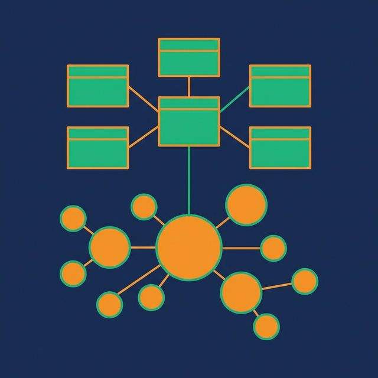

Dimensional modeling works well when your source systems are stable and your business questions are predictable. But what happens when sources change constantly, new systems get added every quarter, and regulatory requirements demand a full audit trail of every attribute change?

Data Vault modeling was designed for exactly this scenario. Created by Dan Linstedt, it separates data into three distinct table types — Hubs, Links, and Satellites — each handling a different concern: identity, relationships, and descriptive context.

## What Problem Data Vault Solves

Traditional dimensional models embed everything about a business entity in one dimension table. A `dim_customers` table contains the customer ID, name, address, segment, acquisition channel, and lifetime value. When a new source system provides additional customer attributes, you add columns to `dim_customers`. When business rules change how "segment" is calculated, you update the ETL pipeline that populates that table.

Over time, these dimension tables become fragile. They depend on multiple source systems. A change in one source breaks the ETL. Schema changes require coordinated updates across pipelines, tables, and downstream reports.

Data Vault solves this by decomposing entities into independent components that can evolve separately.

## The Three Building Blocks

### Hubs: Business Identity

A Hub stores unique business keys — the identifiers that define a business entity regardless of which source system provides them.

```sql
CREATE TABLE hub_customer (
    customer_hash_key BINARY(32),  -- Hash of the business key
    customer_id VARCHAR(50),        -- Natural business key
    load_date TIMESTAMP,
    record_source VARCHAR(100)
);
```

Hubs are immutable. Once a business key is loaded, it never changes. A customer who has `customer_id = 'C-1042'` always has that key. Hubs answer the question: *What business concepts exist?*

### Links: Relationships


A Link stores relationships between Hubs. Every relationship — customer-to-order, order-to-product, employee-to-department — gets its own Link table.

```sql
CREATE TABLE link_customer_order (
    link_hash_key BINARY(32),
    customer_hash_key BINARY(32),
    order_hash_key BINARY(32),
    load_date TIMESTAMP,
    record_source VARCHAR(100)
);
```

Links are also immutable. Once a relationship is recorded, it stays. Links support many-to-many relationships by default. They answer the question: *How are business concepts related?*

### Satellites: Descriptive Context

Satellites store the descriptive attributes of a Hub or Link, along with their change history.

```sql
CREATE TABLE sat_customer_details (
    customer_hash_key BINARY(32),
    effective_date TIMESTAMP,
    customer_name VARCHAR(200),
    email VARCHAR(200),
    city VARCHAR(100),
    segment VARCHAR(50),
    load_date TIMESTAMP,
    record_source VARCHAR(100)
);
```

Every time an attribute changes, a new Satellite row is inserted. This is equivalent to SCD Type 2 — full history is preserved without modifying existing rows. Different source systems can feed different Satellites for the same Hub, allowing attributes to arrive independently.

## How a Data Vault Query Works

To reconstruct a business entity (like a current customer profile), you join the Hub to its current Satellite rows:

```sql
SELECT
    h.customer_id,
    s.customer_name,
    s.email,
    s.city,
    s.segment
FROM hub_customer h
JOIN sat_customer_details s ON h.customer_hash_key = s.customer_hash_key
WHERE s.effective_date = (
    SELECT MAX(effective_date)
    FROM sat_customer_details s2
    WHERE s2.customer_hash_key = s.customer_hash_key
);
```

This is more complex than querying `dim_customers` directly. That complexity is the primary criticism of Data Vault. In practice, teams build a presentation layer — star schema views on top of the vault — for business users and BI tools.

Platforms like [Dremio](https://www.dremio.com/blog/agentic-analytics-semantic-layer/?utm_source=ev_buffer&utm_medium=influencer&utm_campaign=next-gen-dremio&utm_term=blog-021826-02-18-2026&utm_content=alexmerced) make this practical. The raw vault tables live in the Bronze layer. Silver-layer views reconstruct business entities by joining Hubs, Links, and Satellites. Gold-layer views present dimensional star schemas for dashboards and AI agents. Users never query the vault tables directly.

## When Data Vault Fits

**Multiple source systems that change frequently.** Adding a new source means adding new Satellites — not redesigning existing tables. The Hub and Link structure remains stable.

**Regulated industries requiring full audit trails.** Financial services, healthcare, and government often need to prove what data looked like at any point in time. Satellites provide that out of the box.

**Large enterprises with parallel development teams.** Hubs, Links, and Satellites can be loaded independently, enabling parallel ETL development without pipeline conflicts.

**Long-term data warehouses with decades of history.** The separation of structure (Hubs, Links) from content (Satellites) makes the vault resilient to business changes over time.

## When Data Vault Doesn't Fit

**Small teams or simple source environments.** If you have five source tables and one BI tool, Data Vault adds complexity without proportional benefit. A star schema is faster to build and easier to maintain.

**Direct BI tool access.** BI tools don't speak Data Vault natively. You always need a presentation layer on top, which means building two models instead of one.

**Speed-to-value projects.** When the goal is "get a dashboard live this sprint," Data Vault's up-front design work slows you down.

| Factor | Data Vault | Dimensional Model |
|---|---|---|
| Source flexibility | High | Moderate |
| Audit trail | Built-in | Optional (SCDs) |
| Query simplicity | Low (needs presentation layer) | High |
| Learning curve | High | Moderate |
| Adding new sources | Easy (new satellites) | Harder (redesign dimensions) |
| BI tool compatibility | Low | High |

## What to Do Next



If you're evaluating Data Vault, start by counting your source systems and estimating how often they change schema. If the answer is "more than five sources" and "at least once a quarter," Data Vault's separation of concerns will likely save you from painful redesign cycles. If your environment is simpler than that, a well-designed dimensional model will get you to production faster.

[Try Dremio Cloud free for 30 days](https://www.dremio.com/get-started?utm_source=ev_buffer&utm_medium=influencer&utm_campaign=next-gen-dremio&utm_term=blog-021826-02-18-2026&utm_content=alexmerced)
