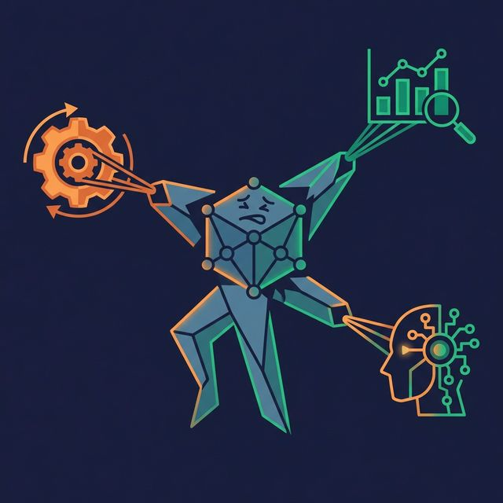

A bad data model doesn't announce itself. It hides behind slow dashboards, conflicting numbers, confused analysts, and AI agents that generate wrong SQL. By the time someone identifies the model as the root cause, the team has already built dozens of reports on top of it.

Here are seven modeling mistakes that create downstream pain — and how to avoid each one.

## Mistake 1: No Defined Grain

The grain declares what one row in a fact table represents. "One row per order line item." "One row per daily user session." "One row per monthly account balance."

Without a declared grain, aggregation produces wrong numbers. If some rows represent individual transactions and others represent daily summaries, a SUM query double-counts or under-counts depending on the mix.

**Fix:** Before designing any fact table, write down the grain in one sentence. Share it with your team. If you can't state the grain clearly, the table isn't ready for production.

## Mistake 2: Cryptic Naming

Columns named `c1`, `dt`, `amt`, `flg`, and `cat_cd` save keystrokes during development but cost hours during analysis. Every analyst who encounters these names must either read the ETL code, ask the engineer, or guess.

AI agents have the same problem. An agent asked to calculate "total revenue" can't identify the right column if it's called `amt3` instead of `revenue_usd`.

**Fix:** Use descriptive, business-friendly names. `customer_name`, `order_date`, `revenue_usd`, `is_active`, `product_category`. Include units where ambiguous (`weight_kg`, `duration_minutes`). Use `snake_case` consistently.

## Mistake 3: Skipping the Conceptual Model

Going straight from a stakeholder request to `CREATE TABLE` skips the alignment step. Engineers build what they understand from the request. Stakeholders assumed something different. The gap surfaces weeks or months later when reports don't match expectations.

**Fix:** For every new business domain, create a conceptual model first. List the entities, name the relationships, and get business stakeholder sign-off before writing any SQL.

## Mistake 4: Over-Normalizing for Analytics

Third Normal Form (3NF) is correct for transactional systems where writes are frequent and consistency matters. Applied to an analytics workload, it creates queries with 10-15 joins that run slowly and break easily.

**Fix:** Separate your transactional model from your analytical model. Keep the OLTP system in 3NF. Build a denormalized star schema (or a set of wide views) for analytics. Different workloads deserve different models.

## Mistake 5: Under-Documenting

A data model without documentation is a puzzle that only its creator can solve. And even they forget the details after a few months.

Without documentation, every new team member reverse-engineers the model from scratch. Every AI agent generates SQL based on guesses. Every analyst interprets column meanings differently, leading to metric discrepancies that take weeks to reconcile.

**Fix:** Document at three levels:
- **Column level:** What does each column mean? Where does it come from?
- **Table level:** What grain does this table use? Who maintains it?
- **Model level:** How do tables connect? What business process does this model represent?

Platforms like [Dremio](https://www.dremio.com/blog/agentic-analytics-semantic-layer/?utm_source=ev_buffer&utm_medium=influencer&utm_campaign=next-gen-dremio&utm_term=blog-021826-02-18-2026&utm_content=alexmerced) make this practical with built-in Wikis for every dataset and Labels for classification (PII, Certified, Raw, Deprecated). The documentation lives next to the data, not in a separate spreadsheet that goes stale.

## Mistake 6: One Model for Every Workload

A model designed for a transactional application doesn't serve analytics well. A model designed for analytics doesn't serve a machine learning feature store well. Trying to make one model serve every use case leads to compromises that serve no use case well.

**Fix:** Build purpose-specific models layered on top of shared source data. The Medallion Architecture does this naturally:
- **Bronze:** Raw data from sources (shared foundation)
- **Silver:** Business logic layer (shared across analytics and ML)
- **Gold:** Purpose-built views (one for dashboards, one for ML features, one for AI agents)

Each Gold view is tailored to its consumer without duplicating the transformation logic in Silver.

## Mistake 7: Ignoring Governance

Data models don't exist in a vacuum. They contain PII, financial data, health records, and other sensitive information. Ignoring governance creates compliance risk and erodes trust.

Common governance gaps:
- No access controls (everyone sees everything)
- No classification (no one knows which columns contain PII)
- No ownership (no one knows who to ask about table X)
- No lineage (no one knows where the data came from)

**Fix:** Integrate governance from day one:
- Tag columns by sensitivity (PII, financial, public)
- Assign ownership per table or domain
- Apply row and column-level access policies
- Document data lineage from source to consumption

In Dremio, Fine-Grained Access Control enforces row and column-level policies, Labels classify datasets, and the Open Catalog tracks lineage. Governance is part of the platform, not an afterthought.

## What to Do Next

Pick one of these seven mistakes. Check whether your current data model has it. Fix it. Then move to the next one. Data modeling is iterative — no team gets it perfect on the first pass. The goal is not perfection but continuous improvement: clearer names, better documentation, tighter governance, and models that match what your consumers actually need.

[Try Dremio Cloud free for 30 days](https://www.dremio.com/get-started?utm_source=ev_buffer&utm_medium=influencer&utm_campaign=next-gen-dremio&utm_term=blog-021826-02-18-2026&utm_content=alexmerced)
