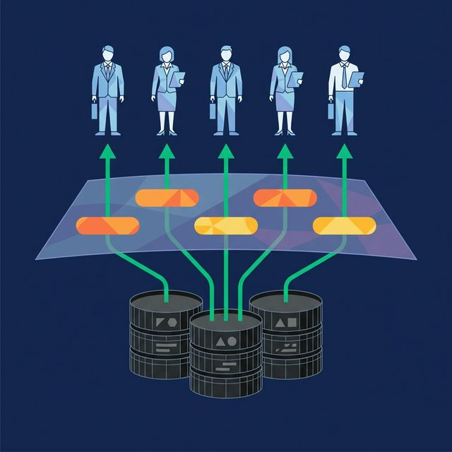
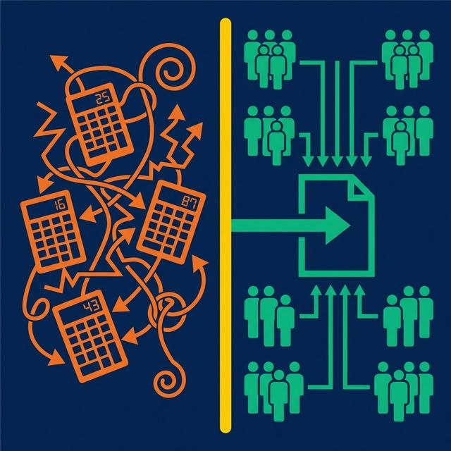

Ask three teams in your company how they calculate "revenue" and you'll get three answers. Sales counts bookings. Finance counts recognized revenue. Marketing counts pipeline value. All three call it "revenue." All three get different numbers. Nobody knows which one is right.

This is the problem a semantic layer solves.

## What a Semantic Layer Actually Is

A semantic layer is a logical abstraction between your raw data and the people (or AI agents) querying it. It maps technical database objects — tables, columns, join paths — to business-friendly terms like "Revenue," "Active Customer," or "Churn Rate."

It's not a database. It doesn't store data. It's a layer of definitions, calculations, and context that ensures every query against your data produces consistent results, regardless of which tool or person runs it.

The concept isn't new. Business Objects introduced "universes" in the 1990s — metadata models that let users drag and drop business concepts instead of writing SQL. What's changed is scope. Modern semantic layers are universal (not tied to one BI tool), AI-aware (they provide context to language models), and governance-integrated (they enforce access policies alongside definitions).

## What a Semantic Layer Contains

A complete semantic layer includes six components:

| Component | What It Does |
|---|---|
| **Virtual datasets (Views)** | SQL-defined business logic applied once and reused everywhere |
| **Metric definitions** | Canonical calculations for KPIs (e.g., MRR = SUM of active subscription revenue) |
| **Documentation** | Human- and machine-readable descriptions of tables, columns, and relationships |
| **Labels and tags** | Categorization for governance (PII, Finance) and discovery |
| **Join relationships** | Pre-defined join paths so users don't need to know foreign keys |
| **Access policies** | Row-level security and column masking enforced at the layer |

The key insight: these components serve both human analysts and AI agents. When an AI generates SQL from a natural language question, it consults this same layer to understand what "revenue" means, which tables to join, and which columns to filter.

## How It Works in Practice

Here's what happens when someone queries data through a semantic layer:

1. A user (or AI agent) asks: "What was revenue by region last quarter?"
2. The semantic layer translates:
   - "Revenue" → `SUM(orders.total) WHERE orders.status = 'completed'`
   - "Region" → `customers.region`
   - "Last quarter" → `WHERE order_date BETWEEN '2025-10-01' AND '2025-12-31'`
3. The query engine generates optimized SQL against the underlying data sources
4. Results are returned using business terms, not raw column names

The user never writes SQL. The AI never guesses at column names. The metric definition is applied identically whether the query runs in a dashboard, a Python notebook, or a chat interface.

## Why It Matters Now More Than Ever

Three trends are making semantic layers essential, not optional.

**AI agents need business context.** Large language models generating SQL will hallucinate column names, use incorrect aggregation logic, and join tables wrong unless they have explicit definitions to work from. A semantic layer provides that grounding. This is why platforms like [Dremio embed a semantic layer directly into the query engine](https://www.dremio.com/blog/agentic-analytics-semantic-layer/?utm_source=ev_buffer&utm_medium=influencer&utm_campaign=next-gen-dremio&utm_term=blog-021826-02-18-2026&utm_content=alexmerced) — it's the context that makes the AI accurate instead of confidently wrong.

**Self-service analytics demands accessibility.** Business users want to query data without filing a ticket. Exposing raw database schemas to non-technical users creates more problems than it solves. A semantic layer presents data in terms people already understand.

**Governance requires centralized definitions.** GDPR, CCPA, and industry regulations require organizations to know what data they have, who can access it, and how it's used. A semantic layer centralizes these definitions and enforces access policies in one place instead of across dozens of tools.

## Common Misconceptions

**"It's just a data catalog."** A data catalog is an inventory — it tells you what data exists. A semantic layer defines what data *means* and how to calculate it. You need both. They're complementary, not interchangeable. (See: Semantic Layer vs. Data Catalog)

**"It's just a BI tool feature."** Some BI tools include semantic models (Looker's LookML, Power BI's datasets). But these are tool-specific. If your organization uses three BI tools, you maintain three separate semantic models. A universal semantic layer defines metrics once and serves them to every tool.

**"It adds a performance penalty."** Modern semantic layers don't just translate queries — they optimize them. Dremio, for example, uses [Reflections](https://www.dremio.com/blog/5-ways-dremio-reflections-outsmart-traditional-materialized-views/?utm_source=ev_buffer&utm_medium=influencer&utm_campaign=next-gen-dremio&utm_term=blog-021826-02-18-2026&utm_content=alexmerced) (pre-computed, physically optimized data copies) to accelerate queries that pass through its semantic layer. The result is often faster than querying raw tables directly.

## What to Do Next

Pick your organization's five most important metrics. Ask two different teams how each one is calculated. If the answers don't match, that's your signal. You don't have a semantic layer problem — you have a trust problem, and a semantic layer is how you fix it.

[Try Dremio Cloud free for 30 days](https://www.dremio.com/get-started?utm_source=ev_buffer&utm_medium=influencer&utm_campaign=next-gen-dremio&utm_term=blog-021826-02-18-2026&utm_content=alexmerced)
