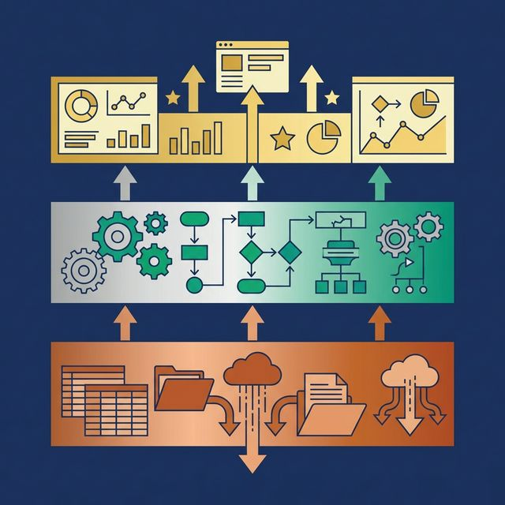

Most teams start building a semantic layer the wrong way: they open their BI tool, create a few calculated fields, and call it done. Six months later, three dashboards define "churn" differently, nobody trusts the numbers, and the data team is debugging metric discrepancies instead of building new features.

A well-built semantic layer prevents all of that. Here's how to do it right.

## Start With Metrics, Not Data Models


Before writing a single line of SQL, sit down with stakeholders from Sales, Finance, Marketing, and Product. Agree on the top 5-10 business metrics your organization uses to make decisions.

For each metric, document:
- **The calculation**: Revenue = SUM(order_total) WHERE status = 'completed' AND refunded = FALSE
- **The owner**: Who is accountable for this definition?
- **The grain**: Daily? Monthly? Per customer?
- **The refresh cadence**: Real-time? Daily batch? Weekly?

This exercise is harder than it sounds. You will discover that "Monthly Active Users" has three competing definitions. That's the point. The semantic layer can't resolve disagreements that haven't been surfaced yet.

**Output**: A metric glossary. This becomes the source document for everything you build next.

## Map Your Data Sources

Inventory every system that feeds into your analytics:

| Source Type | Examples | Access Pattern |
|---|---|---|
| Transactional databases | PostgreSQL, MySQL, SQL Server | Federated query (read-only) |
| Cloud data lakes | S3 (Parquet/Iceberg), Azure Data Lake | Direct scan or catalog |
| SaaS platforms | Salesforce, HubSpot, Stripe | API extraction or replication |
| Spreadsheets | Google Sheets, Excel | One-time import or scheduled sync |

Not all sources need to be replicated into a central store. Federation lets you query data where it lives without the cost and complexity of ETL pipelines. Platforms like [Dremio](https://www.dremio.com/get-started?utm_source=ev_buffer&utm_medium=influencer&utm_campaign=next-gen-dremio&utm_term=blog-021826-02-18-2026&utm_content=alexmerced) connect to dozens of sources and present them in a single namespace, so your semantic layer can span everything without data movement.

## Design the Three-Layer View Structure



The most effective semantic layer architecture uses three layers of SQL views, commonly called the Medallion Architecture.

### Bronze Layer (Preparation)

Create one view per raw source table. Apply no business logic. Just make the data human-readable:
- Rename cryptic columns: `col_7` → `OrderDate`, `cust_id` → `CustomerID`
- Cast types to standard formats: strings to dates, integers to decimals
- Normalize timestamps to UTC
- Avoid using SQL reserved words as column names (`Timestamp`, `Date`, `Role` will force double-quoting in every downstream query. Use `EventTimestamp`, `TransactionDate`, `UserRole` instead.)

Bronze views should be boring. Their only job is to make raw data safe to work with.

### Silver Layer (Business Logic)

This is where your metric glossary becomes code. Silver views join Bronze views, deduplicate records, filter invalid data, and apply business rules.

Example:

```sql
CREATE VIEW silver.orders_enriched AS
SELECT
    o.OrderID,
    o.OrderDate,
    o.Total AS OrderTotal,
    c.Region,
    c.Segment
FROM bronze.orders_raw o
JOIN bronze.customers_raw c ON o.CustomerID = c.CustomerID
WHERE o.Total > 0 AND o.Status = 'completed';
```

Each Silver view encodes exactly one business concept. "Revenue" is defined in one place. Every dashboard, notebook, and AI agent that needs revenue queries this view. No exceptions.

### Gold Layer (Application)

Gold views are pre-aggregated for specific consumers. A BI dashboard gets `monthly_revenue_by_region`. An AI agent gets `customer_360_summary`. A finance report gets `quarterly_financial_summary`.

Gold views don't add new business logic. They aggregate and reshape Silver views for performance and usability.

## Document Everything — or Let AI Help

An undocumented semantic layer is a semantic layer nobody uses. Every table and every column should have a description that explains:
- What the data represents
- Where it comes from
- Any known limitations or caveats

This is tedious work. Modern platforms accelerate it with AI. Dremio's generative AI, for example, can auto-generate Wiki descriptions by sampling table data, and suggest Labels (tags like "PII," "Finance," "Certified") for governance and discoverability. The AI provides a 70% first draft. Your data team fills in the domain-specific context.

This documentation serves two audiences: human analysts browsing the catalog, and AI agents that need context to generate accurate SQL. Both benefit from rich, accurate descriptions.

## Enforce Access Policies at the Layer

Security should be embedded in the semantic layer, not applied after the fact in each tool. Two patterns:

**Row-Level Security**: Filter what data a user can see based on their role. A regional manager sees only their region's data. The SQL view applies the filter automatically.

**Column Masking**: Mask sensitive columns (SSN, email, salary) for roles that don't need them. Analysts see `****@email.com`. Data engineers see the full value.

The advantage of enforcing policies at the semantic layer: every downstream query inherits the rules, whether the query comes from a dashboard, a Python notebook, or an AI agent. No gaps.

## Start Small, Then Expand

Don't try to model your entire data landscape on day one. Start with:
- 3-5 core metrics from your glossary
- The 2-3 source systems those metrics depend on
- One Bronze → Silver → Gold pipeline per metric

Validate by running the same question across two different tools (a BI dashboard and a SQL notebook, for example). If both return the same number, the semantic layer is working. If they don't, fix the Silver view definition before adding more.

Once the first metrics are stable, expand incrementally. Add new sources, new Silver views, new Gold views. Each addition is low-risk because the layered structure isolates changes.

## What to Do Next

Pick the metric your organization argues about the most. Define it explicitly in a Silver view. Test it against the current dashboards. If the numbers match, you've validated the approach. If they don't, you've just found the inconsistency that's been silently costing your organization trust.

[Try Dremio Cloud free for 30 days](https://www.dremio.com/get-started?utm_source=ev_buffer&utm_medium=influencer&utm_campaign=next-gen-dremio&utm_term=blog-021826-02-18-2026&utm_content=alexmerced)
