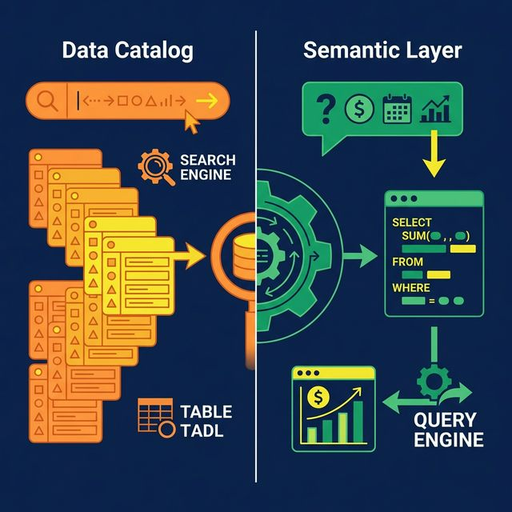
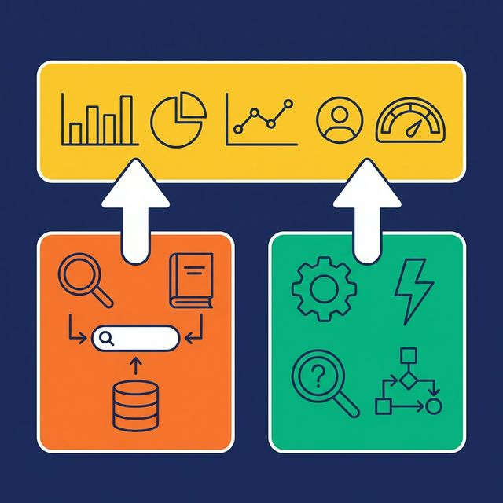

"We already have a data catalog, so we don't need a semantic layer." This is one of the most common misconceptions in modern data architecture. Catalogs and semantic layers both deal with metadata. They both improve data accessibility. But they solve fundamentally different problems.

Swapping one for the other leaves a critical gap in your stack.

## What a Data Catalog Does

A data catalog is a searchable inventory of your organization's data assets. Think of it as a library card system for data. It tells you what data exists, where it lives, who owns it, and how it flows through your systems.

Key functions:
- **Discovery**: Find tables, views, files, and dashboards by searching keywords, tags, or owners
- **Lineage**: Trace how data moves from source to destination, including every transformation along the way
- **Governance metadata**: Track data quality scores, classification (PII, confidential), and compliance status
- **Documentation**: Store descriptions of assets, often crowd-sourced from data producers and consumers

A data catalog is fundamentally a **passive system**. You search it, browse it, and read from it. It doesn't change how queries execute or how metrics are calculated. It organizes information *about* data.

## What a Semantic Layer Does

A semantic layer defines what data **means** and how to **use it correctly**. It's an active system that sits between your raw data and the tools querying it.

Key functions:
- **Metric definitions**: Revenue, Churn Rate, Active Users — calculated one way, everywhere
- **Query translation**: Converts business questions into optimized SQL
- **Access enforcement**: Row-level security and column masking applied at query time
- **Documentation**: Wikis and labels attached to views and columns

A semantic layer **actively participates** in every query. When a user asks "What was revenue by region?", the semantic layer translates "revenue" into the correct SQL formula, joins the right tables, applies security filters, and returns the result.

## Side-by-Side Comparison

| Dimension | Data Catalog | Semantic Layer |
|---|---|---|
| Primary question answered | "What data do we have?" | "What does this data mean?" |
| System behavior | Passive (search & browse) | Active (query translation) |
| Scope | All metadata across assets | Business definitions, metrics, security |
| Lineage | Tracks data flow | Defines calculation logic |
| Query execution | Does not execute queries | Translates and optimizes queries |
| Access control | Documents policies | Enforces policies at query time |

The catalog tells you a table called `orders` exists in the `production` schema. The semantic layer tells you that "Revenue" means `SUM(orders.total) WHERE status = 'completed'`, joins it to `customers` on `customer_id`, and filters results based on the querying user's role.

## Why You Need Both

**A catalog without a semantic layer**: Users find data but don't know how to use it correctly. They discover the `orders` table but write their own revenue formula, which differs from the formula Finance uses. Data is discoverable but inconsistently interpreted.

**A semantic layer without a catalog**: Users get accurate, governed queries for the datasets the semantic layer covers. But they can't discover datasets outside the layer. New data sources, experimental tables, and raw files remain invisible until someone manually adds views.

The best architectures integrate both. The catalog handles discovery and lineage across *everything*. The semantic layer handles meaning, calculation, and governance for the business-critical datasets that drive decisions.

## What Integration Looks Like

An integrated system gives you a single interface where data discovery and business context exist side by side. You search the catalog to find a dataset. You see its semantic layer definition — the metric formulas, documentation, labels, and access policies — alongside the catalog metadata (lineage, quality, ownership).

Dremio achieves this with its [Open Catalog](https://www.dremio.com/blog/5-ways-dremio-delivers-an-apache-iceberg-lakehouse-without-the-headaches/?utm_source=ev_buffer&utm_medium=influencer&utm_campaign=next-gen-dremio&utm_term=blog-021826-02-18-2026&utm_content=alexmerced) (built on Apache Polaris, the open-source Iceberg REST catalog standard) combined with its semantic layer features:

- **Open Catalog** provides the inventory: tables, views, sources, and their lineage
- **Virtual datasets** (SQL views) define business logic and metric calculations
- **Wikis** document what each dataset and column means
- **Labels** tag data for governance and discoverability (PII, Finance, Certified)
- **FGAC** enforces row/column security at query time

AI agents benefit from this integration directly. They use the catalog to navigate available datasets (what tables exist in the "Sales" space?) and the semantic layer to generate accurate queries (what does "Revenue" mean, and who can see which rows?). Remove either piece, and the AI is either blind to available data or confidently generating wrong SQL.

## What to Do Next

Open your current data catalog and pick a business-critical table. Can you see how its key metric is calculated? Who can access which rows? What the column names mean in business terms? If the catalog only shows you *that the table exists*, you've identified the gap a semantic layer fills.

[Try Dremio Cloud free for 30 days](https://www.dremio.com/get-started?utm_source=ev_buffer&utm_medium=influencer&utm_campaign=next-gen-dremio&utm_term=blog-021826-02-18-2026&utm_content=alexmerced)
