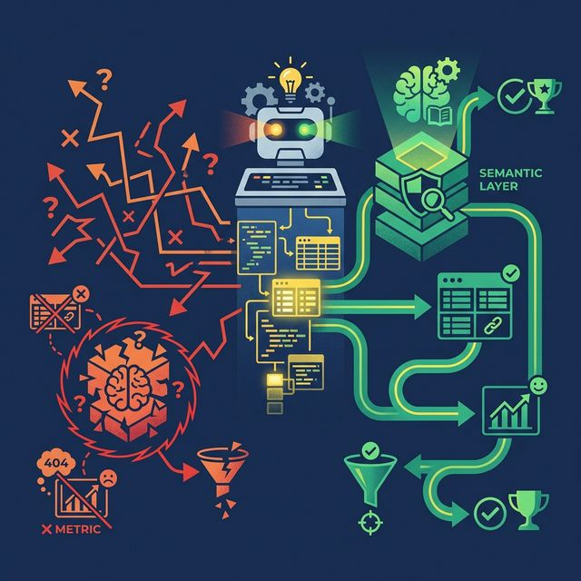
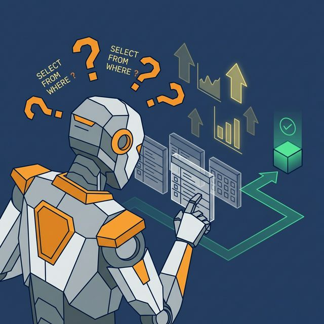
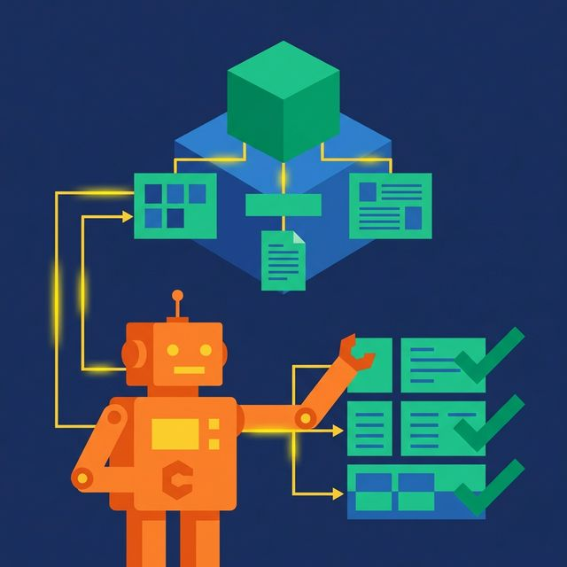

Your team builds an AI agent. It connects to your data warehouse. A product manager types "What was revenue last quarter?" and gets a number. The number is wrong. Nobody knows it's wrong until Finance runs the same query manually and gets a different result.

This happens constantly. And the problem isn't the AI model. It's the missing layer between the model and your data.

## The Promise vs. the Reality

Natural language analytics is the most requested feature in every data platform survey. Business users want to ask questions in plain English and get accurate answers. No SQL. No tickets. No waiting.

The technology exists. Large language models can generate SQL from natural language with impressive accuracy. But accuracy on syntax isn't accuracy on meaning. An LLM can write grammatically correct SQL that returns the wrong answer because it doesn't understand your business definitions.

A semantic layer provides those definitions. Without one, AI analytics is a demonstration that works in a meeting but fails in production.

## Five Ways AI Goes Wrong Without a Semantic Layer

### Metric Hallucination

Your LLM decides that Revenue = `SUM(amount)` from the `transactions` table. But your actual Revenue formula is `SUM(order_total) WHERE status = 'completed' AND refunded = FALSE` from the `orders` table. The AI's number is plausible. It's also wrong by 15%. Nobody catches it because it looks reasonable.

**The fix**: Canonical metric definitions in virtual datasets. The AI references the view, not its own invented formula.

### Join Confusion

There are three paths from `orders` to `customers`: via `customer_id`, via `billing_address_id`, and via `shipping_address_id`. For revenue analysis, you want `customer_id`. The LLM picks `billing_address_id` because it seems logical. The numbers are close enough that the mistake survives review.

**The fix**: Pre-defined join relationships in the semantic model. The AI follows the approved path.

### Column Misinterpretation

A column called `date` appears in the `orders` table. Is it the order date, ship date, or invoice date? The LLM guesses order date. It's actually the ship date. Every time-based query is off by 2-5 days.

**The fix**: Wiki descriptions on every column. The semantic layer tells the AI that `date` is `ShipDate` and `OrderDate` is the field to use for time-based revenue analysis.

### Security Bypass

Your BI dashboard applies row-level security so regional managers only see their region's data. The AI agent queries the raw table directly, bypassing the BI layer. A regional manager asks about "their" revenue and sees the entire company's numbers.

**The fix**: Fine-Grained Access Control enforced at the semantic layer. The AI queries views, not raw tables. Security policies travel with the data regardless of the access path.

### Inconsistent Results

The same question asked twice generates different SQL because the LLM's output is probabilistic. Monday's answer: $4.2M. Wednesday's answer: $4.5M. Both are "correct" given the SQL generated. Neither matches Finance's number.

**The fix**: Deterministic definitions in the semantic layer. The same question always resolves to the same view, the same formula, the same result.

## How a Semantic Layer Grounds AI

Each failure maps to a specific semantic layer component:

| Failure Mode | Semantic Layer Fix |
|---|---|
| Metric hallucination | Virtual datasets with canonical formulas |
| Join confusion | Pre-defined join relationships |
| Column misinterpretation | Wiki descriptions on every field |
| Security bypass | Access policies enforced at the view level |
| Inconsistent results | Deterministic definitions (same question = same SQL) |

This is why platforms that take AI analytics seriously embed the semantic layer directly into the query engine. [Dremio's approach](https://www.dremio.com/blog/agentic-analytics-semantic-layer/?utm_source=ev_buffer&utm_medium=influencer&utm_campaign=next-gen-dremio&utm_term=blog-021826-02-18-2026&utm_content=alexmerced) combines virtual datasets, Wikis, Labels, and Fine-Grained Access Control into a single layer that both humans and AI agents consume. The AI doesn't just generate SQL. It consults the semantic layer to understand what the data means, which formulas to use, and what the querying user is allowed to see.

## What AI-Ready Architecture Looks Like

An AI-ready data platform doesn't just connect an LLM to a database. It puts a structured context layer in between:

1. **Semantic layer** defines metrics, documents columns, and enforces security
2. **AI agent** reads the semantic layer to understand business context
3. **Query engine** executes the AI-generated SQL with full optimization (caching, reflections, pushdowns)
4. **Results** are returned in business terms through the same interface humans use

Without step 1, the AI is just a SQL autocomplete tool with no business understanding. It writes syntactically valid queries that produce semantically wrong answers. The semantic layer is the difference between a toy demo and a production-grade AI analytics system.

## What to Do Next

If your AI analytics initiative is producing unreliable results, don't upgrade the model. Audit the context the model has access to. Can it read your metric definitions? Column descriptions? Security policies? If the answer is no, the fix isn't a better LLM. It's a semantic layer.

[Try Dremio Cloud free for 30 days](https://www.dremio.com/get-started?utm_source=ev_buffer&utm_medium=influencer&utm_campaign=next-gen-dremio&utm_term=blog-021826-02-18-2026&utm_content=alexmerced)
