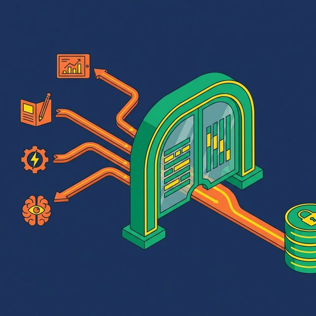
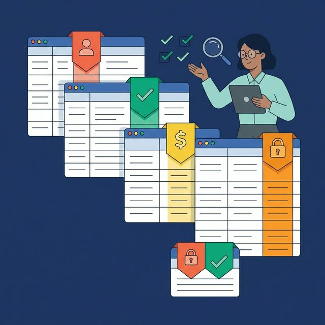

Most organizations have a data governance policy. It lives in a Confluence page. It defines who owns what data, what terms mean, and who should have access. And almost nobody follows it, because it's not enforced where queries actually run.

A semantic layer changes that. It moves governance from a document into the query path, where every rule is applied automatically, for every user, through every tool.

## Governance on Paper vs. Governance in Practice

Data governance fails when it depends on people doing the right thing manually. A policy says "Revenue means completed orders minus refunds." An analyst writes a slightly different formula. A dashboard uses the wrong table. An AI agent invents its own definition. The governance policy exists. Nobody follows it. And the organization makes decisions on inconsistent data.

The root cause isn't that people are careless. It's that governance is separated from the systems people actually use to query data. Enforcement happens in a side channel — documentation, review processes, audit logs — not in the query itself.

## Centralized Definitions Eliminate Conflicting Metrics

A semantic layer solves the definition problem by making the governance policy code.

Revenue isn't a paragraph in a wiki. It's a SQL view:

```sql
CREATE VIEW business.revenue AS
SELECT
    OrderDate,
    Region,
    SUM(OrderTotal) AS Revenue
FROM silver.orders_enriched
WHERE Status = 'completed' AND Refunded = FALSE
GROUP BY OrderDate, Region;
```

Every dashboard, notebook, and AI agent that needs Revenue queries this view. There's no alternative formula to use. The semantic layer IS the governance for this metric.

When the definition changes (say, a new refund category is added), the view is updated once, and every consumer gets the new logic automatically. No rollout. No migration. No "did everyone update their dashboard?"

## Access Policies Enforced at Query Time



The second governance gap: access control. Most organizations enforce security at the BI tool level. Tableau restricts who sees which dashboard. Power BI applies row-level filters. But if someone opens a SQL client and queries the underlying table directly, those filters don't apply.

A semantic layer enforces policies at a lower level. When access control exists in the semantic layer, it applies to every query path:

| Query Path | BI-Level Security | Semantic Layer Security |
|---|---|---|
| Dashboard | Enforced | Enforced |
| SQL notebook | Not enforced | Enforced |
| AI agent | Not enforced | Enforced |
| API/programmatic access | Not enforced | Enforced |

Dremio implements this through [Fine-Grained Access Control (FGAC)](https://www.dremio.com/blog/agentic-analytics-semantic-layer/?utm_source=ev_buffer&utm_medium=influencer&utm_campaign=next-gen-dremio&utm_term=blog-021826-02-18-2026&utm_content=alexmerced): policies defined as UDFs that filter rows and mask columns based on the querying user's role. These policies are applied at the virtual dataset (view) level. A regional manager queries `business.revenue` and sees only their region. A data engineer sees all regions. Same view, same SQL, different results based on identity.

This approach eliminates the "security gap" that appears when users bypass BI tools. Every route to the data flows through the semantic layer. Every route inherits the policies.

## Lineage and Accountability Through Views

The layered view architecture (Bronze → Silver → Gold) that a semantic layer uses is inherently traceable. Every Gold metric traces back to its Silver business logic, which traces back to the Bronze source mapping, which traces back to raw data.

This traceability matters for compliance. When an auditor asks "Where does your Revenue number come from?", you don't search through dashboards and notebooks. You follow the view chain:

- `gold.monthly_revenue_by_region` → references `silver.orders_enriched`
- `silver.orders_enriched` → joins `bronze.orders_raw` with `bronze.customers_raw`
- `bronze.orders_raw` → maps to `production.public.orders` in PostgreSQL

Every step is documented. Every transformation is visible. The lineage isn't reconstructed after the fact — it's structural.

## Documentation as a Governance Tool



Governance is also about discoverability. Can someone find the right dataset without messaging five people? Can they tell whether a view is production-ready or experimental?

Two mechanisms handle this in a semantic layer:

**Wikis** attach human-readable (and AI-readable) descriptions to tables, columns, and views. They explain what data represents, where it comes from, and any caveats. A column named `cltv` gets a description: "Customer Lifetime Value, calculated as total revenue from first purchase to current date, excluding refunds."

**Labels** categorize data for governance workflows. A label like "PII" triggers automatic column masking. A label like "Certified" indicates the view has been reviewed and approved for production use. A label like "Deprecated" warns consumers to migrate to the replacement.

For organizations with thousands of datasets, manual documentation is impractical. Dremio's generative AI auto-generates Wiki descriptions by sampling table data and suggests Labels based on column content. This bootstraps documentation to 70% coverage automatically. The data team fills in what the AI misses.

## Certification and Change Management

Not all views are equal. A semantic layer should distinguish between views that are experimental, under review, and production-ready.

A practical certification workflow:

1. **Draft**: New view created by an analyst. Not yet reviewed. Labeled "Draft."
2. **Reviewed**: View reviewed by the data team. Business logic validated. Documentation complete.
3. **Certified**: View approved for production use. Labeled "Certified." Available in production dashboards and to AI agents.

Each Certified view should have a documented owner — the person accountable for its accuracy and freshness. When business requirements change, the owner updates the view and documentation together. Changes are reviewed before the "Certified" label is reapplied.

This workflow doesn't require advanced tooling. Labels, Wikis, and a team agreement on the process are sufficient. What matters is that governance is visible inside the semantic layer, not tracked in a separate system.

## What to Do Next

Audit your top 10 business metrics. For each one, ask three questions: Is the formula defined in one place? Is access control enforced at the query level (not just the BI tool)? Can you trace the number back to its raw source in under 60 seconds? Every "no" is a governance gap that a semantic layer closes.

[Try Dremio Cloud free for 30 days](https://www.dremio.com/get-started?utm_source=ev_buffer&utm_medium=influencer&utm_campaign=next-gen-dremio&utm_term=blog-021826-02-18-2026&utm_content=alexmerced)
