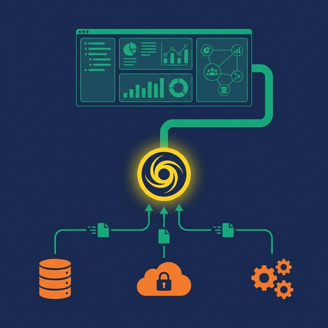
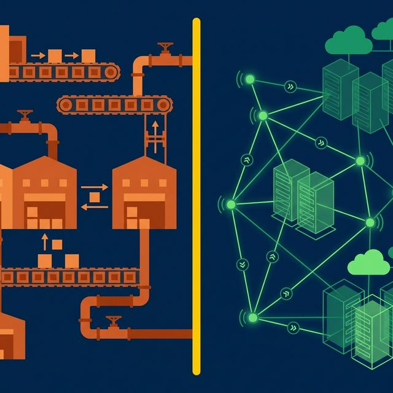
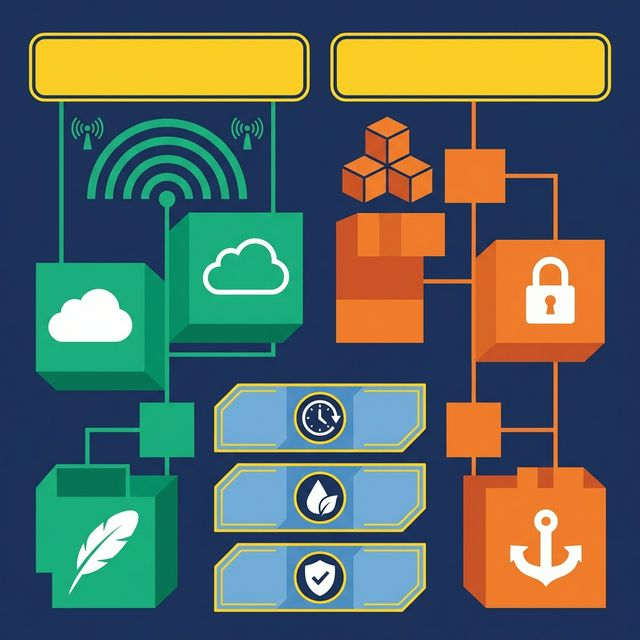

Every data pipeline you build to move data from one system to another costs you three things: time to build it, money to run it, and freshness you lose while waiting for the next sync. Most analytics architectures accept this cost as unavoidable. It isn't.

Data virtualization eliminates the movement. A semantic layer adds meaning and governance on top. Together, they give you a complete analytics layer over distributed data without copying a single table.

## The Data Movement Tax

Traditional analytics architecture looks like this: data lives in operational databases, SaaS tools, and cloud storage. To analyze it, you extract it, transform it, and load it into a central warehouse. Every source gets an ETL pipeline. Every pipeline needs monitoring, error handling, and scheduling.

The result: your analytics are always behind your operational data. The warehouse reflects what happened as of the last sync, not what's happening now. You pay for storage in both the source and the warehouse. And when you add a new source, you add a new pipeline.

This model made sense when compute was expensive and storage was local. In a cloud-native world where compute is elastic and storage is cheap, the calculus changes.

## What Data Virtualization Does

Data virtualization lets you query data where it lives. Instead of copying data to a central location, you connect to each source and issue queries directly. A virtualization engine translates your SQL into the source's native protocol (JDBC for databases, S3 API for object storage, REST for SaaS), retrieves the data, and combines results from multiple sources into a single result set.

From the user's perspective, all data appears in one unified namespace. A PostgreSQL production database, an S3 data lake full of Parquet files, and a Snowflake analytics warehouse all look like tables in the same catalog.

The keyword is "no replication." The data stays where it is. The queries go to the data, not the other way around.

## What a Semantic Layer Adds on Top

Virtualization solves the access problem. But access without context is dangerous. Raw access to 50 federated sources means 50 sources where analysts can write conflicting metric formulas, join tables incorrectly, and query sensitive columns without authorization.

A semantic layer added on top of virtualization provides:

- **Metric definitions**: "Revenue" is calculated the same way regardless of which source the data comes from
- **Documentation**: Wikis describe what each federated table and column represent in business terms
- **Join paths**: Pre-defined relationships prevent analysts from guessing how tables connect
- **Access policies**: Row-level security and column masking enforced at the view level, even for sources that have no fine-grained access controls of their own

The combination is powerful: you get real-time access to all your data (virtualization) with consistent meaning and governance (semantic layer), and without data movement (no ETL).

## Why They're Stronger Together

Each technology is useful alone. Together, they cover gaps neither can fill individually:

| Capability | Virtualization Only | Semantic Layer Only | Both Together |
|---|---|---|---|
| Access distributed data | Yes | No (limited to centralized data) | Yes |
| Business definitions | No | Yes | Yes |
| Governance enforcement | No | Yes | Yes |
| Zero data movement | Yes | No | Yes |
| Real-time access | Yes | Depends on data freshness | Yes |
| Unified namespace | Yes | Yes | Yes |

Virtualization without a semantic layer gives you raw SQL access to everything. Powerful for engineers. Risky for an organization. No metric consistency, no governance, no documentation.

A semantic layer without virtualization covers only the data that's been moved to the platform's native storage. Every source that hasn't been ETL'd is invisible to the layer. You get great governance over a subset of your data, and no governance over the rest.

## How It Works in Practice

[Dremio](https://www.dremio.com/blog/why-agentic-analytics-requires-federation-virtualization-and-the-lakehouse-how-dremio-delivers/?utm_source=ev_buffer&utm_medium=influencer&utm_campaign=next-gen-dremio&utm_term=blog-021826-02-18-2026&utm_content=alexmerced) is built on this architecture natively. It combines a high-performance virtualization engine (supporting 30+ source types including S3, ADLS, PostgreSQL, MySQL, MongoDB, Snowflake, and Redshift) with a full semantic layer (virtual datasets, Wikis, Labels, Fine-Grained Access Control).

A practical query flow:
1. An analyst queries `business.revenue_by_region` — a virtual dataset (view)
2. Dremio's optimizer determines that this view joins data from PostgreSQL (customer records) and S3/Iceberg (order transactions)
3. Predicate pushdowns push filter logic to each source (e.g., date range filters applied at the source)
4. Results are combined using Apache Arrow's columnar format (zero serialization overhead)
5. Row-level security filters the results based on the analyst's role
6. If a Reflection (pre-computed copy) exists, Dremio substitutes it transparently for faster performance

The analyst sees one table. Behind it, two sources, one semantic layer, and automatic performance optimization.

## When to Virtualize vs. When to Materialize

Not every query should hit the source directly. The right architecture uses both strategies:

**Virtualize when:**
- The data changes frequently and freshness matters
- The dataset is queried infrequently (monthly reports, ad-hoc exploration)
- Compliance requires data to stay in its source system
- You're evaluating a new source before committing to a pipeline

**Materialize when:**
- Multiple dashboards query the same dataset hundreds of times daily
- Joins across sources are slow because of network latency
- Table-level optimizations (compaction, partitioning, clustering) would improve performance
- AI workloads need scan-heavy access to large datasets

The practical strategy: start every source as a federated (virtual) connection. Monitor query frequency and performance. When a dataset crosses the line into "queried daily by multiple teams," materialize it as an Apache Iceberg table. Dremio's Reflections automate this for the most common query patterns, creating materialized copies that the optimizer uses transparently.

## What to Do Next

Count your current ETL pipelines. For each one, ask: does the destination system need a physical copy of this data, or does it just need to query it? Every pipeline that exists purely for query access is a candidate for virtualization. Replace the pipeline with a federated connection, add a semantic layer for context, and watch your infrastructure costs drop.

[Try Dremio Cloud free for 30 days](https://www.dremio.com/get-started?utm_source=ev_buffer&utm_medium=influencer&utm_campaign=next-gen-dremio&utm_term=blog-021826-02-18-2026&utm_content=alexmerced)
