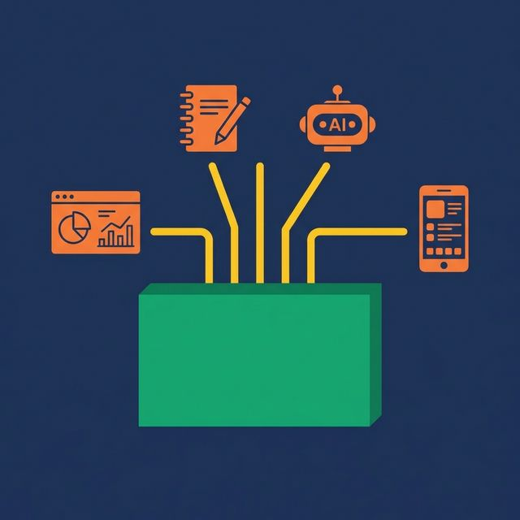
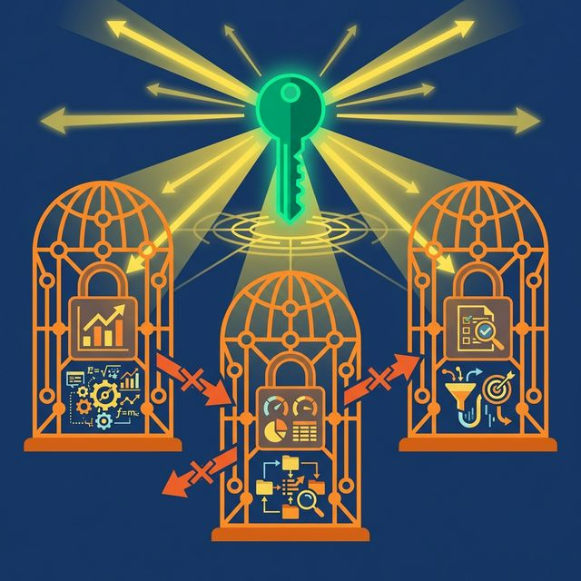
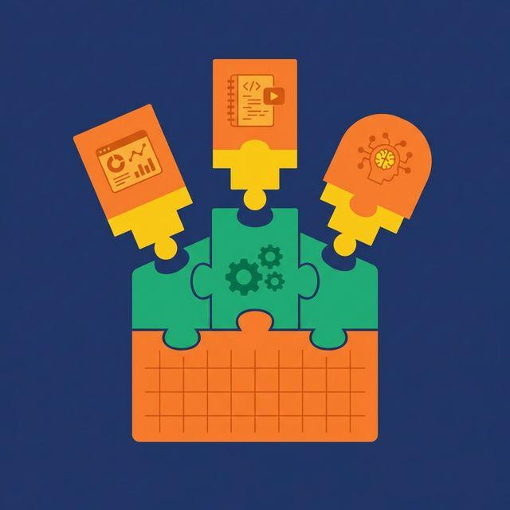

Your organization uses Tableau for executive dashboards, Power BI for operational reports, and Python notebooks for data science. Revenue is defined in Tableau's calculated field, Power BI's DAX measure, and a SQL query inside a Jupyter notebook. Three tools. Three definitions. None of them match.

This is what happens when semantic models are locked inside BI tools. Headless BI fixes it by pulling the definitions out.

## The Problem with Tool-Specific Semantic Models

Every major BI tool comes with its own modeling layer. Looker has LookML. Tableau has the Data Model. Power BI has DAX and the tabular model. Each one defines metrics, relationships, and calculated fields in a proprietary format.

This creates three problems:

**Definition duplication.** Every metric must be defined in every tool. Revenue in Tableau. Revenue in Power BI. Revenue in the data science notebook. When the formula changes (say, a new exclusion rule is added), you update it in three places. Or you forget one, and your dashboards disagree.

**Tool lock-in.** Your metric definitions are trapped inside the tool's proprietary format. Switching from Tableau to a different visualization layer means rebuilding every metric from scratch. The data model doesn't migrate.

**AI agent exclusion.** When you add an AI agent to your stack, it can't access the Looker LookML definitions or the Power BI DAX measures. It has no semantic model to work with. It generates SQL based on raw table schemas and gets the formulas wrong.

## What Headless BI Means

Headless BI is an architecture pattern where metric definitions and business logic are decoupled from the visualization layer. The "head" (the dashboard or chart) is separate from the "body" (the semantic definitions).

In a headless architecture:
- Metrics are defined once in a platform-neutral semantic layer
- Definitions are exposed via standard interfaces: SQL, JDBC, ODBC, Arrow Flight, REST
- Any tool — Tableau, Power BI, Python, an AI agent, a custom app — connects to the same definitions
- Adding a new visualization tool requires zero metric migration

The semantic layer becomes a shared service. Visualization tools consume it. They don't own it.

## Tool-Specific vs. Universal Semantic Layer

| Dimension | Tool-Specific Model | Universal Semantic Layer |
|---|---|---|
| Where metrics are defined | Inside each BI tool | Centralized, tool-independent |
| Number of Revenue definitions | One per tool | One total |
| Formula change process | Update every tool | Update once, propagates |
| New tool onboarding | Rebuild all definitions | Connect and query |
| AI agent access | No (locked in BI format) | Yes (standard SQL interface) |
| Portability | Vendor-locked | Open and interoperable |

## What Composable Analytics Looks Like

Headless BI is one piece of a broader shift called **composable analytics**. Instead of buying a monolithic BI platform that bundles data modeling, metric definitions, and visualizations together, you assemble your analytics stack from modular, interchangeable components.

The semantic layer is the metric module. Choose any visualization tool on top. Choose any data storage underneath. Swap components without rebuilding definitions.

This modularity matters most for AI. An AI agent becomes a first-class consumer of the semantic layer, alongside dashboards and notebooks. It connects to the same interface, reads the same metric definitions, and gets the same answers. No special integration needed.

## How This Works in Practice

Dremio functions as a universal semantic layer that any tool can consume. The architecture:

1. **Virtual datasets (SQL views)** define business logic and metric calculations once
2. **Wikis and Labels** document business context for human and AI consumers
3. **Fine-Grained Access Control** enforces security policies at the query level
4. **Reflections** optimize performance automatically for any consumer

Connection options include ODBC, JDBC, Arrow Flight (for columnar high-speed clients), and REST API. A Tableau dashboard connects via ODBC. A Python notebook connects via Arrow Flight. Dremio's AI Agent [reads the Wikis and Labels](https://www.dremio.com/blog/agentic-analytics-semantic-layer/?utm_source=ev_buffer&utm_medium=influencer&utm_campaign=next-gen-dremio&utm_term=blog-021826-02-18-2026&utm_content=alexmerced) to generate accurate SQL from natural language. All three hit the same virtual datasets. All three get the same answers.

Because the entire semantic layer is built on open standards (Apache Iceberg for data, Apache Polaris for the catalog), the definitions aren't locked to Dremio's format. You can inspect, export, and query the same data with any Iceberg-compatible engine.

## What to Do Next

Count the number of places your organization defines its top metric (probably Revenue or Monthly Active Users). If that number is greater than one, you're paying a consistency tax every time someone changes the formula. A universal semantic layer eliminates that tax by defining it once and serving it everywhere.

[Try Dremio Cloud free for 30 days](https://www.dremio.com/get-started?utm_source=ev_buffer&utm_medium=influencer&utm_campaign=next-gen-dremio&utm_term=blog-021826-02-18-2026&utm_content=alexmerced)
