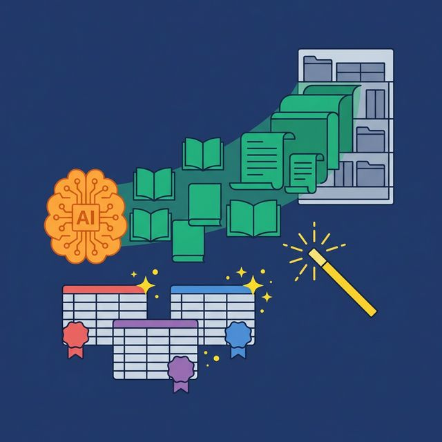
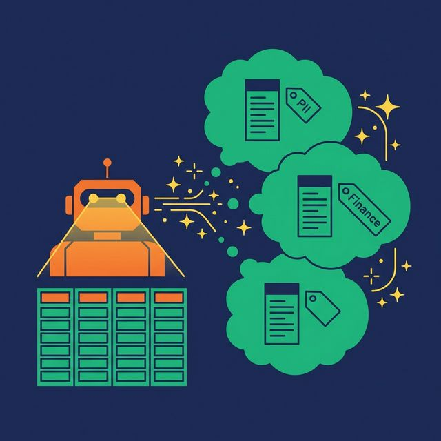
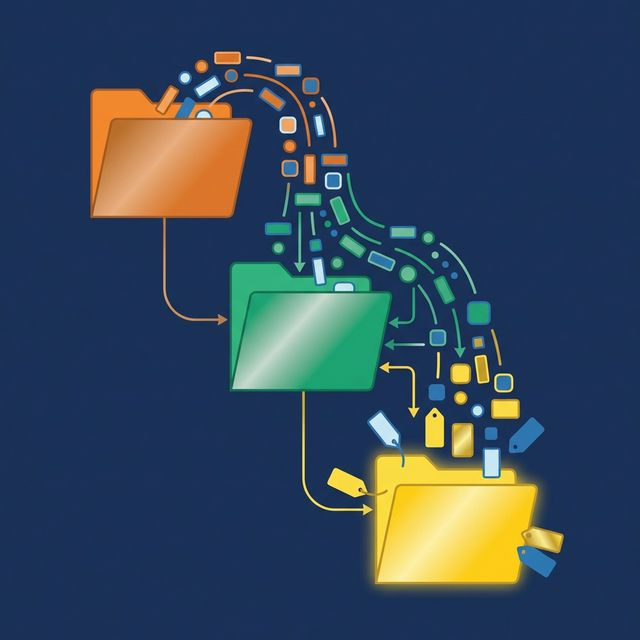

Every data team knows documentation is important. And almost every data team has a backlog of undocumented tables, unlabeled columns, and outdated descriptions that nobody has time to fix. The problem isn't motivation. It's that manual documentation doesn't scale.

A self-documenting semantic layer changes the equation. Instead of asking humans to describe every column in every table, the platform generates descriptions automatically, suggests governance labels from data patterns, and propagates context through the view chain. Documentation becomes a byproduct of building the semantic layer, not a separate project.

## The Documentation Problem Nobody Solves

Industry surveys consistently find that 70% or more of enterprise data assets are undocumented or poorly documented. The result: analysts spend 30-40% of their time searching for data and trying to understand what it means before they can start analyzing it.

This isn't just a productivity problem. Undocumented data is a governance risk. A column named `status` with values 0, 1, 2, and 3 could mean anything. An analyst guesses. An AI agent guesses worse. Nobody verifies. The wrong assumptions get baked into dashboards that drive business decisions.

Data teams respond with documentation sprints. They burn a week writing Wiki pages for their top 50 tables. Two months later, half the descriptions are outdated because schemas have changed. The cycle repeats.

## What Self-Documenting Actually Means

A self-documenting semantic layer generates and maintains documentation with minimal human effort. Three mechanisms work together:

**AI-generated descriptions**: The platform samples data in a table and generates human-readable descriptions for each column and the table itself.

**Automated label suggestions**: The platform analyzes column names, data types, and value patterns to suggest governance labels (PII, Finance, Certified).

**Metadata propagation**: When a Silver view references a Bronze view, column descriptions flow downstream automatically. Documentation written once at the Bronze level appears everywhere the column is used.

Human oversight is still essential. AI provides a 70% first draft. Data engineers add the domain-specific context that only they know: business rules, edge cases, known data quality issues. The point isn't to eliminate human documentation. It's to eliminate the blank page.

## AI-Generated Descriptions

Modern semantic layer platforms can sample a table's data and generate meaningful descriptions automatically.

Consider a column named `cltv` in a table called `customers`. The AI samples values (1200.50, 3400.00, 780.25), examines the column name and table context, and generates:

> **cltv**: Customer Lifetime Value in USD. Represents the total revenue attributed to this customer from their first purchase to the current date, excluding refunded transactions.

Not every generated description will be this precise. But most are useful enough to replace the current state: an empty description that tells the analyst nothing.

More examples:
- A column with values "US", "UK", "DE" → "ISO 3166 alpha-2 country code for the customer's billing address"
- A DATE column named `created_at` in a `subscriptions` table → "Date the subscription was created"
- A FLOAT column named `mrr` → "Monthly Recurring Revenue in the account's base currency"

## Automated Label Suggestions

Labels categorize data for governance and discovery. Manually tagging every column in a data warehouse with hundreds of tables is impractical. AI-based label suggestion makes it manageable:

- Columns containing email-like patterns (text with @ symbols) → suggested label: **PII**
- Columns with phone number patterns → suggested label: **PII**
- Columns named `price`, `total`, `amount`, `revenue` → suggested label: **Finance**
- Columns in tables marked "Certified" → suggested label propagated to downstream views

[Dremio's approach](https://www.dremio.com/blog/5-powerful-dremio-ai-features-you-should-be-using/?utm_source=ev_buffer&utm_medium=influencer&utm_campaign=next-gen-dremio&utm_term=blog-021826-02-18-2026&utm_content=alexmerced) combines these suggestions with human approval. The AI proposes labels. A data engineer reviews and accepts or rejects. Over time, the catalog fills up with accurate, useful labels without dedicated labeling sprints.

## Metadata Propagation Through Views

In a well-designed semantic layer, documentation shouldn't need to be written more than once. The Bronze-Silver-Gold view architecture creates a natural propagation path:

1. **Bronze layer**: Document the `CustomerID` column as "Unique identifier for the customer, sourced from the CRM system."
2. **Silver layer**: A Silver view references `CustomerID`. The description propagates automatically. No re-documentation needed.
3. **Gold layer**: An aggregated Gold view groups by `CustomerID`. The description carries through.

This propagation is especially valuable for join columns, filter columns, and commonly used dimensions that appear in dozens of views. Write the description once at the source, and it follows the column everywhere.

## How This Reduces Toil

The impact on data team productivity is measurable:

| Documentation Task | Manual Approach | Self-Documenting |
|---|---|---|
| Column descriptions | Write each by hand | AI generates draft, human refines |
| Governance labels | Manual tagging sprint | AI suggests from data patterns |
| Downstream view docs | Re-write for each view | Propagated from upstream |
| Schema change updates | Manually check and update | AI re-scans and flags changes |
| New table onboarding | Create from scratch | AI generates baseline immediately |

The net effect: documentation coverage goes from 30% (what the team could manage manually) to 80-90% (AI baseline + human refinement). The team spends hours instead of weeks on documentation. And the documentation stays current because the AI can re-scan when schemas change — flagging outdated descriptions instead of waiting for someone to notice.

For AI agents, this improvement is material. A richer, more accurate semantic layer means the AI generates better SQL, hallucinates less, and requires fewer corrections. Self-documentation isn't just a productivity feature. It's an AI accuracy feature.

## What to Do Next

Pick your most-used table. Open it in your data platform. How many columns have descriptions? How many have governance labels? If the answer is "not many," calculate how long it would take to document the entire table manually. Then consider a platform that does 70% of that work for you.

[Try Dremio Cloud free for 30 days](https://www.dremio.com/get-started?utm_source=ev_buffer&utm_medium=influencer&utm_campaign=next-gen-dremio&utm_term=blog-021826-02-18-2026&utm_content=alexmerced)
