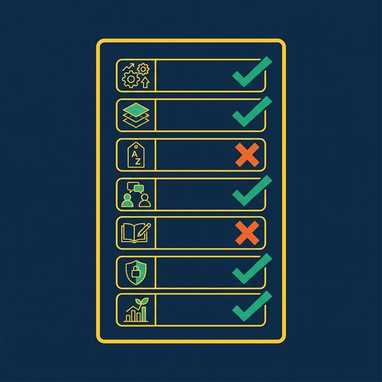
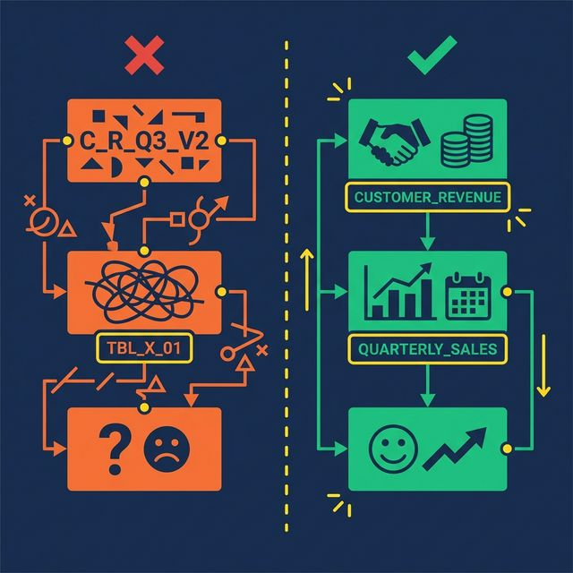

Semantic layers don't fail because the technology is wrong. They fail because of design decisions made in the first two weeks — choices that seem reasonable at the time and create compounding problems for months afterward.

Here are the seven mistakes that kill semantic layer projects, and how to avoid each one.

## Mistake 1: Defining Metrics in Multiple Places

**What happens**: Revenue is defined in a Tableau calculated field, a Power BI DAX measure, a dbt model, and a SQL view. Four sources of truth. None of them agree.

**Why it's common**: Teams adopt new tools without migrating metric definitions. Each tool gets its own model. Over time, the definitions drift.

**The fix**: Every metric gets exactly one canonical definition in the semantic layer. All downstream tools query that definition. No exceptions. When someone needs Revenue, they query `business.revenue`, not their own formula.

This principle extends to AI agents. If your AI generates its own metric formulas instead of referencing the semantic layer, you've just added another source of truth — the least trustworthy one.

## Mistake 2: Skipping the Bronze Layer

**What happens**: A data engineer creates a Silver view that joins raw source tables directly, mixing data cleanup (type casting, column renaming) with business logic (filters, calculations) in a single query. When the source schema changes — a column is renamed, a type is modified — the Silver view breaks.

**Why it's common**: The Bronze layer feels redundant. It's just a 1:1 mapping of the source. Why add a layer that doesn't change anything?

**The fix**: The Bronze layer absorbs schema changes. When a source renames `col_7` to `order_date_utc`, you update one Bronze view. The Silver and Gold views above it don't change. This insulation is worth the tiny overhead of maintaining passthrough views.

Bronze views also standardize data formats. Timestamps normalized to UTC. Strings cast to consistent encodings. Column names made human-readable. This cleanup happens once, at the bottom of the stack, and every view above benefits.

## Mistake 3: Using SQL Reserved Words as Column Names

**What happens**: A Bronze view exposes a column called `Date`. Now every downstream query must reference `"Date"` with double quotes. Analysts forget. AI agents don't quote it at all. Queries break intermittently. Debugging is frustrating because the error messages are cryptic.

**Why it's common**: Source systems often use generic names. `Date`, `Timestamp`, `Order`, `Group`, `Role` — all are SQL reserved words. Bronze views that don't rename them propagate the problem to every consumer.

**The fix**: Rename early. In the Bronze layer, map `Date` to `TransactionDate`, `Timestamp` to `EventTimestamp`, `Order` to `CustomerOrder`. Use domain-specific prefixes that are unambiguous and never conflict with SQL keywords.

This small decision saves hundreds of hours of debugging across the life of the semantic layer. It also dramatically improves AI agent accuracy, since language models generating SQL rarely add appropriate quoting for reserved words.

## Mistake 4: Building Without Stakeholder Input

**What happens**: A data engineering team builds 50 Silver views based on the database schema. They expose every table, every column, every possible metric. Business users look at the result, don't recognize any of the terms, and go back to their spreadsheets.

**Why it's common**: Data engineers understand the schema. They assume the schema structure maps to business needs. It usually doesn't.

**The fix**: Start with a metric glossary co-created with stakeholders from Sales, Finance, Marketing, and Product. Ask them: What are your top 5 metrics? How do you calculate them? What decisions do they drive? Build the Silver layer around those answers, not around the database schema.

This step feels slow. It's the fastest path to adoption. A semantic layer that uses business language and models business concepts gets adopted. A semantic layer that mirrors the database schema gets ignored.

## Mistake 5: Treating Documentation as Optional

**What happens**: Views are created with no Wikis, no column descriptions, no Labels. The semantic layer works for the person who built it. Everyone else — analysts, AI agents, new team members — can't figure out what the views mean.

**Why it's common**: Documentation takes time. Deadlines are tight. Teams plan to "add documentation later." Later never comes.

**The fix**: Make documentation part of the view creation process, not a follow-up task. At minimum, every view gets:
- A one-sentence description of what it represents
- Labels for governance (PII, Finance, Certified)
- Column descriptions for any non-obvious field

Modern platforms reduce this burden with AI-generated documentation. [Dremio's generative AI](https://www.dremio.com/blog/5-powerful-dremio-ai-features-you-should-be-using/?utm_source=ev_buffer&utm_medium=influencer&utm_campaign=next-gen-dremio&utm_term=blog-021826-02-18-2026&utm_content=alexmerced) samples table data and auto-generates Wiki descriptions and Label suggestions. The AI provides a 70% first draft. The data team adds domain context for the other 30%.

Undocumented views are invisible to AI agents. If the Wiki is empty, the AI agent has no context to generate accurate SQL. Documentation isn't just nice to have. It's an accuracy requirement.

## Mistake 6: Applying Security at the BI Tool Level Only

**What happens**: Row-level security is configured in Tableau so regional managers only see their region. Then an analyst opens a SQL client, queries the underlying table directly, and sees all regions. The security was enforced in the dashboard, not in the data.

**Why it's common**: BI tools make it easy to apply filters and security rules. Data platforms require more setup. Teams take the easy path.

**The fix**: Enforce access policies at the semantic layer, not the BI layer. Row-level security and column masking should be applied on the virtual datasets (views). Every query path — dashboard, notebook, API, AI agent — inherits the same rules.

Dremio implements this through Fine-Grained Access Control (FGAC): policies defined as UDFs at the view level. A regional manager queries `business.revenue` and automatically sees only their region, regardless of how they access the data. No security gaps between tools.

## Mistake 7: Trying to Model Everything at Once

**What happens**: The team commits to building a complete semantic layer covering every source, every table, and every metric. The project takes six months. By the time it launches, requirements have changed, stakeholder interest has waned, and half the views are out of date.

**Why it's common**: Ambitious leaders want a "complete" solution. Data teams want to avoid rework. Neither wants to ship an incomplete layer.

**The fix**: Start with 3-5 core metrics that the organization actively debates (usually Revenue, Active Users, Churn). Build one Bronze → Silver → Gold pipeline per metric. Validate that the same question produces the same answer across two different tools.

Once those metrics are stable, expand incrementally. Add new sources, new views, new metrics — one at a time. Each addition is low-risk because the layered architecture isolates changes. A new Gold view doesn't affect existing Silver views.

The fastest semantic layers reach 80% organizational coverage not by modeling everything up front, but by proving value quickly and expanding from momentum.

## What to Do Next

Pick one mistake from this list. Check whether your semantic layer (or your plan for one) is making it. Fix that one thing this week. Then come back for the next one.

[Try Dremio Cloud free for 30 days](https://www.dremio.com/get-started?utm_source=ev_buffer&utm_medium=influencer&utm_campaign=next-gen-dremio&utm_term=blog-021826-02-18-2026&utm_content=alexmerced)
