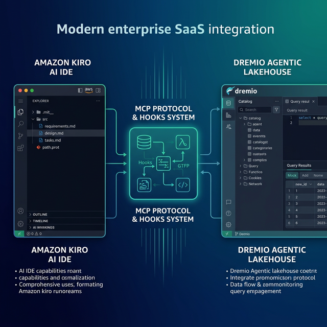

Amazon Kiro is an agentic AI IDE from AWS that introduces spec-driven development to the coding workflow. Instead of jumping straight to code, Kiro helps you define structured specifications — requirements, technical designs, and task breakdowns — before writing a single line. It then generates code that follows those specs and keeps everything in sync as the project evolves. Dremio is a unified lakehouse platform that provides business context through its semantic layer, universal data access through query federation, and interactive speed through Reflections and Apache Arrow.

Connecting them gives Kiro's agent the context it needs to write accurate Dremio SQL, generate data pipelines, and build applications against your lakehouse. Kiro's spec-driven approach is especially well-suited for data projects: you can define your data model requirements in plain language, let Kiro generate the technical design, and then have it build the implementation with full traceability back to the original requirements.

Kiro's hooks system adds event-driven automation, so documentation, tests, and validation can update automatically as your Dremio code changes.

This post covers four approaches, ordered from quickest setup to most customizable.



## Setting Up Amazon Kiro

If you do not already have Kiro installed:

1. **Download Kiro** from [kiro.dev](https://kiro.dev/) (available for macOS, Linux, and Windows).
2. **Sign in** with your AWS account, Google account, or GitHub account.
3. **Open a project** by selecting File > Open Folder and pointing to your project directory.
4. **Explore the interface** — Kiro includes a file explorer, an AI chat panel, a specs panel for viewing requirements/design/tasks, and a hooks panel for event-driven automations.

Kiro is built on the VS Code platform, so existing VS Code extensions and themes are compatible. It is free to use during the preview period.

## Approach 1: Connect the Dremio Cloud MCP Server

Every Dremio Cloud project ships with a built-in MCP server. Kiro supports MCP natively and integrates deeply with AWS MCP servers.

For Claude-based tools, Dremio provides an [official Claude plugin](https://github.com/dremio/claude-plugins) with guided setup. For Kiro, you configure the MCP connection through the IDE settings or project configuration.

### Find Your Project's MCP Endpoint

Log into [Dremio Cloud](https://www.dremio.com/get-started) and navigate to **Project Settings > Info**. Copy the MCP server URL.

### Set Up OAuth in Dremio Cloud

1. Go to **Settings > Organization Settings > OAuth Applications**.
2. Click **Add Application** and enter a name (e.g., "Kiro MCP").
3. Add the appropriate redirect URIs.
4. Save and copy the **Client ID**.

### Configure Kiro's MCP Connection

In Kiro, open the MCP settings and add a new server. You can configure via the settings UI or create a `.kiro/mcp.json` file:

```json
{
  "mcpServers": {
    "dremio": {
      "url": "https://YOUR_PROJECT_MCP_URL"
    }
  }
}
```

Kiro now has access to Dremio's MCP tools:

- **GetUsefulSystemTableNames** returns available tables.
- **GetSchemaOfTable** returns column definitions.
- **GetDescriptionOfTableOrSchema** pulls catalog descriptions.
- **GetTableOrViewLineage** shows data lineage.
- **RunSqlQuery** executes SQL and returns results.

Test by asking the AI chat: "What tables are available in Dremio?"

### Kiro Powers

Kiro supports "Powers" — curated bundles of MCP servers, steering files, and hooks for specific development workflows. If an AWS or community Dremio Power becomes available, you can install it from the Powers panel to get a pre-configured Dremio development environment.

### Self-Hosted Alternative

For Dremio Software deployments, configure the dremio-mcp server:

```json
{
  "mcpServers": {
    "dremio": {
      "command": "uv",
      "args": [
        "run", "--directory", "/path/to/dremio-mcp",
        "dremio-mcp-server", "run"
      ]
    }
  }
}
```

## Approach 2: Use Kiro Specs for Dremio Context

Kiro's spec-driven development is its most distinctive feature. Instead of free-form context files, Kiro uses structured specification documents that the AI generates and maintains.

### Generating Specs for a Dremio Project

Tell Kiro to create specs for your data project:

> "I need a data analytics pipeline that reads from Dremio's lakehouse, transforms the data using a Medallion Architecture, and serves results through a REST API."

Kiro generates three spec files in `.kiro/specs/`:

**requirements.md** — User stories in structured format:
```markdown
1. As a data engineer, I want to ingest raw data from Dremio bronze tables
   so that I can process it through the pipeline.
2. As a data analyst, I want cleaned data in gold views
   so that I can run accurate business queries.
3. As an application developer, I want REST endpoints over gold data
   so that I can build dashboards and reports.
```

**design.md** — Technical design covering architecture, data flow, table schemas, and technology choices.

**tasks.md** — A breakdown of implementation tasks that Kiro tracks as you build.

### Adding Dremio Conventions to Specs

You can refine the generated specs with Dremio-specific conventions:

> "Update the design to use Dremio SQL conventions: CREATE FOLDER IF NOT EXISTS, folder.subfolder.table_name paths, TIMESTAMPDIFF for durations. Use dremioframe for Python connections and environment variables for credentials."

Kiro updates the design.md and tasks.md to reflect these conventions. All code generated from these specs will follow the conventions automatically.

### Steering Files

Kiro also supports steering files — markdown documents that provide persistent context similar to `.cursorrules` or `CLAUDE.md`. Create a `.kiro/steering/dremio.md` file:

```markdown
# Dremio Conventions

## SQL
- Use CREATE FOLDER IF NOT EXISTS
- Tables: folder.subfolder.table_name
- Cast DATE to TIMESTAMP for joins
- Use TIMESTAMPDIFF for durations

## Credentials
- DREMIO_PAT and DREMIO_URI from environment variables
- Never hardcode tokens

## Terminology
- "Agentic Lakehouse" not "data warehouse"
- "Reflections" not "materialized views"
```


## Approach 3: Install Pre-Built Dremio Skills and Docs

> **Official vs. Community Resources:** Dremio provides an [official plugin](https://github.com/dremio/claude-plugins) for Claude Code users and the built-in [Dremio Cloud MCP server](https://docs.dremio.com/current/developer/mcp-server/) is an official Dremio product. The repositories below, along with libraries like dremioframe, are community-supported projects from the Dremio Developer Advocacy team. They are actively maintained but not part of the core Dremio product.

### dremio-agent-skill (Community)

The [dremio-agent-skill](https://github.com/developer-advocacy-dremio/dremio-agent-skill) repository provides knowledge files:

```bash
git clone https://github.com/developer-advocacy-dremio/dremio-agent-skill
cd dremio-agent-skill
./install.sh
```

Copy the knowledge directory into your project and reference it in Kiro's steering files.

### dremio-agent-md (Community)

The [dremio-agent-md](https://github.com/developer-advocacy-dremio/dremio-agent-md) repository provides documentation sitemaps:

```bash
git clone https://github.com/developer-advocacy-dremio/dremio-agent-md
```

Reference it in `.kiro/steering/dremio.md`:

```markdown
For SQL validation, read DREMIO_AGENT.md in ./dremio-agent-md/.
```

## Approach 4: Build Custom Specs and Hooks

Kiro's hooks system offers a unique approach to maintaining data project consistency.

### Creating Dremio Hooks

Hooks are event-driven automations that trigger when files change. Create hooks that automatically validate Dremio SQL:

**On SQL file save** — A hook that validates SQL syntax against Dremio conventions:

> "Create a hook that triggers when any .sql file is saved. It should read the file, validate that it uses CREATE FOLDER IF NOT EXISTS instead of CREATE SCHEMA, checks for proper table path formatting, and flags any deprecated function names."

**On pipeline code change** — A hook that updates tests:

> "Create a hook that triggers when any Python file in the pipelines/ directory changes. It should update the corresponding test file to match the new pipeline logic, using dremioframe mocking patterns."

Hooks keep your Dremio project self-maintaining. As code changes, documentation and tests update automatically.

### Custom Steering Files

Create comprehensive steering files in `.kiro/steering/`:

```
.kiro/steering/
  dremio-sql.md        # SQL conventions
  dremio-python.md     # dremioframe patterns
  dremio-schemas.md    # Team table schemas
  dremio-pipeline.md   # Pipeline architecture rules
```

These files are loaded into every Kiro interaction and ensure consistent code generation.

## Using Dremio with Kiro: Practical Use Cases

Once Dremio is connected, Kiro's spec-driven approach creates traceable, well-documented data projects.

### Ask Natural Language Questions About Your Data

In the chat panel:

> "What were our top 10 products by revenue last quarter? Show growth rates and compare to the same period last year."

Kiro uses MCP to discover tables, writes SQL, and returns results. Unlike other tools, Kiro can also generate a spec that documents the analysis methodology for reproducibility.

Follow up:

> "For the declining products, pull customer sentiment from support tickets. Is there a correlation between product issues and revenue decline?"

Kiro tracks the analytical thread and can generate a formal analysis spec for the investigation.

### Build a Locally Running Dashboard

Start with specs:

> "I need a self-contained HTML dashboard showing Dremio gold-layer metrics: revenue trends, customer acquisition, and regional performance. Spec it out first, then build it."

Kiro generates the requirements, design, and tasks first, then builds the dashboard following the specs. Every file traces back to a requirement, making it easy to review and maintain.

### Create a Data Exploration App

Spec-driven app development:

> "Spec and build a Streamlit app connected to Dremio via dremioframe. Requirements: schema browsing, SQL query editor, data preview, CSV export. Generate all files."

Kiro creates the full spec, then generates the application. The tasks.md tracks progress, and hooks can keep tests updated as you iterate.

### Generate Data Pipeline Scripts

Spec-driven data engineering:

> "Spec a Medallion Architecture pipeline for product_events. Requirements: bronze ingestion, silver cleaning, gold aggregation. Design should use dremioframe and follow our SQL conventions. Then implement it."

Kiro generates the full spec suite (requirements, design, tasks), then writes the pipeline code. Every transformation traces back to a requirement, and hooks validate the SQL on every save.

### Build API Endpoints Over Dremio Data

Spec-driven API development:

> "Spec and build a FastAPI service over Dremio gold-layer views. Requirements: customer analytics, revenue data, product metrics. Design should include Pydantic models and caching."

Kiro generates the complete API with full traceability to the requirements.

## Which Approach Should You Use?

| Approach | Setup Time | What You Get | Best For |
|----------|-----------|--------------|----------|
| MCP Server | 5 minutes | Live queries, schema browsing, catalog exploration | Data analysis, SQL generation, real-time access |
| Kiro Specs | 15 minutes | Structured requirements, design, traceable implementation | Teams valuing documentation and traceability |
| Pre-Built Skills | 5 minutes | Comprehensive Dremio knowledge (CLI, SDK, SQL, API) | Quick start with broad coverage |
| Custom Hooks | 30+ minutes | Event-driven validation, auto-updating tests and docs | Mature teams with CI-like automation needs |

Start with the MCP server for live data access. Use Kiro's spec-driven flow for any project beyond a quick query. Add hooks for automated validation as your project matures.

## Get Started

1. [Sign up for a free Dremio Cloud trial](https://www.dremio.com/get-started) (30 days, $400 in compute credits).
2. Find your project's MCP endpoint in **Project Settings > Info**.
3. Add it in Kiro's MCP settings or `.kiro/mcp.json`.
4. Tell Kiro to generate specs for your Dremio data project.
5. Let Kiro build the implementation from the specs.

Dremio's Agentic Lakehouse gives Kiro accurate data context, and Kiro's spec-driven methodology ensures every line of generated code traces back to a documented requirement. This is especially valuable for data engineering, where auditability and traceability matter.

For more on the Dremio MCP Server, check out the [official documentation](https://docs.dremio.com/current/developer/mcp-server/) or enroll in the free [Dremio MCP Server course](https://university.dremio.com/course/dremio-mcp) on Dremio University.
