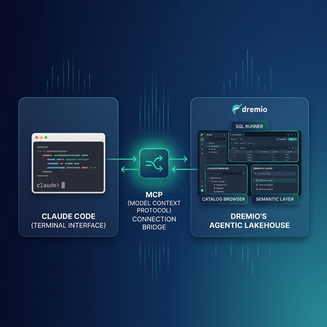

Claude Code is Anthropic's terminal-based coding agent. It reads your files, writes code, runs commands, and maintains context across a session. Dremio is a unified lakehouse platform that gives AI agents three things they need to answer business questions accurately: deep business context through its semantic layer, universal data access through query federation, and interactive speed through Reflections and Apache Arrow.

Connecting them means your coding agent can query live data, validate SQL against real schemas, and generate scripts that actually work against your lakehouse. Without this connection, Claude Code treats Dremio like any other database and often hallucinates function names or syntax. With it, the agent knows your table schemas, your business logic encoded in views, and the correct Dremio SQL dialect.

This post covers four approaches, ordered from quickest setup to most customizable.



## Setting Up Claude Code

If you do not already have Claude Code installed, here is how to get started:

1. **Install Node.js** (version 18 or later) from [nodejs.org](https://nodejs.org/).
2. **Install Claude Code** globally via npm:
   ```bash
   npm install -g @anthropic-ai/claude-code
   ```
3. **Launch Claude Code** by running `claude` in your terminal from any project directory.
4. **Authenticate** with your Anthropic API key or Claude Pro/Team subscription on first launch.

Claude Code runs in your terminal and reads your project files for context. It can execute shell commands, edit files, and interact with MCP servers. No IDE or editor is required.

## Approach 1: Connect the Dremio Cloud MCP Server

The Model Context Protocol (MCP) is an open standard that lets AI tools call external services. Every Dremio Cloud project ships with a built-in MCP server. Claude Code supports MCP natively. Connecting them takes about five minutes.

The fastest path is the **official Dremio plugin for Claude Code** from the [dremio/claude-plugins](https://github.com/dremio/claude-plugins) repository. This is maintained by Dremio and provides guided setup.

### Find Your Project's MCP Endpoint

Log into [Dremio Cloud](https://www.dremio.com/get-started) and open your project. Navigate to **Project Settings > Info**. The MCP server URL is listed on the project overview page. Copy it.

### Set Up OAuth in Dremio Cloud

Dremio's hosted MCP server uses OAuth for authentication. This means Claude Code connects with your identity and your existing access controls apply to every query the agent runs.

1. Go to **Settings > Organization Settings > OAuth Applications**.
2. Click **Add Application**.
3. Enter an application name (e.g., "Claude Code MCP").
4. Add the redirect URIs for Claude:
   - `https://claude.ai/api/mcp/auth_callback`
   - `https://claude.com/api/mcp/auth_callback`
5. Save the application and copy the **Client ID**.

### Configure Claude Code's MCP Client

Claude Code reads MCP server definitions from a `.mcp.json` file. Create one in your project root:

```json
{
  "mcpServers": {
    "dremio": {
      "url": "https://YOUR_PROJECT_MCP_URL",
      "auth": {
        "type": "oauth",
        "clientId": "YOUR_CLIENT_ID"
      }
    }
  }
}
```

For a global configuration that applies across all your projects, place the file at `~/.mcp.json` instead.

Restart Claude Code. The agent now has access to Dremio's MCP tools:

- **GetUsefulSystemTableNames** returns an index of available tables with descriptions.
- **GetSchemaOfTable** returns column names, types, and metadata for any table or view.
- **GetDescriptionOfTableOrSchema** pulls wiki descriptions and labels you have set in the Dremio catalog.
- **GetTableOrViewLineage** shows upstream dependencies.
- **RunSqlQuery** executes SQL and returns results as JSON.

You can verify the connection by asking Claude Code: "What tables are available in Dremio?" The agent will call `GetUsefulSystemTableNames` and return your catalog contents.

### Official Dremio Plugin for Claude Code

Dremio provides an [official Claude Code plugin](https://github.com/dremio/claude-plugins) that streamlines setup. Install it from the plugin marketplace:

```
/plugin marketplace add dremio/claude-plugins
/plugin install dremio@dremio-plugins
```

Create a `.env` file in your project directory with your credentials:

```
DREMIO_PAT=<your_personal_access_token>
DREMIO_PROJECT_ID=<your_project_id>
```

Then add the Dremio MCP server through the [Claude web interface](https://claude.ai) under **Customize > Connectors > Add custom connector**. Claude Code automatically inherits the connection.

Run `/dremio-setup` in Claude Code for step-by-step guidance. The plugin walks you through OAuth configuration, including setting the redirect URI to `http://localhost/callback,https://claude.ai/api/mcp/auth_callback`.

This is the recommended starting point for Claude Code users because it is officially maintained by Dremio and handles the configuration details for you.

### Self-Hosted Alternative

If you run Dremio Software instead of Dremio Cloud, use the open-source [dremio-mcp](https://github.com/dremio/dremio-mcp) repository:

```bash
git clone https://github.com/dremio/dremio-mcp
cd dremio-mcp
uv run dremio-mcp-server config create dremioai \
  --uri https://your-dremio-instance.com \
  --pat YOUR_PERSONAL_ACCESS_TOKEN
uv run dremio-mcp-server config create claude
```

The second command writes the MCP server entry directly into Claude's desktop config. For Claude Code (terminal), add the server to your `.mcp.json`:

```json
{
  "mcpServers": {
    "dremio": {
      "command": "uv",
      "args": [
        "run", "--directory", "/path/to/dremio-mcp",
        "dremio-mcp-server", "run"
      ]
    }
  }
}
```

The self-hosted server supports three modes:
- `FOR_DATA_PATTERNS` for exploring and querying data (default)
- `FOR_SELF` for system introspection and performance analysis
- `FOR_PROMETHEUS` for correlating Dremio metrics with Prometheus

## Approach 2: Use CLAUDE.md for Dremio Context

MCP gives Claude Code live access to your data. But sometimes you need the agent to follow specific conventions, use the right SQL dialect, or know where to find documentation. The MCP connection tells Claude Code what data exists. Context files tell it how your team works with that data.

### What CLAUDE.md Does

Claude Code auto-loads `CLAUDE.md` from your project root at the start of every session. It acts as persistent instructions that survive across conversations. You do not need to re-explain your project every time you start a new session.

The file supports three placement levels. A global `~/.claude/CLAUDE.md` applies to every project you open. A project-root `CLAUDE.md` applies to that specific repo. And `.claude/rules/*.md` files let you split rules into focused modules that are loaded with the same priority. Project-level files override global ones, so you can set organizational defaults and override them per-repo.

### Writing a Dremio-Focused CLAUDE.md

Here is an example `CLAUDE.md` that teaches Claude Code how to work with Dremio:

```markdown
# Project Context

This project uses Dremio Cloud as its lakehouse platform.

## Dremio SQL Conventions
- Use `CREATE FOLDER IF NOT EXISTS` (not CREATE NAMESPACE or CREATE SCHEMA)
- Tables in the built-in Open Catalog use `folder.subfolder.table_name` without a catalog prefix
- External federated sources use `source_name.schema.table_name`
- Cast DATE columns to TIMESTAMP for consistent joins
- Use TIMESTAMPDIFF for duration calculations

## Credentials
- Never hardcode Personal Access Tokens. Use environment variable: DREMIO_PAT
- Dremio Cloud endpoint is in environment variable: DREMIO_URI

## API Reference
- REST API docs: https://docs.dremio.com/current/reference/api/
- SQL reference: https://docs.dremio.com/current/reference/sql/
- For detailed SQL validation, read ./dremio-docs/sql-reference.md

## Terminology
- Call it "Agentic Lakehouse", not "data warehouse"
- "Reflections" are pre-computed optimizations, not "materialized views"
- "Open Catalog" is built on Apache Polaris
- The AI Agent is a co-pilot, not a chatbot
```

### Progressive Disclosure with Supplemental Files

Keep `CLAUDE.md` under 300 lines. For detailed references, store them in separate files and tell Claude Code where to find them:

```markdown
## Documentation References
- For Dremio SQL syntax details, read `./docs/dremio-sql-reference.md`
- For Python SDK (dremioframe) usage, read `./docs/dremioframe-guide.md`
- For REST API endpoints, read `./docs/dremio-rest-api.md`
```

Claude Code only loads these files when it needs them, keeping your context window efficient. You can also instruct the agent explicitly: "Before writing any Dremio SQL, read `./docs/dremio-sql-reference.md` to verify syntax."

You can also place rule files in `.claude/rules/` and they will be auto-loaded with the same priority as `CLAUDE.md`. This is useful for separating concerns. For example, `.claude/rules/dremio-conventions.md` for SQL rules and `.claude/rules/project-style.md` for code style.


## Approach 3: Install Pre-Built Dremio Skills and Docs

Beyond the official plugin, two community-supported open-source repositories provide ready-made Dremio context for coding agents. Both work with Claude Code.

> **Official vs. Community Resources:** The [dremio/claude-plugins](https://github.com/dremio/claude-plugins) plugin is officially maintained by Dremio. The repositories below are community-supported projects from the Dremio Developer Advocacy team. They are actively maintained but not part of the core Dremio product. Libraries like dremioframe (the Dremio Python SDK referenced in the skill) are also community-supported.

### dremio-agent-skill: Full Agent Skill (Community)

The [dremio-agent-skill](https://github.com/developer-advocacy-dremio/dremio-agent-skill) repository contains a complete skill directory that teaches AI assistants how to interact with Dremio.

**What is included:**

```
dremio-skill/
  SKILL.md          # Entry point defining capabilities
  knowledge/        # Comprehensive docs for:
    cli/            #   Dremio CLI administration
    python/         #   dremioframe Python SDK
    sql/            #   SQL syntax, Iceberg DML, metadata
    rest-api/       #   REST API endpoints
  rules/
    .cursorrules    # Config for Cursor/VS Code
    AGENTS.md       # Config for OpenCode/Codex
```

**Installation:**

Run the interactive installer:

```bash
git clone https://github.com/developer-advocacy-dremio/dremio-agent-skill
cd dremio-agent-skill
./install.sh
```

The installer asks you to choose:

1. **Global Install (Symlink)** symlinks the skill to `~/.claude/skills/` so every Claude Code session discovers it automatically. Updates to the cloned repo are reflected immediately.

2. **Local Project Install (Copy)** copies the skill into your project directory and sets up `.claude` symlinks so Claude Code auto-detects it. The skill travels with your repo, so every team member gets the same context.

After installation, start Claude Code and try: "Using the Dremio skill, write a dremioframe script to query my customer table."

### dremio-agent-md: Documentation Protocol (Community)

The [dremio-agent-md](https://github.com/developer-advocacy-dremio/dremio-agent-md) repository takes a different approach. Instead of a skill with structured knowledge files, it provides a master protocol file and a browsable sitemap of the entire Dremio documentation.

**What is included:**

- `DREMIO_AGENT.md` defines how the agent should validate SQL, handle security (credentials via `.env`), and navigate the documentation.
- `dremio_sitemaps/` contains hierarchical markdown indices of official Dremio docs for both Cloud and Software versions.

**Usage with Claude Code:**

Clone the repo into your project or a reference directory:

```bash
git clone https://github.com/developer-advocacy-dremio/dremio-agent-md
```

Then tell Claude Code at the start of your session:

> "Read DREMIO_AGENT.md in the dremio-agent-md directory to understand Dremio protocols. Use the sitemaps in dremio_sitemaps/ to verify any Dremio features or SQL syntax before generating code."

The agent will navigate the sitemaps to find the correct documentation page for whatever feature you are working with, like looking up the right function signature before writing a query.

This approach is especially useful when you need Claude Code to validate SQL against the official docs rather than rely on its training data.

## Approach 4: Build Your Own Dremio Skill

If the pre-built options do not cover your specific workflow, build a custom skill. A skill is just a directory with a `SKILL.md` file and optional supporting docs.

### Create the Skill Directory

```
my-dremio-skill/
  SKILL.md
  knowledge/
    sql-conventions.md
    rest-api-endpoints.md
    project-schemas.md
```

### Write SKILL.md

The `SKILL.md` file needs YAML frontmatter for discovery and markdown instructions for the agent:

```markdown
---
name: My Dremio Skill
description: Custom conventions and API patterns for our team's Dremio Cloud project
---

# My Dremio Skill

## When to Use
Use this skill when working with Dremio queries, dremioframe scripts,
or any code that interacts with our lakehouse.

## SQL Rules
- All tables live under the `analytics` namespace
- Use `analytics.bronze.*` for raw views, `analytics.silver.*` for joins,
  `analytics.gold.*` for final datasets
- Always use TIMESTAMP, never DATE
- Validate function names against `knowledge/sql-conventions.md`

## Authentication
- Use environment variable DREMIO_PAT for Personal Access Tokens
- Cloud endpoint: Use environment variable DREMIO_URI

## Reference Files
- SQL conventions: knowledge/sql-conventions.md
- REST API: knowledge/rest-api-endpoints.md
- Project schemas: knowledge/project-schemas.md
```

### Install the Skill

For Claude Code, place the skill in one of these locations:

- **Global:** `~/.claude/skills/my-dremio-skill/`
- **Project-local:** `.claude/skills/my-dremio-skill/`

Claude Code discovers skills by reading their `SKILL.md` files. When a user prompt matches the skill description, the agent loads the full instructions automatically.

### Add Knowledge Files

Populate the `knowledge/` directory with the specific references your team needs. You might include:

- Your project's table schemas exported from Dremio
- SQL patterns that are specific to your data model
- dremioframe code snippets for common operations
- REST API call examples with your specific endpoints

The advantage of a custom skill over a generic `CLAUDE.md` is discoverability. Skills are loaded on demand based on semantic matching, so they do not consume context tokens until they are needed.

## Using Dremio with Claude Code: Practical Use Cases

Once Dremio is connected, Claude Code becomes a data engineering partner. Here are detailed examples you can try immediately.

### Ask Natural Language Questions About Your Data

The simplest and most powerful use case. Ask Claude Code questions in plain English and get answers from production data:

> "What were our top 10 customers by revenue last quarter? Show month-over-month trends."

Claude Code uses the MCP connection to discover your tables, writes the SQL, runs it against Dremio, and returns formatted results with analysis. You get answers from production data in seconds without writing a single query yourself.

You can go deeper with follow-up questions:

> "Which of those top 10 customers had declining order frequency? Pull their last 6 months of order data and calculate the trend."

Because Claude Code maintains context across the session, it remembers the previous query results and builds on them. The MCP connection gives it live access to run the follow-up query without you needing to re-explain the schema.

This pattern turns Claude Code into a conversational analytics tool. Business analysts who are comfortable with English but not SQL can use it to explore data, test hypotheses, and generate insights directly from the lakehouse.

### Build a Locally Running Dashboard

Ask Claude Code to create a complete, self-contained dashboard:

> "Query our gold-layer sales views in Dremio and build a local HTML dashboard with Chart.js. Include monthly revenue trends, top products by region, and customer acquisition metrics. Make it filterable by date range and downloadable as PDF."

Claude Code will:

1. Use MCP to discover your gold-layer views and their schemas
2. Write and execute SQL queries to pull the relevant data
3. Generate an HTML file with embedded CSS, JavaScript, and Chart.js configurations
4. Embed the query results directly into the JavaScript as data arrays
5. Add interactive filters and a print-to-PDF button
6. Save everything to your project directory

Open the HTML file in a browser and you have an interactive dashboard running from a local file. No server, no deployment, no infrastructure. Share it with your team by dropping it in Slack or email.

For recurring dashboards, save the prompt in a script and re-run it weekly to regenerate the dashboard with fresh data from Dremio.

### Create a Data Exploration App

Build a more interactive tool for ongoing data exploration:

> "Create a Python Streamlit app that uses dremioframe to connect to Dremio. Include a schema browser sidebar, a data preview tab with pagination, and a SQL query editor with results. Add download buttons for CSV export and a query history panel."

Claude Code writes the full Python application:

- `app.py` with Streamlit layout, dremioframe connection, and query execution
- `requirements.txt` with pinned dependencies
- `.env.example` showing required environment variables
- `README.md` with setup instructions

Run `pip install -r requirements.txt && streamlit run app.py` and you have a local data exploration tool connected to your lakehouse. Your team can use it for ad-hoc analysis without needing direct access to the Dremio UI.

This pattern works well for creating internal tools quickly. Instead of waiting for a formal BI tool deployment, you can have a working data explorer in minutes.

### Generate Data Pipeline Scripts

Automate data engineering workflows:

> "Write a dremioframe script that reads new CSV files from the staging folder, creates bronze views in Dremio, builds silver views with data quality validations (null checks, type casting, deduplication), and creates gold views with business logic aggregations. Include error handling, logging, and a dry-run mode."

Claude Code uses the Dremio skill to write production-quality pipeline code that follows Medallion Architecture conventions. The script includes:

- Bronze layer: raw data ingestion with column renames and TIMESTAMP casts
- Silver layer: data quality rules, deduplication, and join logic
- Gold layer: business metric aggregations and CASE WHEN classifications
- Error handling with retry logic for transient Dremio connection issues
- Structured logging for pipeline monitoring

### Build API Endpoints Over Dremio Data

Create a REST API that serves lakehouse data to other applications:

> "Build a FastAPI application that connects to Dremio using dremioframe. Create endpoints for: GET /api/customers (paginated), GET /api/customers/{id}/orders, GET /api/analytics/revenue?period=monthly. Add request validation, error handling, and OpenAPI documentation."

Claude Code generates a complete API server with typed request/response models, query parameterization to prevent SQL injection, and auto-generated Swagger docs. Deploy it locally or containerize it for production use.

## Which Approach Should You Use?

| Approach | Setup Time | What You Get | Best For |
|----------|-----------|--------------|----------|
| MCP Server | 5 minutes | Live queries, schema browsing, catalog exploration | Data analysis, SQL generation, real-time data access |
| CLAUDE.md | 10 minutes | Convention enforcement, doc references, credential rules | Teams with specific SQL standards or project conventions |
| Pre-Built Skills | 5 minutes | Comprehensive Dremio knowledge (CLI, SDK, SQL, API) | Getting started quickly with broad Dremio coverage |
| Custom Skill | 30+ minutes | Tailored to your exact schemas, patterns, and workflows | Mature teams with project-specific conventions |

These approaches are not mutually exclusive. A common setup combines the MCP server for live data access with a custom `CLAUDE.md` for project conventions. Or start with the pre-built `dremio-agent-skill` and add a `CLAUDE.md` for your team-specific overrides.

The strongest configuration uses all four layers: MCP for live connectivity, CLAUDE.md for project rules, a pre-built skill for general Dremio knowledge, and custom knowledge files for your specific schemas and patterns.

If you are evaluating Dremio for the first time, start with the MCP server alone. It takes five minutes and gives you immediate value. As your usage matures and you need the agent to follow team conventions or validate against specific documentation, layer in the context files and skills.

## Get Started

1. [Sign up for a free Dremio Cloud trial](https://www.dremio.com/get-started) (30 days, $400 in compute credits).
2. Find your project's MCP endpoint in **Project Settings > Info**.
3. Add it to Claude Code's `.mcp.json`.
4. Clone [dremio-agent-skill](https://github.com/developer-advocacy-dremio/dremio-agent-skill) and run `./install.sh`.
5. Start Claude Code and ask it to explore your Dremio catalog.

Dremio's Agentic Lakehouse gives Claude Code what it needs to write accurate SQL: the semantic layer provides business context, query federation provides universal data access, and Reflections provide interactive speed. The MCP server is the bridge that connects them.

For more on the Dremio MCP Server, check out the [official documentation](https://docs.dremio.com/current/developer/mcp-server/) or enroll in the free [Dremio MCP Server course](https://university.dremio.com/course/dremio-mcp) on Dremio University.
