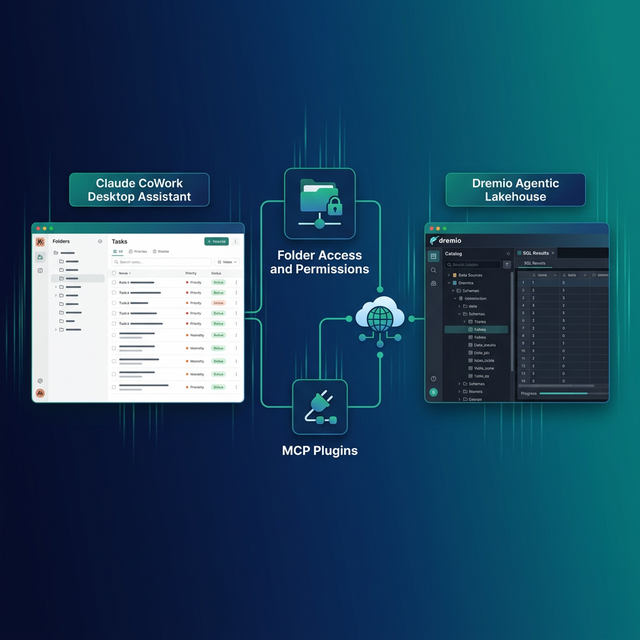

Claude CoWork is Anthropic's desktop agentic assistant. Unlike Claude Code (a terminal coding agent), CoWork operates as a general-purpose autonomous agent that reads and writes files, browses the web, manages tasks, and generates complete project artifacts. Dremio is a unified lakehouse platform that provides business context through its semantic layer, universal data access through query federation, and interactive speed through Reflections.

CoWork's strength is autonomous project execution. Give it a goal and grant it folder access, and it works through the steps independently. For data teams, this means CoWork can query your Dremio lakehouse, analyze the results, build a local dashboard, and write a summary report without you watching over every step.

The context mechanism in CoWork differs from code editors. There is no `CLAUDE.md` or `AGENTS.md` file. CoWork uses folder instructions and global instructions configured through the Claude Desktop app. This makes the integration approach different, but the end result is the same: an agent that understands your Dremio environment.

CoWork also has a unique advantage for Dremio users who are not developers. Because CoWork is a desktop assistant rather than a coding tool, analysts and business users can use it to ask natural language questions about their lakehouse data. The MCP connection handles the SQL generation and execution behind the scenes.

This post covers four approaches, from the quickest MCP connection to building a full Dremio knowledge folder.



## Setting Up Claude CoWork

If you do not already have CoWork set up:

1. **Download Claude Desktop** from [claude.ai/download](https://claude.ai/download) (available for macOS and Windows).
2. **Sign in** with your Anthropic account (Pro, Team, or Enterprise subscription required for CoWork features).
3. **Enable CoWork** in the Claude Desktop app under **Settings > Features > CoWork**.
4. **Grant folder access** by clicking **Add Folder** and selecting your project directory.

CoWork operates as a desktop assistant, not a terminal tool. You interact with it through the Claude Desktop interface, describe tasks in natural language, and it autonomously reads files, writes code, browses the web, and generates project artifacts.

## Approach 1: Connect the Dremio Cloud MCP Server

Every Dremio Cloud project includes a built-in MCP server. CoWork supports MCP through Claude Desktop's connector system.

Dremio also provides an [official plugin for Claude](https://github.com/dremio/claude-plugins) that streamlines setup. If you use Claude Code alongside CoWork, you can install the plugin directly:

```
/plugin marketplace add dremio/claude-plugins
/plugin install dremio@dremio-plugins
```

Create a `.env` file with your credentials:

```
DREMIO_PAT=<your_personal_access_token>
DREMIO_PROJECT_ID=<your_project_id>
```

Then add the Dremio MCP server through the [Claude web interface](https://claude.ai) under **Customize > Connectors > Add custom connector**. CoWork automatically inherits MCP connections configured through the Claude web interface. Run `/dremio-setup` in Claude Code for step-by-step guidance.

### Set Up OAuth in Dremio Cloud

1. Log into [Dremio Cloud](https://www.dremio.com/get-started) and go to **Settings > Organization Settings > OAuth Applications**.
2. Click **Add Application** and name it (e.g., "Claude CoWork").
3. Add the redirect URIs for Claude:
   - `https://claude.ai/api/mcp/auth_callback`
   - `https://claude.com/api/mcp/auth_callback`
4. Save and copy the **Client ID**.

### Configure the MCP Connector

In Claude Desktop, open **Settings > Connectors**. Add a custom MCP connector with your Dremio project's MCP URL and the OAuth client ID. CoWork will now have access to Dremio's MCP tools:

- **GetUsefulSystemTableNames** lists available tables.
- **GetSchemaOfTable** returns column names and types.
- **GetDescriptionOfTableOrSchema** pulls wiki descriptions from the catalog.
- **RunSqlQuery** executes SQL and returns results.

Test it by telling CoWork: "Connect to Dremio and list the available tables in my project." The agent will use the MCP tools to browse your catalog.

### Self-Hosted MCP

For Dremio Software, configure the open-source [dremio-mcp](https://github.com/dremio/dremio-mcp) server in Claude Desktop's `claude_desktop_config.json`:

```json
{
  "mcpServers": {
    "dremio": {
      "command": "uv",
      "args": [
        "run", "--directory", "/path/to/dremio-mcp",
        "dremio-mcp-server", "run"
      ]
    }
  }
}
```

## Approach 2: Use Folder Instructions for Dremio Context

CoWork uses a folder-based context model. When you grant CoWork access to a folder, you can set instructions that apply whenever the agent works within that folder.

### Setting Global Dremio Instructions

In Claude Desktop, go to **Settings > CoWork > Global Instructions**. Add Dremio conventions that apply to every task:

```
When working with Dremio:
- Use CREATE FOLDER IF NOT EXISTS, not CREATE NAMESPACE
- Tables in the Open Catalog use folder.subfolder.table_name without a catalog prefix
- External sources use source_name.schema.table_name
- Cast DATE to TIMESTAMP for consistent joins
- Never hardcode Personal Access Tokens; use environment variables
- Dremio is an Agentic Lakehouse, not a data warehouse
```

### Setting Folder-Specific Instructions

When you grant CoWork access to a project folder, add instructions specific to that project:

```
This folder contains a Dremio analytics project.
- Read dremio-docs/sql-reference.md before writing any SQL
- All tables are under the analytics namespace
- Bronze: analytics.bronze.*, Silver: analytics.silver.*, Gold: analytics.gold.*
- Use environment variable DREMIO_PAT for authentication
- Use environment variable DREMIO_URI for the Dremio endpoint
```

Folder instructions load whenever CoWork operates in that directory, giving it project-specific context on top of the global Dremio defaults.

### Agentic Memories

CoWork creates "agentic memories" as it works. After a few sessions with Dremio, CoWork builds persistent knowledge about your table schemas, common query patterns, and the SQL conventions it should follow. These memories survive across sessions, so the agent improves over time.

For example, after CoWork runs its first few Dremio queries in a project, it remembers which tables exist, which columns tend to be useful, and which SQL patterns work best. The next time you ask a question, CoWork draws on this accumulated knowledge to write better queries faster.

This is equivalent to CLAUDE.md or AGENTS.md but generated automatically rather than written by hand. For teams that do not want to maintain context files manually, agentic memories provide a self-improving alternative.


## Approach 3: Load Pre-Built Dremio Docs into CoWork

Two community-supported open-source repositories provide Dremio context that CoWork can read directly.

> **Official vs. Community Resources:** The [dremio/claude-plugins](https://github.com/dremio/claude-plugins) plugin and the built-in [Dremio Cloud MCP server](https://docs.dremio.com/current/developer/mcp-server/) are officially maintained by Dremio. The repositories below, along with libraries like dremioframe, are community-supported projects from the Dremio Developer Advocacy team. They are actively maintained but not part of the core Dremio product.

### dremio-agent-md: Best Fit for CoWork (Community)

The [dremio-agent-md](https://github.com/developer-advocacy-dremio/dremio-agent-md) repository is the best fit for CoWork. It contains `DREMIO_AGENT.md` (a master protocol file) and `dremio_sitemaps/` (hierarchical documentation indices).

Clone it and grant CoWork access to the folder:

```bash
git clone https://github.com/developer-advocacy-dremio/dremio-agent-md
```

Set the folder instructions to:

```
Before answering any Dremio questions, read DREMIO_AGENT.md in this folder.
Use the sitemaps in dremio_sitemaps/ to verify SQL syntax and find documentation.
```

CoWork will read the protocol file, learn the SQL conventions, and use the sitemaps to validate any Dremio queries it generates.

### dremio-agent-skill: Knowledge Files (Community)

The [dremio-agent-skill](https://github.com/developer-advocacy-dremio/dremio-agent-skill) repository provides a broader set of knowledge files covering CLI, Python SDK, SQL, and REST API:

```bash
git clone https://github.com/developer-advocacy-dremio/dremio-agent-skill
```

Grant CoWork access to this folder and set instructions to: "Read dremio-skill/SKILL.md for Dremio capabilities. Reference the knowledge/ directory for SQL syntax, REST API, and Python SDK documentation."

## Approach 4: Build a Custom Dremio Knowledge Folder

Create a dedicated folder with everything CoWork needs for your Dremio project:

```
dremio-context/
  README.md               # Overview and instructions
  sql-conventions.md       # Team SQL rules
  table-schemas.md         # Exported schemas from Dremio
  common-queries.md        # Frequently used query patterns
  dremioframe-examples.md  # Python SDK code snippets
  rest-api-patterns.md     # API call examples
```

Write a `README.md` that tells CoWork how to use the folder:

```markdown
# Dremio Project Context

Read this folder to understand our Dremio setup before working on data tasks.

## Quick Reference
- SQL conventions: sql-conventions.md
- Table schemas: table-schemas.md (updated weekly)
- Common queries: common-queries.md
- Python SDK: dremioframe-examples.md
- REST API: rest-api-patterns.md

## Rules
- Always use CREATE FOLDER IF NOT EXISTS
- Use TIMESTAMPDIFF for duration calculations
- Credentials are in environment variables, never hardcoded
```

Grant CoWork access to this folder and set folder instructions to: "Before any Dremio task, read README.md in the dremio-context folder."

Export your actual table schemas from Dremio regularly and update `table-schemas.md`. Include the queries your team runs most often in `common-queries.md`. This grows into a living knowledge base that CoWork uses to generate increasingly accurate output.

## Using Dremio with CoWork: Practical Use Cases

Once Dremio is connected, CoWork can execute complete data projects autonomously. Here are detailed examples.

### Ask Natural Language Questions About Your Data

Ask CoWork plain questions about your data:

> "What were our top 10 products by revenue last quarter? Break it down by region."

CoWork uses the MCP connection to discover relevant tables, writes the SQL, runs the query against Dremio, and returns formatted results with analysis. No SQL knowledge required on your part.

Take it further with follow-up questions:

> "Which of those top products had the highest return rates? Pull the return reasons and show the most common issues."

CoWork remembers the previous results and builds on them. Its agentic memory system stores what it learns about your tables, so subsequent questions in the same project get faster, more accurate answers.

This pattern is especially valuable for non-technical users. Business analysts, product managers, and executives can use CoWork to query the lakehouse without learning SQL or navigating the Dremio UI.

### Build Locally Running Dashboards

Tell CoWork to build a complete dashboard:

> "Query our gold-layer sales views in Dremio, then build me a local HTML dashboard with charts showing monthly revenue trends, top customers, and regional breakdowns. Use Chart.js for the visualizations. Add date filters and a dark theme."

CoWork will:

1. Use MCP to discover gold-layer views and their schemas
2. Write and execute SQL queries for each visualization
3. Generate an HTML file with embedded CSS, JavaScript, and Chart.js
4. Add interactive filter controls for date range and region
5. Save it to your project folder

Open the HTML file in a browser, and you have a working dashboard running entirely from a local file. Share it with stakeholders by dropping it in Slack or email. No server or deployment needed.

For recurring dashboards, tell CoWork to regenerate it weekly. Its agentic memory remembers the queries and file structure from the previous run.

### Create Data Exploration Apps

Ask CoWork to build a more interactive tool:

> "Create a Python Flask app that connects to Dremio using dremioframe. It should let me type a table name and see the schema, preview 100 rows, and run custom SQL queries. Include a clean UI with syntax highlighting and CSV download."

CoWork writes the Python code, creates the HTML templates, and generates a `requirements.txt`. Run `pip install -r requirements.txt && python app.py` and you have a local data exploration app connected to your lakehouse.

This is especially useful for teams who need quick internal tools without going through a formal development cycle.

### Generate Automated Reports

Schedule CoWork to generate recurring analytical reports:

> "Query this week's data quality metrics from Dremio's gold layer, compare them to last week, and write a markdown report with tables and recommendations. Include row count trends, null percentages by column, and any columns that exceeded the 5% null threshold. Save it to the reports/ folder."

CoWork runs the queries, computes the comparisons, generates a formatted report with tables, and writes recommendations based on the data. The report is ready to share with stakeholders without any manual analysis.

### Build API Endpoints Over Dremio Data

Create backend services that serve lakehouse data:

> "Build a FastAPI application that queries Dremio's gold-layer views and serves customer analytics through REST endpoints. Add endpoints for customer segments, revenue by geography, and cohort retention. Include request validation and JSON response formatting."

CoWork generates the full application with proper error handling and dremioframe connection management. Deploy it locally or containerize it for production.

## Which Approach Should You Use?

| Approach | Setup Time | What You Get | Best For |
|----------|-----------|--------------|----------|
| MCP Connector | 5 minutes | Live queries, schema browsing, catalog access | Natural language data exploration, ad-hoc analysis |
| Folder Instructions | 10 minutes | Convention enforcement, project context | Teams with specific SQL standards |
| Pre-Built Docs | 5 minutes | Comprehensive Dremio knowledge | Quick setup with broad coverage |
| Custom Knowledge Folder | 30+ minutes | Tailored schemas, queries, and patterns | Mature teams with specific data models |

Start with the MCP connector. It gives CoWork live data access in five minutes, and you can immediately start asking natural language questions. Add folder instructions and knowledge files as you develop team-specific conventions.

## Get Started

1. [Sign up for Dremio Cloud free for 30 days](https://www.dremio.com/get-started) ($400 in compute credits).
2. Set up OAuth and configure the MCP connector in Claude Desktop.
3. Clone [dremio-agent-md](https://github.com/developer-advocacy-dremio/dremio-agent-md) and grant CoWork folder access.
4. Ask CoWork to explore your Dremio catalog.
5. Try: "Query my sales data in Dremio and build a local dashboard with Chart.js."

Dremio's Agentic Lakehouse gives CoWork the data foundation it needs: the semantic layer provides business context, query federation provides universal data access, and Reflections provide interactive speed. CoWork's autonomous execution model turns that data access into complete deliverables, from dashboards to reports to data apps.

For more on the Dremio MCP Server, see the [official documentation](https://docs.dremio.com/current/developer/mcp-server/) or take the free [Dremio MCP Server course](https://university.dremio.com/course/dremio-mcp) on Dremio University.
