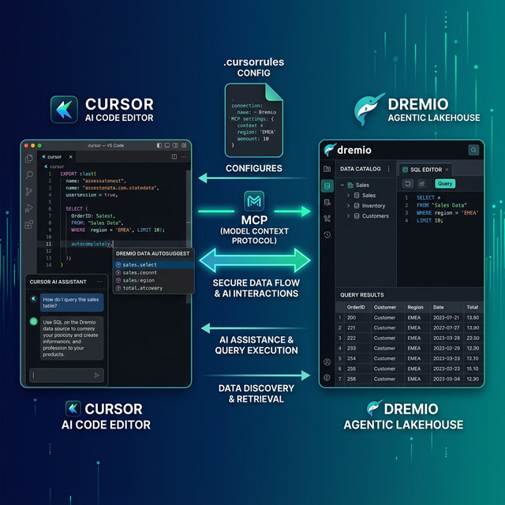

Cursor is an AI-native code editor built as a fork of VS Code. It integrates AI directly into the editing experience with features like Chat, Composer (multi-file editing), and inline code generation. Dremio is a unified lakehouse platform that provides business context through its semantic layer, universal data access through query federation, and interactive speed through Reflections and Apache Arrow.

Connecting them gives Cursor's AI the context it needs to write accurate Dremio SQL, generate data pipeline code, and build applications against your lakehouse. Without this connection, Cursor treats Dremio like a generic database and guesses at function names and table paths. With it, the AI knows your schemas, your business logic encoded in views, and the correct Dremio SQL dialect.

Cursor's rules system is especially well-suited for Dremio integration. Rules files in `.cursor/rules/` let you define granular, pattern-matched instructions that activate only when relevant. You can set Dremio SQL conventions to apply only when editing `.sql` files, and dremioframe patterns to apply only in Python files that import the SDK.

This post covers four approaches, ordered from quickest setup to most customizable.



## Setting Up Cursor

If you do not already have Cursor installed:

1. **Download Cursor** from [cursor.com](https://www.cursor.com/) (available for macOS, Linux, and Windows).
2. **Install it** by running the installer. Cursor replaces or runs alongside VS Code since it is a fork with the same extension ecosystem.
3. **Sign in** with a Cursor account. The free tier includes limited AI requests; Pro ($20/month) provides unlimited access.
4. **Open a project** by selecting File > Open Folder and pointing to your project directory.
5. **Verify AI access** by pressing `Cmd+K` (macOS) or `Ctrl+K` (Windows/Linux) to open the inline AI prompt. Type a question to confirm the AI is responding.

Cursor supports all VS Code extensions, themes, and keybindings. If you are migrating from VS Code, your existing setup transfers automatically.

## Approach 1: Connect the Dremio Cloud MCP Server

The Model Context Protocol (MCP) is an open standard that lets AI tools call external services. Every Dremio Cloud project ships with a built-in MCP server. Cursor supports MCP natively through its settings panel.

For Claude-based tools like Claude Code, Dremio provides an [official Claude plugin](https://github.com/dremio/claude-plugins) with guided setup. For Cursor, you configure the MCP connection through Cursor's built-in MCP settings.

### Find Your Project's MCP Endpoint

Log into [Dremio Cloud](https://www.dremio.com/get-started) and open your project. Navigate to **Project Settings > Info**. The MCP server URL is listed on the project overview page. Copy it.

### Set Up OAuth in Dremio Cloud

Dremio's hosted MCP server uses OAuth for authentication. Your existing access controls apply to every query the AI runs.

1. Go to **Settings > Organization Settings > OAuth Applications**.
2. Click **Add Application** and enter a name (e.g., "Cursor MCP").
3. Add the redirect URIs for Claude:
   - `https://claude.ai/api/mcp/auth_callback`
   - `https://claude.com/api/mcp/auth_callback`
4. Save and copy the **Client ID**.

### Configure Cursor's MCP Connection

In Cursor, go to **Settings > MCP**. Click **Add new MCP server** and configure it with your Dremio project's MCP URL. You can also add the MCP server by creating a `.cursor/mcp.json` file in your project root:

```json
{
  "mcpServers": {
    "dremio": {
      "url": "https://YOUR_PROJECT_MCP_URL",
      "auth": {
        "type": "oauth",
        "clientId": "YOUR_CLIENT_ID"
      }
    }
  }
}
```

Restart Cursor. The AI now has access to Dremio's MCP tools:

- **GetUsefulSystemTableNames** returns an index of available tables with descriptions.
- **GetSchemaOfTable** returns column names, types, and metadata.
- **GetDescriptionOfTableOrSchema** pulls wiki descriptions and labels from the catalog.
- **GetTableOrViewLineage** shows upstream data dependencies.
- **RunSqlQuery** executes SQL and returns results as JSON.

Test the connection by opening Cursor Chat (`Cmd+L`) and asking: "What tables are available in Dremio?" The AI will call `GetUsefulSystemTableNames` and return your catalog contents.

### Self-Hosted Alternative

For Dremio Software deployments, use the open-source [dremio-mcp](https://github.com/dremio/dremio-mcp) server. Clone the repo, configure it, then add it to Cursor's MCP settings:

```bash
git clone https://github.com/dremio/dremio-mcp
cd dremio-mcp
uv run dremio-mcp-server config create dremioai \
  --uri https://your-dremio-instance.com \
  --pat YOUR_PERSONAL_ACCESS_TOKEN
```

In `.cursor/mcp.json`:

```json
{
  "mcpServers": {
    "dremio": {
      "command": "uv",
      "args": [
        "run", "--directory", "/path/to/dremio-mcp",
        "dremio-mcp-server", "run"
      ]
    }
  }
}
```

The self-hosted server supports three modes: `FOR_DATA_PATTERNS` for data exploration (default), `FOR_SELF` for system analysis, and `FOR_PROMETHEUS` for correlating metrics with monitoring.

## Approach 2: Use Cursor Rules for Dremio Context

Cursor's rules system is one of its strongest differentiators. Rules are markdown files in `.cursor/rules/` that provide persistent AI instructions. Unlike a single monolithic context file, Cursor rules support pattern matching, so you can scope instructions to specific file types or directories.

### Project-Wide Rules with .cursorrules

The simplest approach is a `.cursorrules` file in your project root. This loads into every AI interaction:

```markdown
# Dremio SQL Conventions
- Use CREATE FOLDER IF NOT EXISTS (not CREATE NAMESPACE or CREATE SCHEMA)
- Tables in the Open Catalog use folder.subfolder.table_name without a catalog prefix
- External federated sources use source_name.schema.table_name
- Cast DATE to TIMESTAMP for consistent joins
- Use TIMESTAMPDIFF for duration calculations

# Credentials
- Never hardcode Personal Access Tokens. Use environment variable: DREMIO_PAT
- Dremio Cloud endpoint: environment variable DREMIO_URI

# Terminology
- Call it "Agentic Lakehouse", not "data warehouse"
- "Reflections" are pre-computed optimizations, not "materialized views"
```

### Pattern-Matched Rules with .cursor/rules/

For more granular control, create rule files in `.cursor/rules/` with `.mdc` (Markdown Cursor) extension. These files support YAML-like frontmatter that tells Cursor when to activate the rule:

```markdown
---
description: Dremio SQL conventions for query files
globs: ["**/*.sql", "**/queries/**"]
alwaysApply: false
---

# Dremio SQL Rules

When writing or modifying SQL files for Dremio:
- Use CREATE FOLDER IF NOT EXISTS, never CREATE SCHEMA
- Validate function names against the Dremio SQL reference
- Use TIMESTAMPDIFF for duration calculations, not DATEDIFF
- Cast DATE columns to TIMESTAMP before joins
- Reference tables as folder.subfolder.table_name
```

Create a separate rule for Python SDK usage:

```markdown
---
description: dremioframe Python SDK patterns
globs: ["**/*.py"]
alwaysApply: false
---

# dremioframe Conventions

When writing Python code that uses dremioframe:
- Import as: from dremioframe import DremioConnection
- Use environment variables for credentials: DREMIO_PAT, DREMIO_URI
- Always close connections in a finally block or use context managers
- For bulk operations, use df.to_dremio() with batch_size parameter
```

The `globs` field ensures these rules only activate when editing matching files. The `alwaysApply: false` setting means the AI loads them on demand rather than consuming context tokens on every interaction.

### Referencing External Documentation

Keep rules files concise by pointing to reference documents:

```markdown
---
description: Dremio documentation references
globs: ["**/*.sql", "**/*.py"]
alwaysApply: false
---

# Dremio Reference Docs
- For SQL syntax details, read `./docs/dremio-sql-reference.md`
- For Python SDK usage, read `./docs/dremioframe-guide.md`
- For REST API endpoints, read `./docs/dremio-rest-api.md`
```

Cursor loads the referenced files only when the AI needs them, keeping the context window efficient.


## Approach 3: Install Pre-Built Dremio Skills and Docs

> **Official vs. Community Resources:** Dremio provides an [official plugin](https://github.com/dremio/claude-plugins) for Claude Code users and the built-in [Dremio Cloud MCP server](https://docs.dremio.com/current/developer/mcp-server/) is an official Dremio product. The repositories below, along with libraries like dremioframe, are community-supported projects from the Dremio Developer Advocacy team. They are actively maintained but not part of the core Dremio product.

### dremio-agent-skill (Community)

The [dremio-agent-skill](https://github.com/developer-advocacy-dremio/dremio-agent-skill) repository contains a comprehensive skill directory with knowledge files and a `.cursorrules` file specifically designed for Cursor.

```bash
git clone https://github.com/developer-advocacy-dremio/dremio-agent-skill
cd dremio-agent-skill
./install.sh
```

Choose **Local Project Install (Copy)** to copy the `.cursorrules` file and knowledge directory into your project. The `.cursorrules` file provides Dremio conventions, and the `knowledge/` directory contains detailed references for CLI, Python SDK, SQL syntax, and REST API.

After installation, Cursor automatically picks up the `.cursorrules` file and uses it for all AI interactions in the project.

### dremio-agent-md (Community)

The [dremio-agent-md](https://github.com/developer-advocacy-dremio/dremio-agent-md) repository provides a `DREMIO_AGENT.md` protocol file and browsable sitemaps of the Dremio documentation.

```bash
git clone https://github.com/developer-advocacy-dremio/dremio-agent-md
```

Reference it in your `.cursorrules`:

```markdown
For Dremio SQL validation, read DREMIO_AGENT.md in the dremio-agent-md directory.
Use the sitemaps in dremio_sitemaps/ to verify syntax before generating SQL.
```

## Approach 4: Build Your Own Cursor Rules

If the pre-built options do not fit your workflow, create a custom rules setup tailored to your team's Dremio environment.

### Create Rule Files

```
.cursor/rules/
  dremio-sql.mdc          # SQL conventions
  dremio-python.mdc       # dremioframe patterns
  dremio-schemas.mdc      # Team-specific table schemas
  dremio-api.mdc          # REST API patterns
```

### Populate with Team Context

Export your actual table schemas from Dremio and save them as a rule:

```markdown
---
description: Team Dremio table schemas
globs: ["**/*.sql", "**/*.py"]
alwaysApply: false
---

# Team Table Schemas

## analytics.gold.customer_metrics
- customer_id: VARCHAR (primary key)
- lifetime_value: DECIMAL(10,2)
- segment: VARCHAR (values: 'enterprise', 'mid-market', 'smb')
- last_order_date: TIMESTAMP
- churn_risk_score: FLOAT

## analytics.gold.revenue_daily
- date_key: TIMESTAMP
- product_category: VARCHAR
- region: VARCHAR
- revenue: DECIMAL(12,2)
- orders: INT
```

This gives Cursor exact schema knowledge for your project, so the AI generates SQL with correct column names and types instead of guessing.

### Add Notepads for Reference Knowledge

Cursor also supports **Notepads** for longer reference documents. Create a notepad in `.cursor/notepads/dremio-reference.md` with comprehensive documentation. Notepads are available as `@notepad` references in Chat and Composer but do not auto-load, keeping your context efficient.

## Using Dremio with Cursor: Practical Use Cases

Once Dremio is connected, Cursor becomes a powerful data development environment. Here are detailed examples.

### Ask Natural Language Questions About Your Data

Open Cursor Chat (`Cmd+L`) and ask questions in plain English:

> "What were our top 10 products by revenue last quarter? Break it down by region and show the trend."

Cursor uses the MCP connection to discover your tables, writes the SQL in the chat, and can run it against Dremio to return results. You get answers without switching to the Dremio UI.

Follow up with deeper analysis:

> "Which of those top products has declining margins? Pull cost and revenue data for the last 6 months and show the margin trend."

Cursor maintains context across the chat session, building on previous results. This turns the editor into a conversational data analysis tool.

For teams with non-SQL users, Cursor Chat provides a natural language interface to the lakehouse directly inside the development environment.

### Build a Locally Running Dashboard

Use Cursor Composer (`Cmd+I`) for multi-file generation:

> "Query our gold-layer sales views in Dremio and build a local HTML dashboard with Chart.js. Include monthly revenue trends, top products by region, and customer acquisition metrics. Make it filterable by date range. Put the HTML, CSS, and JavaScript in separate files."

Cursor Composer will:

1. Use MCP to discover gold-layer views and their schemas
2. Create `index.html` with the dashboard layout
3. Create `styles.css` with the dark theme and responsive design
4. Create `app.js` with Chart.js configurations and data fetching
5. Embed query results as JSON data files
6. Add interactive filter controls

Open `index.html` in a browser for a complete dashboard running from local files. Cursor Composer excels at multi-file generation, making it ideal for this kind of project scaffolding.

### Create a Data Exploration App

Build an interactive tool using Composer:

> "Create a Streamlit app that connects to Dremio using dremioframe. Include a schema browser sidebar, a data preview tab with pagination, a SQL query editor with syntax highlighting, and CSV download buttons. Generate requirements.txt and a README."

Cursor generates the full application across multiple files:

- `app.py` with Streamlit layout and dremioframe integration
- `requirements.txt` with pinned dependencies
- `.env.example` with required environment variables
- `README.md` with setup and run instructions

Run `pip install -r requirements.txt && streamlit run app.py` for a local data explorer connected to your lakehouse.

### Generate Data Pipeline Scripts

Automate data engineering with inline AI:

Highlight a comment in your Python file like `# Create bronze-silver-gold pipeline for user_events table` and press `Cmd+K`. Cursor generates the complete pipeline code inline:

- Bronze: raw data ingestion with column renames and TIMESTAMP casts
- Silver: deduplication, null checks, and type validation
- Gold: business logic aggregations with CASE WHEN classifications
- Error handling with retry logic
- Structured logging for monitoring

The inline generation respects your `.cursor/rules/` Dremio conventions, so the SQL follows your team's standards automatically.

### Build API Endpoints Over Dremio Data

Use Composer to scaffold a REST API:

> "Build a FastAPI application that connects to Dremio using dremioframe. Create endpoints for customer segments, revenue analytics, and product performance. Include Pydantic models, request validation, response caching, and auto-generated OpenAPI docs."

Cursor generates the complete API across multiple files with proper project structure, ready for `uvicorn main:app --reload`.

## Which Approach Should You Use?

| Approach | Setup Time | What You Get | Best For |
|----------|-----------|--------------|----------|
| MCP Server | 5 minutes | Live queries, schema browsing, catalog exploration | Data analysis, SQL generation, real-time access |
| Cursor Rules | 15 minutes | Convention enforcement, pattern-matched context | Teams with specific SQL standards per file type |
| Pre-Built Skills | 5 minutes | Comprehensive Dremio knowledge (CLI, SDK, SQL, API) | Quick start with broad coverage |
| Custom Rules | 30+ minutes | Tailored schemas, patterns, and team conventions | Mature teams with project-specific needs |

Combine them for the strongest setup. The MCP server gives live data access; Cursor rules enforce conventions scoped to relevant file types; pre-built skills provide broad Dremio knowledge; and custom rules capture your team's specific schemas and patterns.

Start with the MCP server for immediate value. Add a `.cursorrules` file for project-wide conventions. As your team develops specific patterns, create `.cursor/rules/*.mdc` files with pattern matching for granular control.

## Get Started

1. [Sign up for a free Dremio Cloud trial](https://www.dremio.com/get-started) (30 days, $400 in compute credits).
2. Find your project's MCP endpoint in **Project Settings > Info**.
3. Add it in Cursor's **Settings > MCP** or create `.cursor/mcp.json`.
4. Clone [dremio-agent-skill](https://github.com/developer-advocacy-dremio/dremio-agent-skill) and run `./install.sh` with local project install.
5. Open Cursor Chat and ask it to explore your Dremio catalog.

Dremio's Agentic Lakehouse gives Cursor's AI accurate data context: the semantic layer provides business meaning, query federation provides universal access, and Reflections provide interactive speed. Cursor's rules system scopes that context intelligently, activating Dremio knowledge only when relevant.

For more on the Dremio MCP Server, check out the [official documentation](https://docs.dremio.com/current/developer/mcp-server/) or enroll in the free [Dremio MCP Server course](https://university.dremio.com/course/dremio-mcp) on Dremio University.
