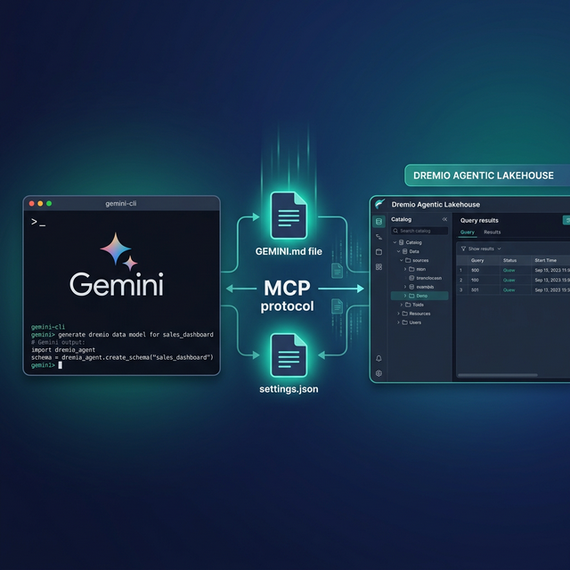
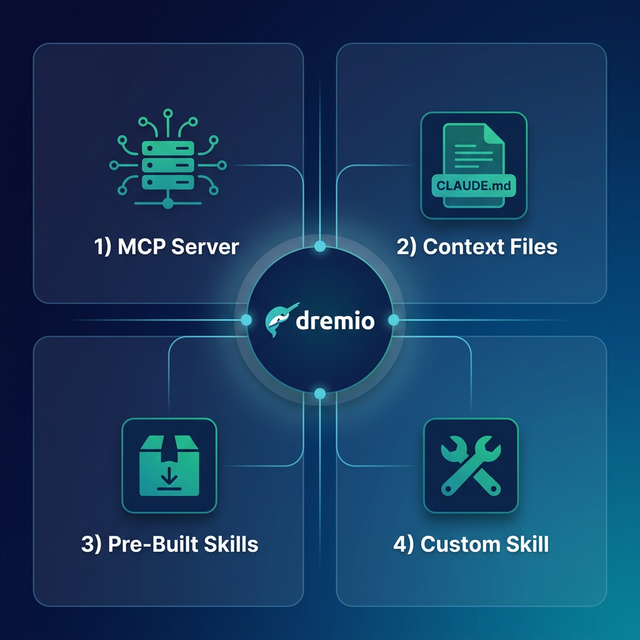

Gemini CLI is Google's open-source terminal-based AI agent. It runs directly in your terminal, powered by Gemini models with a 1-million token context window. Dremio is a unified lakehouse platform that provides business context through its semantic layer, universal data access through query federation, and interactive speed through Reflections and Apache Arrow.

Connecting them gives Gemini CLI the data context it needs to write accurate Dremio SQL, generate pipeline scripts, and build applications against your lakehouse. The 1-million token context window is a significant advantage: Gemini CLI can hold your entire project, documentation, and Dremio schema context simultaneously without the context limitations that constrain other agents.

Gemini CLI's `GEMINI.md` context file system is similar to `CLAUDE.md` in Claude Code. It loads project-specific instructions at session start and supports hierarchical scoping from global defaults to project-specific overrides. The tool also supports MCP natively, Google Search grounding for real-time documentation lookups, and built-in file and shell tools.

This post covers four approaches, ordered from quickest setup to most customizable.



## Setting Up Gemini CLI

If you do not already have Gemini CLI installed:

1. **Install Node.js** (version 18 or later) from [nodejs.org](https://nodejs.org/).
2. **Install Gemini CLI** globally via npm:
   ```bash
   npm install -g @anthropic-ai/gemini-cli
   ```
   Or install from source via the [GitHub repository](https://github.com/google-gemini/gemini-cli).
3. **Authenticate** by running `gemini` in your terminal. On first launch, it will prompt you to sign in with your Google account. Gemini CLI is free to use with a Google account (rate-limited) or with a Gemini API key for higher throughput.
4. **Verify the installation** by asking a question: `gemini "What is Apache Iceberg?"`

Gemini CLI runs in your terminal and reads your project files for context. It can execute shell commands, edit files, browse the web via Google Search grounding, and interact with MCP servers.

## Approach 1: Connect the Dremio Cloud MCP Server

The Model Context Protocol (MCP) is an open standard that lets AI tools call external services. Every Dremio Cloud project ships with a built-in MCP server. Gemini CLI supports MCP natively through its `settings.json` configuration.

For Claude-based tools, Dremio provides an [official Claude plugin](https://github.com/dremio/claude-plugins) with guided setup. For Gemini CLI, you configure the MCP connection through `settings.json`.

### Find Your Project's MCP Endpoint

Log into [Dremio Cloud](https://www.dremio.com/get-started) and open your project. Navigate to **Project Settings > Info**. The MCP server URL is listed on the project overview page. Copy it.

### Set Up OAuth in Dremio Cloud

1. Go to **Settings > Organization Settings > OAuth Applications**.
2. Click **Add Application** and enter a name (e.g., "Gemini CLI MCP").
3. Add the appropriate redirect URI for your setup.
4. Save and copy the **Client ID**.

### Configure Gemini CLI's MCP Connection

Gemini CLI reads MCP server definitions from `settings.json`. You can configure this at two levels:

- **User-level:** `~/.gemini/settings.json` (applies to all projects)
- **Project-level:** `.gemini/settings.json` (applies to the current project only)

Create or edit the settings file:

```json
{
  "mcpServers": {
    "dremio": {
      "httpUrl": "https://YOUR_PROJECT_MCP_URL"
    }
  }
}
```

You can also add MCP servers using the CLI command:

```bash
gemini mcp add dremio --httpUrl "https://YOUR_PROJECT_MCP_URL"
```

Restart Gemini CLI. The agent now has access to Dremio's MCP tools:

- **GetUsefulSystemTableNames** returns available tables with descriptions.
- **GetSchemaOfTable** returns column names, types, and metadata.
- **GetDescriptionOfTableOrSchema** pulls wiki descriptions from the catalog.
- **GetTableOrViewLineage** shows upstream dependencies.
- **RunSqlQuery** executes SQL and returns results as JSON.

Test the connection by asking: "What tables are available in Dremio?" Gemini CLI will call `GetUsefulSystemTableNames` and return your catalog contents.

### Self-Hosted Alternative

For Dremio Software deployments, use the open-source [dremio-mcp](https://github.com/dremio/dremio-mcp) server:

```bash
git clone https://github.com/dremio/dremio-mcp
cd dremio-mcp
uv run dremio-mcp-server config create dremioai \
  --uri https://your-dremio-instance.com \
  --pat YOUR_PERSONAL_ACCESS_TOKEN
```

In your `settings.json`:

```json
{
  "mcpServers": {
    "dremio": {
      "command": "uv",
      "args": [
        "run", "--directory", "/path/to/dremio-mcp",
        "dremio-mcp-server", "run"
      ]
    }
  }
}
```

The self-hosted server supports three modes: `FOR_DATA_PATTERNS` for data exploration (default), `FOR_SELF` for system analysis, and `FOR_PROMETHEUS` for correlating metrics with monitoring.

## Approach 2: Use GEMINI.md for Dremio Context

Gemini CLI auto-loads `GEMINI.md` from your project root at the start of every session. It works similarly to `CLAUDE.md` in Claude Code, providing persistent instructions that survive across conversations.

### Hierarchical Context Loading

`GEMINI.md` supports hierarchical scoping:

- **Global:** `~/.gemini/GEMINI.md` applies to every project.
- **Project:** `GEMINI.md` in the project root applies to that specific repo.
- **Subdirectory:** `GEMINI.md` files in subdirectories provide additional context when working in those folders.

Project-level files override global ones. Subdirectory files add to the project context rather than replacing it.

### Writing a Dremio-Focused GEMINI.md

```markdown
# Project Context

This project uses Dremio Cloud as its lakehouse platform.

## Dremio SQL Conventions
- Use `CREATE FOLDER IF NOT EXISTS` (not CREATE NAMESPACE or CREATE SCHEMA)
- Tables in the Open Catalog use `folder.subfolder.table_name` without a catalog prefix
- External federated sources use `source_name.schema.table_name`
- Cast DATE columns to TIMESTAMP for consistent joins
- Use TIMESTAMPDIFF for duration calculations

## Credentials
- Never hardcode Personal Access Tokens. Use environment variable: DREMIO_PAT
- Dremio Cloud endpoint is in environment variable: DREMIO_URI

## API Reference
- REST API docs: https://docs.dremio.com/current/reference/api/
- SQL reference: https://docs.dremio.com/current/reference/sql/
- For detailed SQL validation, read ./dremio-docs/sql-reference.md

## Terminology
- Call it "Agentic Lakehouse", not "data warehouse"
- "Reflections" are pre-computed optimizations, not "materialized views"
- "Open Catalog" is built on Apache Polaris
```

### Using Protocol Blocks for Gated Instructions

Gemini CLI supports `<PROTOCOL>` blocks within `GEMINI.md` for instructions that should only activate when specific conditions are met. This prevents context bloat:

```markdown
<PROTOCOL>
When the user asks about Dremio SQL or data pipelines:
1. Read ./dremio-docs/sql-reference.md for syntax validation
2. Use Dremio SQL conventions defined above
3. Always verify function names exist in the reference before using them
</PROTOCOL>
```

Protocol blocks are a form of delayed instructions. Gemini CLI reads the protocol definition but only executes the instructions when the triggering condition is met. This is more efficient than loading all reference files at session start.

### Google Search Grounding

Gemini CLI has built-in Google Search grounding, meaning it can look up real-time Dremio documentation during a session. You can instruct it in `GEMINI.md`:

```markdown
## Documentation Strategy
- Before writing any Dremio SQL, use Google Search to verify the syntax
  against the latest Dremio documentation at docs.dremio.com
- If a function name is uncertain, search for it before including it
```

This is a unique advantage over other agents. Instead of relying solely on pre-loaded context or training data, Gemini CLI can verify syntax against live documentation.



## Approach 3: Install Pre-Built Dremio Skills and Docs

> **Official vs. Community Resources:** Dremio provides an [official plugin](https://github.com/dremio/claude-plugins) for Claude Code users and the built-in [Dremio Cloud MCP server](https://docs.dremio.com/current/developer/mcp-server/) is an official Dremio product. The repositories below, along with libraries like dremioframe, are community-supported projects from the Dremio Developer Advocacy team. They are actively maintained but not part of the core Dremio product.

### dremio-agent-skill (Community)

The [dremio-agent-skill](https://github.com/developer-advocacy-dremio/dremio-agent-skill) repository contains a complete skill directory with `SKILL.md`, knowledge files, and configuration files for multiple tools.

```bash
git clone https://github.com/developer-advocacy-dremio/dremio-agent-skill
cd dremio-agent-skill
./install.sh
```

For Gemini CLI, tell the agent to read the skill at session start:

> "Read dremio-skill/SKILL.md and use the knowledge files in dremio-skill/knowledge/ for Dremio conventions."

The skill includes knowledge files covering Dremio CLI, Python SDK (dremioframe), SQL syntax, and REST API endpoints.

### dremio-agent-md (Community)

The [dremio-agent-md](https://github.com/developer-advocacy-dremio/dremio-agent-md) repository provides a master protocol file and browsable documentation sitemaps:

```bash
git clone https://github.com/developer-advocacy-dremio/dremio-agent-md
```

Reference it in your `GEMINI.md`:

```markdown
## Dremio Documentation
- Read DREMIO_AGENT.md in ./dremio-agent-md/ for the Dremio protocol
- Use sitemaps in dremio_sitemaps/ to verify SQL syntax
```

This pairs well with Gemini CLI's Google Search grounding. The sitemaps provide structured offline references, while Search grounding provides real-time verification.

## Approach 4: Build Your Own GEMINI.md Context

If the pre-built options do not fit your workflow, build a custom `GEMINI.md` tailored to your team's Dremio environment.

### Create Project Context Files

```
.gemini/
  GEMINI.md              # Points to the reference files below
project-docs/
  dremio-conventions.md  # Team SQL rules
  table-schemas.md       # Exported schemas from Dremio
  common-queries.md      # Frequently used query patterns
  dremioframe-patterns.md # Python SDK code snippets
```

### Write a Comprehensive GEMINI.md

```markdown
# Team Dremio Context

## SQL Standards
- All tables are under the analytics namespace
- Bronze: analytics.bronze.*, Silver: analytics.silver.*, Gold: analytics.gold.*
- Always use TIMESTAMP, never DATE
- Validate function names against project-docs/dremio-conventions.md

## Authentication
- Use env var DREMIO_PAT for tokens
- Cloud endpoint: env var DREMIO_URI

## Reference Files
- SQL conventions: project-docs/dremio-conventions.md
- Table schemas (updated weekly): project-docs/table-schemas.md
- Common queries: project-docs/common-queries.md
- Python SDK patterns: project-docs/dremioframe-patterns.md

<PROTOCOL>
When writing Dremio SQL:
1. Read project-docs/table-schemas.md to verify table and column names
2. Read project-docs/dremio-conventions.md to validate function names
3. Use Google Search to verify any Dremio function not in the reference
</PROTOCOL>
```

The 1-million token context window means Gemini CLI can hold your entire schema reference, convention guide, and query library simultaneously without truncation.

## Using Dremio with Gemini CLI: Practical Use Cases

Once Dremio is connected, Gemini CLI becomes a powerful data engineering partner in your terminal. Here are detailed examples.

### Ask Natural Language Questions About Your Data

Ask Gemini CLI questions about your lakehouse in plain English:

> "What were our top 10 customers by revenue last quarter? Show month-over-month trends and flag any with declining order frequency."

Gemini CLI uses the MCP connection to discover your tables, writes the SQL, runs it against Dremio, and returns formatted results with analysis. The 1-million token context window means it can hold large result sets and build on them across a session.

Follow up with multi-step analysis:

> "For the customers with declining frequency, pull their support ticket history and calculate the correlation between ticket volume and order decline."

Gemini CLI maintains the full conversation context, including previous query results, and generates the follow-up query with cross-table joins. If it is unsure about a table name or column, it can use Google Search grounding to verify against live Dremio documentation.

### Build a Locally Running Dashboard

Ask Gemini CLI to create a complete dashboard:

> "Query our gold-layer sales views in Dremio and build a local HTML dashboard with Chart.js. Include monthly revenue trends, top products by region, and customer acquisition metrics. Make it filterable by date range and add a dark theme with print-to-PDF."

Gemini CLI will:

1. Use MCP to discover gold-layer views and their schemas
2. Write and execute SQL queries for each visualization
3. Generate an HTML file with embedded CSS, JavaScript, and Chart.js
4. Add interactive filter controls and export buttons
5. Save it to your project directory

Open the HTML file in a browser for a complete dashboard running from a local file. No server or deployment needed.

### Create a Data Exploration App

Build an interactive tool:

> "Create a Python Streamlit app that connects to Dremio using dremioframe. Include a schema browser sidebar with table counts, a data preview with pagination, a SQL query editor with syntax highlighting and execution, and CSV download. Generate requirements.txt and README."

Gemini CLI writes the full application:

- `app.py` with Streamlit layout, dremioframe connection, and query execution
- `requirements.txt` with pinned dependencies
- `.env.example` with required environment variables
- `README.md` with setup and run instructions

Run `streamlit run app.py` and your team has a local data explorer connected to the lakehouse.

### Generate Data Pipeline Scripts

Automate data engineering workflows:

> "Write a dremioframe script that implements a Medallion Architecture pipeline for our new product_events table. Bronze: ingest raw data with column renames and TIMESTAMP casts. Silver: deduplicate on event_id, validate required fields, apply business rules. Gold: aggregate daily active products, event counts by type, and conversion funnels. Include error handling, structured logging, and a dry-run mode."

Gemini CLI uses the GEMINI.md conventions and Dremio skill knowledge to produce production-quality pipeline code. Its Google Search grounding means it can verify Dremio function syntax in real time if the reference files do not cover a specific function.

### Build API Endpoints Over Dremio Data

Create backend services:

> "Build a FastAPI application that connects to Dremio using dremioframe. Create endpoints for customer segments, revenue by geography, and product performance trends. Include Pydantic response models, request validation, caching with TTL, and auto-generated OpenAPI docs."

Gemini CLI generates the complete API server with proper error handling and connection management. Deploy it locally with `uvicorn main:app --reload` or containerize for production.

## Which Approach Should You Use?

| Approach | Setup Time | What You Get | Best For |
|----------|-----------|--------------|----------|
| MCP Server | 5 minutes | Live queries, schema browsing, catalog exploration | Data analysis, SQL generation, real-time access |
| GEMINI.md | 10 minutes | Convention enforcement, protocol blocks, Search grounding | Teams with specific SQL standards or project rules |
| Pre-Built Skills | 5 minutes | Comprehensive Dremio knowledge (CLI, SDK, SQL, API) | Quick start with broad coverage |
| Custom Context | 30+ minutes | Tailored schemas, patterns, and team conventions | Mature teams with project-specific needs |

Combine them for the strongest setup. The MCP server gives live data access; GEMINI.md enforces conventions with protocol blocks; pre-built skills provide broad Dremio knowledge; and custom context files capture your team's schemas and patterns.

Start with the MCP server for immediate value. Add a `GEMINI.md` with your SQL conventions. Use Google Search grounding as a safety net for syntax verification. As your team develops patterns, build out the context files with schemas and query libraries.

## Get Started

1. [Sign up for a free Dremio Cloud trial](https://www.dremio.com/get-started) (30 days, $400 in compute credits).
2. Find your project's MCP endpoint in **Project Settings > Info**.
3. Add it to `~/.gemini/settings.json` or `.gemini/settings.json`.
4. Clone [dremio-agent-skill](https://github.com/developer-advocacy-dremio/dremio-agent-skill) and tell Gemini CLI to read the skill.
5. Start a session and ask Gemini CLI to explore your Dremio catalog.

Dremio's Agentic Lakehouse gives Gemini CLI accurate data context: the semantic layer provides business meaning, query federation provides universal access, and Reflections provide interactive speed. Gemini CLI's massive context window holds it all, and Google Search grounding provides real-time verification as a safety net.

For more on the Dremio MCP Server, check out the [official documentation](https://docs.dremio.com/current/developer/mcp-server/) or enroll in the free [Dremio MCP Server course](https://university.dremio.com/course/dremio-mcp) on Dremio University.
