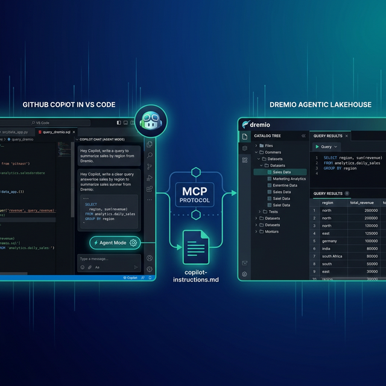

GitHub Copilot is the most widely adopted AI coding assistant, integrated into VS Code, JetBrains IDEs, and the GitHub platform. Its agent mode allows Copilot to plan and execute multi-step coding tasks, run terminal commands, and interact with external tools through MCP. The Copilot CLI extends agentic development to the terminal. Dremio is a unified lakehouse platform that provides business context through its semantic layer, universal data access through query federation, and interactive speed through Reflections and Apache Arrow.

Connecting them gives Copilot's agent mode the context it needs to write accurate Dremio SQL, generate data pipelines, and build applications against your lakehouse. This is significant because of Copilot's massive user base: if you already use Copilot for code completion and chat, adding Dremio context turns it into a data-aware development partner without switching tools.

Copilot's `copilot-instructions.md` file and `.vscode/mcp.json` configuration make it straightforward to integrate project-specific Dremio conventions and live data access into your workflow.

This post covers four approaches, ordered from quickest setup to most customizable.



## Setting Up GitHub Copilot

If you do not already have GitHub Copilot:

1. **Sign up for GitHub Copilot** at [github.com/features/copilot](https://github.com/features/copilot). Individual ($10/month), Business ($19/user/month), and Enterprise ($39/user/month) plans are available. Free tier includes limited completions.
2. **Install VS Code** from [code.visualstudio.com](https://code.visualstudio.com/) if not already installed.
3. **Install the GitHub Copilot extension** from the VS Code marketplace (search "GitHub Copilot").
4. **Sign in** with your GitHub account when prompted.
5. **Enable agent mode** by clicking the Copilot chat icon and selecting "Agent" from the mode dropdown (available in VS Code 1.99+).

For terminal usage, install the **Copilot CLI** (`gh copilot`) through the GitHub CLI:

```bash
gh extension install github/gh-copilot
```

## Approach 1: Connect the Dremio Cloud MCP Server

Every Dremio Cloud project ships with a built-in MCP server. Copilot agent mode supports MCP natively through workspace configuration files.

For Claude-based tools, Dremio provides an [official Claude plugin](https://github.com/dremio/claude-plugins) with guided setup. For Copilot, you configure the MCP connection through `.vscode/mcp.json`.

### Find Your Project's MCP Endpoint

Log into [Dremio Cloud](https://www.dremio.com/get-started) and navigate to **Project Settings > Info**. Copy the MCP server URL.

### Set Up OAuth in Dremio Cloud

1. Go to **Settings > Organization Settings > OAuth Applications**.
2. Click **Add Application** and enter a name (e.g., "Copilot MCP").
3. Add the appropriate redirect URIs.
4. Save and copy the **Client ID**.

### Configure Copilot's MCP Connection

Create `.vscode/mcp.json` in your project root:

```json
{
  "servers": {
    "dremio": {
      "type": "http",
      "url": "https://YOUR_PROJECT_MCP_URL"
    }
  }
}
```

You can also configure MCP servers in your VS Code user settings:

```json
{
  "mcp": {
    "servers": {
      "dremio": {
        "type": "http",
        "url": "https://YOUR_PROJECT_MCP_URL"
      }
    }
  }
}
```

Reload VS Code. Copilot agent mode now has access to Dremio's MCP tools:

- **GetUsefulSystemTableNames** returns available tables with descriptions.
- **GetSchemaOfTable** returns column names, types, and metadata.
- **GetDescriptionOfTableOrSchema** pulls wiki descriptions from the catalog.
- **GetTableOrViewLineage** shows upstream dependencies.
- **RunSqlQuery** executes SQL and returns results as JSON.

Test the connection by opening Copilot Chat in agent mode and asking: "What tables are available in Dremio?" The agent will call `GetUsefulSystemTableNames` and return your catalog contents.

### Self-Hosted Alternative

For Dremio Software deployments, use the open-source [dremio-mcp](https://github.com/dremio/dremio-mcp) server:

```json
{
  "servers": {
    "dremio": {
      "type": "stdio",
      "command": "uv",
      "args": [
        "run", "--directory", "/path/to/dremio-mcp",
        "dremio-mcp-server", "run"
      ]
    }
  }
}
```

### Enterprise Policy Controls

For organizations, GitHub administrators can manage MCP server access through organization policies. This lets teams standardize on approved Dremio MCP connections while preventing unauthorized data access.

## Approach 2: Use copilot-instructions.md for Dremio Context

Copilot reads custom instructions from `.github/copilot-instructions.md` in your repository. This file is loaded into every Copilot interaction, providing persistent project context.

### Repository-Level Instructions

Create `.github/copilot-instructions.md`:

```markdown
# Dremio SQL Conventions

This project uses Dremio Cloud as its lakehouse platform.

## SQL Rules
- Use CREATE FOLDER IF NOT EXISTS (not CREATE NAMESPACE or CREATE SCHEMA)
- Tables in the Open Catalog use folder.subfolder.table_name
- External federated sources use source_name.schema.table_name
- Cast DATE to TIMESTAMP for consistent joins
- Use TIMESTAMPDIFF for duration calculations

## Credentials
- Never hardcode Personal Access Tokens. Use environment variable: DREMIO_PAT
- Cloud endpoint: environment variable DREMIO_URI

## Terminology
- Call it "Agentic Lakehouse", not "data warehouse"
- "Reflections" are pre-computed optimizations, not "materialized views"
```

### Pattern-Specific Instructions

Copilot also supports `.instructions` files with YAML glob patterns for targeted application:

Create `.github/instructions/dremio-sql.instructions.md`:

```markdown
---
applyTo: "**/*.sql"
---

When writing SQL for Dremio:
- Validate function names against the Dremio SQL reference
- Use TIMESTAMPDIFF for duration calculations
- Cast DATE columns to TIMESTAMP before joins
```

Create `.github/instructions/dremio-python.instructions.md`:

```markdown
---
applyTo: "**/*.py"
---

When writing Python code that uses dremioframe:
- Import as: from dremioframe import DremioConnection
- Use environment variables for credentials
- Always close connections in a finally block
```

This scoping is similar to Cursor's `.cursor/rules/*.mdc` pattern matching.


## Approach 3: Install Pre-Built Dremio Skills and Docs

> **Official vs. Community Resources:** Dremio provides an [official plugin](https://github.com/dremio/claude-plugins) for Claude Code users and the built-in [Dremio Cloud MCP server](https://docs.dremio.com/current/developer/mcp-server/) is an official Dremio product. The repositories below, along with libraries like dremioframe, are community-supported projects from the Dremio Developer Advocacy team. They are actively maintained but not part of the core Dremio product.

### dremio-agent-skill (Community)

The [dremio-agent-skill](https://github.com/developer-advocacy-dremio/dremio-agent-skill) repository provides knowledge files and a `.cursorrules` file:

```bash
git clone https://github.com/developer-advocacy-dremio/dremio-agent-skill
cd dremio-agent-skill
./install.sh
```

Reference the knowledge files from your `copilot-instructions.md`:

```markdown
For Dremio SQL conventions, read the knowledge files in dremio-skill/knowledge/.
```

### dremio-agent-md (Community)

The [dremio-agent-md](https://github.com/developer-advocacy-dremio/dremio-agent-md) repository provides a protocol file and documentation sitemaps:

```bash
git clone https://github.com/developer-advocacy-dremio/dremio-agent-md
```

Reference it in `.github/copilot-instructions.md`:

```markdown
For Dremio documentation, read DREMIO_AGENT.md in ./dremio-agent-md/.
```

## Approach 4: Build Your Own copilot-instructions.md

Create a comprehensive instruction file with your team's Dremio environment:

```markdown
# Team Dremio Context

## Environment
- Lakehouse: Dremio Cloud (analytics project)
- Catalog: Apache Polaris-based Open Catalog
- Architecture: Medallion (bronze → silver → gold)

## Table Schemas
For exact column definitions, read ./docs/table-schemas.md

## SQL Standards
- Bronze: raw.*, Silver: cleaned.*, Gold: analytics.*
- Always use TIMESTAMP, never DATE
- Validate function names against ./docs/dremio-sql-reference.md

## Python SDK
- Use dremioframe for all Dremio connections
- Patterns: read ./docs/dremioframe-patterns.md
```

## Using Dremio with GitHub Copilot: Practical Use Cases

Once Dremio is connected, Copilot agent mode can execute complete data projects. Here are detailed examples.

### Ask Natural Language Questions About Your Data

In agent mode, ask Copilot questions about your data:

> "What were our top 10 customers by lifetime value? Show their order frequency and most recent purchase date."

Copilot agent mode uses MCP to discover tables, writes the SQL, runs it, and returns formatted results. Because it operates within VS Code, you can immediately use the results in your code.

Follow up with analysis:

> "For customers with declining order frequency, correlate with support ticket volume. Are our high-value customers churning?"

Copilot maintains context across the conversation and generates cross-table queries automatically.

### Build a Locally Running Dashboard

Ask Copilot in agent mode:

> "Query our Dremio gold-layer views for revenue metrics, then create an HTML dashboard with Chart.js. Include monthly trends, regional breakdown, and top product charts. Add date filters and a dark theme. Save as separate HTML, CSS, and JS files."

Copilot agent mode will:

1. Call MCP to discover views and schemas
2. Execute queries and collect results
3. Generate `index.html`, `styles.css`, and `app.js`
4. Wire everything together with Chart.js

Open `index.html` in a browser for a working dashboard. Since this all happens in VS Code, you can iterate on the design with inline edits.

### Create a Data Exploration App

Build interactive tools:

> "Create a Streamlit app connected to Dremio via dremioframe. Include schema browsing, data preview with pagination, SQL query editor, and CSV export. Generate all files and a README."

Copilot generates the full application. Run `streamlit run app.py` for a local data explorer.

### Generate Data Pipeline Scripts

Use inline completions for data engineering:

Write a comment: `# Medallion pipeline for product_events: bronze ingestion, silver cleaning, gold aggregation`

Copilot generates the complete pipeline following your `copilot-instructions.md` conventions. Agent mode can also run the generated code against your Dremio instance to validate it.

### Build API Endpoints Over Dremio Data

Create backend services:

> "Build a FastAPI app that serves Dremio gold-layer data through REST endpoints. Add customer analytics, revenue by region, and product performance. Include Pydantic models, caching, and OpenAPI docs."

Copilot generates the complete API. Run `uvicorn main:app --reload` for a local server.

## Which Approach Should You Use?

| Approach | Setup Time | What You Get | Best For |
|----------|-----------|--------------|----------|
| MCP Server | 5 minutes | Live queries, schema browsing, catalog exploration | Data analysis, SQL generation, real-time access |
| copilot-instructions.md | 10 minutes | Convention enforcement, pattern-specific rules | Teams with repository-wide standards |
| Pre-Built Skills | 5 minutes | Comprehensive Dremio knowledge (CLI, SDK, SQL, API) | Quick start with broad coverage |
| Custom Instructions | 30+ minutes | Tailored schemas, patterns, and team conventions | Mature teams with project-specific needs |

Start with the MCP server for immediate value. Add `copilot-instructions.md` for conventions. Use `.instructions` files for pattern-specific rules.

## Get Started

1. [Sign up for a free Dremio Cloud trial](https://www.dremio.com/get-started) (30 days, $400 in compute credits).
2. Find your project's MCP endpoint in **Project Settings > Info**.
3. Create `.vscode/mcp.json` with your Dremio MCP server.
4. Create `.github/copilot-instructions.md` with Dremio conventions.
5. Open Copilot in agent mode and ask it to explore your Dremio catalog.

Dremio's Agentic Lakehouse gives Copilot accurate data context. Combined with Copilot's massive user base and VS Code integration, this is the lowest-friction path to AI-powered data development for most teams.

For more on the Dremio MCP Server, check out the [official documentation](https://docs.dremio.com/current/developer/mcp-server/) or enroll in the free [Dremio MCP Server course](https://university.dremio.com/course/dremio-mcp) on Dremio University.
