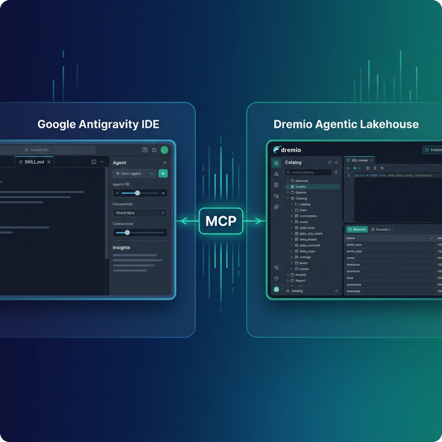

Google Antigravity is an agent-first IDE built by Google DeepMind. Its autonomous agents plan multi-step tasks, write code, browse documentation, and iterate without constant hand-holding. Dremio is a unified lakehouse platform that provides the business context, universal data access, and interactive query speed that AI agents need to produce accurate analytics.

Connecting the two gives your Antigravity agents something most coding agents lack: direct access to your data catalog, table schemas, business logic encoded in views, and the correct SQL dialect for Dremio's query engine. Without it, the agent guesses at table names and hallucinates SQL functions. With it, the agent writes queries that actually run.

Antigravity's skill system is a particularly strong fit for Dremio integration. Skills load on demand based on semantic matching, so Dremio knowledge enters the context only when the agent needs it. This keeps the context window efficient for tasks that have nothing to do with data, while still providing deep Dremio expertise when you shift to analytics work.

This post walks through four integration approaches. Each one adds a different kind of context, and they combine well. You can start with the simplest option and layer in more approaches as your team's Dremio usage grows.



## Setting Up Google Antigravity

If you do not already have Antigravity installed:

1. **Download Antigravity** from the [Google DeepMind tools page](https://deepmind.google/tools/) or your organization's approved software catalog.
2. **Install it** by following the platform-specific instructions (available for macOS, Linux, and Windows).
3. **Open a project** by launching Antigravity and pointing it to your project directory.
4. **Configure your AI model** by adding your API key or connecting your Google Cloud account in the IDE settings.

Antigravity's agent-first design means it can plan multi-step tasks, execute shell commands, browse documentation, and iterate autonomously. Its skill system and rules engine give you fine-grained control over how agents behave.

## Approach 1: Connect the Dremio Cloud MCP Server

The Model Context Protocol (MCP) is an open standard for AI tools to call external services. Dremio Cloud includes a built-in MCP server in every project, and Antigravity supports MCP natively through its IDE settings.

For Claude-based tools, Dremio provides an [official Claude plugin](https://github.com/dremio/claude-plugins) with guided setup. Since Antigravity uses its own MCP configuration, you will configure the connection through the IDE settings instead.

### Find Your Project's MCP Endpoint

Log into [Dremio Cloud](https://www.dremio.com/get-started) and open your project. Go to **Project Settings > Info**. The MCP server URL is displayed on the project overview page. Copy it.

### Set Up OAuth in Dremio Cloud

The hosted MCP server uses OAuth to authenticate connections. Your existing Dremio access controls apply to every query your Antigravity agent runs.

1. Navigate to **Settings > Organization Settings > OAuth Applications**.
2. Click **Add Application** and enter a name like "Antigravity MCP".
3. Add the appropriate redirect URI for your Antigravity setup.
4. Save and copy the **Client ID**.

### Configure Antigravity's MCP Connection

In Antigravity, open the MCP settings panel from the IDE preferences. Add a new MCP server with your Dremio project URL and the OAuth client credentials. The agent will now have access to Dremio's MCP tools:

- **GetUsefulSystemTableNames** returns available tables with descriptions.
- **GetSchemaOfTable** returns column names, types, and metadata.
- **GetDescriptionOfTableOrSchema** pulls wiki descriptions and labels from the catalog.
- **GetTableOrViewLineage** shows upstream data dependencies.
- **RunSqlQuery** executes SQL and returns results as JSON.

Test the connection by asking your Antigravity agent: "What tables are available in Dremio?" The agent will call `GetUsefulSystemTableNames` and return your catalog contents.

### Self-Hosted Alternative

For Dremio Software deployments, use the open-source [dremio-mcp](https://github.com/dremio/dremio-mcp) server. Clone the repo, configure it with your Dremio instance URL and a Personal Access Token (PAT), then point Antigravity's MCP settings to the local server:

```bash
git clone https://github.com/dremio/dremio-mcp
cd dremio-mcp
uv run dremio-mcp-server config create dremioai \
  --uri https://your-dremio-instance.com \
  --pat YOUR_PERSONAL_ACCESS_TOKEN
```

In Antigravity's MCP settings, configure the server to run via the local command:

```json
{
  "command": "uv",
  "args": [
    "run", "--directory", "/path/to/dremio-mcp",
    "dremio-mcp-server", "run"
  ]
}
```

The self-hosted server supports three modes: `FOR_DATA_PATTERNS` for data exploration and SQL generation (default), `FOR_SELF` for system performance analysis, and `FOR_PROMETHEUS` for correlating Dremio metrics with your monitoring stack.

## Approach 2: Use SKILL.md and Agent Rules for Dremio Context

Antigravity's defining feature is its skill system. Skills are reusable knowledge packages that agents discover and load on demand. A skill is a directory containing a `SKILL.md` file with YAML frontmatter for discovery and markdown instructions for the agent.

The key difference from context files in other tools: Antigravity skills are loaded only when relevant. The agent reads the skill's name and description from the YAML frontmatter, semantically matches them against your prompt, and activates the skill only when it is needed. This avoids wasting context tokens on instructions the agent does not need for the current task.

This architecture is called progressive disclosure. A tool like Claude Code loads `CLAUDE.md` into every session whether you need it or not. Antigravity loads skills selectively. For teams that use Dremio for some projects and not others, this means zero overhead on non-Dremio work.

### How SKILL.md Works

A `SKILL.md` file has two parts:

```markdown
---
name: Dremio Conventions
description: SQL syntax, REST API patterns, and credential handling for Dremio Cloud
---

# Dremio Conventions

## SQL Rules
- Use CREATE FOLDER IF NOT EXISTS (not CREATE NAMESPACE)
- Tables in the Open Catalog use folder.subfolder.table_name without a catalog prefix
- External sources use source_name.schema.table_name
- Cast DATE to TIMESTAMP for consistent joins

## Credentials
- Never hardcode PATs. Use environment variable DREMIO_PAT
- Dremio Cloud endpoint: environment variable DREMIO_URI

## Reference
- For SQL syntax validation, read knowledge/sql-reference.md
- For REST API endpoints, read knowledge/rest-api.md
```

Place this in `.agent/skills/dremio/SKILL.md` for workspace scope or `~/.agent/skills/dremio/SKILL.md` for global scope.

### Agent Rules for Always-On Guidance

Skills activate on demand. For instructions that should apply to every session regardless of the prompt, use Antigravity's rules system. Place markdown files in `.agent/rules/`:

```markdown
# .agent/rules/dremio-sql.md

When writing Dremio SQL:
- Never use CREATE SCHEMA or CREATE NAMESPACE. Dremio uses CREATE FOLDER IF NOT EXISTS.
- Always validate function names against the Dremio SQL reference before including them.
- Use TIMESTAMPDIFF for duration calculations, not DATEDIFF.
- Dremio is not a data warehouse. It is an Agentic Lakehouse platform.
```

Rules load at session start, similar to `CLAUDE.md` in Claude Code. Use rules for hard constraints (like SQL dialect rules) and skills for reference knowledge (like API documentation).

### Workflows for Repetitive Dremio Tasks

Antigravity also supports workflows in `.agent/workflows/`. These are saved prompts the agent follows step by step. For example:

```markdown
# .agent/workflows/dremio-data-model.md
---
description: Create a bronze-silver-gold data model in Dremio
---

1. Read the Dremio skill for SQL conventions
2. Create folders for bronze, silver, and gold layers
3. Create bronze views with column renames and TIMESTAMP casts
4. Create silver views joining bronze views with business logic
5. Create gold views with CASE WHEN classifications
6. Enable AI-generated wikis on gold views
```


## Approach 3: Install Pre-Built Dremio Skills and Docs

Two community-supported open-source repositories provide ready-made Dremio context. Antigravity has first-class support for the skill-based approach.

> **Official vs. Community Resources:** Dremio offers an [official Claude Code plugin](https://github.com/dremio/claude-plugins) for Claude-based tools, and the built-in [Dremio Cloud MCP server](https://docs.dremio.com/current/developer/mcp-server/) is an official Dremio product. The repositories below, along with libraries like dremioframe, are community-supported projects from the Dremio Developer Advocacy team. They are actively maintained but not part of the core Dremio product.

### dremio-agent-skill: Native Antigravity Skill (Community)

The [dremio-agent-skill](https://github.com/developer-advocacy-dremio/dremio-agent-skill) repository is designed for tools like Antigravity. It contains a complete `dremio-skill/` directory with `SKILL.md`, comprehensive `knowledge/` files (CLI, Python SDK, SQL, REST API), and configuration files for other tools.

Install it globally:

```bash
git clone https://github.com/developer-advocacy-dremio/dremio-agent-skill
cd dremio-agent-skill
./install.sh
```

Choose **Global Install (Symlink)** when prompted. This creates a symlink from the repo's `dremio-skill/` directory to `~/.agent/skills/`, making the skill available in every Antigravity workspace. When you pull updates to the repo, the skill updates automatically.

After installation, start a new Antigravity session and ask it to scan for available skills. The agent will discover the Dremio skill by its name and description, and load it whenever you ask Dremio-related questions.

For team projects, choose **Local Project Install (Copy)** instead. This copies the skill into your project and sets up `.agent` symlinks so every team member who clones the repo gets the same context.

### dremio-agent-md: Documentation Protocol (Community)

The [dremio-agent-md](https://github.com/developer-advocacy-dremio/dremio-agent-md) repository provides a `DREMIO_AGENT.md` protocol file and browsable sitemaps of the Dremio documentation.

Clone it and tell your Antigravity agent to read it:

```bash
git clone https://github.com/developer-advocacy-dremio/dremio-agent-md
```

Then instruct the agent: "Read DREMIO_AGENT.md in the dremio-agent-md directory. Use the sitemaps in dremio_sitemaps/ to verify Dremio syntax before generating any SQL."

This approach is useful when you need the agent to cross-reference specific documentation pages rather than rely on pre-packaged knowledge files.

## Approach 4: Build Your Own Dremio Skill

If the pre-built skill does not fit your workflow, build a custom one. Antigravity's skill system makes this straightforward.

### Create the Skill Structure

```
.agent/skills/my-dremio/
  SKILL.md
  knowledge/
    sql-conventions.md
    team-schemas.md
    dremioframe-patterns.md
```

### Write the SKILL.md

```markdown
---
name: Team Dremio Skill
description: SQL conventions, table schemas, and dremioframe patterns for our analytics lakehouse
---

# Team Dremio Skill

## SQL Standards
- All tables are under the analytics namespace
- Bronze: analytics.bronze.*, Silver: analytics.silver.*, Gold: analytics.gold.*
- Always use TIMESTAMP, never DATE
- Validate function names against knowledge/sql-conventions.md

## Authentication
- Use env var DREMIO_PAT for tokens
- Cloud endpoint: env var DREMIO_URI

## Common Tasks
- For bulk data operations, use dremioframe patterns in knowledge/dremioframe-patterns.md
- For table schemas, check knowledge/team-schemas.md
```

### Populate Knowledge Files

Export your actual table schemas from Dremio and save them as markdown in the `knowledge/` directory. Include dremioframe code snippets your team uses frequently, REST API call patterns for your CI/CD pipeline, and SQL examples that follow your naming conventions.

The advantage of a custom skill over a generic rules file: skills activate based on semantic matching. When you ask about a completely unrelated topic, the Dremio skill stays out of the context window. When you ask about data pipelines or SQL, the agent pulls it in automatically.

## Using Dremio with Antigravity: Practical Use Cases

Once Dremio is connected, Antigravity's agents can execute complete data projects autonomously. Here are detailed examples.

### Ask Natural Language Questions About Your Data

Ask your Antigravity agent questions about your lakehouse in plain English:

> "What is the average order value by product category for the last 6 months? Show me which categories are trending up."

The agent uses MCP to discover relevant tables, writes and runs the SQL against Dremio, and returns formatted results with analysis. No SQL required.

Take it further with multi-step analysis:

> "For the categories trending up, pull the top 5 products in each and compare their margins. Are we making more revenue but at lower margins?"

Antigravity's skill system loads the Dremio conventions automatically when it detects a data-related question, so the SQL it generates follows your team's standards without you needing to remind it.

### Build a Locally Running Dashboard

Give the agent a broader task:

> "Query our gold-layer customer analytics views in Dremio. Build a local HTML dashboard with Plotly.js charts showing customer lifetime value distribution, churn rates by cohort, and retention curves. Include date range filters and a dark theme."

Antigravity will:

1. Activate the Dremio skill to understand your SQL conventions
2. Use MCP to discover gold-layer views and their schemas
3. Write and execute the SQL queries
4. Generate an HTML file with Plotly.js interactive charts
5. Add filter controls and a responsive layout
6. Save it to your workspace

Open the HTML file in a browser for a complete dashboard running from a local file. The Plotly.js charts support zoom, pan, hover tooltips, and export to PNG.

### Create a Data Exploration App

Ask for an interactive tool:

> "Build a Streamlit app that connects to Dremio using dremioframe. Add a sidebar for browsing schemas and tables, a detail view showing table schemas and wiki descriptions, a SQL query editor with syntax highlighting, and a results panel with pagination and CSV download."

Antigravity writes the full Python application with:

- Dremio catalog browser using the MCP connection for live schema data
- SQL editor with autocomplete based on discovered table names
- Paginated results display with export options
- Connection management using environment variables

Run `streamlit run app.py` and your team has a local data explorer without waiting for a BI tool deployment.

### Automate Data Workflows with Antigravity Workflows

Use Antigravity's workflow system to create repeatable Dremio operations:

> "Using the Dremio skill, write a Python script that creates a bronze-silver-gold view hierarchy for our new user events table. Follow the Medallion Architecture patterns. Bronze should rename columns to snake_case and cast dates. Silver should deduplicate and validate required fields. Gold should aggregate daily active users and session duration by segment."

The agent references the Dremio skill for conventions and produces structured SQL and Python code. Save the prompt as an Antigravity workflow in `.agent/workflows/new-data-model.md` so any team member can run it for new tables.

### Build API Endpoints Over Dremio Data

Create backend services:

> "Build a Flask API that queries Dremio's gold-layer views. Create endpoints for customer segments, revenue trends, and product performance. Include caching with a 5-minute TTL and rate limiting. Generate OpenAPI docs."

Antigravity generates the full application with proper error handling, connection pooling via dremioframe, and production-ready configuration.

## Which Approach Should You Use?

| Approach | Setup Time | What You Get | Best For |
|----------|-----------|--------------|----------|
| MCP Server | 5 minutes | Live queries, schema browsing, catalog exploration | Data analysis, SQL generation, real-time access |
| SKILL.md + Rules | 15 minutes | Convention enforcement, on-demand doc references | Teams with specific SQL standards |
| Pre-Built Skill | 5 minutes | Comprehensive Dremio knowledge (CLI, SDK, SQL, API) | Quick start with broad coverage |
| Custom Skill | 30+ minutes | Tailored to your schemas, patterns, workflows | Mature teams with specific needs |

Combine them for the strongest setup. Use the MCP server for live data, a pre-built skill for general Dremio knowledge, rules for hard SQL constraints, and a custom skill for your team's specific schemas and patterns.

If you are evaluating Dremio for the first time, start with the MCP server. It takes five minutes and gives you immediate querying capabilities. As you develop team conventions, add rules files for the constraints that should apply universally. Once you have a stable set of patterns, package them into a custom skill that your entire team can install.

## Get Started

1. [Sign up for Dremio Cloud free for 30 days](https://www.dremio.com/get-started) ($400 in compute credits included).
2. Find your project's MCP endpoint under **Project Settings > Info**.
3. Add it in Antigravity's MCP settings panel.
4. Clone [dremio-agent-skill](https://github.com/developer-advocacy-dremio/dremio-agent-skill) and run `./install.sh` with global symlink mode.
5. Start a new Antigravity session and ask it to explore your Dremio catalog.

Dremio's Agentic Lakehouse provides the three things Antigravity agents need for accurate analytics: the semantic layer delivers business context, query federation delivers universal data access, and Reflections deliver interactive speed. The MCP server connects them, and skills teach the agent your team's conventions.

For more on the Dremio MCP Server, see the [official documentation](https://docs.dremio.com/current/developer/mcp-server/) or take the free [Dremio MCP Server course](https://university.dremio.com/course/dremio-mcp) on Dremio University.
