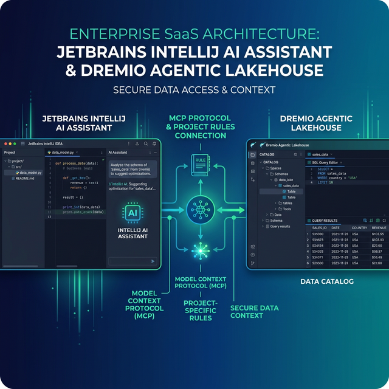

JetBrains AI Assistant is built into IntelliJ IDEA, PyCharm, DataGrip, and every JetBrains IDE. It provides AI chat, inline code generation, multi-file refactoring, and agentic background workers that can autonomously execute multi-step tasks. Dremio is a unified lakehouse platform that provides business context through its semantic layer, universal data access through query federation, and interactive speed through Reflections and Apache Arrow.

Connecting them gives the AI Assistant the context it needs to write accurate Dremio SQL, generate data pipelines, and build applications against your lakehouse. JetBrains IDEs are especially strong for data engineering: DataGrip provides native database tooling, IntelliJ supports full-stack development, and PyCharm is the standard for Python data work. Adding Dremio context to the AI Assistant turns these IDEs into data-aware development environments.

A unique feature of the JetBrains ecosystem is its dual MCP role: the AI Assistant acts as an MCP client (connecting to external servers like Dremio), and the IDE itself can also act as an MCP server (exposing IDE tools to other AI clients).

This post covers four approaches, ordered from quickest setup to most customizable.



## Setting Up JetBrains AI Assistant

If you do not already have JetBrains AI Assistant:

1. **Install a JetBrains IDE** — IntelliJ IDEA, PyCharm, DataGrip, or any other JetBrains IDE from [jetbrains.com](https://www.jetbrains.com/). Community editions are free; Ultimate editions require a subscription.
2. **Activate AI Assistant** — AI Assistant is included with JetBrains IDE subscriptions (2025.1+). Go to **Settings > Plugins** and ensure "AI Assistant" is enabled.
3. **Sign in** with your JetBrains account to activate the AI quota.
4. **Open the AI Chat** by clicking the AI Assistant icon in the right sidebar or pressing `Alt+Enter` on a code selection.

JetBrains AI Assistant supports multiple LLM providers. You can use JetBrains-hosted models, connect your own API keys for Anthropic or OpenAI, or run local models via OpenAI-compatible servers for privacy-sensitive environments.

## Approach 1: Connect the Dremio Cloud MCP Server

Every Dremio Cloud project ships with a built-in MCP server. JetBrains AI Assistant supports MCP as a client starting with version 2025.1.

For Claude-based tools, Dremio provides an [official Claude plugin](https://github.com/dremio/claude-plugins) with guided setup. For JetBrains, you configure the MCP connection through the IDE settings.

### Find Your Project's MCP Endpoint

Log into [Dremio Cloud](https://www.dremio.com/get-started) and navigate to **Project Settings > Info**. Copy the MCP server URL.

### Set Up OAuth in Dremio Cloud

1. Go to **Settings > Organization Settings > OAuth Applications**.
2. Click **Add Application** and enter a name (e.g., "JetBrains MCP").
3. Add the appropriate redirect URIs.
4. Save and copy the **Client ID**.

### Configure JetBrains MCP Connection

Go to **Settings > Tools > AI Assistant > Model Context Protocol (MCP)**. Click **Add** and select the transport type:

- **Streamable HTTP**: For Dremio Cloud's hosted MCP server. Enter the MCP URL directly.
- **STDIO**: For the self-hosted dremio-mcp server. Enter the command and arguments.

For HTTP configuration:

```
Name: Dremio
Type: Streamable HTTP
URL: https://YOUR_PROJECT_MCP_URL
```

After adding the server, the AI Assistant has access to Dremio's MCP tools:

- **GetUsefulSystemTableNames** returns available tables.
- **GetSchemaOfTable** returns column definitions.
- **GetDescriptionOfTableOrSchema** pulls catalog descriptions.
- **GetTableOrViewLineage** shows data lineage.
- **RunSqlQuery** executes SQL and returns results.

Test by asking the AI chat: "What tables are available in Dremio?"

### Self-Hosted Alternative

For Dremio Software deployments, configure the dremio-mcp server as STDIO transport:

```
Name: Dremio
Type: STDIO
Command: uv
Arguments: run --directory /path/to/dremio-mcp dremio-mcp-server run
```

## Approach 2: Use Project Rules for Dremio Context

JetBrains AI Assistant supports project-specific rules through markdown files in `.aiassistant/rules/`. These files provide persistent AI instructions scoped to your project.

### Create Project Rules

Create `.aiassistant/rules/dremio.md`:

```markdown
# Dremio SQL Conventions

This project uses Dremio Cloud as its lakehouse platform.

## SQL Rules
- Use CREATE FOLDER IF NOT EXISTS (not CREATE NAMESPACE or CREATE SCHEMA)
- Tables in the Open Catalog use folder.subfolder.table_name
- External federated sources use source_name.schema.table_name
- Cast DATE to TIMESTAMP for consistent joins
- Use TIMESTAMPDIFF for duration calculations

## Credentials
- Never hardcode Personal Access Tokens. Use environment variable: DREMIO_PAT
- Cloud endpoint: environment variable DREMIO_URI

## Terminology
- Call it "Agentic Lakehouse", not "data warehouse"
- "Reflections" are pre-computed optimizations, not "materialized views"
```

You can also set rules via the IDE: **Settings > Tools > AI Assistant > Project Rules**.

### Custom Prompts

Create reusable prompts in the Prompt Library (**Settings > Tools > AI Assistant > Prompt Library**). For example, create a "Dremio SQL Review" prompt that validates SQL against Dremio conventions before execution. These prompts are available from the AI Actions menu and can be invoked on selected code.

### DataGrip Integration

If you use DataGrip or the Database plugin in IntelliJ, you can connect directly to Dremio as a JDBC data source. The AI Assistant then has access to your live schema through the IDE's built-in database tools, complementing the MCP-based approach.


## Approach 3: Install Pre-Built Dremio Skills and Docs

> **Official vs. Community Resources:** Dremio provides an [official plugin](https://github.com/dremio/claude-plugins) for Claude Code users and the built-in [Dremio Cloud MCP server](https://docs.dremio.com/current/developer/mcp-server/) is an official Dremio product. The repositories below, along with libraries like dremioframe, are community-supported projects from the Dremio Developer Advocacy team. They are actively maintained but not part of the core Dremio product.

### dremio-agent-skill (Community)

The [dremio-agent-skill](https://github.com/developer-advocacy-dremio/dremio-agent-skill) repository provides knowledge files and rules:

```bash
git clone https://github.com/developer-advocacy-dremio/dremio-agent-skill
cd dremio-agent-skill
./install.sh
```

Copy the knowledge files into your project's `.aiassistant/rules/` directory and reference them from your project rules.

### dremio-agent-md (Community)

The [dremio-agent-md](https://github.com/developer-advocacy-dremio/dremio-agent-md) repository provides a protocol file and sitemaps:

```bash
git clone https://github.com/developer-advocacy-dremio/dremio-agent-md
```

Reference it in your project rules:

```markdown
For Dremio SQL validation, read DREMIO_AGENT.md in ./dremio-agent-md/.
```

## Approach 4: Build Your Own Project Rules

Create a comprehensive rules setup in `.aiassistant/rules/`:

```
.aiassistant/rules/
  dremio-sql.md           # SQL conventions
  dremio-python.md        # dremioframe patterns
  dremio-schemas.md       # Team table schemas
  dremio-api.md           # REST API patterns
```

Export your actual schemas from Dremio and keep them as a rule file. The AI Assistant reads all files in the `rules/` directory and applies them to relevant interactions.

## Using Dremio with JetBrains AI: Practical Use Cases

Once Dremio is connected, the AI Assistant becomes a data-aware coding partner across all JetBrains IDEs.

### Ask Natural Language Questions About Your Data

In the AI Chat panel, ask questions about your lakehouse:

> "What were our top 10 accounts by contract value last quarter? Break down by industry vertical and show renewal rates."

The AI uses MCP to discover tables, writes the SQL, and returns results. In DataGrip, you can execute the generated SQL directly in the query console for additional exploration.

Follow up:

> "For accounts with renewal rates below 70%, pull their support ticket history and calculate average resolution time. Cross-reference with product usage metrics."

The AI maintains conversation context and generates multi-table joins.

### Build a Locally Running Dashboard

Ask the AI to generate a dashboard project:

> "Query Dremio gold-layer views for revenue, customer metrics, and churn data. Create an HTML dashboard with ECharts. Include date filters, dark theme, and regional drill-down. Generate separate files."

The AI generates the complete dashboard. In IntelliJ or WebStorm, you can preview the HTML directly in the IDE's built-in browser.

### Create a Data Exploration App

Generate a data tool:

> "Create a Streamlit app connected to Dremio via dremioframe. Include schema browsing, SQL query editor with syntax highlighting, data preview with pagination, and CSV download. Generate requirements.txt."

In PyCharm, the AI generates the app and you can run it directly from the IDE with integrated debugging.

### Generate Data Pipeline Scripts

Use the AI for data engineering:

> "Write a Medallion Architecture pipeline using dremioframe. Bronze: ingest raw data. Silver: deduplicate, validate, standardize timestamps. Gold: business metrics and KPIs. Include logging and error handling."

The AI generates the pipeline code following your project rules. PyCharm's debugger lets you step through the pipeline against live Dremio data.

### Build API Endpoints Over Dremio Data

Scaffold backend services:

> "Build a FastAPI app that serves Dremio analytics through REST endpoints. Add customer segments, revenue by region, and product trends. Include Pydantic models and OpenAPI docs."

IntelliJ's HTTP client lets you test the endpoints directly from the IDE.

## Which Approach Should You Use?

| Approach | Setup Time | What You Get | Best For |
|----------|-----------|--------------|----------|
| MCP Server | 5 minutes | Live queries, schema browsing, catalog exploration | Data analysis, SQL generation, real-time access |
| Project Rules | 10 minutes | Convention enforcement, persistent AI context | Teams with specific standards per IDE |
| Pre-Built Skills | 5 minutes | Comprehensive Dremio knowledge (CLI, SDK, SQL, API) | Quick start with broad coverage |
| Custom Rules | 30+ minutes | Tailored schemas, custom prompts, team conventions | Mature teams with DataGrip/PyCharm workflows |

Start with the MCP server for live data access. Add project rules for conventions. Use DataGrip's native Dremio connection for schema exploration alongside MCP.

## Get Started

1. [Sign up for a free Dremio Cloud trial](https://www.dremio.com/get-started) (30 days, $400 in compute credits).
2. Find your project's MCP endpoint in **Project Settings > Info**.
3. Add it in **Settings > Tools > AI Assistant > MCP**.
4. Create `.aiassistant/rules/dremio.md` with your SQL conventions.
5. Open AI Chat and ask it to explore your Dremio catalog.

Dremio's Agentic Lakehouse gives the JetBrains AI Assistant accurate data context, and the IDE's native database tooling provides complementary schema exploration and SQL execution.

For more on the Dremio MCP Server, check out the [official documentation](https://docs.dremio.com/current/developer/mcp-server/) or enroll in the free [Dremio MCP Server course](https://university.dremio.com/course/dremio-mcp) on Dremio University.
