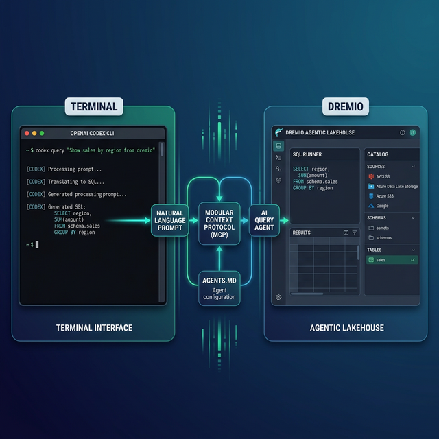

OpenAI Codex CLI is a terminal-based coding agent built in Rust. It reads your codebase, writes files, executes commands, and supports MCP for connecting to external data services. Dremio is a unified lakehouse platform that provides the business context, universal data access, and query speed that coding agents need to produce accurate, working analytics code.

Codex uses `AGENTS.md` as its primary context file. This is an open standard designed to work across multiple AI tools, so the Dremio configuration you write for Codex also works with other AGENTS.md-compatible tools. That portability matters if your team uses different agents.

Without a Dremio connection, Codex treats your lakehouse like any generic database. It may guess at table names, hallucinate SQL functions, or ignore your team's naming conventions. With a proper connection, Codex knows your schema, your business logic encoded in virtual views, and the right Dremio SQL dialect.

Codex's support for the AGENTS.md open standard is worth highlighting. Unlike tool-specific context files, AGENTS.md works across multiple AI agents. Write it once for Codex and your team members using OpenCode, OpenWork, or any other AGENTS.md-compatible tool get the same context without maintaining separate files.

This post covers four approaches, ordered from quickest setup to most customizable. Start with the one that matches your current needs, and layer in the others as your Dremio usage grows.



## Setting Up OpenAI Codex CLI

If you do not already have Codex CLI installed:

1. **Install Node.js** (version 22 or later) from [nodejs.org](https://nodejs.org/).
2. **Install Codex** globally via npm:
   ```bash
   npm install -g @openai/codex
   ```
3. **Launch Codex** by running `codex` in your terminal from any project directory.
4. **Authenticate** with your OpenAI API key. Codex uses the `OPENAI_API_KEY` environment variable.

Codex runs in your terminal and reads your project files for context. It supports three autonomy modes: `suggest` (proposes changes), `auto-edit` (applies file edits), and `full-auto` (runs commands without confirmation).

## Approach 1: Connect the Dremio Cloud MCP Server

The Model Context Protocol (MCP) is an open standard that lets AI tools call external services. Every Dremio Cloud project ships with a built-in MCP server. Codex supports MCP natively, making this the fastest way to give the agent direct access to your data.

For Claude-based tools, Dremio provides an [official Claude plugin](https://github.com/dremio/claude-plugins) with guided setup including `/dremio-setup` for step-by-step configuration. For Codex, you configure the MCP connection through your project settings:

### Find Your Project's MCP Endpoint

Log into [Dremio Cloud](https://www.dremio.com/get-started) and open your project. Navigate to **Project Settings > Info**. Copy the MCP server URL from the project overview page.

### Set Up OAuth in Dremio Cloud

Dremio's hosted MCP server uses OAuth for authentication. Your existing access controls apply to every query Codex runs.

1. Go to **Settings > Organization Settings > OAuth Applications**.
2. Click **Add Application** and name it (e.g., "Codex MCP").
3. Add the redirect URI specific to your Codex client setup.
4. Save and copy the **Client ID**.

### Configure Codex's MCP Connection

Codex reads MCP configuration from its settings. Add the Dremio server to your MCP configuration:

```json
{
  "mcpServers": {
    "dremio": {
      "url": "https://YOUR_PROJECT_MCP_URL",
      "auth": {
        "type": "oauth",
        "clientId": "YOUR_CLIENT_ID"
      }
    }
  }
}
```

After configuring, Codex can call Dremio's MCP tools directly:

- **GetUsefulSystemTableNames** lists available tables with descriptions.
- **GetSchemaOfTable** returns column names, types, and metadata.
- **GetDescriptionOfTableOrSchema** pulls wiki descriptions and labels from the catalog.
- **GetTableOrViewLineage** shows upstream data dependencies.
- **RunSqlQuery** executes SQL and returns results as JSON.

Test it by asking Codex: "What tables are available in Dremio?" The agent will call the appropriate MCP resource and return your catalog contents.

### Self-Hosted Alternative

For Dremio Software deployments, use the open-source [dremio-mcp](https://github.com/dremio/dremio-mcp) server:

```bash
git clone https://github.com/dremio/dremio-mcp
cd dremio-mcp
uv run dremio-mcp-server config create dremioai \
  --uri https://your-dremio-instance.com \
  --pat YOUR_PERSONAL_ACCESS_TOKEN
```

Then configure Codex to run the local server:

```json
{
  "mcpServers": {
    "dremio": {
      "command": "uv",
      "args": [
        "run", "--directory", "/path/to/dremio-mcp",
        "dremio-mcp-server", "run"
      ]
    }
  }
}
```

The self-hosted server supports three modes: `FOR_DATA_PATTERNS` for data exploration (default), `FOR_SELF` for system introspection, and `FOR_PROMETHEUS` for metrics correlation.

The `FOR_DATA_PATTERNS` mode is what you want for most coding workflows. It enables the agent to explore your catalog, read table schemas, pull wiki descriptions, and run SQL queries. The `FOR_SELF` mode is useful for DevOps and platform engineering tasks where you need the agent to analyze Dremio's own performance metrics, job history, and resource utilization. The `FOR_PROMETHEUS` mode connects to your monitoring stack for correlating Dremio-specific metrics with broader system observability.

For Dremio Cloud users, the hosted MCP server is the simpler choice. It requires no local installation, handles authentication through OAuth, and inherits your existing access controls. The self-hosted option gives you more control and works with Dremio Software deployments that are not in the cloud.

## Approach 2: Use AGENTS.md for Dremio Context

`AGENTS.md` is an open standard for providing AI coding agents with project context. Codex auto-scans for this file at the start of every task. It defines your project structure, coding conventions, and tool-specific instructions.

### How AGENTS.md Works in Codex

Codex supports layered guidance:

1. **Global defaults:** `~/.codex/AGENTS.md` applies to every project.
2. **Project-level:** `AGENTS.md` at the repo root overrides global defaults.
3. **Nested overrides:** `AGENTS.override.md` in subdirectories provides directory-specific rules that take precedence over broader ones.

This layering is useful for monorepos where different subdirectories interact with Dremio differently.

### Writing a Dremio-Focused AGENTS.md

Create `AGENTS.md` in your project root:

```markdown
# Project Agent Configuration

## Dremio Lakehouse

This project uses Dremio Cloud as its lakehouse platform.

### SQL Conventions
- Use `CREATE FOLDER IF NOT EXISTS` for namespace creation
- Tables in the Open Catalog: `folder.subfolder.table_name` (no catalog prefix)
- External sources: `source_name.schema.table_name`
- Cast DATE columns to TIMESTAMP for consistent joins
- Use TIMESTAMPDIFF for duration calculations

### Credentials
- Personal Access Token: use env var `DREMIO_PAT`
- Cloud endpoint: use env var `DREMIO_URI`
- Never hardcode credentials in scripts

### Documentation References
- Dremio SQL reference: https://docs.dremio.com/current/reference/sql/
- REST API: https://docs.dremio.com/current/reference/api/
- For detailed SQL validation, read ./docs/dremio-sql-reference.md

### Terminology
- Use "Agentic Lakehouse" not "data warehouse"
- "Reflections" not "materialized views"
- "Open Catalog" is built on Apache Polaris
```

You can also run `codex init` to let Codex scan your project and scaffold an initial `AGENTS.md`. Then edit it to add the Dremio-specific sections shown above.

### Nested Overrides for Multi-Schema Projects

If different directories in your project target different Dremio namespaces, use `AGENTS.override.md`:

```markdown
# data-pipeline/AGENTS.override.md

## Dremio Namespace Override
All tables in this directory use the `etl_pipeline` top-level namespace.
Bronze views: etl_pipeline.bronze.*
Silver views: etl_pipeline.silver.*
Gold views: etl_pipeline.gold.*
```

This override applies only when Codex is working on files within the `data-pipeline/` directory.

### Portability Across Tools

One key advantage of AGENTS.md over tool-specific formats: the same file works with OpenCode, OpenWork, and any future tool that adopts the standard. Write it once for Codex and your team members using other AGENTS.md-compatible tools get the same Dremio context without extra setup.

This portability is especially valuable for teams that are still evaluating which AI coding tool to standardize on. Rather than committing to CLAUDE.md (Claude-only) or SKILL.md (Antigravity-optimized), AGENTS.md gives you a tool-agnostic foundation that carries your Dremio conventions forward regardless of which agent your team picks.


## Approach 3: Install Pre-Built Dremio Skills and Docs

Two community-supported open-source repositories provide ready-made Dremio context for coding agents.

> **Official vs. Community Resources:** Dremio provides an [official plugin](https://github.com/dremio/claude-plugins) for Claude Code users and the built-in [Dremio Cloud MCP server](https://docs.dremio.com/current/developer/mcp-server/) is an official Dremio product. The repositories below, along with libraries like dremioframe, are community-supported projects from the Dremio Developer Advocacy team. They are actively maintained but not part of the core Dremio product.

### dremio-agent-skill: Full Agent Skill (Community)

The [dremio-agent-skill](https://github.com/developer-advocacy-dremio/dremio-agent-skill) repository contains a comprehensive skill directory that teaches AI assistants how to interact with Dremio. It includes knowledge files for the CLI, Python SDK (dremioframe), SQL syntax, and REST API.

For Codex, the skill's `rules/` directory includes an `AGENTS.md` file you can copy to your project root:

```bash
git clone https://github.com/developer-advocacy-dremio/dremio-agent-skill
cp dremio-agent-skill/dremio-skill/rules/AGENTS.md ./AGENTS.md
```

This gives Codex the Dremio conventions and references without running the full skill installer. For broader integration, run the installer:

```bash
cd dremio-agent-skill
./install.sh
```

Choose **Local Project Install (Copy)** to copy the skill directory into your project, or **Global Install (Symlink)** for system-wide access.

### dremio-agent-md: Documentation Protocol (Community)

The [dremio-agent-md](https://github.com/developer-advocacy-dremio/dremio-agent-md) repository provides a `DREMIO_AGENT.md` master protocol file and a browsable sitemap of the Dremio documentation.

Clone it alongside your project:

```bash
git clone https://github.com/developer-advocacy-dremio/dremio-agent-md
```

Then tell Codex to read the protocol file: "Read DREMIO_AGENT.md in the dremio-agent-md directory. Use the sitemaps in dremio_sitemaps/ to verify Dremio syntax before generating SQL."

This is especially useful for SQL validation. The agent navigates the sitemaps to find correct function signatures and reserved words instead of relying on training data.

## Approach 4: Build Your Own Dremio Agent Configuration

If the pre-built options do not match your workflow, create a custom configuration.

### Custom AGENTS.md with Knowledge Files

Create a directory structure that pairs your `AGENTS.md` with reference documents:

```
project-root/
  AGENTS.md
  docs/
    dremio-sql-reference.md
    team-schemas.md
    dremioframe-patterns.md
```

In your `AGENTS.md`, reference these files so Codex reads them when needed:

```markdown
## Reference Documentation
- For SQL syntax rules, read docs/dremio-sql-reference.md
- For team table schemas, read docs/team-schemas.md
- For Python SDK patterns, read docs/dremioframe-patterns.md
```

Populate the knowledge files with your actual table schemas exported from Dremio, team-specific SQL patterns, and dremioframe code snippets for common operations.

### Directory-Level Overrides

For monorepos, use `AGENTS.override.md` in each subdirectory to provide namespace-specific context. The parent `AGENTS.md` sets the Dremio conventions; the overrides specify which schemas and tables are relevant to each sub-project.

## Using Dremio with Codex: Practical Use Cases

Once Dremio is connected, Codex becomes a data engineering assistant in your terminal. Here are detailed examples.

### Ask Natural Language Questions About Your Data

Type a question directly in Codex and get answers from production data:

> "What were our top 5 underperforming regions last quarter? Compare to the same quarter last year and suggest which metrics to investigate."

Codex discovers your tables via MCP, writes a multi-step SQL analysis, runs it against Dremio, and returns a structured answer. You get insights from production data without opening the Dremio UI.

Follow up with deeper investigation:

> "For the worst-performing region, break down the decline by product category. Is it a demand issue or a fulfillment issue? Show return rates and delivery times alongside revenue."

Codex maintains session context and uses the AGENTS.md conventions to write correct Dremio SQL. The layered guidance system means your global Dremio rules apply automatically.

This pattern is especially powerful for engineers who live in the terminal. You can explore data, validate hypotheses, and generate insights without switching to a browser-based BI tool.

### Build a Locally Running Dashboard

Ask Codex to create a complete visualization:

> "Query Dremio's gold-layer financial views for revenue, expenses, and margins by department. Build a local HTML dashboard with D3.js charts showing trends, a summary table, and conditional formatting for over/under budget departments. Add a dark theme and filter controls."

Codex will:

1. Use MCP to discover gold-layer financial views and their schemas
2. Write and execute SQL queries for each metric
3. Generate an HTML file with D3.js interactive visualizations
4. Add conditional formatting (green/red) for budget variance
5. Include filter dropdowns for department and date range
6. Save the complete file to your project

Open it in a browser for an interactive financial dashboard. No server required. Re-run the prompt weekly with fresh data from Dremio.

### Create a Data Exploration App

Build an interactive tool for your team:

> "Create a Flask app with a REST API that proxies queries to Dremio through dremioframe. Add a React frontend with a table browser, column statistics view, and a SQL sandbox where I can run ad-hoc queries. Include authentication with API keys."

Codex scaffolds the full-stack app with:

- Flask backend with dremioframe connection pooling
- React frontend with schema browser and SQL editor
- API key middleware for access control
- `docker-compose.yml` for easy deployment
- Proper project structure with `requirements.txt` and `package.json`

This pattern lets you create internal data tools quickly without a formal development cycle.

### Generate Data Pipeline Code

Automate your ETL workflows:

> "Write a Python pipeline using dremioframe that incrementally processes new customer records. Create bronze views for raw data with TIMESTAMP casts, silver views with deduplication and email validation, and gold views with customer segmentation logic using CASE WHEN expressions. Add logging, error handling, and a summary report at the end."

Codex follows the Dremio conventions from your AGENTS.md and produces production-ready pipeline code. The AGENTS.md cross-tool portability means the same conventions apply whether you run this from Codex, OpenCode, or OpenWork.

### Build API Endpoints Over Dremio Data

Serve lakehouse data to other applications:

> "Create a FastAPI service that connects to Dremio and serves customer analytics. Add endpoints for cohort analysis, retention metrics, and revenue forecasting. Include request validation, response caching, and health checks."

Codex generates a complete API server ready for `uvicorn main:app --reload`.

## Which Approach Should You Use?

| Approach | Setup Time | What You Get | Best For |
|----------|-----------|--------------|----------|
| MCP Server | 5 minutes | Live queries, schema browsing, catalog exploration | Data analysis, SQL generation, real-time access |
| AGENTS.md | 10 minutes | Convention enforcement, doc references, portable config | Teams needing cross-tool consistency |
| Pre-Built Skills | 5 minutes | Comprehensive Dremio knowledge (CLI, SDK, SQL, API) | Quick start with broad coverage |
| Custom Config | 30+ minutes | Tailored to your schemas, patterns, and monorepo layout | Mature teams with project-specific needs |

These approaches stack. Start with the MCP server for live data access, add an `AGENTS.md` for Dremio conventions, and supplement with knowledge files as your team identifies recurring patterns. The layered guidance system in Codex (global, project, nested overrides) makes it easy to manage Dremio context at every level of your project hierarchy.

If your team uses multiple AI coding tools, invest in the AGENTS.md approach first. It gives you a single Dremio configuration that works across tools, and you can layer in MCP for live data access from whichever agent you are using at the time.

## Get Started

1. [Sign up for Dremio Cloud free for 30 days](https://www.dremio.com/get-started) ($400 in compute credits included).
2. Find your project's MCP endpoint in **Project Settings > Info**.
3. Add it to Codex's MCP configuration.
4. Clone [dremio-agent-skill](https://github.com/developer-advocacy-dremio/dremio-agent-skill) and copy the `AGENTS.md` to your project root.
5. Start Codex and ask it to explore your Dremio catalog.

Dremio's Agentic Lakehouse delivers the three things Codex needs to write accurate analytics code: the semantic layer provides business context, query federation provides universal data access, and Reflections provide interactive speed. The MCP server bridges them, and `AGENTS.md` teaches the agent your team's conventions.

For more on the Dremio MCP Server, see the [official documentation](https://docs.dremio.com/current/developer/mcp-server/) or take the free [Dremio MCP Server course](https://university.dremio.com/course/dremio-mcp) on Dremio University.
