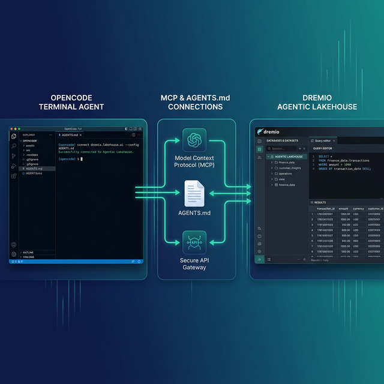

OpenCode is an open-source, terminal-based AI coding agent released under the MIT license. It provides a TUI with split panes, uses the Language Server Protocol (LSP) for deep codebase understanding, and maintains persistent project context through file-based memory. Dremio is a unified lakehouse platform built on open standards like Apache Iceberg, Apache Arrow, and Apache Polaris.

The open-source philosophy aligns. Dremio stores data in open formats with no vendor lock-in. OpenCode gives you full control over your AI coding agent with no proprietary restrictions. Connecting them means your open-source agent can query an open lakehouse, validate SQL against real schemas, and generate scripts using your team's actual conventions.

OpenCode uses the same `AGENTS.md` standard as OpenAI Codex, so the Dremio context files you write work across both tools. It also supports custom agents with dedicated prompts and model configurations, which opens up a Dremio-specific agent pattern that other tools do not offer. You can create a dedicated data analyst subagent that uses a reasoning model for SQL generation while your primary agent uses a faster model for application code.

OpenCode's LSP integration gives it another advantage. The agent analyzes imports, dependencies, and file structure at the language level. When you combine this with Dremio's MCP server, the agent understands both your code structure and your data structure simultaneously.

This post covers four approaches, ordered from quickest to most customizable.



## Setting Up OpenCode

If you do not already have OpenCode installed:

1. **Install Go** (version 1.23 or later) from [go.dev](https://go.dev/dl/).
2. **Install OpenCode**:
   ```bash
   go install github.com/opencode-ai/opencode@latest
   ```
   Or use Homebrew: `brew install opencode`.
3. **Configure your AI model** by setting the `OPENAI_API_KEY`, `ANTHROPIC_API_KEY`, or other model provider key in your environment.
4. **Launch OpenCode** by running `opencode` in your terminal from any project directory.

OpenCode provides a TUI with split panes, LSP-powered code understanding, and a multi-agent architecture that lets you define specialized subagents for different tasks. It is open-source under the MIT license.

## Approach 1: Connect the Dremio Cloud MCP Server

Every Dremio Cloud project includes a built-in MCP server. OpenCode supports MCP natively through its `opencode.json` configuration.

For Claude-based tools, Dremio provides an [official Claude plugin](https://github.com/dremio/claude-plugins) with guided setup. For OpenCode, you configure the MCP connection through `opencode.json`:

### Find Your Project's MCP Endpoint

Log into [Dremio Cloud](https://www.dremio.com/get-started) and open your project. Go to **Project Settings > Info** and copy the MCP server URL.

### Set Up OAuth in Dremio Cloud

1. Navigate to **Settings > Organization Settings > OAuth Applications**.
2. Click **Add Application** and name it (e.g., "OpenCode MCP").
3. Add the redirect URI for your setup.
4. Copy the **Client ID**.

### Configure OpenCode's MCP Connection

Add the Dremio MCP server to your `opencode.json`:

```json
{
  "mcp": {
    "dremio": {
      "url": "https://YOUR_PROJECT_MCP_URL",
      "auth": {
        "type": "oauth",
        "clientId": "YOUR_CLIENT_ID"
      }
    }
  }
}
```

For global configuration, place it in `~/.config/opencode/opencode.json`. For project-specific config, place it at the project root.

After configuring, OpenCode can call Dremio's MCP tools:

- **GetUsefulSystemTableNames** lists tables with descriptions.
- **GetSchemaOfTable** returns column names, types, and metadata.
- **GetDescriptionOfTableOrSchema** pulls wiki descriptions and labels from the catalog.
- **GetTableOrViewLineage** shows data lineage.
- **RunSqlQuery** executes SQL and returns JSON results.

### Self-Hosted Alternative

For Dremio Software, use the open-source [dremio-mcp](https://github.com/dremio/dremio-mcp) server:

```bash
git clone https://github.com/dremio/dremio-mcp
cd dremio-mcp
uv run dremio-mcp-server config create dremioai \
  --uri https://your-dremio-instance.com \
  --pat YOUR_PERSONAL_ACCESS_TOKEN
```

Then configure OpenCode to run the local server in `opencode.json`:

```json
{
  "mcp": {
    "dremio": {
      "command": "uv",
      "args": [
        "run", "--directory", "/path/to/dremio-mcp",
        "dremio-mcp-server", "run"
      ]
    }
  }
}
```

The server supports `FOR_DATA_PATTERNS` (query and explore), `FOR_SELF` (system introspection), and `FOR_PROMETHEUS` (metrics). Most coding workflows use `FOR_DATA_PATTERNS`, the default mode. It gives the agent full access to explore your catalog, read schemas, pull wiki descriptions, and run SQL queries.

If your team also handles Dremio administration, `FOR_SELF` mode lets the agent analyze job history, resource utilization, and query performance. This is useful for platform engineering tasks where you need the agent to diagnose slow queries or suggest Reflection configurations. `FOR_PROMETHEUS` connects to your monitoring stack for correlating Dremio metrics with broader system observability.

For Dremio Cloud users, the hosted MCP server is the simpler option. No local installation, OAuth-based auth, and your existing access controls apply automatically. The self-hosted server gives more control and works with on-premise Dremio Software deployments.

## Approach 2: Use AGENTS.md for Dremio Context

OpenCode shares the `AGENTS.md` standard with OpenAI Codex. It auto-scans for this file at project start and uses it to guide agent behavior.

### AGENTS.md Placement

- **Project root:** `AGENTS.md` applies to the current project.
- **Global:** `~/.config/opencode/AGENTS.md` applies across all projects.
- Project-level files override global defaults.

### Writing a Dremio-Focused AGENTS.md

```markdown
# Agent Configuration

## Dremio Lakehouse

This project uses Dremio Cloud as its lakehouse.

### SQL Conventions
- Use `CREATE FOLDER IF NOT EXISTS` for namespace creation
- Open Catalog tables: `folder.subfolder.table_name` (no catalog prefix)
- External sources: `source_name.schema.table_name`
- Cast DATE to TIMESTAMP for join consistency
- Use TIMESTAMPDIFF for duration calculations

### Credentials
- PAT: env var `DREMIO_PAT`
- Endpoint: env var `DREMIO_URI`
- Never hardcode credentials

### References
- SQL syntax: https://docs.dremio.com/current/reference/sql/
- REST API: https://docs.dremio.com/current/reference/api/
- Local SQL reference: ./docs/dremio-sql-reference.md

### Terminology
- "Agentic Lakehouse" not "data warehouse"
- "Reflections" not "materialized views"
- "Open Catalog" built on Apache Polaris
```

Run `/init` inside OpenCode to generate a starter `AGENTS.md` from a project scan, then add the Dremio sections above.

### Custom Agents for Dremio-Specific Workflows

OpenCode supports defining custom agents in `.opencode/agents/`. This is a capability that most other tools lack. You can create a dedicated Dremio agent with its own system prompt, model choice, and tool permissions.

Create `.opencode/agents/dremio-analyst.md`:

```markdown
---
description: Dremio data analyst agent
mode: subagent
---

You are a data analyst working with Dremio Cloud. Your job is to:
1. Explore available tables using the MCP connection
2. Write SQL queries that follow Dremio conventions
3. Use TIMESTAMPDIFF, not DATEDIFF
4. Use CREATE FOLDER IF NOT EXISTS, not CREATE SCHEMA
5. Always validate function names against the SQL reference before using them
6. Never hardcode credentials; use environment variables
```

This agent runs as a subagent that the primary agent can invoke for Dremio-specific tasks. You can configure it with a different model (for example, a reasoning model optimized for SQL generation) and restrict its tool access to only the Dremio MCP server.


## Approach 3: Install Pre-Built Dremio Skills and Docs

> **Official vs. Community Resources:** Dremio provides an [official plugin](https://github.com/dremio/claude-plugins) for Claude Code users and the built-in [Dremio Cloud MCP server](https://docs.dremio.com/current/developer/mcp-server/) is an official Dremio product. The repositories below, along with libraries like dremioframe, are community-supported projects from the Dremio Developer Advocacy team. They are actively maintained but not part of the core Dremio product.

### dremio-agent-skill (Community)

The [dremio-agent-skill](https://github.com/developer-advocacy-dremio/dremio-agent-skill) repository contains a complete agent skill with `SKILL.md`, knowledge files, and an `AGENTS.md` in the `rules/` directory.

For OpenCode, copy the AGENTS.md from the skill to your project:

```bash
git clone https://github.com/developer-advocacy-dremio/dremio-agent-skill
cp dremio-agent-skill/dremio-skill/rules/AGENTS.md ./AGENTS.md
```

Or run the full installer for broader integration:

```bash
cd dremio-agent-skill
./install.sh
```

The skill includes knowledge files covering Dremio CLI, Python SDK (dremioframe), SQL syntax, and REST API endpoints.

### dremio-agent-md (Community)

The [dremio-agent-md](https://github.com/developer-advocacy-dremio/dremio-agent-md) repository provides a `DREMIO_AGENT.md` protocol file and hierarchical documentation sitemaps.

Clone it and tell OpenCode to read the protocol:

```bash
git clone https://github.com/developer-advocacy-dremio/dremio-agent-md
```

Instruct OpenCode: "Read DREMIO_AGENT.md in the dremio-agent-md directory. Use the sitemaps to verify SQL syntax before generating code."

This is especially powerful with OpenCode's LSP-based context engine. The agent can cross-reference the Dremio sitemaps with your actual project imports and file structure, ensuring that the SQL it generates fits both the Dremio dialect and your project conventions.

## Approach 4: Build a Custom Dremio Agent

OpenCode's custom agent system is its differentiator for Dremio integration. While other tools limit you to context files, OpenCode lets you define a purpose-built Dremio agent.

### Multi-Agent Architecture

Create a primary coding agent plus a Dremio-focused subagent:

```
.opencode/agents/
  dremio-analyst.md       # Subagent for SQL and data queries
  dremio-pipeline.md      # Subagent for ETL/pipeline scripts
```

Each agent gets its own system prompt, model configuration, and tool permissions. The primary agent delegates Dremio tasks to the appropriate subagent, which has the full Dremio context loaded while keeping the primary agent's context window focused on application code.

This separation matters for large projects. A data pipeline subagent can be configured with a reasoning-capable model (like a Chain of Thought model) that excels at complex SQL generation, while your primary coding agent uses a faster model for application logic. The Dremio subagent's tool permissions can be restricted to only the Dremio MCP server, preventing it from accidentally modifying application files.

### Knowledge Files

Pair your custom agents with reference documentation:

```
docs/
  dremio-sql-reference.md
  team-schemas.md
  dremioframe-patterns.md
```

Reference these in both your `AGENTS.md` and your custom agent prompts. OpenCode's file-based memory system ensures the agent retains context from these references across interactions. Export your actual table schemas from Dremio's catalog and save them as markdown. Include dremioframe code snippets for common operations like querying, creating views, and managing branches. Add REST API call patterns for your CI/CD pipelines.

## Using Dremio with OpenCode: Practical Use Cases

Once Dremio is connected, OpenCode's multi-agent architecture enables sophisticated data workflows. Here are detailed examples.

### Ask Natural Language Questions About Your Data

Type a question in OpenCode's TUI and get answers from your lakehouse:

> "Which product categories have the highest return rates? Cross-reference with customer satisfaction scores and identify correlations."

OpenCode routes this to the Dremio subagent, which discovers the relevant tables via MCP, writes a multi-table join with aggregations, runs it against Dremio, and returns analysis with the underlying SQL. The primary agent stays focused on your code context while the Dremio subagent handles the data work.

Dig deeper with follow-up analysis:

> "For the categories with highest returns, pull the top reasons from the returns table. Group by product SKU and show which specific items are driving the category-level numbers."

The Dremio subagent already knows the schema context from the previous query and generates the follow-up efficiently.

### Build a Locally Running Dashboard

Ask OpenCode to create a visualization:

> "Query Dremio's gold-layer views for inventory levels, reorder rates, and supplier lead times. Build a local HTML dashboard with ECharts showing stock trends, a forecasting chart, and supplier performance scorecards. Include a responsive layout and dark theme."

OpenCode's multi-agent system handles this: the Dremio subagent writes and executes the SQL queries, while the primary agent generates the HTML/CSS/JavaScript:

1. Dremio subagent discovers inventory views and pulls data
2. Primary agent generates the HTML structure with ECharts
3. Data is embedded as JSON in the generated file
4. Interactive filters for warehouse, category, and date range
5. Responsive layout that works on desktop and tablet

Open it in a browser for an interactive supply chain dashboard running from a local file.

### Create a Data Exploration App

Build a full application leveraging the multi-agent architecture:

> "Create a Python Dash app that uses dremioframe to connect to Dremio. Include a catalog browser, table schema viewer with column statistics, and a multi-tab interface for SQL queries, data profiling, and anomaly detection. Add a connection settings page."

OpenCode delegates the work: the Dremio subagent writes the dremioframe connection code and SQL queries, while the primary agent builds the Dash UI components and layout:

- Multi-tab interface with catalog browser, schema viewer, SQL editor, and profiler
- Column statistics calculated from Dremio metadata
- Anomaly detection using basic IQR analysis on numeric columns
- Connection settings stored in `.env` with a settings page for updates

Run `python app.py` and your team has a local data platform connected to the lakehouse.

### Generate Pipeline Scripts with Agent Collaboration

Automate data engineering with Dremio-aware code:

> "Using the Dremio skill, create a Python ETL pipeline that processes IoT sensor data. Create bronze tables for raw readings, silver views that apply calibration offsets and flag anomalies (readings outside 3 standard deviations), and gold views that aggregate by device and time window. Include retry logic and structured logging."

The Dremio subagent writes the pipeline code using correct Dremio SQL conventions and bronze-silver-gold patterns, while the primary agent handles file management, error handling, and test generation. The result is production-quality code with proper separation of concerns.

### Build API Endpoints Over Dremio Data

Serve lakehouse data to downstream applications:

> "Build a FastAPI service with endpoints for IoT device metrics, alert summaries, and historical trends. Connect to Dremio using dremioframe. Add WebSocket support for real-time data streaming and Pydantic response models."

OpenCode generates the full API server with the Dremio subagent handling query logic and the primary agent building the FastAPI framework.

## Which Approach Should You Use?

| Approach | Setup Time | What You Get | Best For |
|----------|-----------|--------------|----------|
| MCP Server | 5 minutes | Live queries, schema browsing, catalog | Data analysis, real-time access |
| AGENTS.md | 10 minutes | Convention enforcement, portable config | Cross-tool consistency |
| Pre-Built Skills | 5 minutes | Broad Dremio knowledge | Quick start |
| Custom Agent | 30+ minutes | Dedicated Dremio subagent with own model/prompt | Advanced multi-agent workflows |

OpenCode's custom agent system makes the fourth approach more powerful than in other tools. A dedicated Dremio subagent with its own reasoning model and restricted tool access produces higher-quality SQL than a general-purpose agent trying to handle both application code and data queries in the same context.

Combine the MCP server for live data access with a custom Dremio agent for SQL generation, and an `AGENTS.md` for project-wide conventions. This three-layer stack gives you the strongest Dremio integration available in any open-source coding tool.

If you are coming from Claude Code or Codex and want an open-source alternative, start with the AGENTS.md approach since your existing file works directly in OpenCode. Add the MCP connection for live data, then explore custom agents to see if the multi-agent architecture improves your workflow.

## Get Started

1. [Sign up for Dremio Cloud free for 30 days](https://www.dremio.com/get-started) ($400 in compute credits).
2. Find your project's MCP endpoint in **Project Settings > Info**.
3. Add it to your `opencode.json`.
4. Clone [dremio-agent-skill](https://github.com/developer-advocacy-dremio/dremio-agent-skill) and copy the AGENTS.md.
5. Start OpenCode and ask it to explore your Dremio catalog.

Dremio's Agentic Lakehouse provides what OpenCode's agents need for accurate analytics: the semantic layer delivers business context, query federation delivers universal data access, and Reflections deliver interactive speed. Both platforms are built on open standards, and connecting them gives you an open-source analytics stack from agent to lakehouse.

For more on the Dremio MCP Server, see the [official documentation](https://docs.dremio.com/current/developer/mcp-server/) or take the free [Dremio MCP Server course](https://university.dremio.com/course/dremio-mcp) on Dremio University.
