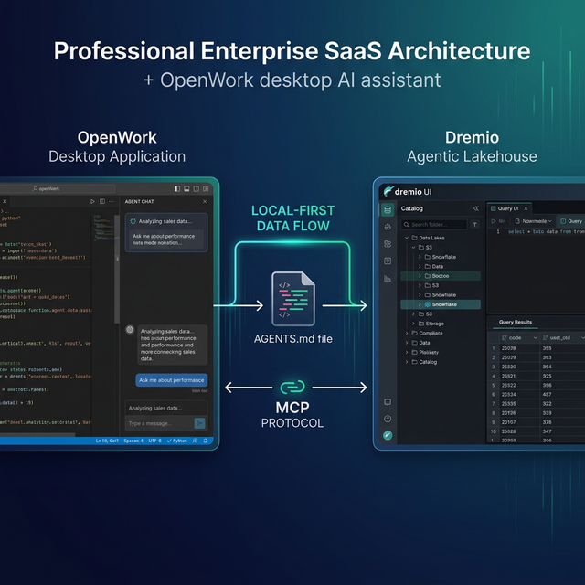

OpenWork is an open-source desktop AI agent built on the OpenCode engine. It runs entirely on your machine with your own API keys, giving you full control over your data and your AI costs. Dremio is a unified lakehouse platform built on open standards like Apache Iceberg, Apache Arrow, and Apache Polaris.

Both tools share a local-first philosophy. Dremio stores data in open formats with no vendor lock-in. OpenWork runs on your hardware with no cloud dependency for the agent itself. Connecting them creates an open-source analytics stack where your coding agent queries your lakehouse without sending data through third-party services.

OpenWork inherits OpenCode's `AGENTS.md` support, `opencode.json` configuration, and MCP integration. If you have already written Dremio context files for OpenCode or OpenAI Codex, they work in OpenWork without modification. The desktop application adds a graphical interface, integrated file browser, and agent chat panel on top of the terminal experience.

The local-first model has specific advantages for data work. Your Dremio queries and results stay on your machine. Your API keys are stored locally. The agent code runs in your environment. For teams that handle sensitive data or operate under compliance constraints, this architecture keeps the AI agent within your security perimeter.

This post covers four approaches, from a five-minute MCP connection to a fully custom Dremio configuration.



## Setting Up OpenWork

If you do not already have OpenWork installed:

1. **Download OpenWork** from [openwork.software](https://openwork.software) (available for macOS, Linux, and Windows).
2. **Install it** by following the platform-specific instructions.
3. **Configure your AI model** by adding your API key (OpenAI, Anthropic, or another supported provider) in the application settings.
4. **Open a project** by selecting your project directory in the OpenWork file browser.

OpenWork is built on the OpenCode engine but provides a desktop GUI with an integrated file browser, agent chat panel, and visual output display. It runs entirely on your machine with your own API keys, giving you full control over costs and data privacy.

## Approach 1: Connect the Dremio Cloud MCP Server

Every Dremio Cloud project includes a built-in MCP server. OpenWork supports MCP through its inherited `opencode.json` configuration.

For Claude-based tools, Dremio provides an [official Claude plugin](https://github.com/dremio/claude-plugins) with guided setup. For OpenWork, you configure the MCP connection through `opencode.json`:

### Find Your MCP Endpoint and Set Up OAuth

1. Log into [Dremio Cloud](https://www.dremio.com/get-started) and find your MCP URL under **Project Settings > Info**.
2. Go to **Settings > Organization Settings > OAuth Applications**.
3. Create a new application with an appropriate redirect URI.
4. Copy the **Client ID**.

### Configure OpenWork's MCP Connection

Add the Dremio server to your `opencode.json`:

```json
{
  "mcp": {
    "dremio": {
      "url": "https://YOUR_PROJECT_MCP_URL",
      "auth": {
        "type": "oauth",
        "clientId": "YOUR_CLIENT_ID"
      }
    }
  }
}
```

Place this at your project root or globally at `~/.config/opencode/opencode.json`. After configuration, OpenWork can call Dremio's MCP tools:

- **GetUsefulSystemTableNames** returns available tables with descriptions.
- **GetSchemaOfTable** returns column details and metadata.
- **GetDescriptionOfTableOrSchema** pulls wiki descriptions from the catalog.
- **RunSqlQuery** executes SQL and returns JSON results.

### Self-Hosted MCP

For Dremio Software deployments, use the open-source [dremio-mcp](https://github.com/dremio/dremio-mcp) server:

```bash
git clone https://github.com/dremio/dremio-mcp
cd dremio-mcp
uv run dremio-mcp-server config create dremioai \
  --uri https://your-dremio-instance.com \
  --pat YOUR_PERSONAL_ACCESS_TOKEN
```

Configure OpenWork to run the local server:

```json
{
  "mcp": {
    "dremio": {
      "command": "uv",
      "args": [
        "run", "--directory", "/path/to/dremio-mcp",
        "dremio-mcp-server", "run"
      ]
    }
  }
}
```

The server supports three modes: `FOR_DATA_PATTERNS` (data exploration, default), `FOR_SELF` (system introspection for diagnosing performance), and `FOR_PROMETHEUS` (metrics correlation). The local-first nature of OpenWork pairs well with the self-hosted MCP option, as both components run entirely on your infrastructure.

## Approach 2: Use AGENTS.md for Dremio Context

OpenWork inherits `AGENTS.md` support from OpenCode. The same file works in OpenWork, OpenCode, and OpenAI Codex.

### Writing a Dremio-Focused AGENTS.md

Create `AGENTS.md` in your project root:

```markdown
# Agent Configuration

## Dremio Lakehouse

This project uses Dremio Cloud as its lakehouse.

### SQL Conventions
- Use `CREATE FOLDER IF NOT EXISTS` (not CREATE NAMESPACE)
- Open Catalog tables: `folder.subfolder.table_name` (no catalog prefix)
- External sources: `source_name.schema.table_name`
- Cast DATE to TIMESTAMP for join consistency
- Use TIMESTAMPDIFF for duration calculations

### Credentials
- PAT: env var `DREMIO_PAT`
- Endpoint: env var `DREMIO_URI`
- Never hardcode credentials

### References
- SQL reference: https://docs.dremio.com/current/reference/sql/
- REST API: https://docs.dremio.com/current/reference/api/
- Local SQL docs: ./docs/dremio-sql-reference.md

### Terminology
- "Agentic Lakehouse" not "data warehouse"
- "Reflections" not "materialized views"
- "Open Catalog" built on Apache Polaris
```

OpenWork auto-scans this file at project start. Global defaults go in `~/.config/opencode/AGENTS.md` and project-level files override them.

### Cross-Tool Portability

The AGENTS.md you write for OpenWork works identically in OpenCode and OpenAI Codex. If your team uses multiple tools, you maintain one Dremio configuration file instead of separate context files for each tool.


## Approach 3: Install Pre-Built Dremio Skills and Docs

> **Official vs. Community Resources:** Dremio provides an [official plugin](https://github.com/dremio/claude-plugins) for Claude Code users and the built-in [Dremio Cloud MCP server](https://docs.dremio.com/current/developer/mcp-server/) is an official Dremio product. The repositories below, along with libraries like dremioframe, are community-supported projects from the Dremio Developer Advocacy team. They are actively maintained but not part of the core Dremio product.

### dremio-agent-skill (Community)

The [dremio-agent-skill](https://github.com/developer-advocacy-dremio/dremio-agent-skill) repository provides a complete skill directory with `SKILL.md`, knowledge files (CLI, Python SDK, SQL, REST API), and `AGENTS.md` in the `rules/` directory.

For OpenWork, copy the AGENTS.md:

```bash
git clone https://github.com/developer-advocacy-dremio/dremio-agent-skill
cp dremio-agent-skill/dremio-skill/rules/AGENTS.md ./AGENTS.md
```

Or run the full installer for broader integration:

```bash
cd dremio-agent-skill && ./install.sh
```

### dremio-agent-md (Community)

The [dremio-agent-md](https://github.com/developer-advocacy-dremio/dremio-agent-md) repository provides `DREMIO_AGENT.md` and documentation sitemaps. Clone it alongside your project:

```bash
git clone https://github.com/developer-advocacy-dremio/dremio-agent-md
```

Tell OpenWork: "Read DREMIO_AGENT.md in the dremio-agent-md directory and use the sitemaps to validate SQL." OpenWork's desktop interface makes it easy to have the agent-md folder open in the file browser while working on your project.

## Approach 4: Build a Custom Dremio Configuration

### Custom AGENTS.md with Knowledge Files

Create a project structure with reference docs:

```
project-root/
  AGENTS.md
  docs/
    dremio-sql-reference.md
    team-schemas.md
    dremioframe-patterns.md
```

Reference the docs in your AGENTS.md so OpenWork reads them on demand. Populate with your actual table schemas exported from Dremio, team-specific SQL patterns, and dremioframe code snippets.

### Custom Agents

OpenWork inherits OpenCode's custom agent system. Create dedicated Dremio agents in `.opencode/agents/`:

```markdown
# .opencode/agents/dremio-analyst.md
---
description: Dremio data analyst agent
mode: subagent
---

You are a data analyst working with Dremio Cloud.
1. Use the MCP connection to explore tables
2. Follow Dremio SQL conventions (CREATE FOLDER IF NOT EXISTS, etc.)
3. Validate function names against the SQL reference
4. Never hardcode credentials
```

This subagent uses a separate model and context window dedicated to Dremio tasks, producing higher-quality SQL than a general-purpose agent.

## Using Dremio with OpenWork: Practical Use Cases

Once Dremio is connected, OpenWork can generate complete data applications. Here are detailed examples.

### Ask Natural Language Questions About Your Data

Type a question in the OpenWork chat panel and get answers from your lakehouse:

> "What is the average order value by customer segment for Q4? Which segment grew the fastest compared to Q3?"

OpenWork queries Dremio through MCP, computes the comparison, and returns a formatted answer with the SQL it ran. This turns your desktop agent into a local, private data analyst that works with production data.

Follow up with deeper analysis:

> "For the fastest-growing segment, show the top 10 customers by order frequency. Are they new customers or returning? Pull their first order date and total lifetime value."

OpenWork maintains context from the previous question and writes progressively more complex queries. Because everything runs locally, your data never leaves your machine.

This pattern is especially powerful for teams with data sovereignty requirements. The AI model processes your prompt, but the data stays on your infrastructure.

### Build a Locally Running Dashboard

Ask OpenWork to create a self-contained dashboard:

> "Query our gold-layer views in Dremio for monthly revenue, active users, and churn rate over the last 12 months. Build an HTML dashboard with Plotly.js charts. Include filters for region and product line. Add a dark theme and export-to-PNG buttons."

OpenWork will:

1. Use MCP to discover gold-layer views and their schemas
2. Write and execute SQL queries for each metric
3. Generate an HTML file with Plotly.js interactive charts
4. Add dropdown filters for region and product line
5. Include export functionality and responsive layout
6. Save everything to your project folder

Open it in a browser for a fully interactive dashboard running from a local file. No server required. The Plotly.js charts support zoom, pan, and hover tooltips.

### Create a Data Exploration App

Build a more sophisticated tool:

> "Create a Streamlit app that connects to Dremio using dremioframe. Add a sidebar for selecting schemas and tables, a schema viewer, a data preview with pagination, a custom SQL query editor with results displayed as a table, and CSV download buttons."

OpenWork writes the full Python application:

- `app.py` with Streamlit layout, dremioframe connection, and query execution
- `requirements.txt` with pinned dependencies
- `.env.example` with required environment variables
- `README.md` with setup instructions

Run `streamlit run app.py` and you have a local data exploration tool connected to your lakehouse. Since both OpenWork and the app run on your machine, your data never leaves your infrastructure.

### Generate Data Pipeline Scripts

Automate your ETL workflows:

> "Write a Python script using dremioframe that reads raw CSV data from S3, creates a bronze table in Dremio, builds silver views with data quality rules (null checks, type validation, deduplication), and creates a gold view with business logic aggregations. Include error handling, logging, and a dry-run mode."

OpenWork uses the Dremio skill knowledge to write pipeline code that follows your team's Medallion Architecture conventions. The script includes structured logging, retry logic, and a summary report at the end.

### Build API Endpoints Over Dremio Data

Serve lakehouse data to other applications:

> "Build a FastAPI application that connects to Dremio using dremioframe. Create endpoints for device metrics, alert summaries, and historical trends. Include request validation, response caching with a 5-minute TTL, and auto-generated API docs."

OpenWork generates the complete server with proper error handling and connection management. Run `uvicorn main:app --reload` for a local API connected to your lakehouse.

## Which Approach Should You Use?

| Approach | Setup Time | What You Get | Best For |
|----------|-----------|--------------|----------|
| MCP Server | 5 minutes | Live queries, schema browsing, catalog | NL data exploration, building apps |
| AGENTS.md | 10 minutes | Convention enforcement, cross-tool portable | Multi-tool teams |
| Pre-Built Skills | 5 minutes | Broad Dremio knowledge | Quick start |
| Custom Config | 30+ minutes | Tailored agents, schemas, patterns | Advanced multi-agent workflows |

OpenWork's advantage is the local-first model. Your agent, your API keys, your data connections all run on your machine. Combined with Dremio's open lakehouse formats, you get a fully controlled analytics stack.

Start with the MCP server for immediate access to your data. Layer in AGENTS.md for conventions and custom agents for specialized Dremio workflows. If your team already uses OpenCode or Codex, your existing AGENTS.md and MCP configuration work in OpenWork immediately.

The local-first model means you can evaluate OpenWork with Dremio without any organizational approval process. Install it on your machine, connect it to your Dremio Cloud project, and start querying. If it works for you, share the `AGENTS.md` and `opencode.json` files with your team so they can replicate the same setup on their machines.

## Get Started

1. [Sign up for Dremio Cloud free for 30 days](https://www.dremio.com/get-started) ($400 in compute credits).
2. Find your project's MCP endpoint in **Project Settings > Info**.
3. Add it to your `opencode.json`.
4. Clone [dremio-agent-skill](https://github.com/developer-advocacy-dremio/dremio-agent-skill) and copy the AGENTS.md.
5. Ask OpenWork to explore your catalog and build a local dashboard from your data.

Dremio's Agentic Lakehouse provides what OpenWork needs: the semantic layer for business context, query federation for universal data access, and Reflections for interactive speed. Both platforms embrace open standards and local-first operation, making them a natural fit for teams that prioritize data sovereignty and transparency.

For more on the Dremio MCP Server, see the [official documentation](https://docs.dremio.com/current/developer/mcp-server/) or enroll in the free [Dremio MCP Server course](https://university.dremio.com/course/dremio-mcp) on Dremio University.
