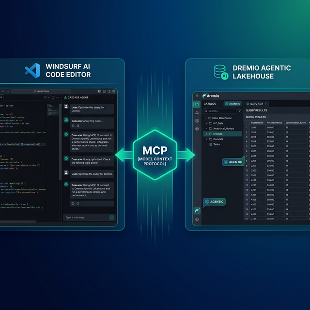

Windsurf is an AI-native code editor built as a fork of VS Code. Its standout feature is Cascade, an agentic AI system that plans and executes multi-step coding tasks autonomously. Cascade understands your entire codebase, can chain together multiple file edits, terminal commands, and tool calls in a single flow. Dremio is a unified lakehouse platform that provides business context through its semantic layer, universal data access through query federation, and interactive speed through Reflections and Apache Arrow.

Connecting them gives Cascade the context it needs to write accurate Dremio SQL, generate data pipelines, and build applications against your lakehouse. Without this connection, Cascade treats Dremio like a generic database. With it, the agent knows your schemas, business logic encoded in views, and the correct Dremio SQL dialect.

Windsurf's Cascade is especially well-suited for data projects because it can chain together discovery, querying, code generation, and testing in a single autonomous flow. Ask it to explore your Dremio catalog, identify relevant tables, write a pipeline, and generate tests — all in one prompt.

This post covers four approaches, ordered from quickest setup to most customizable.



## Setting Up Windsurf

If you do not already have Windsurf installed:

1. **Download Windsurf** from [windsurf.com](https://windsurf.com/) (available for macOS, Linux, and Windows).
2. **Install it** by running the installer. Windsurf is a VS Code fork, so all VS Code extensions and themes work.
3. **Sign in** with a Windsurf account. The free tier includes limited Cascade credits; Pro provides expanded access.
4. **Open a project** by selecting File > Open Folder and pointing to your project directory.
5. **Open Cascade** by pressing `Cmd+L` (macOS) or `Ctrl+L` to access the agentic AI chat panel.

If you are migrating from VS Code or Cursor, your existing extensions and settings transfer automatically.

## Approach 1: Connect the Dremio Cloud MCP Server

The Model Context Protocol (MCP) is an open standard that lets AI tools call external services. Every Dremio Cloud project ships with a built-in MCP server. Windsurf supports MCP natively through its Cascade settings.

For Claude-based tools, Dremio provides an [official Claude plugin](https://github.com/dremio/claude-plugins) with guided setup. For Windsurf, you configure the MCP connection through the Cascade settings or `mcp_config.json`.

### Find Your Project's MCP Endpoint

Log into [Dremio Cloud](https://www.dremio.com/get-started) and open your project. Navigate to **Project Settings > Info**. The MCP server URL is listed on the project overview page. Copy it.

### Set Up OAuth in Dremio Cloud

1. Go to **Settings > Organization Settings > OAuth Applications**.
2. Click **Add Application** and enter a name (e.g., "Windsurf MCP").
3. Add the appropriate redirect URIs.
4. Save and copy the **Client ID**.

### Configure Windsurf's MCP Connection

You have two options:

**Option A: Via Settings UI**

Open Windsurf Settings and navigate to **Cascade > MCP**. Click **Add custom server** and paste your Dremio MCP configuration.

**Option B: Via mcp_config.json**

Create or edit `~/.codeium/windsurf/mcp_config.json`:

```json
{
  "mcpServers": {
    "dremio": {
      "url": "https://YOUR_PROJECT_MCP_URL"
    }
  }
}
```

Restart Windsurf. Cascade now has access to Dremio's MCP tools:

- **GetUsefulSystemTableNames** returns available tables with descriptions.
- **GetSchemaOfTable** returns column names, types, and metadata.
- **GetDescriptionOfTableOrSchema** pulls wiki descriptions from the catalog.
- **GetTableOrViewLineage** shows upstream dependencies.
- **RunSqlQuery** executes SQL and returns results as JSON.

Test the connection by opening Cascade and asking: "What tables are available in Dremio?" Cascade will call `GetUsefulSystemTableNames` and return your catalog contents.

### Self-Hosted Alternative

For Dremio Software deployments, use the open-source [dremio-mcp](https://github.com/dremio/dremio-mcp) server:

```bash
git clone https://github.com/dremio/dremio-mcp
cd dremio-mcp
uv run dremio-mcp-server config create dremioai \
  --uri https://your-dremio-instance.com \
  --pat YOUR_PERSONAL_ACCESS_TOKEN
```

In `mcp_config.json`:

```json
{
  "mcpServers": {
    "dremio": {
      "command": "uv",
      "args": [
        "run", "--directory", "/path/to/dremio-mcp",
        "dremio-mcp-server", "run"
      ]
    }
  }
}
```

## Approach 2: Use Windsurf Rules for Dremio Context

Windsurf supports `.windsurfrules` files in your project root for persistent AI instructions. These work similarly to `.cursorrules` and are loaded into every Cascade interaction.

### Project-Wide Rules

Create a `.windsurfrules` file in your project root:

```markdown
# Dremio SQL Conventions
- Use CREATE FOLDER IF NOT EXISTS (not CREATE NAMESPACE or CREATE SCHEMA)
- Tables in the Open Catalog use folder.subfolder.table_name without a catalog prefix
- External federated sources use source_name.schema.table_name
- Cast DATE to TIMESTAMP for consistent joins
- Use TIMESTAMPDIFF for duration calculations

# Credentials
- Never hardcode Personal Access Tokens. Use environment variable: DREMIO_PAT
- Dremio Cloud endpoint: environment variable DREMIO_URI

# Terminology
- Call it "Agentic Lakehouse", not "data warehouse"
- "Reflections" are pre-computed optimizations, not "materialized views"
```

Windsurf also reads `.cursorrules` as a fallback if no `.windsurfrules` file is present, so if your team uses Cursor alongside Windsurf, shared rules files work across both editors.

### Cascade Memory and Context

Cascade has a persistent memory system. As you work with Dremio tables, Cascade remembers the schemas, query patterns, and conventions it has encountered. This means subsequent requests in the same project get more accurate over time without needing to re-read context files.


## Approach 3: Install Pre-Built Dremio Skills and Docs

> **Official vs. Community Resources:** Dremio provides an [official plugin](https://github.com/dremio/claude-plugins) for Claude Code users and the built-in [Dremio Cloud MCP server](https://docs.dremio.com/current/developer/mcp-server/) is an official Dremio product. The repositories below, along with libraries like dremioframe, are community-supported projects from the Dremio Developer Advocacy team. They are actively maintained but not part of the core Dremio product.

### dremio-agent-skill (Community)

The [dremio-agent-skill](https://github.com/developer-advocacy-dremio/dremio-agent-skill) repository contains a comprehensive skill directory with knowledge files and a `.cursorrules` file that Windsurf reads as a fallback.

```bash
git clone https://github.com/developer-advocacy-dremio/dremio-agent-skill
cd dremio-agent-skill
./install.sh
```

Choose **Local Project Install (Copy)** to copy the `.cursorrules` file and knowledge directory into your project. Windsurf will pick up the rules file automatically.

### dremio-agent-md (Community)

The [dremio-agent-md](https://github.com/developer-advocacy-dremio/dremio-agent-md) repository provides a master protocol file and browsable documentation sitemaps:

```bash
git clone https://github.com/developer-advocacy-dremio/dremio-agent-md
```

Reference it in your `.windsurfrules`:

```markdown
For Dremio SQL validation, read DREMIO_AGENT.md in the dremio-agent-md directory.
Use the sitemaps in dremio_sitemaps/ to verify syntax before generating SQL.
```

## Approach 4: Build Your Own Windsurf Rules

Create a custom `.windsurfrules` with your team's specific Dremio environment:

```markdown
# Team Dremio Context

## Table Schemas (updated weekly)
- For table schemas, read ./docs/table-schemas.md
- For SQL conventions, read ./docs/dremio-conventions.md
- For common queries, read ./docs/common-queries.md

## Naming Standards
- Bronze: raw.*, Silver: cleaned.*, Gold: analytics.*
- Always use TIMESTAMP, never DATE
- Validate function names against docs/dremio-conventions.md
```

Export your actual schemas from Dremio and keep them updated. Cascade's memory system means it learns your patterns over time, but explicit rules ensure consistency from the first interaction.

## Using Dremio with Windsurf: Practical Use Cases

Once Dremio is connected, Cascade can execute complex multi-step data projects autonomously. Here are detailed examples.

### Ask Natural Language Questions About Your Data

Open Cascade and ask questions in plain English:

> "What were our top 10 products by revenue last quarter? Break it down by region and show the growth rate compared to the previous quarter."

Cascade uses MCP to discover your tables, writes the SQL, runs it against Dremio, and returns formatted results. Its multi-step nature means it can chain multiple queries together autonomously.

Follow up immediately:

> "For products with declining growth, pull the customer reviews and support tickets. Is there a pattern between product issues and revenue decline?"

Cascade maintains full context and chains together cross-table queries without prompting. This turns the editor into a data analysis workstation.

### Build a Locally Running Dashboard

Use Cascade for multi-step project generation:

> "Query our gold-layer sales views in Dremio and build a local HTML dashboard with Chart.js. Include monthly revenue trends, top products by region, and customer metrics. Add date range filters, a dark theme, and export buttons. Create separate HTML, CSS, and JavaScript files."

Cascade will autonomously:

1. Call MCP to discover gold-layer views and schemas
2. Write and execute SQL queries for each metric
3. Create `index.html` with the dashboard layout
4. Create `styles.css` with dark theme and responsive design
5. Create `dashboard.js` with Chart.js configurations
6. Wire everything together and save to your project

Open `index.html` in a browser for a complete interactive dashboard. Cascade's agentic flow handles the entire process without manual intervention.

### Create a Data Exploration App

Build interactive tools in one prompt:

> "Create a Streamlit app connected to Dremio via dremioframe. Include a schema browser with table previews, a SQL editor with syntax highlighting, CSV download, and charting for numeric columns. Generate all the files including requirements.txt and a README."

Cascade generates the full application stack and wires the components together. Run `streamlit run app.py` for a local data explorer.

### Generate Data Pipeline Scripts

Automate data engineering:

> "Write a Medallion Architecture pipeline using dremioframe. Bronze: ingest raw events from S3. Silver: deduplicate, validate required fields, cast timestamps. Gold: aggregate daily metrics and build customer lifetime value calculations. Include structured logging, retry logic, and dry-run mode."

Cascade writes the pipeline code, creates test files, and can execute a dry run to verify the logic against your live Dremio instance.

### Build API Endpoints Over Dremio Data

Create backend services:

> "Build a FastAPI app that queries Dremio gold-layer views via dremioframe. Add endpoints for customer segments, revenue analytics, and cohort retention. Include Pydantic models, caching, and OpenAPI docs."

Cascade generates the complete API project. Run `uvicorn main:app --reload` for a local API connected to your lakehouse.

## Which Approach Should You Use?

| Approach | Setup Time | What You Get | Best For |
|----------|-----------|--------------|----------|
| MCP Server | 5 minutes | Live queries, schema browsing, catalog exploration | Data analysis, SQL generation, real-time access |
| Windsurf Rules | 10 minutes | Convention enforcement, persistent AI instructions | Teams with specific SQL standards |
| Pre-Built Skills | 5 minutes | Comprehensive Dremio knowledge (CLI, SDK, SQL, API) | Quick start with broad coverage |
| Custom Rules | 30+ minutes | Tailored schemas, patterns, and team conventions | Mature teams with project-specific needs |

Start with the MCP server for immediate value. Add a `.windsurfrules` file for Dremio conventions. Let Cascade's memory build on your patterns over time.

## Get Started

1. [Sign up for a free Dremio Cloud trial](https://www.dremio.com/get-started) (30 days, $400 in compute credits).
2. Find your project's MCP endpoint in **Project Settings > Info**.
3. Add it in Windsurf's **Cascade > MCP** settings or `mcp_config.json`.
4. Clone [dremio-agent-skill](https://github.com/developer-advocacy-dremio/dremio-agent-skill) and run `./install.sh`.
5. Open Cascade and ask it to explore your Dremio catalog.

Dremio's Agentic Lakehouse gives Cascade accurate data context, and Cascade's multi-step autonomous flows turn that context into complete data projects.

For more on the Dremio MCP Server, check out the [official documentation](https://docs.dremio.com/current/developer/mcp-server/) or enroll in the free [Dremio MCP Server course](https://university.dremio.com/course/dremio-mcp) on Dremio University.
