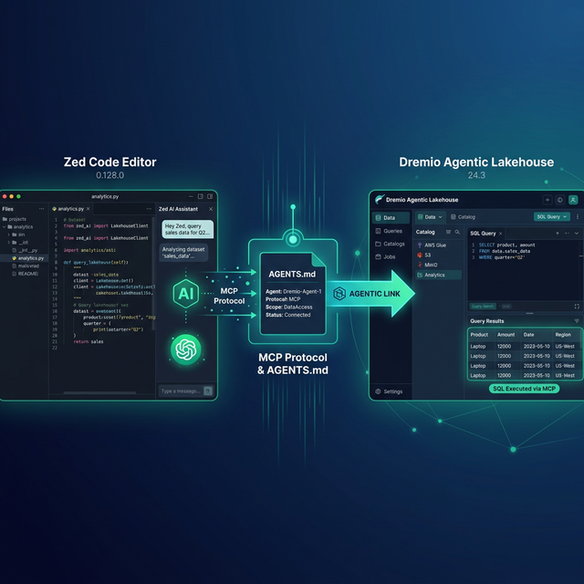

Zed is an open-source, GPU-accelerated code editor written in Rust. It is designed for speed and collaboration, with a built-in AI assistant that supports multiple LLM providers and an agent mode for autonomous multi-step development. Dremio is a unified lakehouse platform that provides business context through its semantic layer, universal data access through query federation, and interactive speed through Reflections and Apache Arrow.

Connecting them gives Zed's AI agent the context it needs to write accurate Dremio SQL, generate data pipelines, and build applications against your lakehouse. Zed's performance advantage is significant for data work: its GPU-accelerated rendering handles large result sets and complex code without the lag common in Electron-based editors.

Zed supports MCP through its settings, uses `AGENTS.md` as its primary context file, and provides agent profiles for scoping tool access to specific workflows.

This post covers four approaches, ordered from quickest setup to most customizable.



## Setting Up Zed

If you do not already have Zed installed:

1. **Download Zed** from [zed.dev](https://zed.dev/) (available for macOS and Linux).
2. **Install it** by running the installer or using Homebrew: `brew install zed`.
3. **Configure your AI model** in **Settings > AI**. Zed supports its own hosted models, Anthropic, OpenAI, Google, and Ollama for local models.
4. **Open a project** by launching Zed and opening your project directory.

Zed is free and open-source under the GPL license. Its native Rust architecture makes it significantly faster than Electron-based editors, with sub-millisecond input latency and GPU-accelerated rendering.

## Approach 1: Connect the Dremio Cloud MCP Server

Every Dremio Cloud project ships with a built-in MCP server. Zed supports MCP through its JSON settings file, where MCP servers are configured as context servers.

For Claude-based tools, Dremio provides an [official Claude plugin](https://github.com/dremio/claude-plugins) with guided setup. For Zed, you configure the MCP connection through `settings.json`.

### Find Your Project's MCP Endpoint

Log into [Dremio Cloud](https://www.dremio.com/get-started) and navigate to **Project Settings > Info**. Copy the MCP server URL.

### Set Up OAuth in Dremio Cloud

1. Go to **Settings > Organization Settings > OAuth Applications**.
2. Click **Add Application** and enter a name (e.g., "Zed MCP").
3. Add the appropriate redirect URIs.
4. Save and copy the **Client ID**.

### Configure Zed's MCP Connection

Open Zed's settings (`Cmd+,`) and add the MCP server configuration:

```json
{
  "context_servers": {
    "dremio": {
      "command": {
        "path": "npx",
        "args": ["-y", "@dremio/mcp-client", "--url", "https://YOUR_PROJECT_MCP_URL"]
      }
    }
  }
}
```

For project-level configuration, create a `.zed/settings.json` file in your project root with the same structure.

Zed's AI agent now has access to Dremio's MCP tools:

- **GetUsefulSystemTableNames** returns available tables.
- **GetSchemaOfTable** returns column definitions.
- **GetDescriptionOfTableOrSchema** pulls catalog descriptions.
- **GetTableOrViewLineage** shows data lineage.
- **RunSqlQuery** executes SQL and returns results.

Test by opening the agent panel and asking: "What tables are available in Dremio?"

### Self-Hosted Alternative

For Dremio Software deployments, use the dremio-mcp server:

```json
{
  "context_servers": {
    "dremio": {
      "command": {
        "path": "uv",
        "args": [
          "run", "--directory", "/path/to/dremio-mcp",
          "dremio-mcp-server", "run"
        ]
      }
    }
  }
}
```

## Approach 2: Use AGENTS.md for Dremio Context

Zed uses `AGENTS.md` as its primary context file. Place it in your project root and reference it in agent conversations with `@agents.md`.

### Writing a Dremio Context File

Create `AGENTS.md` in your project root:

```markdown
# Dremio Project Context

## SQL Conventions
- Use CREATE FOLDER IF NOT EXISTS (not CREATE NAMESPACE or CREATE SCHEMA)
- Tables in the Open Catalog use folder.subfolder.table_name
- External federated sources use source_name.schema.table_name
- Cast DATE to TIMESTAMP for consistent joins
- Use TIMESTAMPDIFF for duration calculations

## Credentials
- Never hardcode Personal Access Tokens. Use environment variable: DREMIO_PAT
- Cloud endpoint: environment variable DREMIO_URI

## Terminology
- Call it "Agentic Lakehouse", not "data warehouse"
- "Reflections" are pre-computed optimizations, not "materialized views"

## Reference
- SQL syntax: ./docs/dremio-sql-reference.md
- Python SDK: ./docs/dremioframe-patterns.md
- Table schemas: ./docs/table-schemas.md
```

When starting a new agent session, type `@agents.md` to load the context. Zed will include the file contents in the agent's working context.

### Agent Profiles

Zed supports agent profiles for controlling which tools are available. Create a "Dremio Data" profile that enables MCP tools and file editing while restricting terminal access:

In **Settings > AI > Profiles**, create a profile with specific tool permissions. This is useful for separating data exploration (read-only MCP queries) from development work (full tool access).


## Approach 3: Install Pre-Built Dremio Skills and Docs

> **Official vs. Community Resources:** Dremio provides an [official plugin](https://github.com/dremio/claude-plugins) for Claude Code users and the built-in [Dremio Cloud MCP server](https://docs.dremio.com/current/developer/mcp-server/) is an official Dremio product. The repositories below, along with libraries like dremioframe, are community-supported projects from the Dremio Developer Advocacy team. They are actively maintained but not part of the core Dremio product.

### dremio-agent-skill (Community)

The [dremio-agent-skill](https://github.com/developer-advocacy-dremio/dremio-agent-skill) repository provides knowledge files:

```bash
git clone https://github.com/developer-advocacy-dremio/dremio-agent-skill
cd dremio-agent-skill
./install.sh
```

Copy the knowledge directory into your project. Reference it in your `AGENTS.md`:

```markdown
For Dremio conventions, read the knowledge files in ./dremio-skill/knowledge/.
```

### dremio-agent-md (Community)

The [dremio-agent-md](https://github.com/developer-advocacy-dremio/dremio-agent-md) repository provides documentation sitemaps:

```bash
git clone https://github.com/developer-advocacy-dremio/dremio-agent-md
```

Reference it in `AGENTS.md`:

```markdown
For Dremio SQL validation, read DREMIO_AGENT.md in ./dremio-agent-md/.
```

## Approach 4: Build Your Own AGENTS.md Context

Create a comprehensive context file tailored to your team:

```markdown
# Team Dremio Data Context

## Environment
- Lakehouse: Dremio Cloud
- Catalog: Apache Polaris-based Open Catalog
- Architecture: Medallion (bronze → silver → gold)

## Table Schemas (updated weekly)
For exact column definitions, read ./docs/table-schemas.md

## SQL Standards
- Bronze: raw.*, Silver: cleaned.*, Gold: analytics.*
- Always use TIMESTAMP, never DATE
- Validate functions against ./docs/dremio-sql-reference.md

## Common Queries
For frequently used patterns, read ./docs/common-queries.md

## Python SDK
- Use dremioframe for all Dremio connections
- Patterns: read ./docs/dremioframe-patterns.md
```

Zed's fast file loading means referencing external docs adds negligible latency. Keep the `AGENTS.md` concise and point to detailed reference files.

## Using Dremio with Zed: Practical Use Cases

Once Dremio is connected, Zed's AI agent can execute complete data projects with the speed advantage of a native editor.

### Ask Natural Language Questions About Your Data

Open the agent panel and ask:

> "What were our top 10 products by revenue last quarter? Show growth rates and regional breakdown."

Zed's agent uses MCP to discover tables, writes SQL, and returns results. The GPU-accelerated rendering handles large result tables without lag.

Follow up:

> "For products with negative growth, show the correlation between customer complaints and revenue decline over the last 6 months."

The agent maintains context and generates multi-table analytical queries.

### Build a Locally Running Dashboard

Ask the agent to create a dashboard:

> "Query Dremio gold-layer views for revenue metrics and build an HTML dashboard with Plotly.js. Include monthly trends, regional heatmap, and top customer charts. Add a dark theme, date filters, and export buttons."

The agent generates the complete dashboard across multiple files. Zed's multi-buffer editing lets you see all generated files side-by-side without performance degradation.

### Create a Data Exploration App

Build interactive tools:

> "Create a Streamlit app connected to Dremio via dremioframe. Include schema browsing, data preview, SQL editor, and CSV download. Generate all files."

The agent generates the full application. Zed's speed makes iterating on the generated code feel instantaneous.

### Generate Data Pipeline Scripts

Automate data engineering:

> "Write a Medallion pipeline using dremioframe. Bronze ingestion, silver cleaning with deduplication and validation, gold aggregations with business metrics. Include logging and dry-run mode."

The agent writes the pipeline following your `AGENTS.md` conventions.

### Build API Endpoints Over Dremio Data

Create backend services:

> "Build a FastAPI app serving Dremio gold-layer data. Add endpoints for analytics, customer segments, and product performance. Include Pydantic models and OpenAPI docs."

The agent generates the complete API server.

## Which Approach Should You Use?

| Approach | Setup Time | What You Get | Best For |
|----------|-----------|--------------|----------|
| MCP Server | 5 minutes | Live queries, schema browsing, catalog exploration | Data analysis, SQL generation, real-time access |
| AGENTS.md | 10 minutes | Convention enforcement, reference file pointers | Teams that want speed + context control |
| Pre-Built Skills | 5 minutes | Comprehensive Dremio knowledge (CLI, SDK, SQL, API) | Quick start with broad coverage |
| Custom Context | 30+ minutes | Tailored schemas, profiles, and team conventions | Mature teams with specific workflows |

Start with the MCP server for live data access. Add `AGENTS.md` with conventions and reference file pointers. Use agent profiles to scope tool access for different workflows.

## Get Started

1. [Sign up for a free Dremio Cloud trial](https://www.dremio.com/get-started) (30 days, $400 in compute credits).
2. Find your project's MCP endpoint in **Project Settings > Info**.
3. Add it to Zed's `settings.json` under `context_servers`.
4. Create `AGENTS.md` with your Dremio conventions.
5. Open the agent panel and ask it to explore your Dremio catalog.

Dremio's Agentic Lakehouse gives Zed's agent accurate data context, and Zed's native performance makes data exploration and code generation feel effortless.

For more on the Dremio MCP Server, check out the [official documentation](https://docs.dremio.com/current/developer/mcp-server/) or enroll in the free [Dremio MCP Server course](https://university.dremio.com/course/dremio-mcp) on Dremio University.
