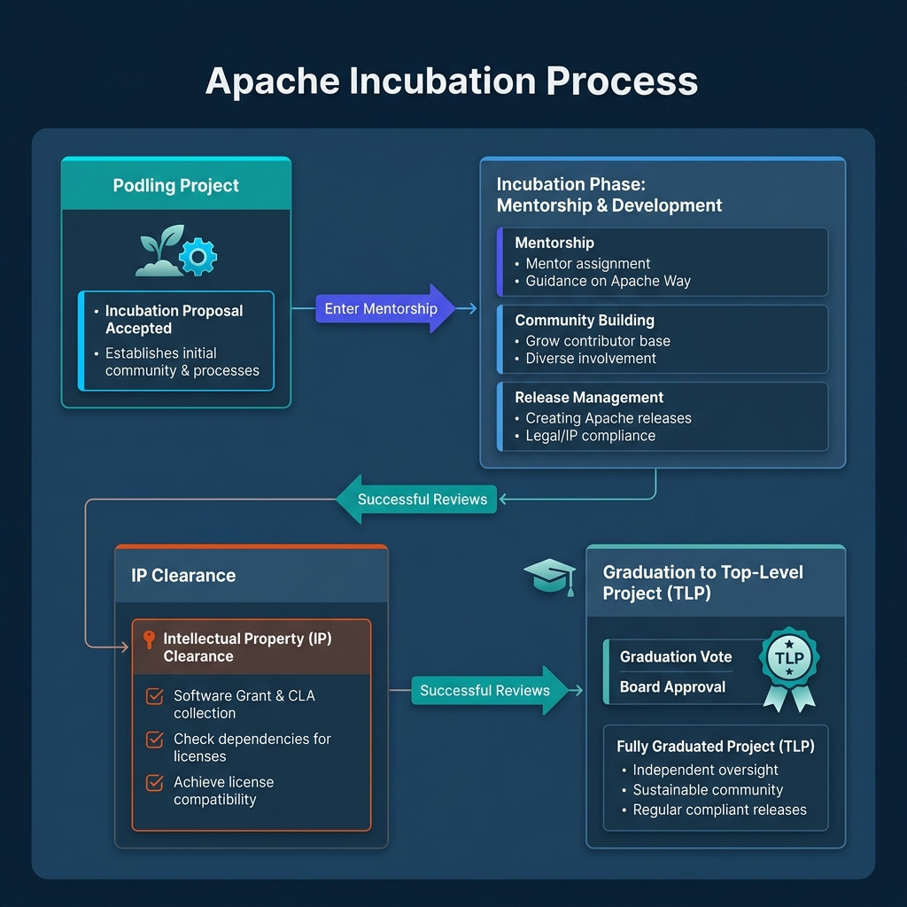
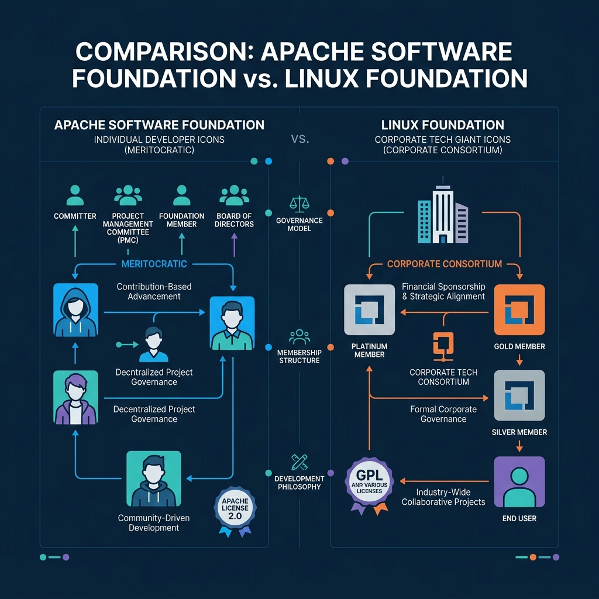
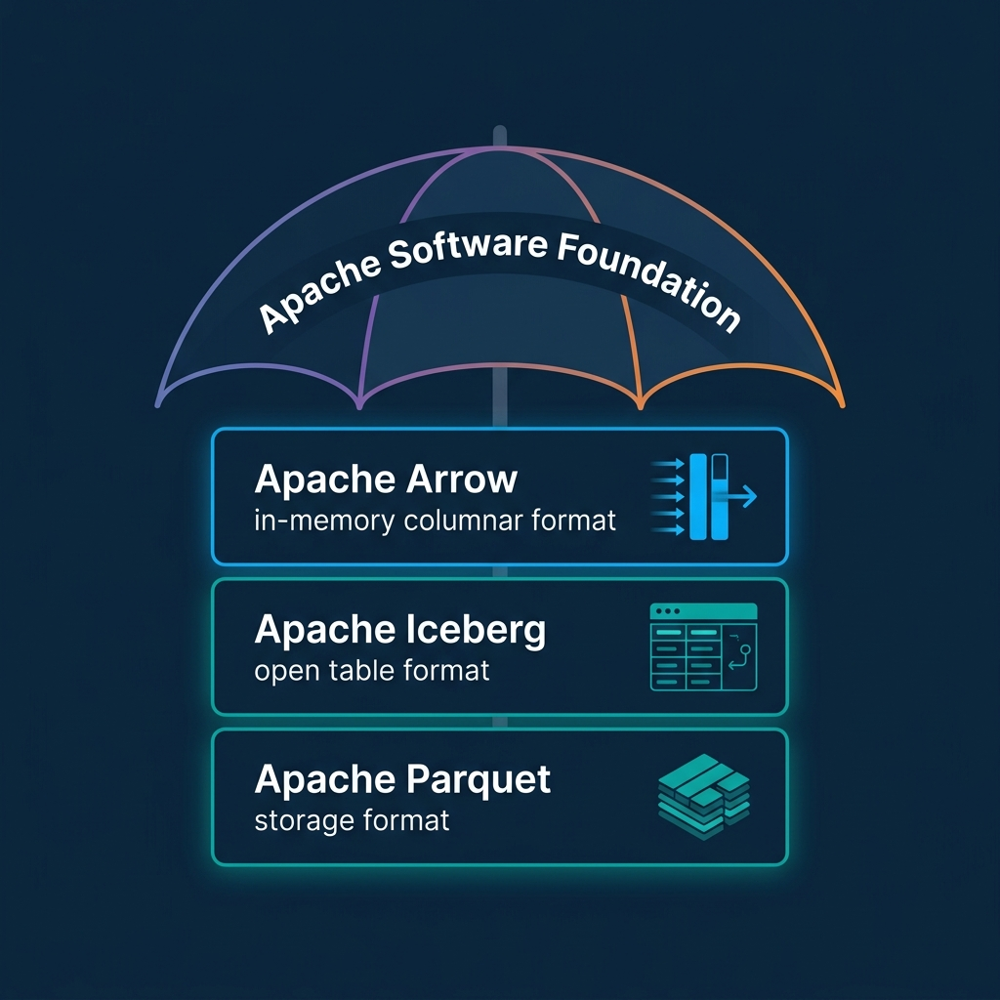

*Read the complete Open Source and the Lakehouse series:*
* [Part 1: Apache Software Foundation](/2026/2026-04-al-01-apache-software-foundation-history-purpose-and-process/)
* [Part 2: What is Apache Parquet?](/2026/2026-04-al-02-what-is-apache-parquet-columns-encoding-and-performance/)
* [Part 3: What is Apache Iceberg?](/2026/2026-04-al-03-what-is-apache-iceberg-the-table-format-revolution/)
* [Part 4: What is Apache Polaris?](/2026/2026-04-al-04-what-is-apache-polaris-unifying-the-iceberg-ecosystem/)
* [Part 5: What is Apache Arrow?](/2026/2026-04-al-05-what-is-apache-arrow-erasing-the-serialization-tax/)
* [Part 6: Assembling the Apache Lakehouse](/2026/2026-04-al-06-assembling-the-apache-lakehouse-the-modular-architecture/)
* [Part 7: Agentic Analytics on the Apache Lakehouse](/2026/2026-04-al-07-agentic-analytics-on-the-apache-lakehouse/)

If you build a modern data lakehouse, you inevitably stack Apache Iceberg, Apache Parquet, and Apache Arrow. These projects dictate how you store, query, and govern petabytes of data. But the code itself is only half the story. The legal and operational framework supporting that code dictates whether a project survives for decades or gets hijacked by a single vendor. 

That framework is the Apache Software Foundation. The ASF provides the structural immunity that prevents any one company from controlling the open source stack. Understanding how the ASF operates helps you evaluate the longevity and neutrality of the tools powering your lakehouse.

## The Origins of the Apache Software Foundation

The web runs on software. In 1995, an informal collective of eight developers began collaborating on patches for the NCSA HTTPd web server. They called themselves the "Apache Group." Their work eventually became the Apache HTTP Server, which powered the early internet expansion.

As the software gained massive corporate adoption, the group faced a structural problem. An informal collective cannot legally hold copyrights, accept corporate donations, or shield individual volunteer developers from lawsuits. 

To solve this, the group incorporated the Apache Software Foundation in 1999 as a U.S. 501(c)(3) non-profit public charity. The foundation exists to provide software for the public good. It acts as an independent legal shield that takes taking legal and financial ownership so that developers can focus entirely on code. Today, the ASF stewards hundreds of projects spanning big data, artificial intelligence, and cloud infrastructure.

## The Apache Way: Community Over Code

The ASF operates on a unique philosophy known as "The Apache Way." The core tenet is simple: a healthy community is more important than good code. A toxic but brilliant contributor poses a greater risk to a project's survival than a mediocre codebase.

Meritocracy drives the Apache Way. You cannot buy a seat on a project's decision-making board. Contributors must earn authority by submitting code, writing documentation, and helping others on the mailing lists. 

Crucially, individuals participate in the ASF as individuals. They do not act as representatives of their employers. This strict firewall prevents corporations from buying influence. Projects make decisions openly on public mailing lists through consensus. If an action is not recorded on the mailing list, it did not happen. 

## The Apache Incubator Process

You cannot simply hand an existing codebase to the ASF and declare it an Apache project. Every incoming project must pass through the Apache Incubator. 

When a project enters the incubator, it becomes a "podling." The incubator Project Management Committee assigns experienced Apache members as mentors to guide the podling. 

During incubation, the project community must prove they can operate under The Apache Way. They must transition all intellectual property to the ASF, which involves relicensing the code under the permissive Apache License 2.0. They also must demonstrate that their contributor base is diverse and not dominated by a single company.

Once a podling proves its community is resilient, legally clear, and self-governing, it applies for graduation. The ASF board grants approval, elevating the project to a Top-Level Project (TLP). The project then operates autonomously under its own Project Management Committee.

## Apache Software Foundation vs. Linux Foundation

The ASF and the Linux Foundation frequently appear alongside each other, but they operate under entirely different models. Both are vital to open source software, but they serve different purposes. 

The ASF is a 501(c)(3) public charity focused on grassroots community incubation. The Linux Foundation is a 501(c)(6) trade organization that acts as a consortium for massive industry collaboration. 

| Feature | Apache Software Foundation (ASF) | Linux Foundation (LF) |
| :--- | :--- | :--- |
| **Organizational Model** | 501(c)(3) charity | 501(c)(6) trade organization |
| **Members** | Individuals | Corporations |
| **Governance** | Decentralized Project Management Committees | Centralized Technical Steering Committees |
| **Financial Influence** | Financial donors hold zero influence | Large corporate sponsors often hold structured governance seats |

The Linux Foundation excels at gathering competing corporate giants to fund and stabilize core internet infrastructure like Kubernetes. Companies pay membership fees, and those fees often secure them seats on a governing board to help direct the project. 

The ASF strictly prohibits pay-to-play governance. A company can donate millions of dollars to the ASF, but they receive exactly zero influence over any project's technical direction. Only individual code contributors earn votes.

## Why ASF Governance Matters for the Lakehouse

When you design a data lakehouse, you commit to a storage and query architecture that will last five to ten years. If a single vendor controls your data format, they can change the licensing model, slow down innovation, or force you into expensive proprietary compute engines.

By building your stack on Apache Parquet for storage, Apache Iceberg for table formats, and Apache Arrow for memory processing, you mitigate that risk. Because these are Top-Level Projects at the ASF, no single company can hijack their roadmaps.

The ASF ensures that the standards remain genuinely open. Competing query engines can all integrate with Iceberg and Arrow under equal conditions. Your data stays in your storage, in an open format, accessible by any engine. No lock-in.

If your team is ready to run analytics on these open standards without manual tuning, start by querying your Iceberg tables centrally. [Try Dremio Cloud free for 30 days](https://www.dremio.com/get-started) to deploy agentic analytics directly on your data lakehouse with zero vendor lock-in.
