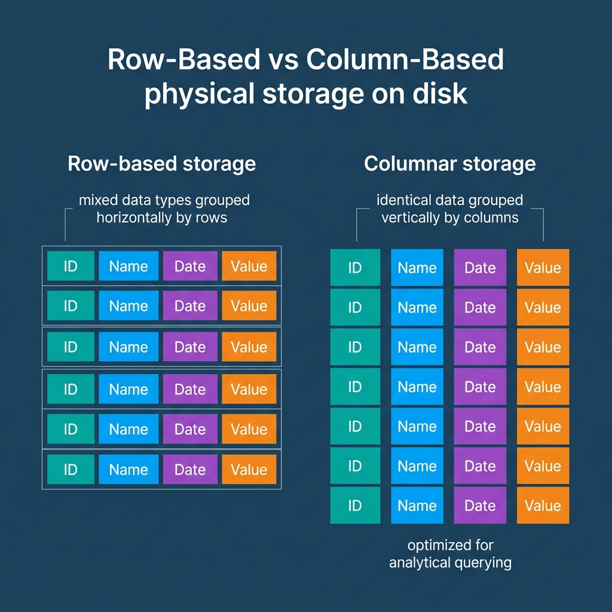
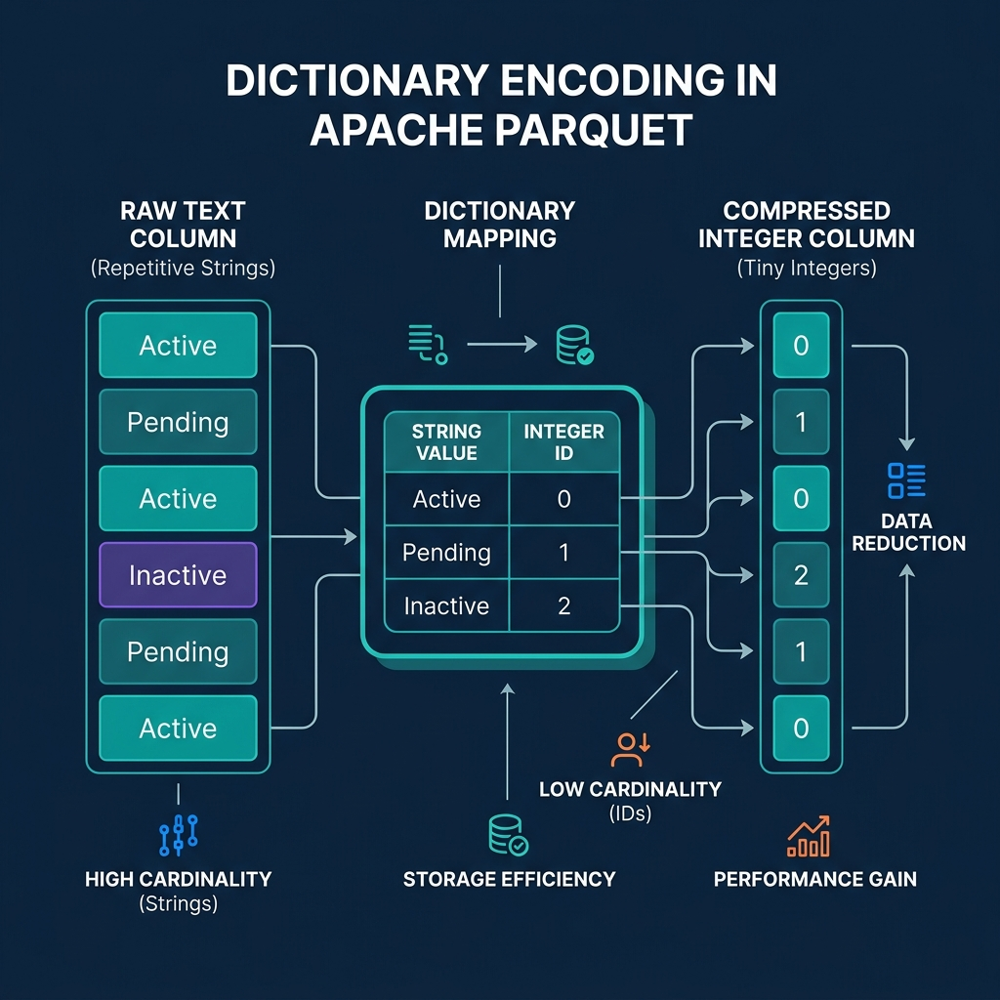
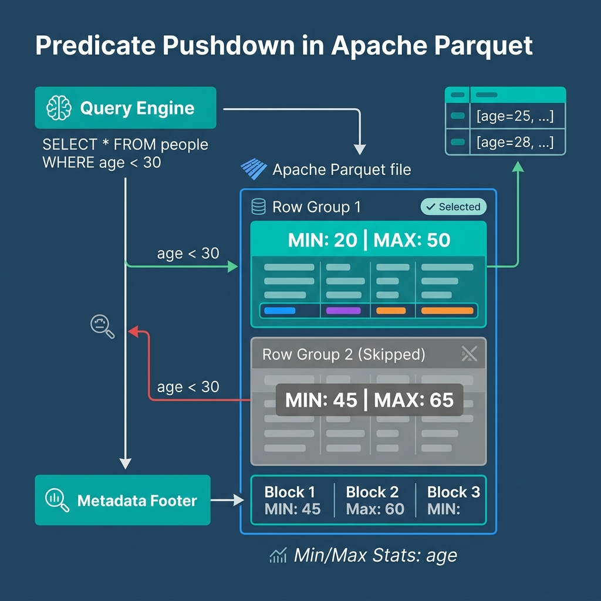

*Read the complete Open Source and the Lakehouse series:*
* [Part 1: Apache Software Foundation: History, Purpose, and Process](/2026/2026-04-al-01-apache-software-foundation-history-purpose-and-process/)
* [Part 2: What is Apache Parquet?](/2026/2026-04-al-02-what-is-apache-parquet-columns-encoding-and-performance/)
* [Part 3: What is Apache Iceberg?](/2026/2026-04-al-03-what-is-apache-iceberg-the-table-format-revolution/)
* [Part 4: What is Apache Polaris?](/2026/2026-04-al-04-what-is-apache-polaris-unifying-the-iceberg-ecosystem/)
* [Part 5: What is Apache Arrow?](/2026/2026-04-al-05-what-is-apache-arrow-erasing-the-serialization-tax/)
* [Part 6: Assembling the Apache Lakehouse](/2026/2026-04-al-06-assembling-the-apache-lakehouse-the-modular-architecture/)
* [Part 7: Agentic Analytics on the Apache Lakehouse](/2026/2026-04-al-07-agentic-analytics-on-the-apache-lakehouse/)

If you ask a data analyst to calculate the average transaction amount for the month of July using a massive CSV file, the compute engine must read every single line of that file. It reads the customer name, the address, the item SKUs, and the timestamps, just to find the single column it actually needs. At the petabyte scale, this row-based reading pattern guarantees slow analytics and high compute bills.

In 2013, engineers at Twitter and Cloudera collaborated to solve this fundamental storage bottleneck. Inspired by Google's Dremel paper on querying nested data, they created Apache Parquet. Since becoming a top-level project at the Apache Software Foundation in 2015, Parquet has emerged as the baseline storage format for the modern data lakehouse. 

## The Columnar Architecture of Parquet

Unlike CSV or JSON files that store data row by row, Apache Parquet heavily reorganizes data horizontally to support parallel analytics. 

When a query engine writes a Parquet file, it horizontally slices the table into "Row Groups" (typically between 128 MB and 1 GB in size). Within each row group, the data is physically stored column by column. A "Column Chunk" holds all the values for a single column within that row group. Finally, the column chunk is split into smaller "Pages," which serve as the base unit for compression.

This architecture immediately solves the CSV problem through "Column Pruning." If you run a `SELECT` statement targeting only the transaction amount, the query engine completely ignores the chunks containing addresses and names. It only reads the specific column chunks requested. This drastically reduces disk I/O, generating faster query responses and lowering costs.

## Dictionary Encoding and Compression

Data analytics often involves reading repetitive categorizations. Consider a status column containing millions of rows that say either "Active", "Pending", or "Cancelled". Storing those full strings over and over wastes massive amounts of space.

Parquet handles low-cardinality repetitive data using Dictionary Encoding. Instead of writing "Cancelled" millions of times, Parquet creates a small dictionary in the file's metadata mapping "Active" to `0`, "Pending" to `1`, and "Cancelled" to `2`. The actual data pages simply store a list of these tiny integers.

Beyond encoding, columnar storage inherently improves compression. Algorithms like Snappy, Zstd, and GZIP search for repeating patterns to compress data. A column of integers looks incredibly repetitive and compresses tightly. A row containing an integer, a string, a date, and a boolean does not. Storing homogeneous data together allows Parquet files to consume a fraction of the space of their dense CSV equivalents.

## Predicate Pushdown and Row Group Skipping

Perhaps Parquet's greatest distinct advantage is that its files are entirely self-describing. When a system writes Parquet data, it also computes and stores statistical metadata in the file's footer.

The footer contains the minimum value, maximum value, and null counts for every column within every row group. When you issue a query with a filter—like `WHERE transaction_amount > 1000`—the query engine reads the footer first. This process is called Predicate Pushdown. 

If the footer reveals that the highest transaction amount in Row Group 1 is 500, the engine simply skips reading Row Group 1 entirely. The engine only pulls data from row groups containing values that might satisfy the query. This optimization turns broad multi-gigabyte table scans into highly targeted micro-reads.

## Parquet's Role in the Open Source Lakehouse

Apache Parquet provides the physical storage engine for the data lakehouse. It ensures that data remains highly compressed and brutally efficient to read. 

However, pure Parquet files are immutable. You cannot natively issue an `UPDATE` or `DELETE` statement against a raw Parquet file to fix a typo. To treat these static, high-performance files like a living, mutating database, you need a table format running on top of them. That is the role of Apache Iceberg.

To experience query execution directly against Parquet data stored in your own object storage, [try Dremio Cloud free for 30 days](https://www.dremio.com/get-started). Dremio's vectorized query engine reads Parquet data aggressively, allowing you to ask questions in plain English and receive instant analytical results.
