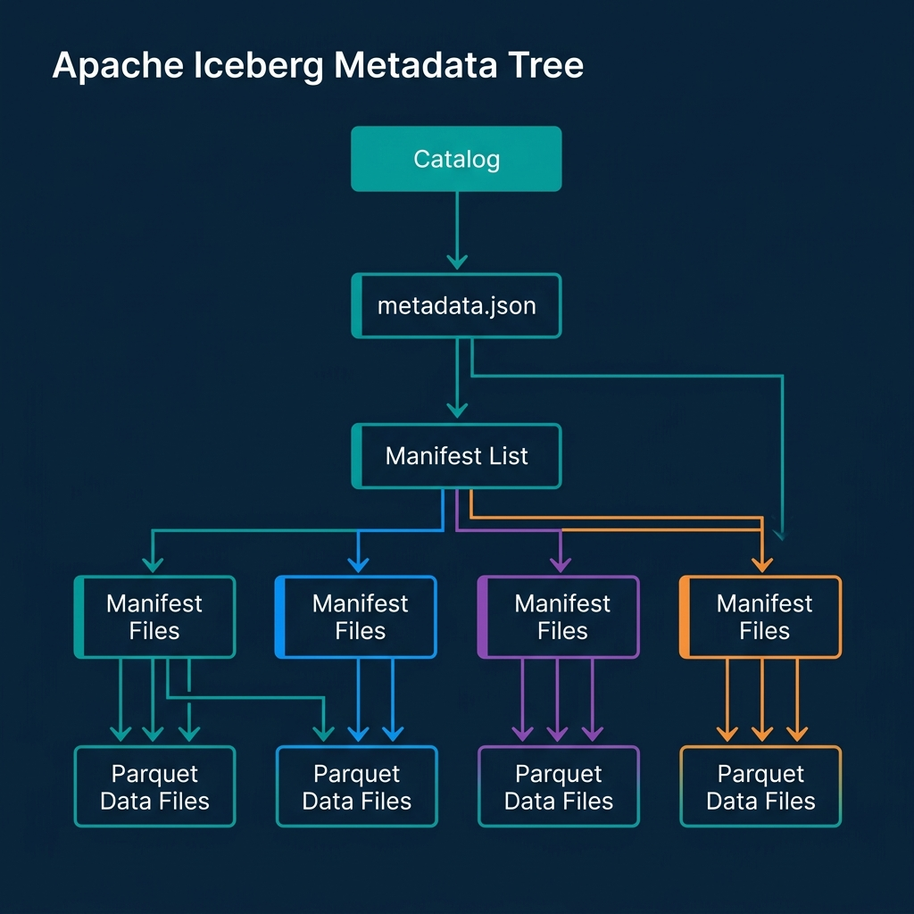
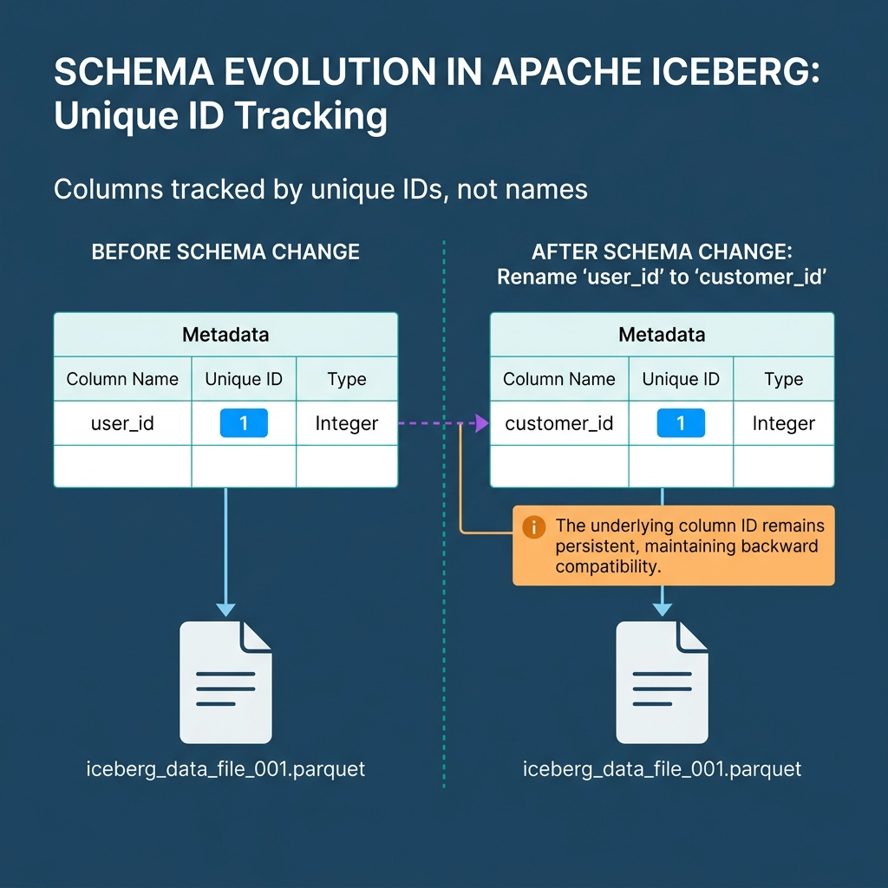
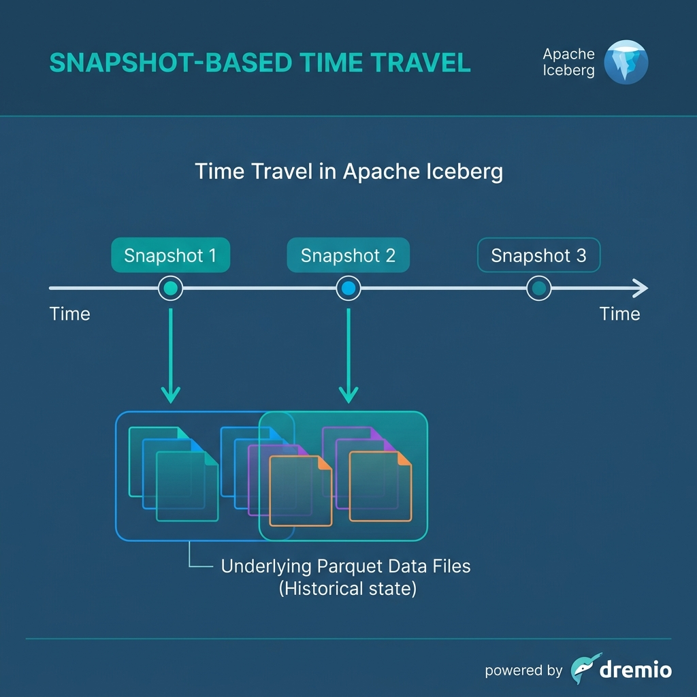

*Read the complete Open Source and the Lakehouse series:*
* [Part 1: Apache Software Foundation](/2026/2026-04-al-01-apache-software-foundation-history-purpose-and-process/)
* [Part 2: What is Apache Parquet?](/2026/2026-04-al-02-what-is-apache-parquet-columns-encoding-and-performance/)
* [Part 3: What is Apache Iceberg?](/2026/2026-04-al-03-what-is-apache-iceberg-the-table-format-revolution/)
* [Part 4: What is Apache Polaris?](/2026/2026-04-al-04-what-is-apache-polaris-unifying-the-iceberg-ecosystem/)
* [Part 5: What is Apache Arrow?](/2026/2026-04-al-05-what-is-apache-arrow-erasing-the-serialization-tax/)
* [Part 6: Assembling the Apache Lakehouse](/2026/2026-04-al-06-assembling-the-apache-lakehouse-the-modular-architecture/)
* [Part 7: Agentic Analytics on the Apache Lakehouse](/2026/2026-04-al-07-agentic-analytics-on-the-apache-lakehouse/)

If you drop ten thousand Parquet files into an S3 bucket, you have a data swamp. You do not have a database. To run SQL queries against those files safely, your engine needs to know exactly which files belong to which table, what the columns are, and which files to ignore. Historically, Apache Hive solved this by tracking directories. Apache Iceberg solves this by tracking files. 

That shift from directory-listing to file-level metadata fundamentally changes how organizations scale analytics. Iceberg brings the reliability of a transactional database to cloud object storage.

## The Directory Listing Bottleneck

Legacy data architectures treated cloud storage like a local hard drive. If an engine like Hive wanted to read a table, it asked the cloud provider to list all the files inside a specific directory. 

Listing millions of files in Amazon S3 or Google Cloud Storage takes an incredibly long time. Worse, cloud providers aggressively throttle high-frequency listing requests. When concurrent writers update a heavily partitioned Hive table, metadata synchronization operations cause readers to see inconsistent, partial data. Scaling meant hitting a hard wall.

Iceberg architects recognized that the file system is the wrong place to store database state. They moved the state into a dedicated metadata tree.

## The Iceberg Metadata Tree Architecture

When an engine queries an Iceberg table, it never asks S3 to list directories. File discovery becomes an instant, `O(1)` metadata lookup. The architecture works through a strict hierarchy of pointers.

The query begins at the **Catalog**, which holds a single pointer to the current `metadata.json` file. This ensures atomic commits; whichever engine successfully updates the catalog pointer wins the transaction. The `metadata.json` tracks the table schema and points to a **Manifest List**.

The Manifest List acts as a table of contents for a specific point in time (a snapshot). It points to multiple **Manifest Files**. Finally, these Manifest Files contain the explicit paths to the individual Parquet data files, along with statistics like minimum and maximum values for every column.

This strict tree structure means the engine knows exactly which Parquet files it needs to read before touching the raw data.

## Schema and Partition Evolution

Data shapes change. In traditional data lakes, renaming a column or changing a partition strategy required a total table rewrite. Iceberg executes these changes in milliseconds as metadata operations.

Iceberg achieves Schema Evolution by assigning a unique ID to every column. It tracks schema changes against the ID, not the string name. If you delete a column named `user_id` and create a new column named `user_id`, Iceberg knows they are entirely different fields. You can add, drop, rename, and reorder columns with zero side effects on existing files.

Similarly, Iceberg features "hidden partitioning". Engineers do not have to create physically derived columns just to partition data (e.g., extracting the year from a timestamp). Iceberg tracks the partition logic entirely in metadata. If you decide to change a table from monthly partitioning to daily partitioning, old data remains partitioned by month, and new data partitions by day. The engine handles the difference transparently.

## Time Travel and Atomic Snapshots

Because Iceberg uses a tree of files where data is never updated in place, every write operation creates a brand new, immutable snapshot of the table.

When you run an `UPDATE` statement, Iceberg writes a new Parquet file containing the updated records, creates a new Manifest pointing to the new data, and generates a new Manifest List. The previous snapshot remains completely intact. 

This architecture unlocks Time Travel. Analysts can append `FOR SYSTEM_TIME AS OF` to their SQL queries to read previous table states. If a faulty pipeline writes bad data, you do not need to rebuild the table from backups. You simply roll back the catalog pointer to the previous, healthy snapshot. Time travel does not duplicate data; the metadata simply points back to the underlying files that were valid at that exact moment.

## Scaling the Open Source Lakehouse

Apache Iceberg provides the structure necessary to treat raw Parquet files like high-performance relational tables. However, a table format alone is incomplete. You need a centralized catalog mechanism to manage the root pointers, enforce security access, and resolve interoperability between multiple query engines.

That requirement leads directly to Apache Polaris, the open catalog standard designed to unify the Iceberg ecosystem.

Dremio executes natively against Iceberg tables, managing the metadata optimization lifecycle automatically. To see Iceberg transactions and time travel in action without building infrastructure, [try Dremio Cloud free for 30 days](https://www.dremio.com/get-started).
