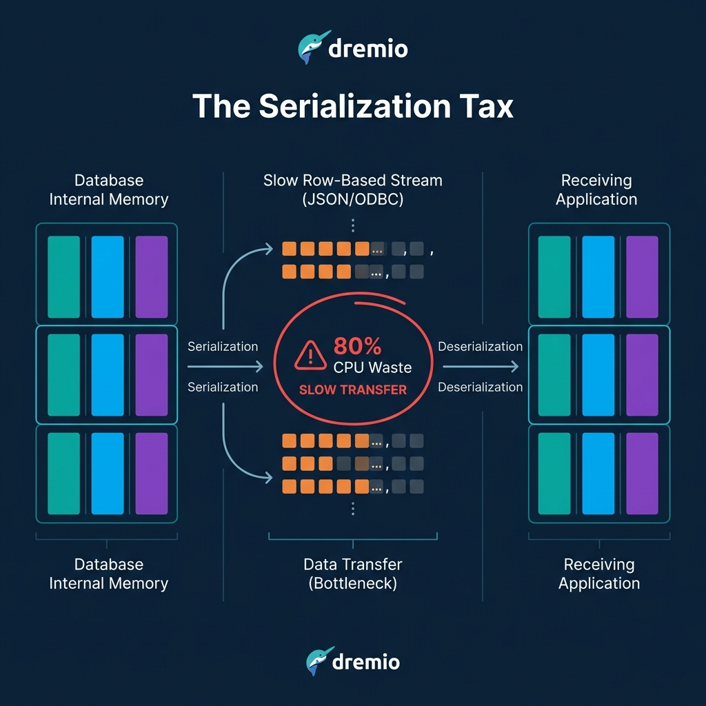
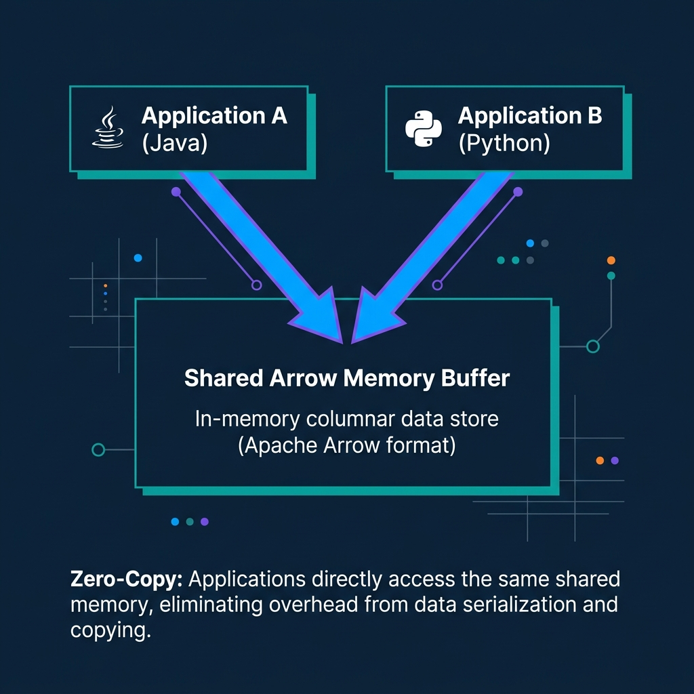
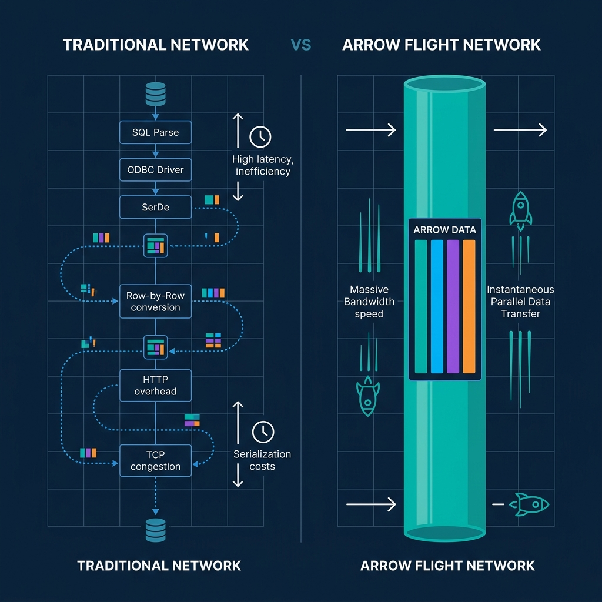

*Read the complete Open Source and the Lakehouse series:*
* [Part 1: Apache Software Foundation: History, Purpose, and Process](/2026/2026-04-al-01-apache-software-foundation-history-purpose-and-process/)
* [Part 2: What is Apache Parquet?](/2026/2026-04-al-02-what-is-apache-parquet-columns-encoding-and-performance/)
* [Part 3: What is Apache Iceberg?](/2026/2026-04-al-03-what-is-apache-iceberg-the-table-format-revolution/)
* [Part 4: What is Apache Polaris?](/2026/2026-04-al-04-what-is-apache-polaris-unifying-the-iceberg-ecosystem/)
* [Part 5: What is Apache Arrow?](/2026/2026-04-al-05-what-is-apache-arrow-erasing-the-serialization-tax/)
* [Part 6: Assembling the Apache Lakehouse](/2026/2026-04-al-06-assembling-the-apache-lakehouse-the-modular-architecture/)
* [Part 7: Agentic Analytics on the Apache Lakehouse](/2026/2026-04-al-07-agentic-analytics-on-the-apache-lakehouse/)

If you pull a million records from a database into a Python notebook, the query runs instantly, but the transfer feels endlessly slow. Your compute engine wastes the majority of that time quietly translating data layouts. 

Historically, moving data between two analytical systems required paying a massive "serialization tax." Apache Arrow eliminates that tax by establishing a universal, open-source standard for how computer memory holds columnar data.

## The Hidden Cost of Moving Data

When an analytical system queries legacy architectures via JDBC or ODBC, it encounters a severe bottleneck. The database holds data in its own proprietary layout. To send the data over a network, the database must serialize it—converting it into a generic row-based format like a JSON array or a proprietary buffer stream. 

When the receiving system (like a pandas DataFrame or a Spark cluster) catches the stream, it must deserialize the rows. It reads the row, pulls out the individual strings and integers, and places them into its own internal columnar arrays for processing. 

This cycle of formatting, converting, and parsing consumes up to 80% of the CPU time in data workflows. It slows down queries, burns compute credits, and bottlenecks machine learning pipelines.

## The Standardized In-Memory Format

Apache Arrow changes the physics of data movement. While Apache Parquet defines how to store columnar data on a slow hard drive, Arrow defines how to structure columnar data inside high-speed RAM. 

Arrow provides a standardized, language-agnostic, in-memory columnar format. Whether your system uses Java, Python, C++, or Rust, it structures the data identically in memory. Because the format is columnar, it natively supports vectorization. Modern CPUs can use Single Instruction, Multiple Data (SIMD) hardware acceleration to process entire chunks of Arrow arrays in a single clock cycle.

## Zero-Copy Sharing

Standardizing the memory layout unlocks Arrow's most powerful trait: Zero-Copy data sharing. 

Imagine a Java-based query engine and a Python-based data science tool running on the same machine. In a pre-Arrow world, the Java tool translates its data to a middle format, hands it to Python, and Python copies it into a new memory space. It doubles the memory footprint and wastes time.

With Apache Arrow, both tools understand the exact same memory layout. The Java engine creates an Arrow buffer in RAM. When Python asks for the data, Java simply hands Python the memory address pointer. Python begins reading the data instantly. Zero serialization. Zero copying. 

## Taking Flight: Arrow over the Network

Arrow's speed is not restricted to single machines. The project introduced Arrow Flight, a high-performance Remote Procedure Call (RPC) protocol for transmitting large datasets across networks. 

Instead of converting data to REST or row-based streams, Arrow Flight transports the native Arrow memory buffers directly over the wire. The receiving client gets the buffer and immediately begins executing analytics on it.

To finalize the death of the serialization tax, the Apache Arrow community created ADBC (Arrow Database Connectivity). ADBC replaces legacy JDBC and ODBC drivers with an API standard explicitly designed for columnar analytics. ADBC allows databases to deliver native Arrow streams directly to clients, bypassing row-conversion entirely. 

## Arrow on the Lakehouse

Apache Arrow is the execution memory moving through the central nervous system of the lakehouse. 

By stacking Parquet for storage, Iceberg for tables, Polaris for metadata routing, and Arrow for memory processing, you create an open data architecture capable of outperforming expensive proprietary data warehouses.

Dremio co-created Apache Arrow. It uses Arrow natively as its internal execution engine to eliminate the serialization tax that slows down traditional platforms. [Try Dremio Cloud free for 30 days](https://www.dremio.com/get-started) to query your object storage with zero-copy analytics.
