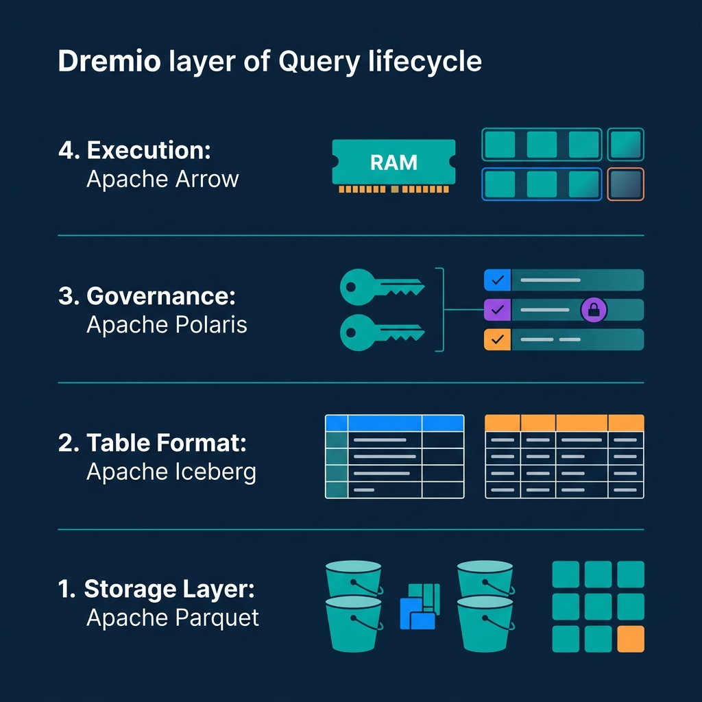
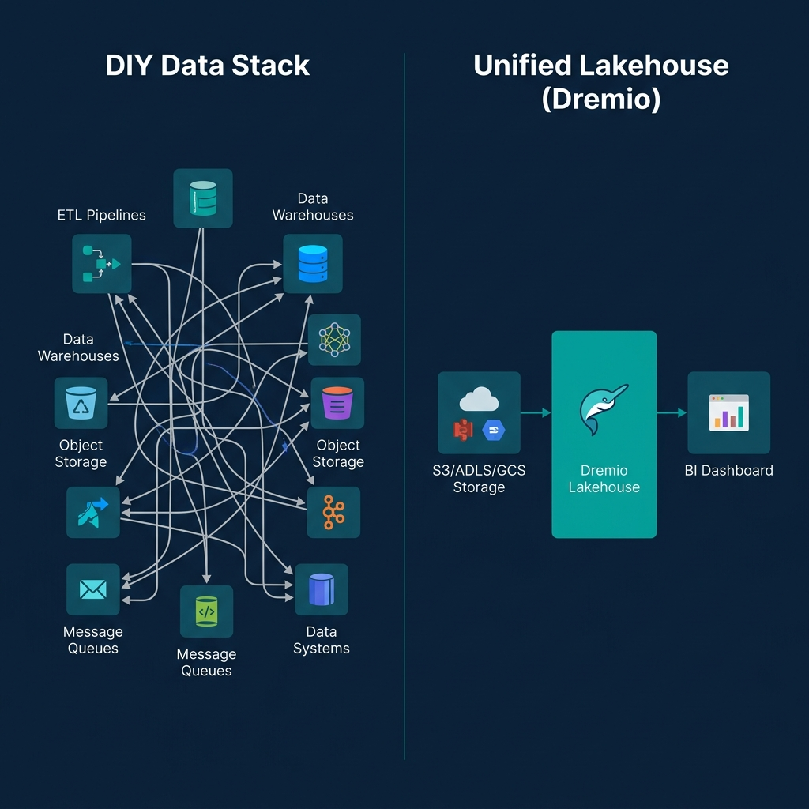

*Read the complete Open Source and the Lakehouse series:*
* [Part 1: Apache Software Foundation: History, Purpose, and Process](/2026/2026-04-al-01-apache-software-foundation-history-purpose-and-process/)
* [Part 2: What is Apache Parquet?](/2026/2026-04-al-02-what-is-apache-parquet-columns-encoding-and-performance/)
* [Part 3: What is Apache Iceberg?](/2026/2026-04-al-03-what-is-apache-iceberg-the-table-format-revolution/)
* [Part 4: What is Apache Polaris?](/2026/2026-04-al-04-what-is-apache-polaris-unifying-the-iceberg-ecosystem/)
* [Part 5: What is Apache Arrow?](/2026/2026-04-al-05-what-is-apache-arrow-erasing-the-serialization-tax/)
* [Part 6: Assembling the Apache Lakehouse](/2026/2026-04-al-06-assembling-the-apache-lakehouse-the-modular-architecture/)
* [Part 7: Agentic Analytics on the Apache Lakehouse](/2026/2026-04-al-07-agentic-analytics-on-the-apache-lakehouse/)

For decades, the standard data architecture was monolithic. When you bought a data warehouse, you bought a single box where the vendor tightly coupled the storage format, the database rules, the metadata catalog, and the compute engine. If you wanted to query your data with a different tool, you had to physically extract the data from the warehouse and pay to store it somewhere else. 

The modular Apache Lakehouse breaks that monolith apart. By using open standards for every defining layer of the data stack, you can decouple your storage from your compute entirely. 

## The Four Pillars of the Open Stack

The true power of the modern data lakehouse emerges when you assemble the four foundational open-source components into a single, cohesive architecture.

1. **The Storage Layer (Apache Parquet):** At the base, you have raw object storage (like Amazon S3 or Google Cloud Storage) filled with highly compressed, columnar Parquet files. This minimizes your storage footprint and guarantees rapid I/O for analytical queries.
2. **The Table Format (Apache Iceberg):** Because Parquet files are immutable, they cannot function natively as a database. Iceberg sits directly above the storage layer, mapping those files into relational tables. It provides the ACID transactions, schema evolution, and time travel necessary to keep data highly structured.
3. **The Governance Layer (Apache Polaris):** To prevent catalog fragmentation, Polaris acts as the central brain. It securely manages access to the Iceberg tables, using credential vending to ensure that different compute engines can hit the same data safely and transparently via a REST API.
4. **The Execution Layer (Apache Arrow):** When a BI dashboard or a query engine needs the data, it processes it in RAM using Apache Arrow. This in-memory columnar format ensures zero-copy reads, eliminating the massive CPU penalties of the legacy serialization tax.

This stack ensures complete vendor neutrality. Because every layer relies on an Apache Software Foundation standard, you own your data. You can swap compute engines tomorrow without migrating a single byte.

## The Trap of the DIY Lakehouse

When engineering teams first understand this modular stack, the instinct is to build it manually. They stitch together open-source Spark clusters, deploy standalone Polaris containers, and point everything at their S3 buckets. 

That Do-It-Yourself approach provides absolute control over the infrastructure, but it introduces a massive operational trap. 

Apache Iceberg is incredibly powerful, but it is not self-maintaining. Every time you insert or update rows, Iceberg creates new snapshots, new manifest files, and tiny new Parquet files. If left unchecked, this bloat degrades query performance to a crawl. In a DIY build, your team must manually write, schedule, and monitor heavy Spark jobs to regularly compact small files, rewrite manifests, and vacuum expired snapshots. Your team becomes a database maintenance firm instead of a data analytics firm.

## The Open Platform Approach

The enterprise alternative to a DIY build is a managed, open platform. 

Choosing a managed platform does not violate the "no vendor lock-in" mandate—provided the platform honors the open architecture. Dremio, for example, natively integrates all four of these Apache projects out of the box. 

When you deploy Dremio, you get a fully featured engine running Apache Arrow in its memory layer, querying Apache Iceberg tables stored in Apache Parquet formats, tracked by an internal Apache Polaris catalog. 

Crucially, Dremio handles the operational burden. Features like Automatic Table Optimization quietly compact files and vacuum expired snapshots in the background, ensuring sub-second query performance without demanding custom maintenance scripts. Because the underlying data remains in open Iceberg REST formats, you are never locked into the execution engine.

To bypass the engineering headaches of a DIY build and start analyzing data on a production-ready Apache architecture on day one, [try Dremio Cloud free for 30 days](https://www.dremio.com/get-started).
