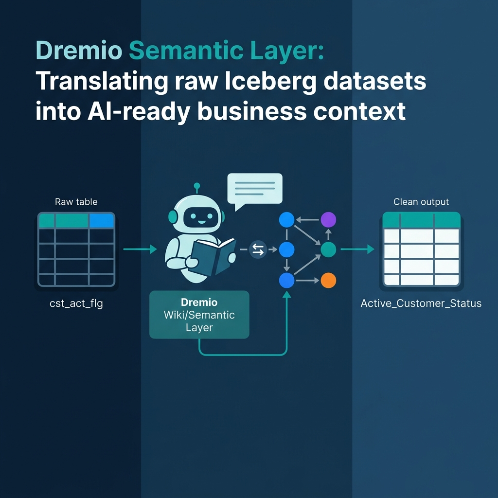
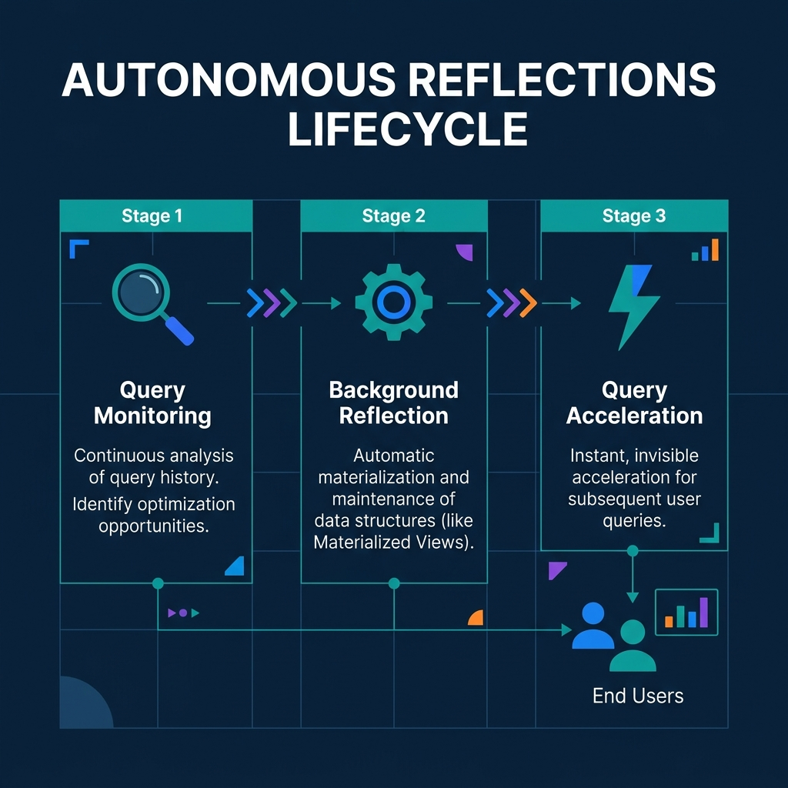
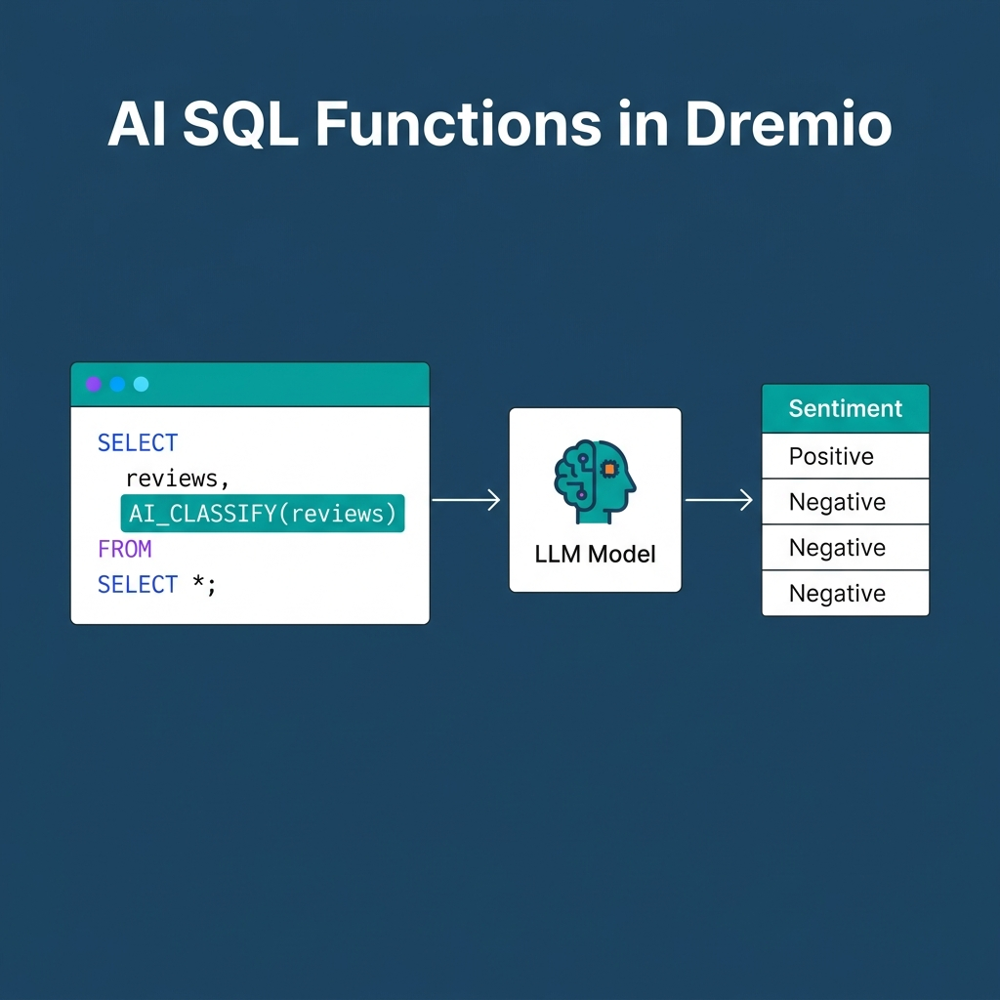

*Read the complete Open Source and the Lakehouse series:*
* [Part 1: Apache Software Foundation: History, Purpose, and Process](/2026/2026-04-al-01-apache-software-foundation-history-purpose-and-process/)
* [Part 2: What is Apache Parquet?](/2026/2026-04-al-02-what-is-apache-parquet-columns-encoding-and-performance/)
* [Part 3: What is Apache Iceberg?](/2026/2026-04-al-03-what-is-apache-iceberg-the-table-format-revolution/)
* [Part 4: What is Apache Polaris?](/2026/2026-04-al-04-what-is-apache-polaris-unifying-the-iceberg-ecosystem/)
* [Part 5: What is Apache Arrow?](/2026/2026-04-al-05-what-is-apache-arrow-erasing-the-serialization-tax/)
* [Part 6: Assembling the Apache Lakehouse](/2026/2026-04-al-06-assembling-the-apache-lakehouse-the-modular-architecture/)
* [Part 7: Agentic Analytics on the Apache Lakehouse](/2026/2026-04-al-07-agentic-analytics-on-the-apache-lakehouse/)

If you grant a Large Language Model direct access to a raw Amazon S3 bucket filled with Parquet files, it will fail to answer your business questions. AI agents possess immense processing power, but they lack inherent business knowledge. 

To execute agentic analytics safely and accurately, an AI agent requires three things: deep business context, universal governed access, and interactive speed. The Apache open-source data lakehouse stack provides the foundation for those requirements, but you must bridge the gap between raw data and machine intelligence. 

## The Hallucination Trap

Consider a raw data table containing a column named `cst_act_flg`. A human analyst working at the company for five years knows this stands for "Customer Account Flag." An AI agent does not. If a user asks the agent to "Show me active customers," the agent guesses meaning from the abbreviation. Guessing leads directly to hallucinations.

Raw data lakes optimize for machine storage, not semantic understanding. To prevent hallucinations, you must teach the AI your specific business language. 

## Teaching AI with the Semantic Layer

The semantic layer acts as a translation layer between technical schemas and business logic. It provides the context that transforms a generic LLM into an accurate agentic analyst.

In the Dremio platform, the Semantic Layer is built through Virtual Datasets. Engineers create logical views that rename `cst_act_flg` to `Active_Customer_Status`. Dremio takes this a step further by using generative AI to automatically document these datasets. By sampling table data and analyzing schemas, Dremio generates detailed Wikis and Tags for your Apache Iceberg tables. 

When an AI agent receives a user prompt, it first reads these semantic Wikis. The documentation effectively teaches the AI agent the definitions of your specific business metrics before it attempts to write SQL, ensuring remarkably high accuracy.

## Autonomous Reflections: AI Accelerating AI

Agentic analytics creates a massive new compute burden. When executives and business lines can ask natural language questions, the volume of unpredictable SQL queries skyrockets. Human database administrators cannot manually tune indexes or write materialized views fast enough to support this scale.

You need AI to accelerate AI. Dremio tackles this with Autonomous Reflections. The platform continuously monitors query patterns—originating from both humans and AI agents—over a seven-day rolling window. 

When Dremio identifies a bottleneck, it automatically acts. It creates, maintains, and drops "Reflections" (pre-computed, highly optimized Iceberg materializations of the data) entirely in the background. Performance becomes an automated byproduct of the architecture, rather than a manual engineering chore.

## Text-to-SQL and Native AI Functions

With context and speed resolved, users can interact directly with the agentic interfaces. Dremio includes a built-in AI Agent capable of discovering datasets, exploring relationships, and visualizing answers. Because the agent is grounded in the AI Semantic Layer and the open Apache Polaris catalog, Text-to-SQL translations actually hit the right tables.

But agentic analytics is not limited to text-to-SQL. Dremio exposes LLM capabilities directly inside the SQL engine itself. 

Using native AI SQL functions like `AI_CLASSIFY` or `AI_GENERATE`, analysts can run sentiment analysis on unstructured product reviews directly within a standard `SELECT` statement. This eliminates the need to export data into external Python pipelines just to leverage modern generative AI models.

## The Fully Realized Agentic Lakehouse

This 7-part series mapped the evolution of the modern data architecture. 

It starts with the strict vendor-neutral governance of the Apache Software Foundation. You store data highly compressed using Apache Parquet. You map those files into relational, transactional tables using Apache Iceberg. You expose those tables to multiple engines securely using Apache Polaris. You execute queries with zero-copy, in-memory speed using Apache Arrow. 

Finally, you layer the semantic context and Autonomous Reflections over that stack to create the Agentic Lakehouse.

You can build this stack yourself, or you can use a unified platform. Deploy agentic analytics directly on Apache Iceberg data with no pipelines and no added overhead. [Try Dremio Cloud free for 30 days](https://www.dremio.com/get-started).
