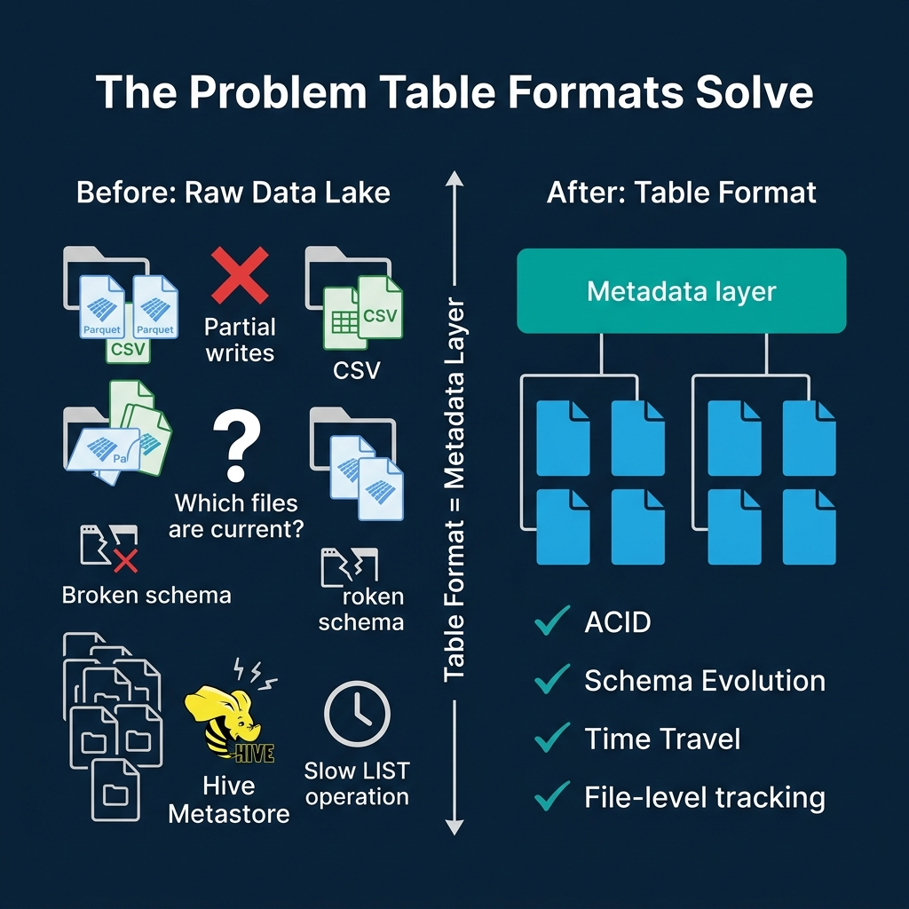
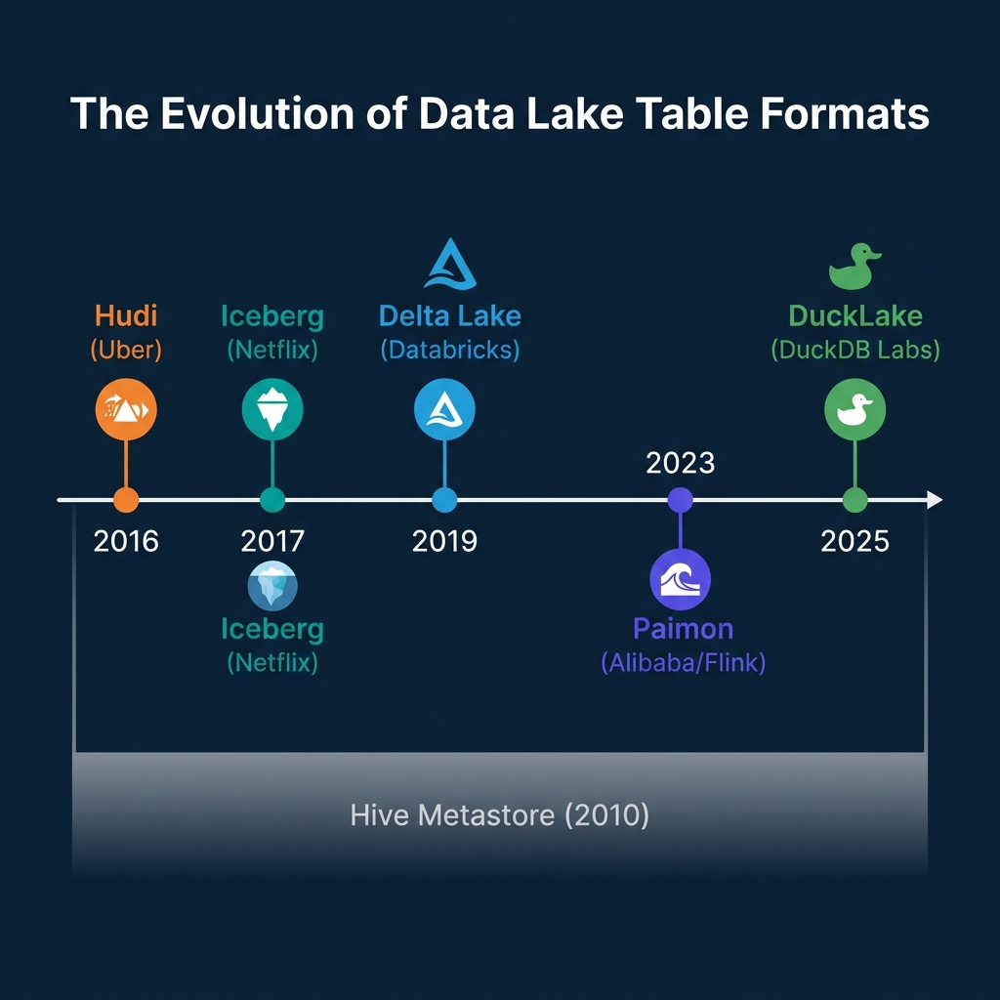
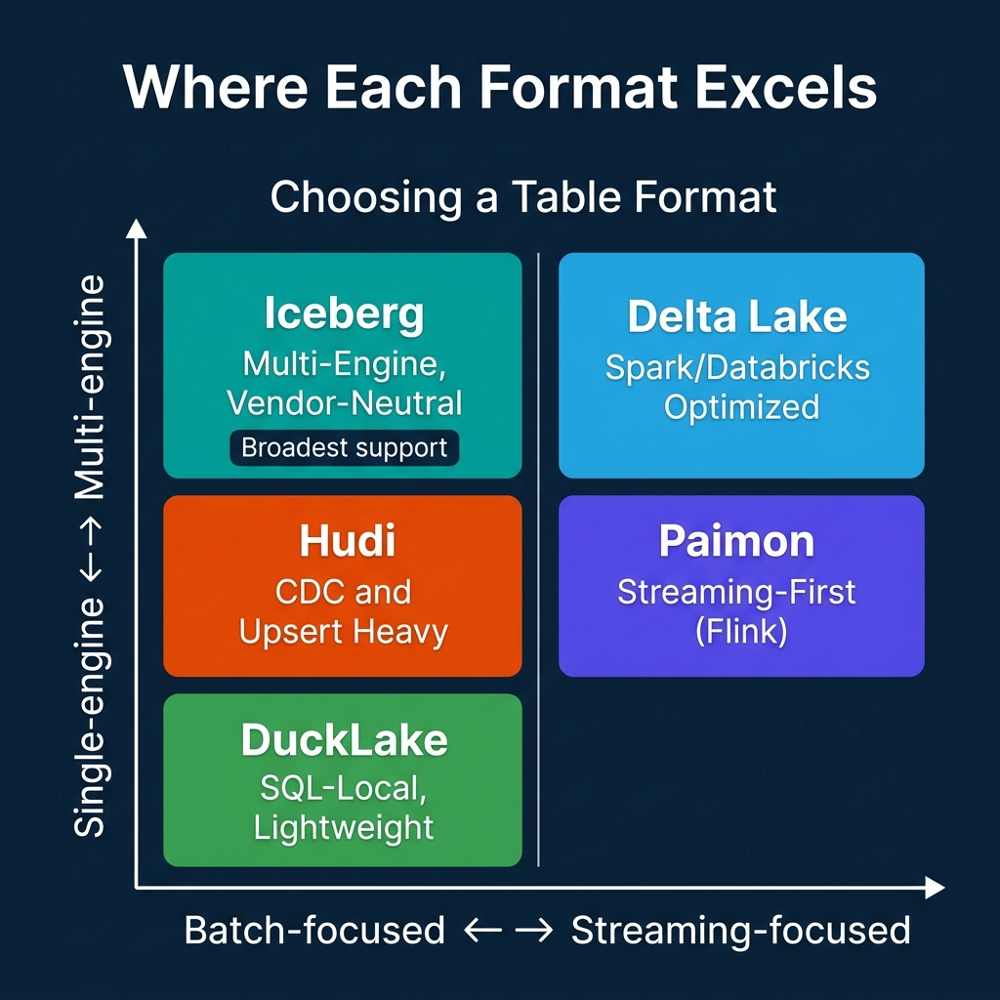

<!-- Meta Description: Table formats like Apache Iceberg solved the ACID, schema, and performance problems that turned data lakes into data swamps. Here is how each one works. -->
<!-- Primary Keyword: data lake table formats -->
<!-- Secondary Keywords: Apache Iceberg, Delta Lake, Apache Hudi, Apache Paimon -->

This is Part 1 of a 15-part [Apache Iceberg Masterclass](/tags/apache-iceberg/). This article covers the fundamental question: what problem do table formats solve, and why does the choice between them matter?

A data lake without a table format is a collection of files. It has no concept of a transaction, no mechanism to prevent two writers from producing corrupted state, and no efficient way to determine which files belong to the current version of a table. Table formats exist because the gap between "a pile of Parquet files" and "a reliable analytical table" is enormous, and bridging it requires a formal metadata specification.

## Table of Contents

1. [What Are Table Formats and Why Were They Needed?](/2026/2026-04-ib-01-what-are-table-formats-and-why-were-they-needed/)
2. [The Metadata Structure of Current Table Formats](/2026/2026-04-ib-02-the-metadata-structure-of-modern-table-formats/)
3. [Performance and Apache Iceberg's Metadata](/2026/2026-04-ib-03-performance-and-apache-icebergs-metadata/)
4. [Technical Deep Dive on Partition Evolution](/2026/2026-04-ib-04-partition-evolution-change-your-partitioning-without-rewriti/)
5. [Technical Deep Dive on Hidden Partitioning](/2026/2026-04-ib-05-hidden-partitioning-how-iceberg-eliminates-accidental-full-t/)
6. [Writing to an Apache Iceberg Table](/2026/2026-04-ib-06-writing-to-an-apache-iceberg-table-how-commits-and-acid-actu/)
7. [What Are Lakehouse Catalogs?](/2026/2026-04-ib-07-what-are-lakehouse-catalogs-the-role-of-catalogs-in-apache-i/)
8. [Embedded Catalogs: S3 Tables and MinIO AI Stor](/2026/2026-04-ib-08-when-catalogs-are-embedded-in-storage/)
9. [How Iceberg Table Storage Degrades Over Time](/2026/2026-04-ib-09-how-data-lake-table-storage-degrades-over-time/)
10. [Maintaining Apache Iceberg Tables](/2026/2026-04-ib-10-maintaining-apache-iceberg-tables-compaction-expiry-and-clea/)
11. [Apache Iceberg Metadata Tables](/2026/2026-04-ib-11-apache-iceberg-metadata-tables-querying-the-internals/)
12. [Using Iceberg with Python and MPP Engines](/2026/2026-04-ib-12-using-apache-iceberg-with-python-and-mpp-query-engines/)
13. [Streaming Data into Apache Iceberg Tables](/2026/2026-04-ib-13-approaches-to-streaming-data-into-apache-iceberg-tables/)
14. [Hands-On with Iceberg Using Dremio Cloud](/2026/2026-04-ib-14-hands-on-with-apache-iceberg-using-dremio-cloud/)
15. [Migrating to Apache Iceberg](/2026/2026-04-ib-15-migrating-to-apache-iceberg-strategies-for-every-source-syst/)

## The World Before Table Formats

Before table formats, data lakes relied on a simple convention: data was organized into directories in object storage (S3, ADLS, GCS), and the [Hive Metastore](https://cwiki.apache.org/confluence/display/hive/design#Design-HiveMetastore) tracked which directories corresponded to which partitions.

This approach had five critical problems:

**No atomic commits.** If a Spark job wrote 500 new Parquet files and failed after writing 300, readers could see the 300 partial files. There was no mechanism to make all 500 files visible at once or none of them. Cleanup required manual intervention or custom garbage collection scripts.

**Expensive query planning.** To determine which files to scan, the engine issued `LIST` requests against object storage. S3 returns up to 5,000 objects per request. A table with 100,000 files required 20+ sequential HTTP calls before query execution could even start. At Netflix, query planning for large tables could take minutes just from directory listing.

**Schema changes required rewrites.** Adding a column to a Hive table meant either rewriting every file (expensive) or accepting that old files had a different schema than new files (confusing). Renaming a column was not supported without a full table rewrite because Hive mapped columns by position, not by identity.

**No time travel.** Once data was overwritten, the previous version was gone. There was no snapshot history, no ability to roll back a bad write, and no way to reproduce a query result from last Tuesday.

**Exposed partitioning.** Users had to know the physical partition layout. A table partitioned by `year` and `month` required queries to explicitly filter on those columns using the exact partition column names (`WHERE year = 2024 AND month = 3`). If partitioning changed, every downstream query broke.

## What a Table Format Actually Is

A table format is a specification that defines how to organize metadata about data files so that query engines can treat them as reliable, transactional tables. It sits between the query engine and the physical files.

The core responsibilities of every table format:

- **File tracking**: Maintain an explicit list of which data files belong to the current version of the table, eliminating directory listing
- **Atomic commits**: Make all changes to a table visible to readers at once through a single metadata pointer swap
- **Schema management**: Track the table schema and its evolution history, allowing safe column adds, drops, renames, and reorders
- **Partition management**: Define how data is partitioned and enable query pruning without exposing the physical layout to users
- **Snapshot history**: Maintain a history of table states for time travel, rollback, and auditing
- **Statistics**: Store column-level min/max values and other statistics to enable file skipping during query planning

The data files themselves are still standard [Parquet](https://parquet.apache.org/) or ORC. The table format adds a metadata layer on top that gives those files the properties of a database table.

## The Five Table Formats

Five table formats exist today, each born from a different problem and optimized for a different workload.

### Apache Iceberg

Iceberg started at Netflix in 2017, created by Ryan Blue to solve Netflix's petabyte-scale query planning problems. It uses a three-layer metadata tree: a `metadata.json` file points to a manifest list, which points to manifest files, which track individual data files with column-level statistics.

Iceberg's defining feature is its [formal specification](https://iceberg.apache.org/spec/). Any engine that follows the spec can read and write Iceberg tables correctly. This makes Iceberg the most engine-neutral format. Spark, Trino, Flink, [Dremio](https://www.dremio.com/blog/apache-iceberg-101-your-guide-to-learning-apache-iceberg-concepts-and-practices/), Snowflake, BigQuery, Athena, StarRocks, and DuckDB all support it.

Iceberg also introduced [hidden partitioning](https://www.dremio.com/blog/fewer-accidental-full-table-scans-brought-to-you-by-apache-icebergs-hidden-partitioning/) and partition evolution, which are covered in depth in Parts 4 and 5 of this series.

### Delta Lake

Delta Lake was created at Databricks in 2019. It stores metadata as a sequential transaction log (`_delta_log/`) of JSON and Parquet checkpoint files. Each commit appends a new log entry describing which files were added or removed.

Delta Lake's design prioritizes simplicity within the Spark ecosystem. Its strongest features are Liquid Clustering (adaptive data organization that replaces static partitioning) and UniForm (automatic generation of Iceberg-compatible metadata so other engines can read Delta tables as Iceberg).

### Apache Hudi

Hudi originated at Uber in 2016, designed specifically for Change Data Capture (CDC) pipelines that needed to upsert millions of records per hour. Hudi uses a timeline-based metadata architecture where each commit, compaction, and rollback is an "action instant."

Hudi offers both Copy-on-Write (rewrite entire files on update) and Merge-on-Read (write deltas and merge at read time) table types, plus record-level indexing for fast point lookups. It excels when your primary workload involves frequent row-level updates and deletes.

### Apache Paimon

Paimon evolved from Flink Table Store at Alibaba and entered Apache incubation in 2023. It uses [LSM-tree](https://en.wikipedia.org/wiki/Log-structured_merge-tree) based storage internally, making it the most streaming-native table format.

Tables in Paimon are divided into partitions and then further into buckets, each containing an independent LSM tree. This structure enables high-throughput streaming writes with millisecond-level latency. Paimon supports multiple merge engines (deduplication, partial update, aggregation) that determine how records with the same primary key are resolved.

### DuckLake

DuckLake is the newest entry, released by DuckDB Labs and MotherDuck in 2025. It takes a fundamentally different approach: instead of storing metadata as files in object storage, DuckLake stores all metadata in a standard SQL database (PostgreSQL, MySQL, SQLite, or DuckDB itself).

This means a single SQL query resolves all metadata (schema, file list, statistics) instead of the multiple HTTP requests required by file-based metadata formats. The tradeoff is a dependency on a running database for the metadata layer and currently limited engine support (primarily DuckDB).

## Where Each Format Excels

| Dimension | Iceberg | Delta Lake | Hudi | Paimon | DuckLake |
|---|---|---|---|---|---|
| **Metadata** | File-based tree | File-based log | File-based timeline | File-based LSM | SQL database |
| **Engine support** | Broadest | Good (via UniForm) | Moderate | Growing | DuckDB |
| **Schema evolution** | By column ID | By name | By version | By version | SQL ALTER |
| **Partition evolution** | Yes (unique) | Liquid Clustering | Limited | Bucket evolution | SQL-managed |
| **Streaming writes** | Good | Good | Excellent | Excellent | Limited |
| **Best for** | Multi-engine analytics | Spark/Databricks | CDC/upserts | Flink streaming | Local SQL analytics |

The key insight: each format reflects the priorities of the team that built it. Netflix needed multi-engine reads at petabyte scale (Iceberg). Uber needed high-frequency upserts (Hudi). Alibaba needed real-time streaming from Flink (Paimon). Databricks needed Spark-optimized simplicity (Delta). DuckDB Labs wanted SQL-native metadata management (DuckLake).

## Why Iceberg Has Become the Default

Iceberg has achieved the broadest adoption for three reasons:

1. **Specification-first design.** Iceberg's [spec](https://iceberg.apache.org/spec/) is independent of any engine or vendor. Any team can build a conforming implementation. This created a network effect: more engine support attracted more users, which attracted more engine support.

2. **No engine dependency.** Unlike Delta Lake's historical Spark dependency or Paimon's Flink focus, Iceberg was designed from day one to work across engines. A table written by Spark can be read by [Dremio](https://www.dremio.com/blog/apache-iceberg-delta-lake-apache-hudi-a-comparison/), Trino, Flink, or Snowflake without conversion.

3. **Industry convergence.** Snowflake, AWS (Athena, EMR), Google (BigQuery), and Databricks (via UniForm) have all adopted Iceberg as an interoperability standard. When the major cloud vendors align on a format, it becomes the safe choice for long-term investments.

That said, Iceberg is not universally superior. Hudi's record-level indexing makes it faster for point lookups on upsert-heavy tables. Paimon's LSM-tree architecture handles continuous streaming ingestion with lower latency than Iceberg's batch-oriented commit model. DuckLake's SQL-based metadata is simpler for single-engine, local-first analytics.

The rest of this series focuses on Iceberg because its design decisions and capabilities represent the state of the art for multi-engine analytical lakehouses. [Part 2](/2026/2026-04-ib-02-the-metadata-structure-of-modern-table-formats/) examines the metadata structures of all five formats in detail.

### Books to Go Deeper

To learn more about Apache Iceberg and the lakehouse architecture, check out these resources:

- [Architecting the Apache Iceberg Lakehouse](https://www.amazon.com/Architecting-Apache-Iceberg-Lakehouse-open-source/dp/1633435105/) by Alex Merced (Manning)
- [Lakehouses with Apache Iceberg: Agentic Hands-on](https://www.amazon.com/Lakehouses-Apache-Iceberg-Agentic-Hands-ebook/dp/B0GQL4QNRT/) by Alex Merced
- [Constructing Context: Semantics, Agents, and Embeddings](https://www.amazon.com/Constructing-Context-Semantics-Agents-Embeddings/dp/B0GSHRZNZ5/) by Alex Merced
- [Apache Iceberg & Agentic AI: Connecting Structured Data](https://www.amazon.com/Apache-Iceberg-Agentic-Connecting-Structured/dp/B0GW2WF4PX/) by Alex Merced
- [Open Source Lakehouse: Architecting Analytical Systems](https://www.amazon.com/Open-Source-Lakehouse-Architecting-Analytical/dp/B0GW595MVL/) by Alex Merced

### Free Resources

- [FREE - Apache Iceberg: The Definitive Guide](https://drmevn.fyi/linkpageiceberg)
- [FREE - Apache Polaris: The Definitive Guide](https://drmevn.fyi/linkpagepolaris)
- [FREE - Agentic AI for Dummies](https://hello.dremio.com/wp-resources-agentic-ai-for-dummies-reg.html?utm_source=link_page&utm_medium=influencer&utm_campaign=iceberg&utm_term=qr-link-list-04-07-2026&utm_content=alexmerced)
- [FREE - Leverage Federation, The Semantic Layer and the Lakehouse for Agentic AI](https://hello.dremio.com/wp-resources-agentic-analytics-guide-reg.html?utm_source=link_page&utm_medium=influencer&utm_campaign=iceberg&utm_term=qr-link-list-04-07-2026&utm_content=alexmerced)
- [FREE with Survey - Understanding and Getting Hands-on with Apache Iceberg in 100 Pages](https://forms.gle/xdsun6JiRvFY9rB36)
