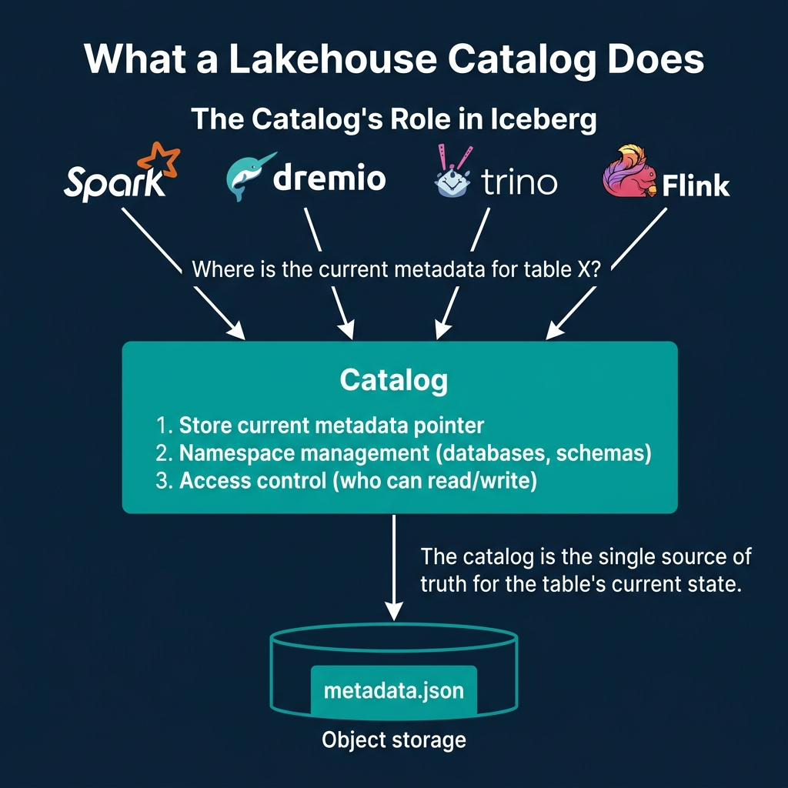
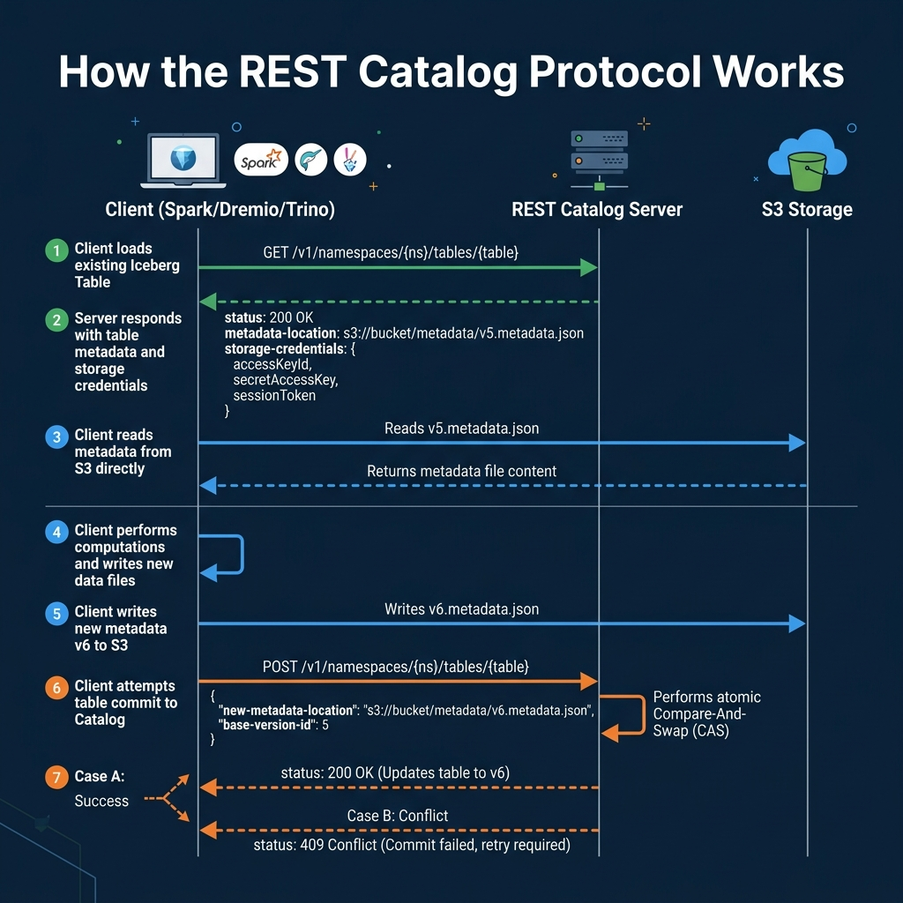
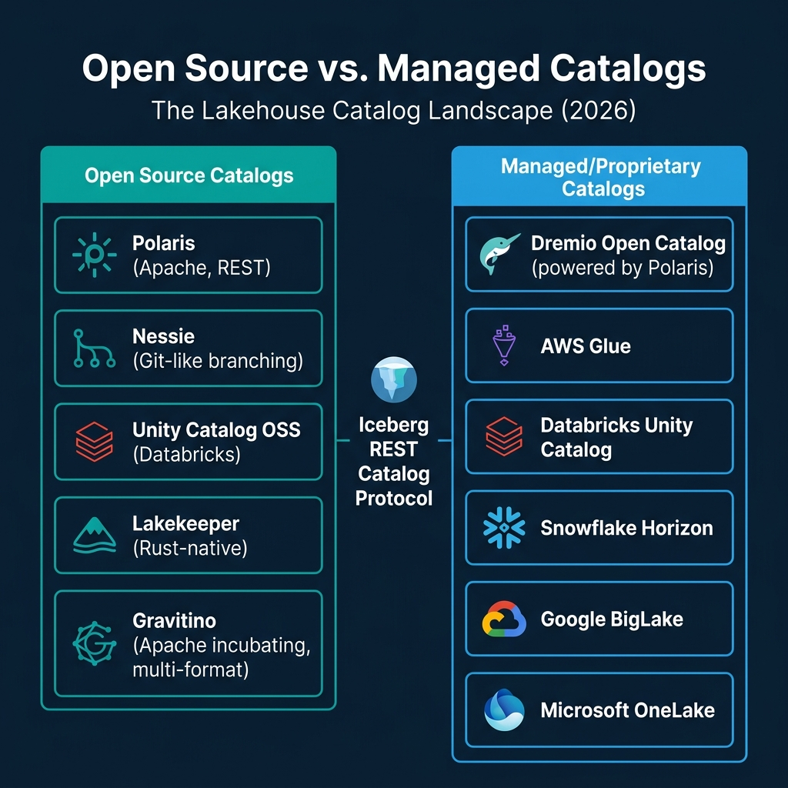

<!-- Meta Description: Lakehouse catalogs store metadata pointers, manage namespaces, and enforce access control. Here is the complete catalog landscape from Polaris to Glue. -->
<!-- Primary Keyword: lakehouse catalogs -->
<!-- Secondary Keywords: Iceberg REST catalog, Apache Polaris, Nessie, catalog landscape -->

This is Part 7 of a 15-part [Apache Iceberg Masterclass](/tags/apache-iceberg/). [Part 6](/2026/2026-04-ib-06-writing-to-an-apache-iceberg-table-how-commits-and-acid-actu/) covered the write process and explained how the catalog enables atomic commits. This article covers what catalogs are, why they matter, and how to choose between the many options available in 2026.

A lakehouse catalog is the component that answers one question: "Where is the current metadata for this table?" Without a catalog, every engine would need to independently locate and track metadata files. With a catalog, there is a single source of truth that coordinates reads, writes, and access control across all engines.

## Table of Contents

1. [What Are Table Formats and Why Were They Needed?](/2026/2026-04-ib-01-what-are-table-formats-and-why-were-they-needed/)
2. [The Metadata Structure of Current Table Formats](/2026/2026-04-ib-02-the-metadata-structure-of-modern-table-formats/)
3. [Performance and Apache Iceberg's Metadata](/2026/2026-04-ib-03-performance-and-apache-icebergs-metadata/)
4. [Technical Deep Dive on Partition Evolution](/2026/2026-04-ib-04-partition-evolution-change-your-partitioning-without-rewriti/)
5. [Technical Deep Dive on Hidden Partitioning](/2026/2026-04-ib-05-hidden-partitioning-how-iceberg-eliminates-accidental-full-t/)
6. [Writing to an Apache Iceberg Table](/2026/2026-04-ib-06-writing-to-an-apache-iceberg-table-how-commits-and-acid-actu/)
7. [What Are Lakehouse Catalogs?](/2026/2026-04-ib-07-what-are-lakehouse-catalogs-the-role-of-catalogs-in-apache-i/)
8. [Embedded Catalogs: S3 Tables and MinIO AI Stor](/2026/2026-04-ib-08-when-catalogs-are-embedded-in-storage/)
9. [How Iceberg Table Storage Degrades Over Time](/2026/2026-04-ib-09-how-data-lake-table-storage-degrades-over-time/)
10. [Maintaining Apache Iceberg Tables](/2026/2026-04-ib-10-maintaining-apache-iceberg-tables-compaction-expiry-and-clea/)
11. [Apache Iceberg Metadata Tables](/2026/2026-04-ib-11-apache-iceberg-metadata-tables-querying-the-internals/)
12. [Using Iceberg with Python and MPP Engines](/2026/2026-04-ib-12-using-apache-iceberg-with-python-and-mpp-query-engines/)
13. [Streaming Data into Apache Iceberg Tables](/2026/2026-04-ib-13-approaches-to-streaming-data-into-apache-iceberg-tables/)
14. [Hands-On with Iceberg Using Dremio Cloud](/2026/2026-04-ib-14-hands-on-with-apache-iceberg-using-dremio-cloud/)
15. [Migrating to Apache Iceberg](/2026/2026-04-ib-15-migrating-to-apache-iceberg-strategies-for-every-source-syst/)

## What a Catalog Does

Every Iceberg catalog performs three functions:

**Store the current metadata pointer.** When a query engine asks for table `analytics.orders`, the catalog returns the location of the current `metadata.json` file (e.g., `s3://warehouse/orders/metadata/v42.metadata.json`). This is the most fundamental responsibility. As described in [Part 6](/2026/2026-04-ib-06-writing-to-an-apache-iceberg-table-how-commits-and-acid-actu/), the atomic update of this pointer is what makes ACID transactions possible.

**Manage namespaces.** Catalogs organize tables into hierarchical namespaces (databases, schemas). This provides logical organization (`production.analytics.orders` vs `staging.analytics.orders`) and is the foundation for access control.

**Enforce access control.** Catalogs determine which users and engines can read, write, or manage specific tables and namespaces. This ranges from simple table-level permissions to fine-grained column-level and row-level security.

## The REST Catalog Protocol

The [Iceberg REST Catalog specification](https://iceberg.apache.org/spec/#rest-catalog) defines a standard HTTP API for catalog operations. This protocol has become the industry standard because it decouples the catalog implementation from the engine.

The key operations:

| Endpoint | Purpose |
|---|---|
| `GET /v1/namespaces/{ns}/tables/{table}` | Load table metadata location |
| `POST /v1/namespaces/{ns}/tables` | Create a new table |
| `POST /v1/namespaces/{ns}/tables/{table}` | Commit a table update (CAS) |
| `GET /v1/namespaces` | List available namespaces |
| `DELETE /v1/namespaces/{ns}/tables/{table}` | Drop a table |

The protocol includes **credential vending**: the catalog returns short-lived storage credentials alongside the metadata location, so the engine can access the data files directly without needing permanent storage credentials. This is important for multi-tenant environments where [Dremio](https://www.dremio.com/blog/what-is-the-iceberg-rest-catalog/) and other engines need scoped access to specific tables.

### Why the REST Protocol Matters

Before the REST catalog specification, every engine needed a custom integration for each catalog type. Spark had its own Hive Metastore connector, Trino had a different one, and adding a new catalog meant updating every engine. The REST protocol standardizes this: any engine that speaks REST can talk to any catalog that implements the specification.

This is what makes the Iceberg ecosystem genuinely multi-engine. You can use Spark for ETL, [Dremio](https://www.dremio.com/platform/) for interactive analytics, Trino for exploration, and Flink for streaming, all pointed at the same REST catalog. Each engine sees the same tables, the same schemas, and the same snapshots.

### Multi-Engine Coordination

When multiple engines share a catalog, the catalog becomes the coordination point for concurrent access. The [atomic compare-and-swap](/2026/2026-04-ib-06-writing-to-an-apache-iceberg-table-how-commits-and-acid-actu/) mechanism ensures that two engines writing to the same table cannot corrupt each other's commits. This is fundamentally different from file-system-based metastores where coordination relies on file renames that may not be atomic on object storage.

### Governance Portability

One of the biggest concerns in the catalog landscape is governance portability. Access control policies (who can query what) are defined in the catalog, but there is no industry standard for sharing these policies across catalogs. If you set up row-level security in one catalog, that policy does not automatically transfer to another.

This is why many architects recommend picking a catalog that will serve as the single governance boundary and having all engines connect through it, rather than having multiple catalogs with duplicate governance rules.

## The Catalog Landscape

### Open Source Catalogs

**[Apache Polaris](https://www.dremio.com/blog/the-polaris-catalog-what-it-is-and-getting-started/) (Apache Incubating).** The leading vendor-neutral REST catalog implementation. Co-created by Snowflake and Dremio, Polaris is designed to be engine-agnostic and cloud-agnostic. It implements the full REST Catalog spec with fine-grained access control and credential vending. It is the foundation for [Dremio's Open Catalog](https://www.dremio.com/platform/open-catalog/).

**Nessie.** Differentiates itself with Git-like branching and merging for data. You can create branches, make changes to multiple tables, and merge them atomically. This is useful for testing pipeline changes or implementing multi-table transactions.

**Unity Catalog OSS.** Databricks' open-source catalog offering. It provides multi-format support (Delta, Iceberg, Hudi) and includes AI/ML asset management (models, features). Closely tied to the Databricks ecosystem.

**Lakekeeper.** A lightweight, Rust-native REST catalog implementation focused on performance and minimal operational footprint. Good for teams that want a self-hosted catalog without the complexity of larger platforms.

**Apache Gravitino (Incubating).** A federation-focused catalog that can bridge multiple underlying catalogs and storage systems. Designed for organizations that need a unified metadata view across multiple Iceberg catalogs, Hive metastores, and other data sources.

### Managed Catalogs

**[Dremio Open Catalog](https://www.dremio.com/platform/open-catalog/).** A managed Polaris-based catalog that includes [automatic table optimization](https://www.dremio.com/blog/table-optimization-in-dremio/) (compaction, snapshot expiry, orphan cleanup) and integrates with Dremio's query engine, semantic layer, and AI capabilities.

**AWS Glue.** Amazon's managed metastore service. Widely used because it is integrated with the AWS ecosystem (Athena, EMR, Redshift Spectrum). Supports Iceberg tables natively and acts as both a Hive-compatible metastore and an Iceberg catalog.

**Databricks Unity Catalog (managed).** The enterprise version of Unity Catalog with additional governance features, lineage tracking, and AI asset management. Tightly integrated with the Databricks runtime.

**Snowflake Horizon.** Snowflake's catalog and governance layer that supports Iceberg tables in Snowflake-managed storage.

**Google BigLake.** Google Cloud's managed metadata service for Iceberg tables on GCS.

**Microsoft OneLake.** Microsoft's unified storage and catalog layer within the Fabric ecosystem.

## How to Choose a Catalog

The decision depends on three factors:

| Priority | Recommended Approach |
|---|---|
| Multi-engine, vendor-neutral | REST catalog (Polaris or Lakekeeper) |
| AWS-native, minimal ops | AWS Glue |
| Databricks ecosystem | Unity Catalog |
| Git-style data versioning | Nessie |
| Managed with auto-optimization | [Dremio Open Catalog](https://www.dremio.com/platform/open-catalog/) |
| Multi-catalog federation | Gravitino |

The safest long-term choice is a REST-catalog-compatible implementation because every major engine supports the protocol. If you start with a REST catalog, you can swap implementations later without changing your engine configurations.

## Catalogs Are Not Optional

Some teams try to use Iceberg without a proper catalog, relying on Hadoop-style file system catalogs that use file renames for atomicity. This works on HDFS but is unreliable on object storage (S3 does not support atomic renames). For production lakehouses on cloud storage, a proper catalog with server-side compare-and-swap is essential.

[Part 8](/2026/2026-04-ib-08-when-catalogs-are-embedded-in-storage/) covers a newer approach where the catalog is embedded directly in the storage layer.

### Books to Go Deeper

- [Architecting the Apache Iceberg Lakehouse](https://www.amazon.com/Architecting-Apache-Iceberg-Lakehouse-open-source/dp/1633435105/) by Alex Merced (Manning)
- [Lakehouses with Apache Iceberg: Agentic Hands-on](https://www.amazon.com/Lakehouses-Apache-Iceberg-Agentic-Hands-ebook/dp/B0GQL4QNRT/) by Alex Merced
- [Constructing Context: Semantics, Agents, and Embeddings](https://www.amazon.com/Constructing-Context-Semantics-Agents-Embeddings/dp/B0GSHRZNZ5/) by Alex Merced
- [Apache Iceberg & Agentic AI: Connecting Structured Data](https://www.amazon.com/Apache-Iceberg-Agentic-Connecting-Structured/dp/B0GW2WF4PX/) by Alex Merced
- [Open Source Lakehouse: Architecting Analytical Systems](https://www.amazon.com/Open-Source-Lakehouse-Architecting-Analytical/dp/B0GW595MVL/) by Alex Merced

### Free Resources

- [FREE - Apache Iceberg: The Definitive Guide](https://drmevn.fyi/linkpageiceberg)
- [FREE - Apache Polaris: The Definitive Guide](https://drmevn.fyi/linkpagepolaris)
- [FREE - Agentic AI for Dummies](https://hello.dremio.com/wp-resources-agentic-ai-for-dummies-reg.html?utm_source=link_page&utm_medium=influencer&utm_campaign=iceberg&utm_term=qr-link-list-04-07-2026&utm_content=alexmerced)
- [FREE - Leverage Federation, The Semantic Layer and the Lakehouse for Agentic AI](https://hello.dremio.com/wp-resources-agentic-analytics-guide-reg.html?utm_source=link_page&utm_medium=influencer&utm_campaign=iceberg&utm_term=qr-link-list-04-07-2026&utm_content=alexmerced)
- [FREE with Survey - Understanding and Getting Hands-on with Apache Iceberg in 100 Pages](https://forms.gle/xdsun6JiRvFY9rB36)
