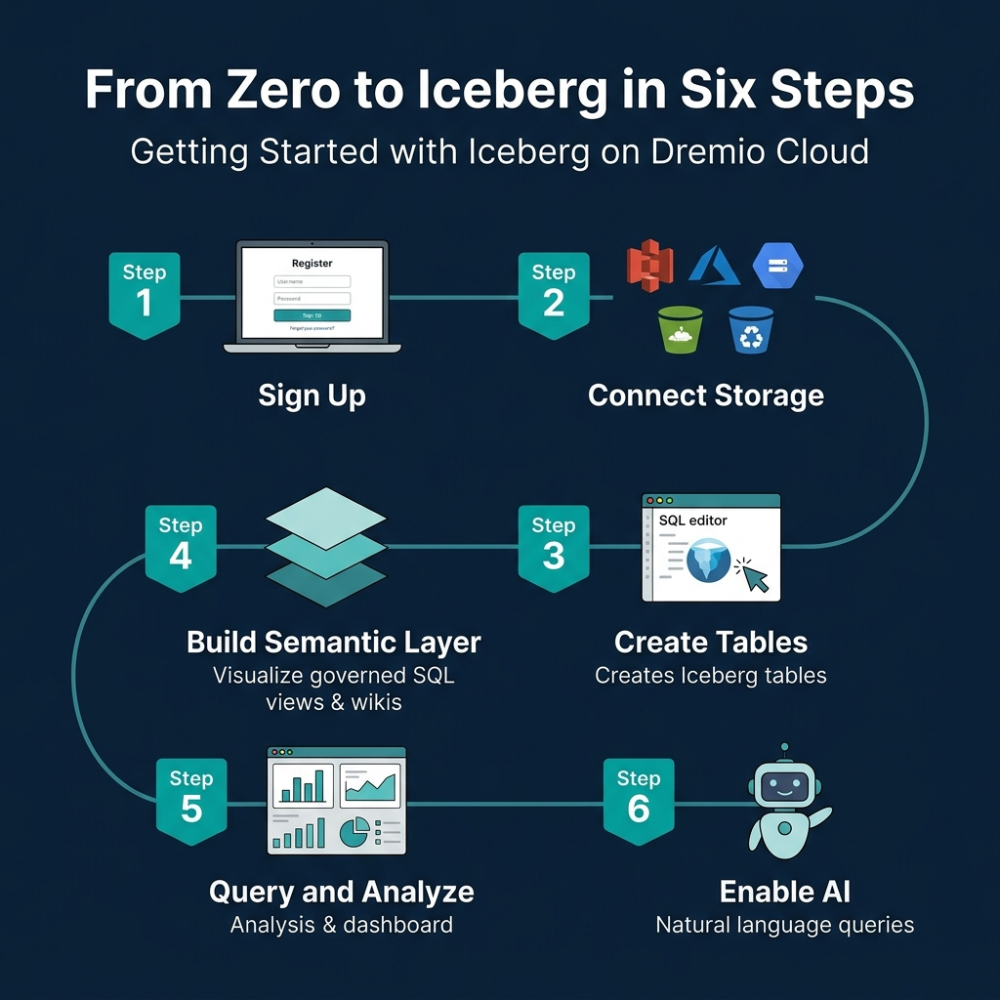
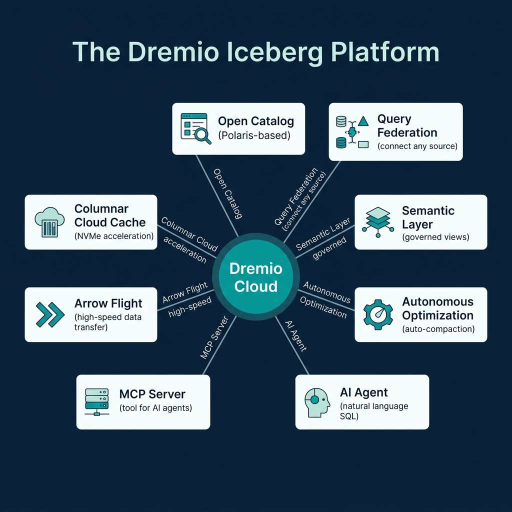
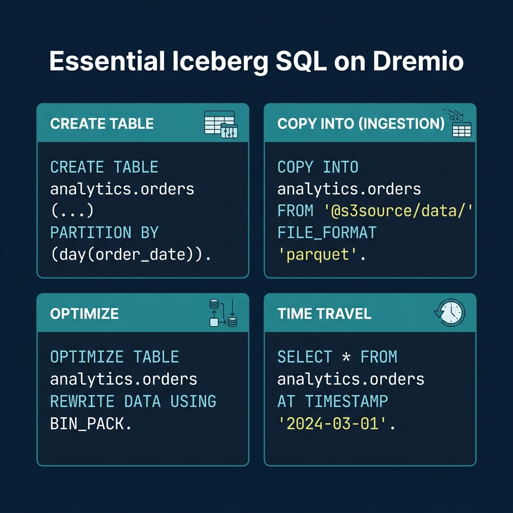

<!-- Meta Description: A practical walkthrough of creating, querying, and optimizing Iceberg tables on Dremio Cloud, from account setup to AI-powered analytics. -->
<!-- Primary Keyword: Dremio Cloud Apache Iceberg -->
<!-- Secondary Keywords: Dremio Cloud tutorial, Iceberg hands-on, COPY INTO, semantic layer -->

This is Part 14 of a 15-part [Apache Iceberg Masterclass](/tags/apache-iceberg/). [Part 13](/2026/2026-04-ib-13-approaches-to-streaming-data-into-apache-iceberg-tables/) covered streaming approaches. This article is a practical walkthrough of working with Iceberg on [Dremio Cloud](https://www.dremio.com/get-started/), covering table creation, data ingestion, optimization, semantic layer construction, and AI-powered analytics.

## Table of Contents

1. [What Are Table Formats and Why Were They Needed?](/2026/2026-04-ib-01-what-are-table-formats-and-why-were-they-needed/)
2. [The Metadata Structure of Current Table Formats](/2026/2026-04-ib-02-the-metadata-structure-of-modern-table-formats/)
3. [Performance and Apache Iceberg's Metadata](/2026/2026-04-ib-03-performance-and-apache-icebergs-metadata/)
4. [Technical Deep Dive on Partition Evolution](/2026/2026-04-ib-04-partition-evolution-change-your-partitioning-without-rewriti/)
5. [Technical Deep Dive on Hidden Partitioning](/2026/2026-04-ib-05-hidden-partitioning-how-iceberg-eliminates-accidental-full-t/)
6. [Writing to an Apache Iceberg Table](/2026/2026-04-ib-06-writing-to-an-apache-iceberg-table-how-commits-and-acid-actu/)
7. [What Are Lakehouse Catalogs?](/2026/2026-04-ib-07-what-are-lakehouse-catalogs-the-role-of-catalogs-in-apache-i/)
8. [Embedded Catalogs: S3 Tables and MinIO AI Stor](/2026/2026-04-ib-08-when-catalogs-are-embedded-in-storage/)
9. [How Iceberg Table Storage Degrades Over Time](/2026/2026-04-ib-09-how-data-lake-table-storage-degrades-over-time/)
10. [Maintaining Apache Iceberg Tables](/2026/2026-04-ib-10-maintaining-apache-iceberg-tables-compaction-expiry-and-clea/)
11. [Apache Iceberg Metadata Tables](/2026/2026-04-ib-11-apache-iceberg-metadata-tables-querying-the-internals/)
12. [Using Iceberg with Python and MPP Engines](/2026/2026-04-ib-12-using-apache-iceberg-with-python-and-mpp-query-engines/)
13. [Streaming Data into Apache Iceberg Tables](/2026/2026-04-ib-13-approaches-to-streaming-data-into-apache-iceberg-tables/)
14. [Hands-On with Iceberg Using Dremio Cloud](/2026/2026-04-ib-14-hands-on-with-apache-iceberg-using-dremio-cloud/)
15. [Migrating to Apache Iceberg](/2026/2026-04-ib-15-migrating-to-apache-iceberg-strategies-for-every-source-syst/)

## Getting Started



### Step 1: Sign Up and Connect Storage

1. [Create a Dremio Cloud account](https://www.dremio.com/get-started/) (free trial available)
2. Add a cloud storage source (S3, ADLS, or GCS) through the Sources panel
3. Configure credentials and target bucket

Dremio creates an [Open Catalog](https://www.dremio.com/platform/open-catalog/) for your Iceberg tables automatically. This Polaris-based catalog handles metadata management, access control, and automatic optimization.

### Step 2: Create Iceberg Tables

```sql
CREATE TABLE analytics.orders (
    order_id BIGINT,
    customer_id BIGINT,
    order_date DATE,
    amount DECIMAL(10,2),
    status VARCHAR,
    region VARCHAR
)
PARTITION BY (day(order_date))
```

This creates a table with [hidden partitioning](/2026/2026-04-ib-05-hidden-partitioning-how-iceberg-eliminates-accidental-full-t/) by day. Users query on `order_date` naturally; the engine handles partition pruning automatically.

### Step 3: Ingest Data

**From files in object storage:**

```sql
COPY INTO analytics.orders
FROM '@my_s3_source/raw/orders/'
FILE_FORMAT 'parquet'
```

**From another table or source:**

```sql
INSERT INTO analytics.orders
SELECT * FROM postgres_source.public.orders
WHERE order_date >= '2024-01-01'
```

[Dremio's federation](https://www.dremio.com/platform/federation/) can query data in PostgreSQL, MySQL, Oracle, MongoDB, S3 files, and other sources directly. You can migrate data into Iceberg tables with a single INSERT...SELECT statement.

## The Dremio Platform



### Columnar Cloud Cache

Dremio's [Columnar Cloud Cache (C3)](https://www.dremio.com/blog/dremios-columnar-cloud-cache-c3/) stores frequently accessed Iceberg data on local NVMe SSDs attached to the query engine nodes. When a query accesses data for the first time, Dremio caches the relevant columns locally. Subsequent queries against the same data read from local SSD instead of remote object storage, reducing latency from hundreds of milliseconds to single-digit milliseconds.

C3 operates transparently. You do not need to configure which data to cache. Dremio tracks access patterns and caches the most-queried data automatically.

### Connecting BI Tools

Dremio exposes Iceberg data through ODBC, JDBC, and Arrow Flight endpoints. Any BI tool (Tableau, Power BI, Looker, Superset) can connect to Dremio and query Iceberg tables as if they were a traditional database. The semantic layer ensures consistent governance and naming across all connected tools.

### Semantic Layer

Dremio's [semantic layer](https://www.dremio.com/platform/semantic-layer/) lets you create governed SQL views that serve as the interface between raw data and consumers:

```sql
CREATE VIEW analytics.customer_orders AS
SELECT
    o.customer_id,
    c.customer_name,
    c.region,
    SUM(o.amount) AS total_spend,
    COUNT(*) AS order_count
FROM analytics.orders o
JOIN analytics.customers c ON o.customer_id = c.customer_id
GROUP BY o.customer_id, c.customer_name, c.region
```

Add wikis and tags to views and tables through the Dremio UI. These descriptions help other users find and understand data, and they power the [AI agent's](https://www.dremio.com/platform/ai/) ability to generate accurate SQL from natural language.

### Reflections (Query Acceleration)

Dremio Reflections are precomputed materializations that automatically accelerate queries without requiring changes to your SQL. When you create a reflection on a view or table, Dremio precomputes the results and stores them as optimized Iceberg tables on fast storage:

```sql
-- Create an aggregation reflection for fast dashboard queries
ALTER TABLE analytics.customer_orders
  CREATE AGGREGATE REFLECTION customer_orders_agg
  USING DIMENSIONS (region, order_date)
  MEASURES (total_spend SUM, order_count SUM)
```

When a query matches the reflection's definition, Dremio serves it from the precomputed data instead of scanning the full table. Queries that take 30 seconds against raw data can complete in under 1 second with reflections. The query optimizer chooses the reflection transparently, so users and applications do not need to know reflections exist.

### Data Governance

Dremio provides column-level access control and row-level filtering directly in the [semantic layer](https://www.dremio.com/platform/semantic-layer/):

```sql
-- Create a view that masks PII for non-privileged users
CREATE VIEW analytics.orders_masked AS
SELECT
    order_id,
    CASE WHEN is_member('finance_team') THEN customer_name
         ELSE '***MASKED***' END AS customer_name,
    order_date,
    amount
FROM analytics.orders
```

Governance policies defined in the semantic layer apply consistently regardless of which tool (BI dashboard, Python notebook, AI agent) queries the data. This approach is more maintainable than duplicating access policies in every consuming application.

### Query Federation

One of Dremio's unique capabilities is querying Iceberg tables alongside data in other systems:

```sql
-- Join Iceberg table with a PostgreSQL table
SELECT i.order_id, i.amount, p.payment_status
FROM analytics.orders i
JOIN postgres_source.public.payments p
ON i.order_id = p.order_id
```

This eliminates the need to move all data into Iceberg before you can query it. You can [start with federation and migrate incrementally](https://www.dremio.com/blog/the-journey-from-scattered-data-to-an-apache-iceberg-lakehouse-with-governed-agentic-analytics/). Federation is especially useful during [migration](/2026/2026-04-ib-15-migrating-to-apache-iceberg-strategies-for-every-source-syst/): query legacy systems and Iceberg tables side by side, then swap the underlying source when you are ready.

## Essential SQL Operations



### Table Optimization

```sql
-- Compact small files
OPTIMIZE TABLE analytics.orders REWRITE DATA USING BIN_PACK

-- Compact with sorting for better file skipping
OPTIMIZE TABLE analytics.orders REWRITE DATA USING SORT (order_date, customer_id)

-- Expire old snapshots
ALTER TABLE analytics.orders EXPIRE SNAPSHOTS OLDER_THAN = '2024-04-01 00:00:00'
```

For tables managed by [Open Catalog](https://www.dremio.com/platform/open-catalog/), Dremio runs [automatic table optimization](https://www.dremio.com/blog/table-optimization-in-dremio/) in the background, handling compaction, expiry, and orphan cleanup without user intervention.

### Time Travel

```sql
-- Query the table as of a specific timestamp
SELECT * FROM analytics.orders
AT TIMESTAMP '2024-03-01 00:00:00'

-- Compare current data to a previous snapshot
SELECT
    current_data.region,
    current_data.total - old_data.total AS growth
FROM (SELECT region, SUM(amount) AS total FROM analytics.orders GROUP BY region) current_data
JOIN (
    SELECT region, SUM(amount) AS total
    FROM analytics.orders AT TIMESTAMP '2024-01-01'
    GROUP BY region
) old_data ON current_data.region = old_data.region
```

### Metadata Inspection

```sql
-- Check table health
SELECT AVG(file_size_in_bytes)/1048576 AS avg_mb, COUNT(*) AS files
FROM TABLE(table_files('analytics.orders'))

-- Review recent snapshots
SELECT committed_at, operation, summary
FROM TABLE(table_snapshot('analytics.orders'))
ORDER BY committed_at DESC LIMIT 5
```

## AI-Powered Analytics

Dremio's built-in [AI agent](https://www.dremio.com/platform/ai/) converts natural language questions into SQL queries using the semantic layer's wikis and tags as context:

- "Show me the top 10 customers by total spend this quarter"
- "What was the month-over-month revenue growth by region?"
- "Which products had the highest return rate last month?"

The AI agent generates standard SQL, meaning the results are transparent and auditable. Users can see exactly what SQL was generated, verify it, and refine it. This is different from black-box AI analytics tools that hide the underlying logic.

### MCP Server for External AI Agents

The [MCP Server](https://www.dremio.com/blog/getting-started-with-the-dremio-mcp-server/) extends Dremio's data access to external AI agents and tools through the Model Context Protocol. LLMs running in Claude, ChatGPT, or custom agent frameworks can query your Iceberg lakehouse through MCP, inheriting all the governance, semantic context, and optimization that Dremio provides.

This positions Dremio as the data layer for [agentic AI](https://www.dremio.com/platform/ai/) workflows: the AI agent asks questions in natural language, MCP translates them into governed SQL, and Dremio returns the results from optimized Iceberg tables.

[Part 15](/2026/2026-04-ib-15-migrating-to-apache-iceberg-strategies-for-every-source-syst/) covers strategies for migrating existing data into Iceberg.

### Books to Go Deeper

- [Architecting the Apache Iceberg Lakehouse](https://www.amazon.com/Architecting-Apache-Iceberg-Lakehouse-open-source/dp/1633435105/) by Alex Merced (Manning)
- [Lakehouses with Apache Iceberg: Agentic Hands-on](https://www.amazon.com/Lakehouses-Apache-Iceberg-Agentic-Hands-ebook/dp/B0GQL4QNRT/) by Alex Merced
- [Constructing Context: Semantics, Agents, and Embeddings](https://www.amazon.com/Constructing-Context-Semantics-Agents-Embeddings/dp/B0GSHRZNZ5/) by Alex Merced
- [Apache Iceberg & Agentic AI: Connecting Structured Data](https://www.amazon.com/Apache-Iceberg-Agentic-Connecting-Structured/dp/B0GW2WF4PX/) by Alex Merced
- [Open Source Lakehouse: Architecting Analytical Systems](https://www.amazon.com/Open-Source-Lakehouse-Architecting-Analytical/dp/B0GW595MVL/) by Alex Merced

### Free Resources

- [FREE - Apache Iceberg: The Definitive Guide](https://drmevn.fyi/linkpageiceberg)
- [FREE - Apache Polaris: The Definitive Guide](https://drmevn.fyi/linkpagepolaris)
- [FREE - Agentic AI for Dummies](https://hello.dremio.com/wp-resources-agentic-ai-for-dummies-reg.html?utm_source=link_page&utm_medium=influencer&utm_campaign=iceberg&utm_term=qr-link-list-04-07-2026&utm_content=alexmerced)
- [FREE - Leverage Federation, The Semantic Layer and the Lakehouse for Agentic AI](https://hello.dremio.com/wp-resources-agentic-analytics-guide-reg.html?utm_source=link_page&utm_medium=influencer&utm_campaign=iceberg&utm_term=qr-link-list-04-07-2026&utm_content=alexmerced)
- [FREE with Survey - Understanding and Getting Hands-on with Apache Iceberg in 100 Pages](https://forms.gle/xdsun6JiRvFY9rB36)
