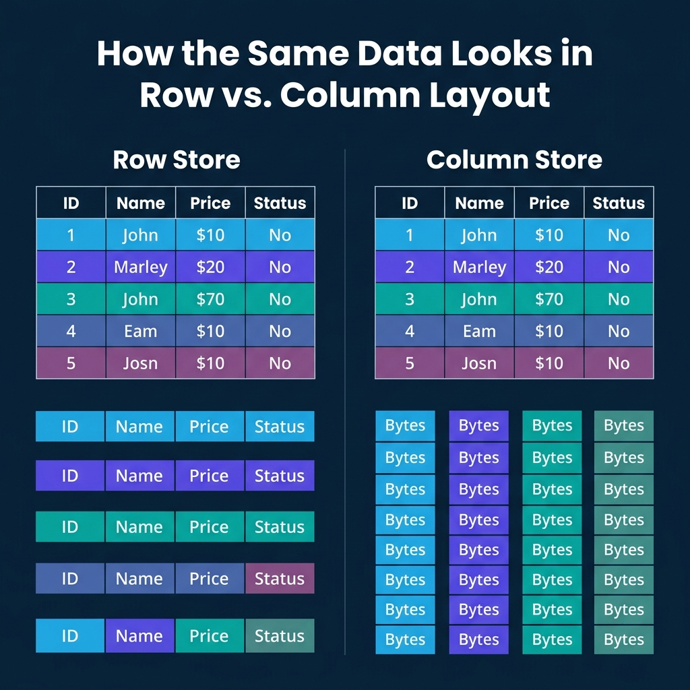
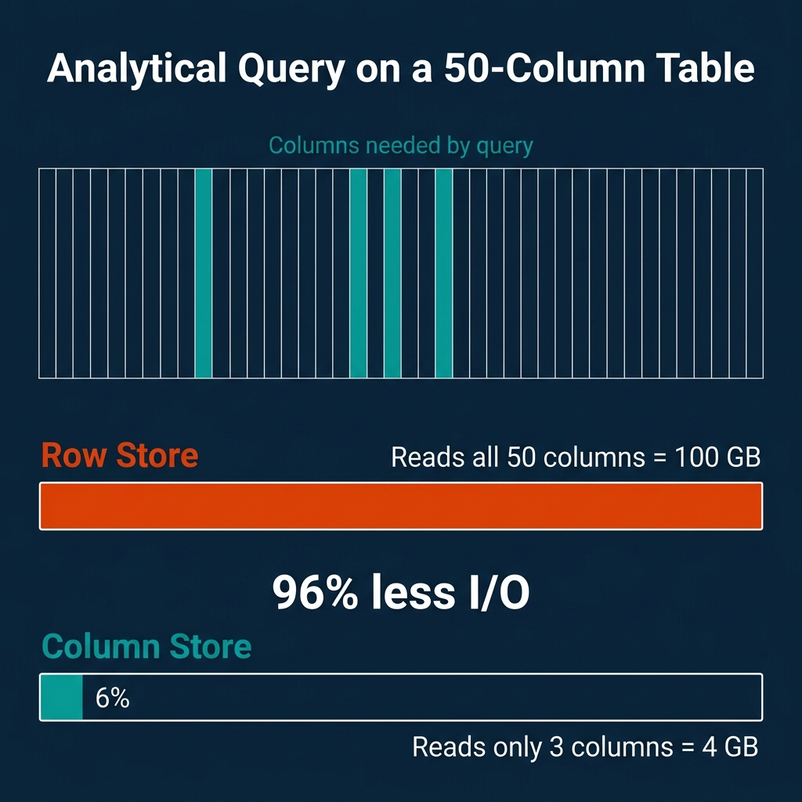
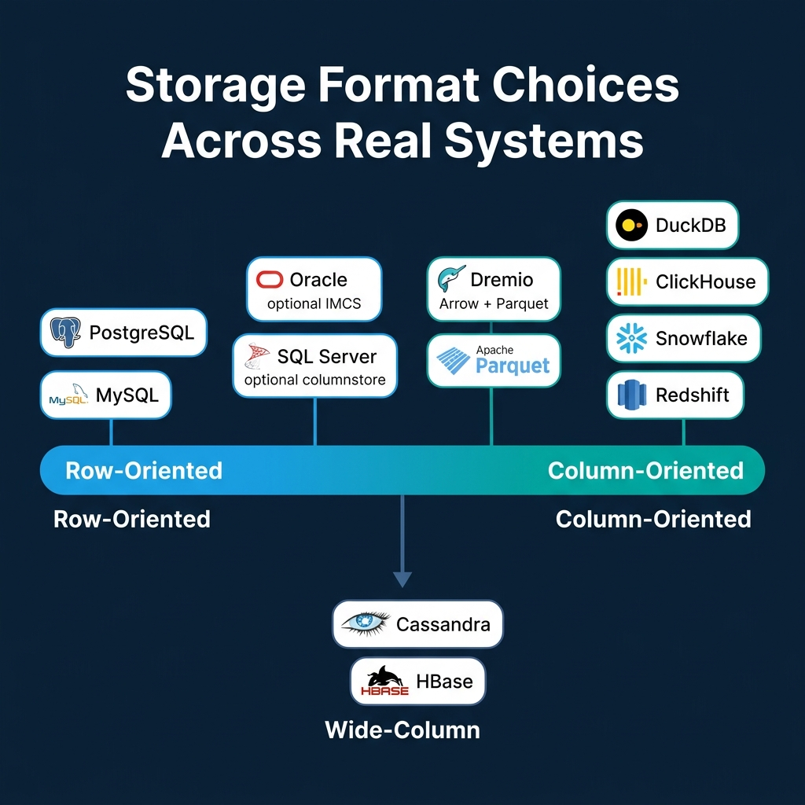

<!-- Meta Description: Row stores keep records together for fast transactions. Column stores keep field values together for fast analytics. Here is how each layout works and when to use it. -->
<!-- Primary Keyword: columnar vs row storage -->
<!-- Secondary Keywords: column-oriented database, row store performance, data storage layout -->

This is Part 2 of a 10-part series on query engine design. [Part 1 (Overview)](/2026/2026-04-qeo-01-how-query-engines-think-the-tradeoffs-behind-every-data-syst/) introduced the nine decisions every engine must make. This article covers the first and most fundamental: how bytes are arranged on disk.

## Table of Contents

1. [How Query Engines Think: The Tradeoffs Behind Every Data System](/2026/2026-04-qeo-01-how-query-engines-think-the-tradeoffs-behind-every-data-syst/)
2. [Row vs. Column: How Storage Layout Shapes Everything](/2026/2026-04-qeo-02-row-vs-column-how-storage-layout-shapes-everything/)
3. [How Databases Organize Data on Disk: Pages, Blocks, and File Formats](/2026/2026-04-qeo-03-how-databases-organize-data-on-disk-pages-blocks-and-file-fo/)
4. [B-Trees, LSM Trees, and the Indexing Tradeoff Spectrum](/2026/2026-04-qeo-04-b-trees-lsm-trees-and-the-indexing-tradeoff-spectrum/)
5. [Inside the Query Optimizer: How Engines Pick a Plan](/2026/2026-04-qeo-05-inside-the-query-optimizer-how-engines-pick-a-plan/)
6. [Volcano, Vectorized, Compiled: How Engines Execute Your Query](/2026/2026-04-qeo-06-volcano-vectorized-compiled-how-engines-execute-your-query/)
7. [Buffer Pools, Caches, and the Memory Hierarchy](/2026/2026-04-qeo-07-buffer-pools-caches-and-the-memory-hierarchy/)
8. [Partitioning, Sharding, and Data Distribution Strategies](/2026/2026-04-qeo-08-partitioning-sharding-and-data-distribution-strategies/)
9. [Hash, Sort-Merge, Broadcast: How Distributed Joins Work](/2026/2026-04-qeo-09-hash-sort-merge-broadcast-how-distributed-joins-work/)
10. [Concurrency, Isolation, and MVCC: How Engines Handle Contention](/2026/2026-04-qeo-10-concurrency-isolation-and-mvcc-how-engines-handle-contention/)

## How Row Storage Works

A row store keeps all fields of a record physically together on a disk page. A page is typically 4KB to 16KB. Each page holds multiple complete "tuples" (records). When you read one page, you get every field for every record on that page.

This layout is optimized for transactional workloads. Looking up a customer by ID? One page read gives you every field: name, email, address, balance, status. Inserting a new order? One write puts the entire record in one place. Updating a single field? The engine finds the tuple and modifies it in place.

[PostgreSQL](https://www.postgresql.org/docs/current/storage.html) stores rows as heap tuples with a header containing transaction visibility info and a null bitmap. MySQL/InnoDB organizes rows in a clustered B-tree indexed by primary key. Oracle and SQL Server both default to row-based storage.

The weakness shows up with analytical queries. If your table has 50 columns and your query needs 3 of them, a row store still reads all 50 for every row. The other 47 columns ride along for free, wasting I/O bandwidth and polluting your CPU cache.

## How Column Storage Works

A column store flips the layout. Instead of keeping all fields of a record together, it keeps all values for a single field together. Every `price` value is stored contiguously. Every `status` value is stored contiguously. And so on.

The data is typically organized in "row groups" (Parquet calls them this, ORC calls them "stripes"), each containing 100K to 1M rows. Within each row group, each column is stored as a separate "column chunk" with its own compression and encoding. Values at the same position across column chunks belong to the same logical record.

This layout is optimized for analytical workloads. When a query computes `AVG(price) WHERE status = 'shipped'`, the engine reads only the `price` and `status` columns. The other 48 columns are never touched.

Systems like [DuckDB](https://duckdb.org/docs/internals/storage), ClickHouse, Snowflake, Dremio, Redshift, and BigQuery all use columnar storage as their primary layout. Apache Parquet and ORC are open columnar file formats used across the data ecosystem.

## The I/O Math

The savings from columnar storage scale with table width. Consider a concrete example:

- **Table**: 50 columns, 1 billion rows, 100 bytes per row average
- **Total data**: 100 GB
- **Query**: `SELECT AVG(price) FROM orders WHERE status = 'shipped'`
- **Columns needed**: 2 (price + status), approximately 4 GB

| Storage Layout | Data Read | Percentage of Total |
|---|---|---|
| Row store | 100 GB | 100% |
| Column store | 4 GB | 4% |

That is a 25x reduction in I/O. For a table with 200 columns (common in analytics), the ratio gets even more dramatic.

The tradeoff goes the other direction for point lookups. Fetching one complete record from a column store requires reading from every column file: 50 separate reads for a 50-column table. A row store does it in one.

## Why Columnar Compression Is So Much Better

Uniform data within a column enables specialized encoding that mixed-type rows cannot use:

| Encoding | Best For | How It Works |
|---|---|---|
| **Run-Length (RLE)** | Sorted columns with repeated values | Store (value, count) pairs. A column of 1M "USA" values becomes one entry. |
| **Dictionary** | Low-cardinality strings | Map each unique string to an integer ID. Store the small integers instead. |
| **Delta** | Sorted integers/timestamps | Store differences between consecutive values. Monotonic sequences shrink to near-zero. |
| **Bit-packing** | Small integers | Use the minimum number of bits per value instead of a full 32 or 64 bits. |

These techniques routinely achieve 5-10x compression on analytical datasets. Row stores cannot match this because adjacent bytes in a tuple belong to different data types, defeating any type-specific encoding.

## Late Materialization

Column stores gain additional performance by deferring tuple reconstruction until the very end. This technique is called late materialization:

1. Scan the `status` column. Produce a selection vector (a bitmap of matching row positions).
2. Use that selection vector to read only the matching positions from the `price` column.
3. Compute `AVG(price)` on the filtered values.

At no point did the engine reconstruct a full row. It worked entirely with columnar arrays and position-based selection. This avoids copying irrelevant data and keeps computation in tight, cache-friendly loops that exploit CPU SIMD instructions.

Dremio uses [Apache Arrow](https://arrow.apache.org/) as its native in-memory columnar format, which is specifically designed for this kind of vectorized, late-materialized processing.

## Hybrid Approaches

Not every system picks one side and stays there.

**SQL Server** lets you add nonclustered columnstore indexes to row-based tables. The query optimizer decides which format to use for each query. **Oracle** offers an In-Memory Column Store (IMCS) that keeps hot data in both row and column format simultaneously in memory.

**Wide-column stores** like Cassandra and HBase take a different path. They group related columns into "column families." Within a family, data is stored together (row-like). Across families, storage is separate (column-like). This optimizes for workloads where certain columns are always accessed together.

**Parquet** and **ORC** use a hybrid layout at the file level: data is divided into row groups (row-like partitioning), and within each row group, each column is stored separately (column-like). This balances the benefits of columnar scanning with practical record reconstruction when needed.

## Where Real Systems Land

| System | Storage Format | Primary Workload | Notes |
|---|---|---|---|
| PostgreSQL | Row | OLTP | Heap tuples, TOAST for large values |
| MySQL/InnoDB | Row | OLTP | Clustered B-tree by primary key |
| SQL Server | Row + optional column | Mixed | Columnstore indexes for analytics |
| Oracle | Row + optional column | Mixed | In-Memory Column Store (IMCS) |
| DuckDB | Column | OLAP (embedded) | Morsel-driven parallelism |
| ClickHouse | Column | OLAP (real-time) | MergeTree engine, sparse indexes |
| Snowflake | Column | Cloud OLAP | Micro-partitions |
| Dremio | Column | OLAP (lakehouse) | Arrow in-memory, reads Parquet/Iceberg |
| Redshift | Column | Cloud OLAP | MPP, zone maps |
| Cassandra | Wide-column | Write-heavy distributed | LSM-based, column families |

## When to Choose Which

The choice is driven by your dominant access pattern:

- **Mostly point lookups and transactional writes** (user profiles, order processing, session management): use a row store. PostgreSQL and MySQL are battle-tested here.
- **Mostly analytical scans and aggregations** (dashboards, reports, data science): use a column store. DuckDB for embedded, ClickHouse or Dremio for distributed, Snowflake or BigQuery for fully managed cloud.
- **Both workloads on the same data**: use separate systems for each (the most common production pattern) or a hybrid like SQL Server with columnstore indexes.

Trying to force a row store into heavy analytics or a column store into high-frequency transactions will produce consistently poor results. The storage layout is the first domino, and it falls in one direction.

### Books to Go Deeper

- [Architecting the Apache Iceberg Lakehouse](https://www.amazon.com/Architecting-Apache-Iceberg-Lakehouse-open-source/dp/1633435105/) by Alex Merced (Manning)
- [Lakehouses with Apache Iceberg: Agentic Hands-on](https://www.amazon.com/Lakehouses-Apache-Iceberg-Agentic-Hands-ebook/dp/B0GQL4QNRT/) by Alex Merced
- [Constructing Context: Semantics, Agents, and Embeddings](https://www.amazon.com/Constructing-Context-Semantics-Agents-Embeddings/dp/B0GSHRZNZ5/) by Alex Merced
- [Apache Iceberg & Agentic AI: Connecting Structured Data](https://www.amazon.com/Apache-Iceberg-Agentic-Connecting-Structured/dp/B0GW2WF4PX/) by Alex Merced
- [Open Source Lakehouse: Architecting Analytical Systems](https://www.amazon.com/Open-Source-Lakehouse-Architecting-Analytical/dp/B0GW595MVL/) by Alex Merced
