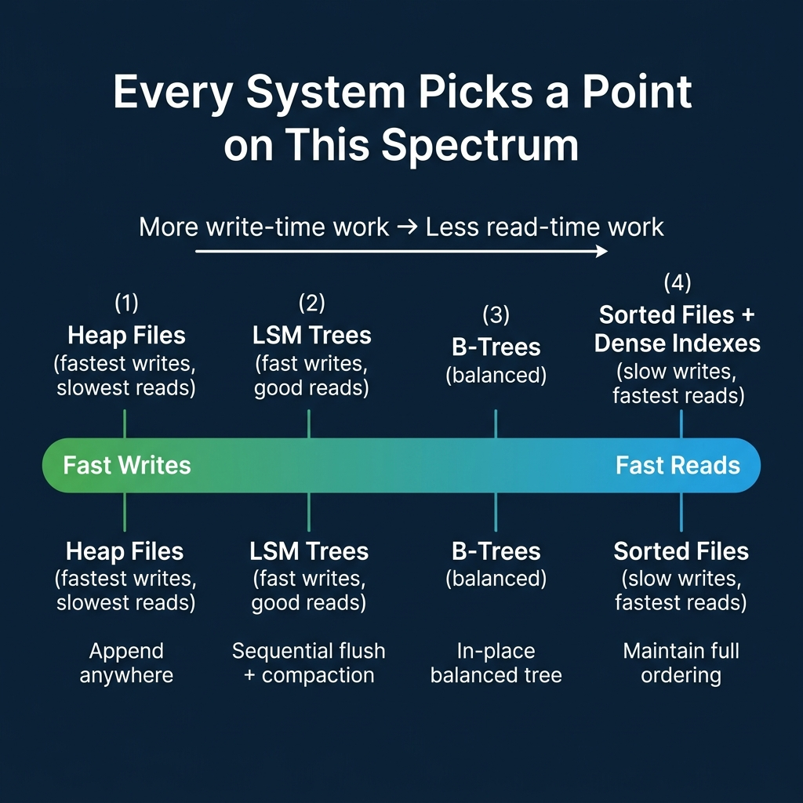
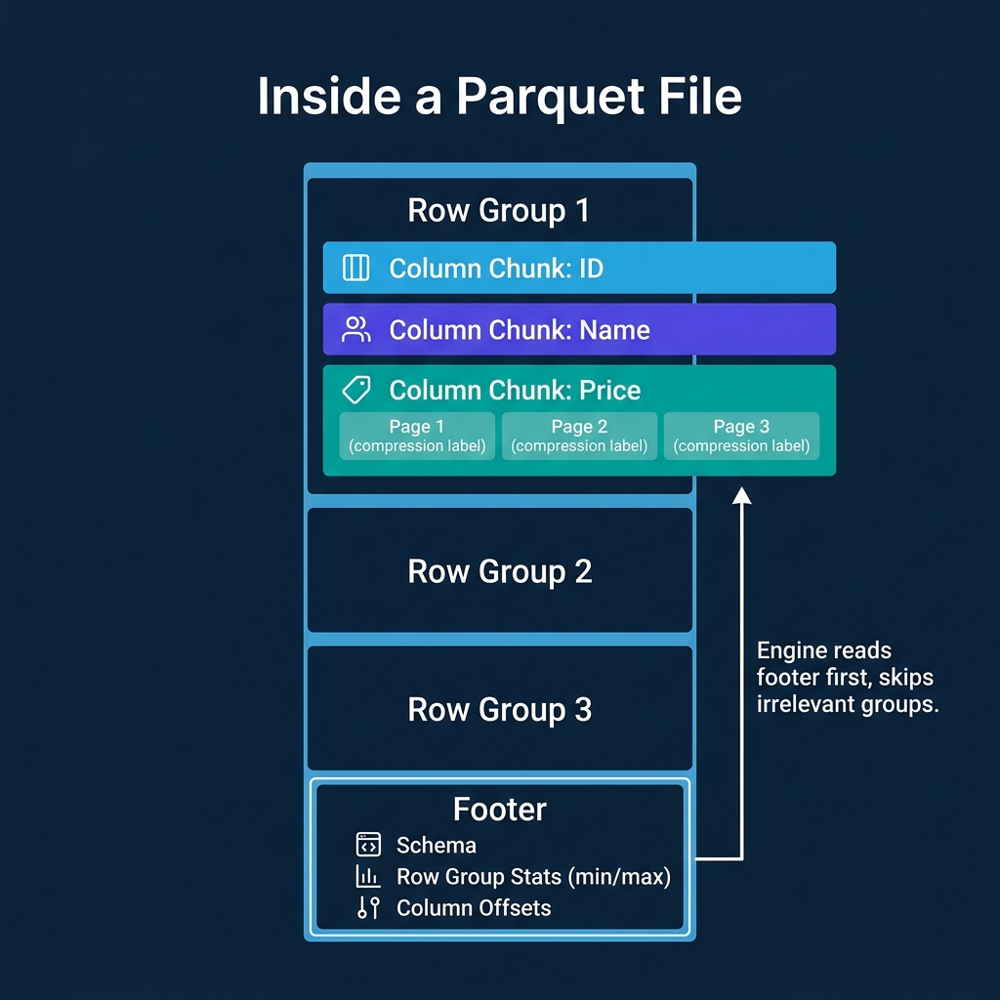
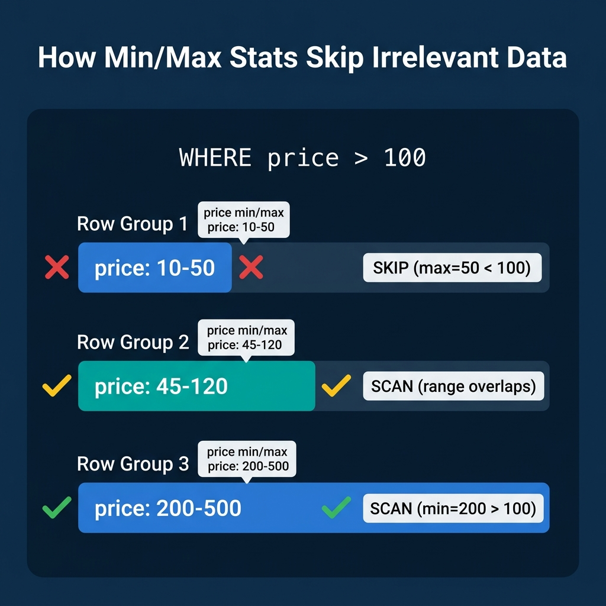

<!-- Meta Description: Databases structure data on disk as heap files, sorted files, or LSM trees, then wrap it in formats like Parquet with metadata that lets engines skip irrelevant blocks. -->
<!-- Primary Keyword: data file formats -->
<!-- Secondary Keywords: Parquet file format, database storage internals, predicate pushdown -->

This is Part 3 of a 10-part series on query engine design. [Part 2](/2026/2026-04-qeo-02-row-vs-column-how-storage-layout-shapes-everything/) covered row vs. column storage layouts. This article goes one level deeper: how data is physically structured within files, and what metadata accompanies it to make reads efficient.

## Table of Contents

1. [How Query Engines Think: The Tradeoffs Behind Every Data System](/2026/2026-04-qeo-01-how-query-engines-think-the-tradeoffs-behind-every-data-syst/)
2. [Row vs. Column: How Storage Layout Shapes Everything](/2026/2026-04-qeo-02-row-vs-column-how-storage-layout-shapes-everything/)
3. [How Databases Organize Data on Disk: Pages, Blocks, and File Formats](/2026/2026-04-qeo-03-how-databases-organize-data-on-disk-pages-blocks-and-file-fo/)
4. [B-Trees, LSM Trees, and the Indexing Tradeoff Spectrum](/2026/2026-04-qeo-04-b-trees-lsm-trees-and-the-indexing-tradeoff-spectrum/)
5. [Inside the Query Optimizer: How Engines Pick a Plan](/2026/2026-04-qeo-05-inside-the-query-optimizer-how-engines-pick-a-plan/)
6. [Volcano, Vectorized, Compiled: How Engines Execute Your Query](/2026/2026-04-qeo-06-volcano-vectorized-compiled-how-engines-execute-your-query/)
7. [Buffer Pools, Caches, and the Memory Hierarchy](/2026/2026-04-qeo-07-buffer-pools-caches-and-the-memory-hierarchy/)
8. [Partitioning, Sharding, and Data Distribution Strategies](/2026/2026-04-qeo-08-partitioning-sharding-and-data-distribution-strategies/)
9. [Hash, Sort-Merge, Broadcast: How Distributed Joins Work](/2026/2026-04-qeo-09-hash-sort-merge-broadcast-how-distributed-joins-work/)
10. [Concurrency, Isolation, and MVCC: How Engines Handle Contention](/2026/2026-04-qeo-10-concurrency-isolation-and-mvcc-how-engines-handle-contention/)

## Three Ways to Organize Data in Files

Every database faces the same question: when new data arrives, where does it go? The answer determines how fast writes are and how much work reads require.

### Heap Files: Fast Writes, Slow Reads

A heap file is an unordered collection of pages. New records go wherever there is free space. No sorting, no ordering, no extra metadata to maintain.

PostgreSQL uses heap files as its primary storage. Writes are O(1) because the engine just appends to the next available slot. The tradeoff: any query without an index requires a full sequential scan of every page. For a 100 GB table, that means reading 100 GB.

### Sorted Files: Fast Reads, Slow Writes

The opposite extreme. Records are physically ordered by a key. Range scans become sequential I/O (the fastest type of disk access). Binary search finds any record in O(log n) reads.

The tradeoff: inserting a record into the middle requires shifting everything after it. This makes writes expensive. Few production systems use pure sorted files, but the concept appears in B-trees (which maintain sorted order in a tree structure with efficient insertions) and in compacted LSM tree levels.

### LSM Trees: A Write-Optimized Compromise

Log-Structured Merge-Trees convert random writes into sequential writes. The write path works in three stages:

1. **Buffer**: New records go to an in-memory sorted structure (the memtable). Writes are fast because memory is orders of magnitude faster than disk.
2. **Flush**: When the memtable reaches a size threshold, it is written to disk as an immutable sorted file (SSTable).
3. **Compact**: Background processes merge multiple SSTables into fewer, larger sorted files, removing duplicates and deleted records.

RocksDB, LevelDB, Cassandra, HBase, and ScyllaDB all use LSM trees. The tradeoff: reads may need to check the memtable plus multiple levels of SSTables. Bloom filters (probabilistic structures that quickly answer "is this key possibly in this file?") mitigate the read amplification.

## Open File Formats: Parquet, ORC, and Avro

Beyond the engine's internal file structures, the data ecosystem has standardized on open file formats that separate the storage format from the engine. This is what makes data lakehouses possible: multiple engines (Dremio, Spark, DuckDB, Trino, Snowflake) can all read the same data files.

### Apache Parquet

[Parquet](https://parquet.apache.org/docs/) is the dominant columnar file format for analytics. Understanding its internal structure explains why analytical queries on Parquet files are fast.

A Parquet file is organized in layers:

- **Row groups** (default ~128 MB): Each row group contains a horizontal slice of the data (e.g., 1 million rows). This is the unit of parallelism for readers.
- **Column chunks**: Within a row group, each column is stored as a separate contiguous block. This is what enables columnar I/O savings.
- **Pages** (default ~1 MB): Each column chunk is divided into pages, the smallest unit of compression and encoding. Each page uses a single encoding (dictionary, RLE, delta, etc.) and compression codec (Snappy, ZSTD, LZ4, GZIP).
- **Footer**: The file footer contains the schema, the location of every row group and column chunk, and column statistics (min value, max value, null count) for each column chunk.

The footer is the key to performance. The engine reads it first, then uses the statistics to decide which row groups and column chunks to read. Everything else can be skipped.

### Apache ORC

ORC (Optimized Row Columnar) serves a similar purpose to Parquet but originated in the Hive ecosystem. Its structure uses "stripes" instead of row groups (default ~250 MB) and includes built-in lightweight indexes: bloom filters per stripe and min/max statistics per row index entry (typically every 10K rows, finer-grained than Parquet's per-row-group stats).

### Apache Avro

Avro is a row-oriented format with embedded schema. It supports schema evolution (readers handle files written with older or newer schemas). Avro is common for write-heavy pipelines and streaming (Kafka serialization) but is not optimized for analytical reads because its row orientation forces reading unnecessary columns. Dremio, Spark, and other engines can read Avro files but typically convert to Parquet for analytical workloads.

## Metadata That Enables Skipping

The biggest performance wins in analytical engines do not come from reading data faster. They come from reading less data. File-level metadata is what makes this possible.

### Column Statistics (Min/Max)

Every Parquet row group and ORC stripe stores the minimum and maximum value for each column. The query engine uses these statistics to skip entire blocks.

Consider `SELECT * FROM orders WHERE price > 100` on a file with three row groups:

| Row Group | Price Min | Price Max | Action |
|---|---|---|---|
| 1 | 10 | 50 | Skip (max 50 < 100) |
| 2 | 45 | 120 | Scan (range overlaps) |
| 3 | 200 | 500 | Scan (all values qualify) |

Row Group 1 is never read. The engine saved 33% of the I/O with a single metadata comparison. On real datasets with many row groups and selective filters, these savings routinely exceed 90%.

Dremio, Snowflake, DuckDB, Spark, ClickHouse, and Trino all use this technique. Table formats like Apache Iceberg take it further by storing per-file statistics in manifest files, enabling file-level pruning before any individual file is opened.

### Bloom Filters

When the filter is an equality check (`WHERE customer_id = 'abc123'`) rather than a range, min/max stats are less useful (the value could be anywhere within the range). Bloom filters solve this: a compact probabilistic structure that answers "is this value possibly in this block?" with no false negatives.

A bloom filter of a few KB can represent membership for millions of distinct values. Parquet supports optional per-column bloom filters, and ORC includes them per stripe.

### Partition Metadata

Beyond file-internal metadata, many systems organize data into directories by partition key (e.g., `year=2024/month=03/day=15/`). A query with `WHERE year = 2024` skips all other year directories entirely.

Apache Iceberg improves on directory-based partitioning with hidden partitioning: partition values are computed from data columns and stored in manifest metadata, enabling partition pruning without requiring users to know the physical layout.

## The Tradeoff: Write-Time Work vs. Read-Time Work

Every organizational choice above is a variation of the same tradeoff: do more work when writing data (sort it, compute statistics, build indexes, organize into optimal row groups) to do less work when reading it.

| Strategy | Write-Time Cost | Read-Time Benefit |
|---|---|---|
| Heap file | None | None (full scan) |
| Sort data | High (maintain order) | Binary search, sequential scans |
| Compute min/max stats | Low (aggregate per block) | Skip irrelevant blocks |
| Build bloom filters | Moderate (hash computation) | Skip blocks for equality filters |
| Optimize row group sizes | Moderate (buffer before flush) | Better parallelism, less overhead |

Systems that ingest data continuously (streaming, high-frequency writes) tend to minimize write-time work and rely on background processes (compaction, optimization jobs) to reorganize data for reads. Dremio, for example, automates table maintenance including compaction and clustering to keep Iceberg tables optimized without manual intervention.

Systems that load data in batches (nightly ETL, periodic imports) can afford to invest heavily in sorting and statistics at write time because the write frequency is low.

The right choice depends on your ingest pattern. There is no single answer.

### Books to Go Deeper

- [Architecting the Apache Iceberg Lakehouse](https://www.amazon.com/Architecting-Apache-Iceberg-Lakehouse-open-source/dp/1633435105/) by Alex Merced (Manning)
- [Lakehouses with Apache Iceberg: Agentic Hands-on](https://www.amazon.com/Lakehouses-Apache-Iceberg-Agentic-Hands-ebook/dp/B0GQL4QNRT/) by Alex Merced
- [Constructing Context: Semantics, Agents, and Embeddings](https://www.amazon.com/Constructing-Context-Semantics-Agents-Embeddings/dp/B0GSHRZNZ5/) by Alex Merced
- [Apache Iceberg & Agentic AI: Connecting Structured Data](https://www.amazon.com/Apache-Iceberg-Agentic-Connecting-Structured/dp/B0GW2WF4PX/) by Alex Merced
- [Open Source Lakehouse: Architecting Analytical Systems](https://www.amazon.com/Open-Source-Lakehouse-Architecting-Analytical/dp/B0GW595MVL/) by Alex Merced
